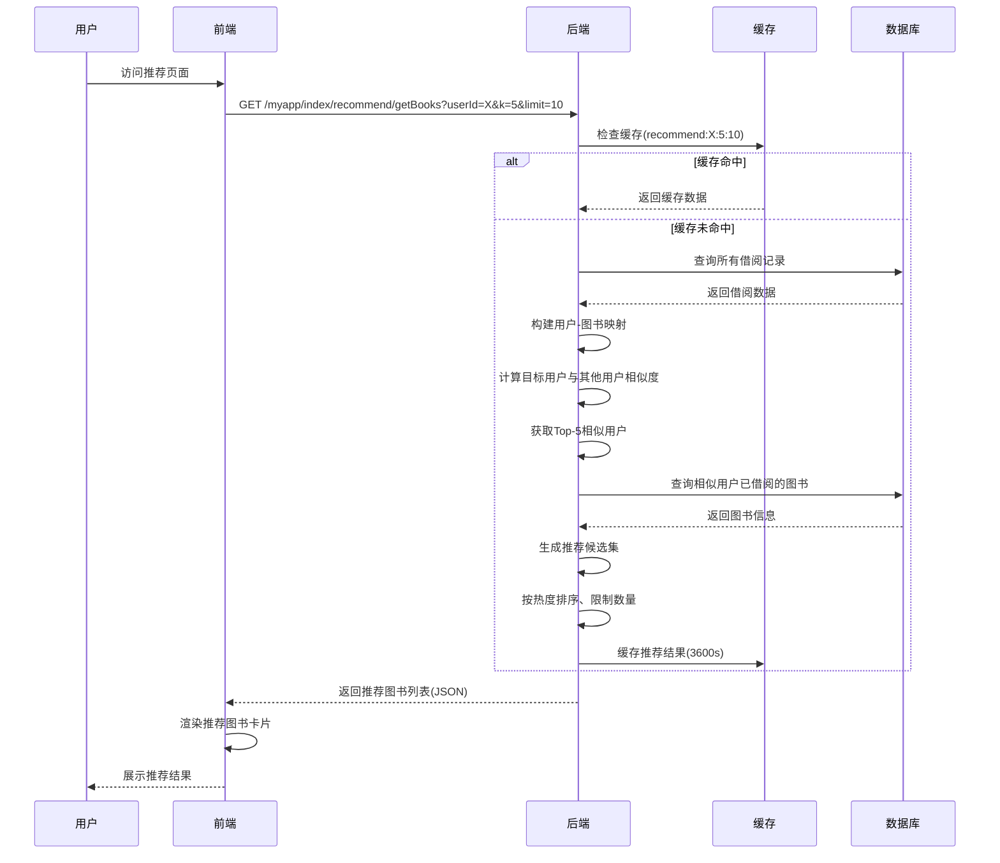
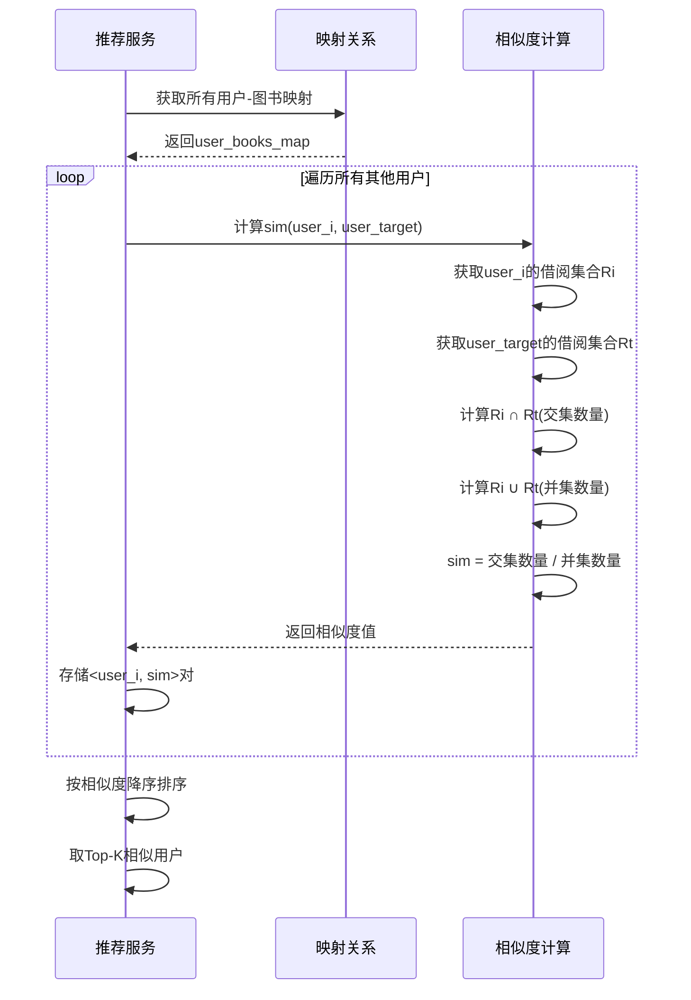

# 4.8 推荐算法模块的实现

## 4.8.1 算法概述

本图书借阅推荐系统主要运用了基于用户的协同过滤推荐算法，为用户推荐个性化的图书。协同过滤算法能够通过分析用户的借阅行为，计算出用户间的相似度，进而为用户推荐其相似用户已借阅但自己未借阅的图书。

## 4.8.2 推荐流程

推荐图书流程如下：

**1. 请求映射**

通过 `@api_view(['GET'])` 装饰器，指定该方法处理GET请求，URL路径为 `/myapp/index/recommend/getBooks`，用于接收获取推荐图书的请求。

**2. 方法参数**

- `userId`：接收请求中的用户ID参数，确定为哪个用户进行图书推荐。
- `k`：用于协同过滤算法中选取与目标用户最相似用户的数量（默认值为5）。
- `limit`：推荐图书的数量限制（默认值为10）。

**3. 数据获取**

通过 `Borrow.objects.all()` 从数据库获取所有借阅记录，这些记录存储在 `borrows` 列表中。每条记录包含用户ID和图书ID，用于记录用户的借阅行为。

**4. 算法实例创建**

创建用户与图书的映射关系 `user_books_map`，将所有借阅数据进行处理，构建一个字典结构，其中键为用户ID，值为该用户借阅过的图书ID集合。

**5. 相似用户寻找**

通过计算目标用户与其他用户的相似度，使用参数 `k` 来确定选取最相似用户的数量。首先调用 `_get_user_books_mapping()` 方法获取用户-图书映射，然后遍历所有用户，调用 `_calculate_similarity()` 方法逐一计算相似度。

**6. 相似度计算**

相似度通过Jaccard相似系数计算，设用户u借阅的图书集合为 $R_u$，用户v借阅的图书集合为 $R_v$，则用户u和用户v的相似度计算公式为：

$$\text{sim}(u,v) = \frac{|R_u \cap R_v|}{|R_u \cup R_v|}$$

其中，$|R_u \cap R_v|$ 表示两个用户共同借阅过的图书数量，$|R_u \cup R_v|$ 表示两个用户借阅过的所有不同图书的总数。

**7. 候选图书生成**

找出Top-K相似用户借阅过但目标用户未借阅的图书，作为推荐候选。同时处理冷启动问题：若用户借阅数少于3本，则推荐平台热门图书；若用户存在分类偏好不足的问题，则根据用户已借阅图书的分类推荐相同分类的热门图书。

**8. 结果排序与返回**

按图书的热度（浏览量、收藏量）对候选图书进行排序，返回前 `limit` 个推荐结果。最终将推荐图书的详细信息以JSON格式返回给前端。

## 4.8.3 后端实现

### 推荐视图代码

```python
from rest_framework.decorators import api_view, permission_classes
from rest_framework.response import Response
from rest_framework.permissions import IsAuthenticated
from django.core.cache import cache
import logging

logger = logging.getLogger(__name__)

@api_view(['GET'])
@permission_classes([IsAuthenticated])
def recommend_books_view(request):
    """推荐图书接口"""
    try:
        user_id = request.query_params.get('userId')
        k = int(request.query_params.get('k', 5))
        limit = int(request.query_params.get('limit', 10))
        
        # 检查缓存
        cache_key = f"recommend:{user_id}:{k}:{limit}"
        cached_result = cache.get(cache_key)
        if cached_result:
            return Response({
                'code': 200,
                'message': '获取推荐成功',
                'data': cached_result
            })
        
        # 创建推荐服务实例
        recommend_service = RecommendService()
        recommended_books = recommend_service.recommend_books(
            user_id=user_id, 
            k=k, 
            limit=limit
        )
        
        # 缓存结果，有效期1小时
        cache.set(cache_key, recommended_books, 3600)
        
        return Response({
            'code': 200,
            'message': '获取推荐成功',
            'data': recommended_books
        })
    except Exception as e:
        logger.error(f"推荐算法异常: {str(e)}")
        return Response({
            'code': 500,
            'message': '推荐服务异常'
        }, status=500)
```

### 推荐服务类

```python
from myapp.models import Borrow, Book, User
from django.db.models import Count

class RecommendService:
    """推荐服务类"""
    
    def recommend_books(self, user_id, k=5, limit=10):
        """主推荐方法"""
        # 获取用户-图书映射
        user_books_map = self._get_user_books_mapping()
        
        # 检查冷启动情况
        if len(user_books_map.get(int(user_id), [])) < 3:
            return self._get_popular_books(limit)
        
        # 查找相似用户
        similar_users = self._find_top_k_similar_users(
            user_id, user_books_map, k
        )
        
        # 生成候选图书
        candidates = self._generate_candidates(
            user_id, similar_users, user_books_map
        )
        
        # 排序和过滤
        recommended = self._rank_and_filter(candidates, limit)
        
        return recommended
    
    def _get_user_books_mapping(self):
        """获取用户-图书映射"""
        user_books = {}
        borrows = Borrow.objects.select_related('user', 'book').all()
        
        for borrow in borrows:
            user_id = borrow.user.id
            book_id = borrow.book.id
            
            if user_id not in user_books:
                user_books[user_id] = set()
            user_books[user_id].add(book_id)
        
        return user_books
    
    def _calculate_similarity(self, user_u_id, user_v_id, user_books_map):
        """计算两个用户的相似度（Jaccard系数）"""
        books_u = user_books_map.get(int(user_u_id), set())
        books_v = user_books_map.get(int(user_v_id), set())
        
        if len(books_u) == 0 or len(books_v) == 0:
            return 0.0
        
        intersection = len(books_u & books_v)
        union = len(books_u | books_v)
        
        return intersection / union if union > 0 else 0.0
    
    def _find_top_k_similar_users(self, user_id, user_books_map, k=5):
        """查找Top-K相似用户"""
        similarities = {}
        
        for other_user_id in user_books_map.keys():
            if other_user_id == int(user_id):
                continue
            
            sim = self._calculate_similarity(
                user_id, other_user_id, user_books_map
            )
            if sim > 0:
                similarities[other_user_id] = sim
        
        # 按相似度排序，取Top-K
        sorted_users = sorted(
            similarities.items(), 
            key=lambda x: x[1], 
            reverse=True
        )[:k]
        
        return [user_id for user_id, _ in sorted_users]
    
    def _generate_candidates(self, user_id, similar_users, user_books_map):
        """生成推荐候选图书"""
        user_books = user_books_map.get(int(user_id), set())
        candidates = set()
        
        for similar_user_id in similar_users:
            similar_user_books = user_books_map.get(similar_user_id, set())
            # 取相似用户借阅过但目标用户未借阅的图书
            candidates.update(similar_user_books - user_books)
        
        return list(candidates)
    
    def _rank_and_filter(self, candidates, limit=10):
        """按热度排序并过滤"""
        books = Book.objects.filter(
            id__in=candidates,
            status=1  # 仅推荐在架的图书
        ).annotate(
            pv_count=Count('pv')
        ).order_by('-pv', '-collect_count')[:limit]
        
        return [
            {
                'id': book.id,
                'title': book.title,
                'author': book.author,
                'cover': book.cover,
                'pv': book.pv,
                'score': book.score
            }
            for book in books
        ]
    
    def _get_popular_books(self, limit=10):
        """获取热门图书（冷启动处理）"""
        books = Book.objects.filter(
            status=1
        ).order_by('-pv', '-collect_count')[:limit]
        
        return [
            {
                'id': book.id,
                'title': book.title,
                'author': book.author,
                'cover': book.cover,
                'pv': book.pv,
                'score': book.score
            }
            for book in books
        ]
```

## 4.8.4 前端实现

### API调用

```javascript
// api/index/recommend.js
import axios from '@/utils/request'

const api = {
  recommendApi: '/myapp/index/recommend/getBooks'
}

export const getRecommendBooks = (params) => {
  return axios({
    url: api.recommendApi,
    method: 'get',
    params: params
  })
}
```

### Vue组件

```vue
<!-- views/index/RecommendBooks.vue -->
<template>
  <div class="recommend-container">
    <h2>为您推荐</h2>
    
    <a-spin :spinning="loading" size="large">
      <a-empty v-if="!loading && books.length === 0" description="暂无推荐图书" />
      
      <a-row :gutter="[16, 16]" v-else>
        <a-col :xs="24" :sm="12" :md="8" :lg="6" v-for="book in books" :key="book.id">
          <a-card :hoverable="true" class="book-card">
            <template #cover>
              
            </template>
            <a-card-meta :title="book.title" :description="book.author" />
            <p class="book-score">评分: {{ book.score }}</p>
            <a-button type="primary" block @click="borrowBook(book.id)">
              借阅
            </a-button>
          </a-card>
        </a-col>
      </a-row>
    </a-spin>
  </div>
</template>

<script>
import { getRecommendBooks } from '@/api/index/recommend'
import { mapState } from 'vuex'

export default {
  name: 'RecommendBooks',
  data() {
    return {
      books: [],
      loading: false
    }
  },
  computed: {
    ...mapState({
      userId: state => state.user.userId
    })
  },
  mounted() {
    this.fetchRecommendBooks()
  },
  methods: {
    fetchRecommendBooks() {
      this.loading = true
      getRecommendBooks({
        userId: this.userId,
        k: 5,
        limit: 10
      }).then(res => {
        if (res.data.code === 200) {
          this.books = res.data.data
        }
        this.loading = false
      }).catch(err => {
        this.$message.error('获取推荐失败')
        this.loading = false
      })
    },
    borrowBook(bookId) {
      this.$router.push({
        name: 'BorrowDetail',
        params: { id: bookId }
      })
    }
  }
}
</script>

<style scoped lang="less">
.recommend-container {
  padding: 20px;
  
  h2 {
    margin-bottom: 20px;
    font-size: 24px;
  }
  
  .book-card {
    transition: transform 0.3s;
    
    &:hover {
      transform: translateY(-5px);
    }
    
    img {
      width: 100%;
      height: 200px;
      object-fit: cover;
    }
    
    .book-score {
      margin: 10px 0;
      color: #ff6b6b;
      font-weight: bold;
    }
  }
}
</style>
```

## 4.8.5 系统时序图

### 推荐算法完整流程



### 相似度计算流程



## 4.8.6 性能优化

**缓存策略**：使用Redis缓存推荐结果，缓存键为 `recommend:{user_id}:{k}:{limit}`，有效期设置为1小时，当用户借阅新图书时清除其推荐缓存。

**增量更新**：每当有新的借阅行为时，只需重新计算该用户的相似度，而不必全量重算，提高计算效率。

**混合推荐**：结合用户的分类偏好，按70%协同过滤 + 30%分类推荐的方式混合推荐，增加推荐的多样性。

## 4.8.7 推荐有效性评估

推荐算法的有效性通过以下指标评估：

| 指标 | 说明 | 计算方法 |
|------|------|---------|
| 精准度(Precision) | 推荐中用户实际借阅的比例 | P = 实际借阅数 / 推荐数量 |
| 召回率(Recall) | 用户实际借阅中被推荐的比例 | R = 实际借阅数 / 用户总借阅数 |
| F1值 | 精准度和召回率的调和平均 | F1 = 2PR/(P+R) |
| 多样性(Diversity) | 推荐图书的分类覆盖率 | 推荐图书涉及的不同分类数 |

后端记录所有推荐日志，通过定期分析推荐有效性，不断优化算法参数，提升推荐效果。
