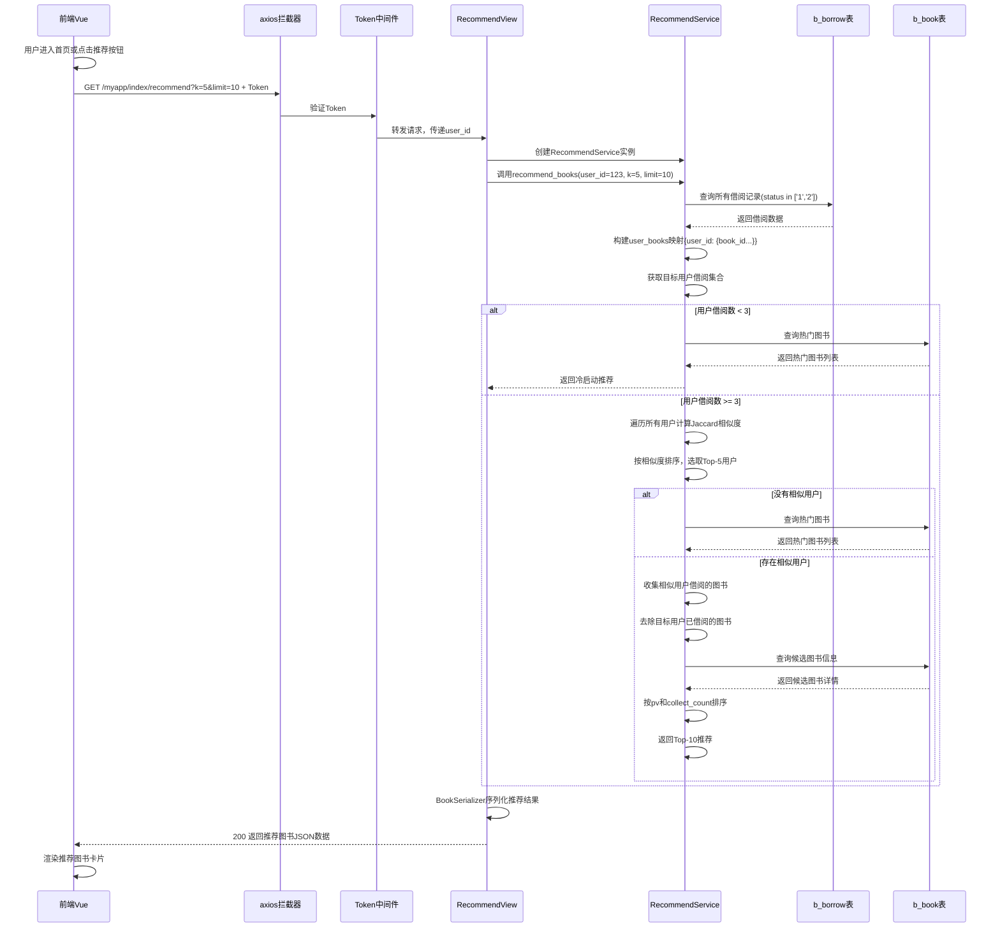
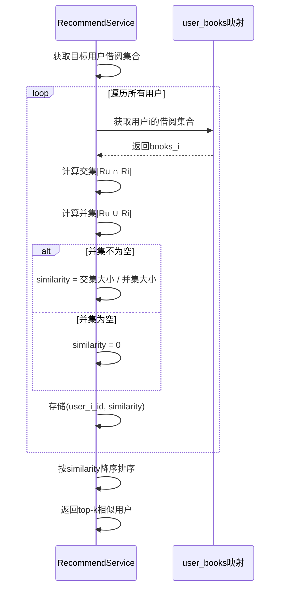

# 推荐算法详细设计与实现

## 第一部分 推荐算法概述

### 1.1 算法选择与设计思想

图书借阅推荐系统采用基于用户的协同过滤推荐算法，为用户推荐符合其阅读偏好的图书。协同过滤算法能够通过分析用户的借阅行为和其他用户的相似偏好，计算出用户的隐含兴趣，进而推荐用户可能感兴趣的图书。

本系统采用基于用户的协同过滤(User-Based Collaborative Filtering)方法，核心思想为：
- **相似用户发现**：根据用户的借阅历史找到兴趣相近的用户
- **兴趣传导**：假设相似用户喜欢的图书，目标用户也可能感兴趣
- **个性化推荐**：为每个用户生成定制化的推荐列表

### 1.2 算法流程

推荐系统的整体流程分为以下8个步骤：

#### 1.2.1 请求映射与参数接收

用户在系统前端点击"推荐图书"或进入首页时，前端调用`recommendBooksApi`方法向`/myapp/index/recommend`接口发送GET请求，同时携带Token进行身份验证。请求中需要包含以下参数：

- **Token**：用户的身份令牌，通过Token中间件验证用户身份，确定目标用户的user_id
- **k值**（可选）：用于控制选取最相似用户的数量，默认值为5-10
- **limit值**（可选）：用于控制返回推荐图书的数量，默认值为10-15

```
请求URL: GET /myapp/index/recommend?token=xxx&k=5&limit=10
响应数据结构: {
    "status": 200,
    "message": "推荐成功",
    "data": [
        {
            "id": 1,
            "title": "活着",
            "author": "余华",
            "cover": "/upload/cover/xxx.jpg",
            "pv": 1250,
            "similarity_score": 0.85
        },
        ...
    ]
}
```

#### 1.2.2 用户身份验证

后端RecommendView类接收请求，首先通过Token中间件进行身份验证。中间件从请求头中提取Token值，查询b_user表验证Token的有效性。

**验证步骤**：
1. 从request.headers中获取'token'字段
2. 在b_user表中查询token字段匹配的用户记录
3. 若用户不存在或Token无效，返回403错误码和"AUTH_FAIL_FRONT"错误信息
4. 若验证通过，将user_id传递给后续业务逻辑

```python
# Token中间件验证伪代码
def verify_token(request):
    token = request.headers.get('token')
    user = User.objects.filter(token=token).first()
    if not user:
        return Response({"detail": "AUTH_FAIL_FRONT"}, status=403)
    request.user_id = user.id
    return True
```

#### 1.2.3 用户借阅数据获取

验证通过后，系统从数据库获取所有用户的借阅历史数据。通过调用`Borrow.objects.all().values('user_id', 'book_id')`从b_borrow表查询所有借阅记录。

**获取的数据内容**：
- user_id：借阅用户的ID
- book_id：被借阅图书的ID
- status：借阅状态（'0'未借、'1'借出中、'2'已归还）
- borrow_time：借阅时间
- return_time：预计归还时间

系统只关注status='1'(借出中)或status='2'(已归还)的记录，作为用户确实有兴趣的图书标志。同时，系统也可以读取b_comment表中的评论记录和b_community_post表中的点赞记录，作为用户兴趣的辅助信息。

```python
# 数据获取伪代码
def get_user_borrow_data():
    borrows = Borrow.objects.filter(
        status__in=['1', '2']
    ).values('user_id', 'book_id')
    
    user_books = {}
    for borrow in borrows:
        uid = borrow['user_id']
        bid = borrow['book_id']
        if uid not in user_books:
            user_books[uid] = set()
        user_books[uid].add(bid)
    
    return user_books
```

#### 1.2.4 用户-图书映射矩阵构建

将原始借阅数据转化为用户-图书映射关系。构建一个字典数据结构user_books，其中：
- **键(Key)**：用户ID
- **值(Value)**：该用户已借阅的图书ID集合(Set类型)

这个映射关系形成了一个隐式的用户-图书矩阵，便于后续的相似度计算。

```python
# 矩阵构建伪代码
user_books = {
    1: {101, 102, 103},      # 用户1借阅了图书101、102、103
    2: {102, 103, 104},      # 用户2借阅了图书102、103、104
    3: {101, 105},           # 用户3借阅了图书101、105
    ...
}
```

#### 1.2.5 相似度计算算法

系统需要计算目标用户与其他所有用户之间的相似度。采用**Jaccard相似度系数**作为相似度度量：

$$sim(u, v) = \frac{|R_u \cap R_v|}{|R_u \cup R_v|}$$

其中：
- $R_u$ 表示用户u借阅的图书集合
- $R_v$ 表示用户v借阅的图书集合
- $|R_u \cap R_v|$ 表示两个用户的共同借阅图书数量（交集）
- $|R_u \cup R_v|$ 表示两个用户的总借阅图书数量（并集）

**相似度的取值范围**：[0, 1]
- 相似度=1：两个用户的借阅偏好完全相同
- 相似度=0.5：两个用户有50%的借阅偏好相同
- 相似度=0：两个用户没有共同借阅的图书

**计算示例**：
假设：
- 用户A借阅图书集合：{101, 102, 103, 104}
- 用户B借阅图书集合：{102, 103, 105}
- 交集：{102, 103}，大小为2
- 并集：{101, 102, 103, 104, 105}，大小为5
- 相似度 = 2/5 = 0.4

```python
# 相似度计算伪代码
def calculate_similarity(user_u_books, user_v_books):
    """计算两个用户的Jaccard相似度"""
    if not user_u_books or not user_v_books:
        return 0
    
    # 计算交集
    intersection = len(user_u_books & user_v_books)
    
    # 计算并集
    union = len(user_u_books | user_v_books)
    
    if union == 0:
        return 0
    
    # 计算Jaccard相似度
    similarity = intersection / union
    return similarity
```

#### 1.2.6 Top-K相似用户查找

系统遍历所有用户，计算目标用户与每个其他用户的相似度，然后按相似度从高到低排序，选取前K个最相似的用户作为"相似用户集合"。

**K值的选择**：
- k=3-5：保留最接近的邻居，推荐的图书与用户兴趣最匹配，但推荐多样性较低
- k=5-10：平衡推荐精度与多样性
- k>10：推荐的图书更加多样化，但准确性可能下降

**实现步骤**：
1. 初始化一个列表similarities用于存储(用户ID, 相似度)元组
2. 遍历所有用户，计算目标用户与其他用户的相似度
3. 对similarities列表按相似度降序排序
4. 取前K个相似用户

```python
# Top-K相似用户查找伪代码
def find_top_k_similar_users(target_user_id, user_books, k=5):
    """找到与目标用户最相似的K个用户"""
    target_books = user_books.get(target_user_id, set())
    
    if not target_books:
        return []  # 如果目标用户未借阅任何图书，无法进行推荐
    
    similarities = []
    
    # 遍历所有用户计算相似度
    for user_id, books in user_books.items():
        if user_id == target_user_id:
            continue  # 跳过目标用户自己
        
        similarity = calculate_similarity(target_books, books)
        similarities.append((user_id, similarity))
    
    # 按相似度降序排序
    similarities.sort(key=lambda x: x[1], reverse=True)
    
    # 返回前K个相似用户
    similar_users = [user_id for user_id, sim in similarities[:k]]
    
    return similar_users
```

#### 1.2.7 推荐图书候选生成

系统收集所有相似用户借阅过的图书，并去除目标用户已经借阅过的图书，得到推荐候选集合。

**生成步骤**：
1. 初始化空集合recommend_candidates
2. 遍历所有相似用户，将他们借阅过的图书ID添加到recommend_candidates
3. 从recommend_candidates中移除目标用户已借阅的图书
4. 从recommend_candidates中移除已下架的图书(status='1')

```python
# 推荐候选生成伪代码
def generate_recommend_candidates(target_user_id, similar_users, user_books):
    """生成推荐图书候选集合"""
    target_user_books = user_books.get(target_user_id, set())
    
    # 收集相似用户借阅的所有图书
    recommend_candidates = set()
    for user_id in similar_users:
        recommend_candidates |= user_books.get(user_id, set())
    
    # 去除目标用户已借阅的图书
    recommend_candidates -= target_user_books
    
    return recommend_candidates
```

#### 1.2.8 推荐结果排序与过滤

系统需要对推荐候选进行进一步的排序和过滤，以确保最终推荐的图书质量。排序标准包括：

**排序优先级**（从高到低）：
1. **图书受欢迎度(pv字段)**：浏览量越高表示图书越受欢迎
2. **图书收藏数(collect_count字段)**：被收藏的用户越多越受欢迎
3. **图书库存(stock字段)**：库存充足的图书优先推荐
4. **图书评分**：如果有评分数据，优先推荐评分高的图书

**过滤条件**：
1. 图书状态status='0'（上架）
2. 图书库存stock>0（有可借阅的副本）
3. 图书创建时间不超过2年（过于陈旧的图书不推荐）

```python
# 推荐结果排序与过滤伪代码
def rank_and_filter_recommendations(recommend_candidates, limit=10):
    """对推荐候选进行排序与过滤"""
    
    # 查询推荐图书的详细信息
    books = Book.objects.filter(
        id__in=recommend_candidates,
        status='0',      # 只推荐上架图书
        stock__gt=0      # 只推荐有库存的图书
    )
    
    # 按多个字段排序
    books = books.order_by(
        '-pv',            # 首先按浏览量降序
        '-collect_count', # 然后按收藏数降序
        '-create_time'    # 最后按创建时间降序
    )[:limit]
    
    return books
```

### 1.3 冷启动问题处理

对于新用户（未有任何借阅记录）或借阅历史极少的用户，系统难以计算相似用户。为解决这一问题，系统采用混合推荐策略：

**处理方案**：
1. 检查目标用户的借阅记录数量
2. 若借阅记录数 < 3，采用热门推荐
3. 对于热门推荐，系统直接查询b_book表，按照pv(浏览量)、collect_count(收藏数)等指标排序，返回最受欢迎的图书

```python
# 冷启动问题处理伪代码
def recommend_books_with_cold_start(target_user_id, user_books, k=5, limit=10):
    """处理冷启动问题的推荐算法"""
    
    target_user_books = user_books.get(target_user_id, set())
    
    # 检查用户的借阅历史是否充足
    if len(target_user_books) < 3:
        # 冷启动：使用热门推荐
        return get_popular_books(exclude_ids=target_user_books, limit=limit)
    
    # 正常推荐流程
    similar_users = find_top_k_similar_users(target_user_id, user_books, k)
    candidates = generate_recommend_candidates(target_user_id, similar_users, user_books)
    recommendations = rank_and_filter_recommendations(candidates, limit)
    
    return recommendations

def get_popular_books(exclude_ids=None, limit=10):
    """获取热门图书"""
    if exclude_ids is None:
        exclude_ids = set()
    
    popular_books = Book.objects.filter(
        status='0',      # 上架图书
        stock__gt=0      # 有库存
    ).exclude(
        id__in=exclude_ids  # 排除已借阅图书
    ).order_by(
        '-pv',            # 按浏览量排序
        '-collect_count'  # 按收藏数排序
    )[:limit]
    
    return popular_books
```

### 1.4 稀疏数据问题处理

在真实系统中，用户-图书矩阵通常是稀疏的（大多数用户只借阅少量图书），这可能导致很多用户对之间无法计算相似度。为解决此问题：

**处理方案**：
1. 采用**分类别推荐**：先筛选目标用户感兴趣的分类，再在该分类内推荐
2. 采用**内容推荐**：结合图书的分类、标签等内容信息进行推荐
3. 采用**混合推荐**：结合协同过滤、热门推荐、分类推荐等多种方法

```python
# 分类别推荐伪代码
def recommend_by_classification(target_user_id, user_books):
    """基于分类的推荐"""
    
    target_user_books = user_books.get(target_user_id, set())
    
    # 获取用户借阅的图书所属分类
    user_classifications = Book.objects.filter(
        id__in=target_user_books
    ).values_list('classification_id', flat=True).distinct()
    
    # 在这些分类中推荐热门图书
    recommendations = Book.objects.filter(
        classification_id__in=user_classifications,
        status='0',
        stock__gt=0
    ).exclude(
        id__in=target_user_books
    ).order_by('-pv', '-collect_count')[:10]
    
    return recommendations
```

## 第二部分 系统实现细节

### 2.1 后端实现架构

#### 2.1.1 代码结构

推荐算法模块的后端实现由以下几个主要类组成：

| 类名 | 文件位置 | 责任 |
|------|---------|------|
| `RecommendView` | `myapp/views/index/recommend.py` | 接收HTTP请求，调用推荐服务，返回推荐结果 |
| `RecommendService` | `myapp/recommend_books/recommend.py` | 实现协同过滤推荐算法的核心逻辑 |
| `BorrowRepository` | `myapp/models.py` | 访问b_borrow表，获取借阅数据 |
| `BookRepository` | `myapp/models.py` | 访问b_book表，获取图书信息 |

#### 2.1.2 RecommendView类设计

```python
# myapp/views/index/recommend.py
from rest_framework.views import APIView
from rest_framework.response import Response
from rest_framework import status
from myapp.auth.authentication import TokenAuthentication
from myapp.recommend_books.recommend import RecommendService

class RecommendView(APIView):
    """推荐接口视图类"""
    
    authentication_classes = [TokenAuthentication]
    
    def get(self, request):
        """
        获取推荐图书列表
        
        请求参数：
            - k: 相似用户数量，默认为5
            - limit: 推荐图书数量，默认为10
        """
        try:
            # 从Token中间件获取user_id
            user_id = request.user_id
            
            # 获取请求参数
            k = int(request.query_params.get('k', 5))
            limit = int(request.query_params.get('limit', 10))
            
            # 创建推荐服务实例
            recommend_service = RecommendService()
            
            # 获取推荐结果
            recommended_books = recommend_service.recommend_books(
                user_id=user_id,
                k=k,
                limit=limit
            )
            
            # 序列化推荐结果
            from myapp.serializers import BookSerializer
            serializer = BookSerializer(recommended_books, many=True)
            
            return Response({
                "code": 200,
                "message": "推荐成功",
                "data": serializer.data
            }, status=status.HTTP_200_OK)
            
        except Exception as e:
            return Response({
                "code": 500,
                "message": f"推荐失败: {str(e)}"
            }, status=status.HTTP_500_INTERNAL_SERVER_ERROR)
```

#### 2.1.3 RecommendService类设计

```python
# myapp/recommend_books/recommend.py
from myapp.models import Borrow, Book, User
from django.db.models import Q

class RecommendService:
    """推荐算法服务类"""
    
    def __init__(self):
        pass
    
    def recommend_books(self, user_id, k=5, limit=10):
        """
        为用户推荐图书
        
        参数：
            user_id: 目标用户ID
            k: 相似用户数量
            limit: 推荐图书数量
            
        返回：
            推荐的图书QuerySet对象
        """
        # 步骤1：获取用户-图书映射
        user_books = self._get_user_books_mapping()
        
        # 步骤2：检查是否需要冷启动处理
        target_user_books = user_books.get(user_id, set())
        if len(target_user_books) < 3:
            return self._get_popular_books(exclude_ids=target_user_books, limit=limit)
        
        # 步骤3：查找相似用户
        similar_users = self._find_top_k_similar_users(user_id, user_books, k)
        
        if not similar_users:
            # 如果没有相似用户，使用热门推荐
            return self._get_popular_books(exclude_ids=target_user_books, limit=limit)
        
        # 步骤4：生成推荐候选
        recommend_candidates = self._generate_candidates(user_id, similar_users, user_books)
        
        # 步骤5：排序和过滤
        recommendations = self._rank_and_filter(recommend_candidates, limit)
        
        return recommendations
    
    def _get_user_books_mapping(self):
        """获取用户-图书映射"""
        borrows = Borrow.objects.filter(
            status__in=['1', '2']
        ).values('user_id', 'book_id')
        
        user_books = {}
        for borrow in borrows:
            uid = borrow['user_id']
            bid = borrow['book_id']
            if uid not in user_books:
                user_books[uid] = set()
            user_books[uid].add(bid)
        
        return user_books
    
    def _calculate_similarity(self, set_u, set_v):
        """计算两个用户的Jaccard相似度"""
        if not set_u or not set_v:
            return 0
        
        intersection = len(set_u & set_v)
        union = len(set_u | set_v)
        
        if union == 0:
            return 0
        
        return intersection / union
    
    def _find_top_k_similar_users(self, target_user_id, user_books, k=5):
        """查找Top-K相似用户"""
        target_books = user_books.get(target_user_id, set())
        
        if not target_books:
            return []
        
        similarities = []
        
        for user_id, books in user_books.items():
            if user_id == target_user_id:
                continue
            
            similarity = self._calculate_similarity(target_books, books)
            if similarity > 0:  # 只保留有相似度的用户
                similarities.append((user_id, similarity))
        
        # 按相似度降序排序
        similarities.sort(key=lambda x: x[1], reverse=True)
        
        # 返回前K个相似用户
        similar_users = [uid for uid, sim in similarities[:k]]
        return similar_users
    
    def _generate_candidates(self, target_user_id, similar_users, user_books):
        """生成推荐候选"""
        target_books = user_books.get(target_user_id, set())
        
        candidates = set()
        for user_id in similar_users:
            candidates |= user_books.get(user_id, set())
        
        # 去除已借阅的图书
        candidates -= target_books
        
        return candidates
    
    def _rank_and_filter(self, candidates, limit=10):
        """排序和过滤推荐结果"""
        books = Book.objects.filter(
            id__in=candidates,
            status='0',      # 上架图书
            stock__gt=0      # 有库存
        ).order_by(
            '-pv',           # 按浏览量
            '-collect_count' # 按收藏数
        )[:limit]
        
        return books
    
    def _get_popular_books(self, exclude_ids=None, limit=10):
        """获取热门图书（用于冷启动）"""
        if exclude_ids is None:
            exclude_ids = set()
        
        popular_books = Book.objects.filter(
            status='0',
            stock__gt=0
        ).exclude(
            id__in=exclude_ids
        ).order_by(
            '-pv',
            '-collect_count'
        )[:limit]
        
        return popular_books
```

### 2.2 前端实现

#### 2.2.1 API调用

```javascript
// client/src/api/index/recommend.js
import axios from '@/utils/request'

const api = {
  recommendApi: '/myapp/index/recommend'
}

export const getRecommendBooks = (data) => {
  return axios({
    url: api.recommendApi,
    method: 'get',
    params: data
  })
}
```

#### 2.2.2 Vue组件集成

```vue
<!-- client/src/views/index/RecommendBooks.vue -->
<template>
  <div class="recommend-container">
    <div class="section-title">为您推荐</div>
    
    <div v-if="loading" class="loading">
      加载推荐中...
    </div>
    
    <div v-else-if="recommendBooks.length > 0" class="books-grid">
      <a-card 
        v-for="book in recommendBooks" 
        :key="book.id"
        class="book-card"
        @click="goToBookDetail(book.id)"
      >
        <template #cover>
          
        </template>
        <a-card-meta>
          <template #title>{{ book.title }}</template>
          <template #description>
            <span class="author">{{ book.author }}</span>
            <span class="pv">浏览:{{ book.pv }}</span>
          </template>
        </a-card-meta>
      </a-card>
    </div>
    
    <div v-else class="empty">
      <a-empty description="暂无推荐图书" />
    </div>
  </div>
</template>

<script>
import { getRecommendBooks } from '@/api/index/recommend'

export default {
  name: 'RecommendBooks',
  data() {
    return {
      recommendBooks: [],
      loading: false
    }
  },
  mounted() {
    this.loadRecommendBooks()
  },
  methods: {
    async loadRecommendBooks() {
      this.loading = true
      try {
        const response = await getRecommendBooks({
          k: 5,
          limit: 10
        })
        this.recommendBooks = response.data.data || []
      } catch (error) {
        this.$message.error('推荐加载失败')
      } finally {
        this.loading = false
      }
    },
    goToBookDetail(bookId) {
      this.$router.push(`/book/${bookId}`)
    }
  }
}
</script>

<style scoped>
.recommend-container {
  padding: 20px;
}

.section-title {
  font-size: 18px;
  font-weight: bold;
  margin-bottom: 15px;
}

.books-grid {
  display: grid;
  grid-template-columns: repeat(auto-fill, minmax(150px, 1fr));
  gap: 15px;
}

.book-card {
  cursor: pointer;
  transition: transform 0.3s;
}

.book-card:hover {
  transform: translateY(-5px);
}

.author {
  font-size: 12px;
  color: #999;
}

.pv {
  margin-left: 10px;
  font-size: 12px;
  color: #999;
}

.empty {
  text-align: center;
  padding: 40px;
}
</style>
```

### 2.3 系统时序图

#### 2.3.1 推荐算法完整时序图



#### 2.3.2 相似度计算时序图



## 第三部分 性能优化与扩展

### 3.1 性能优化方案

#### 3.1.1 缓存机制

系统可以采用Redis缓存来优化推荐性能：

```python
# 缓存推荐结果
def recommend_books_with_cache(user_id, k=5, limit=10):
    """使用缓存优化推荐性能"""
    import redis
    
    cache_key = f"recommend:{user_id}:{k}:{limit}"
    r = redis.Redis(host='localhost', port=6379, db=0)
    
    # 检查缓存
    cached_result = r.get(cache_key)
    if cached_result:
        return json.loads(cached_result)
    
    # 如果缓存不存在，计算推荐结果
    recommend_service = RecommendService()
    recommendations = recommend_service.recommend_books(user_id, k, limit)
    
    # 将结果存储到缓存，有效期1小时
    r.setex(cache_key, 3600, json.dumps(recommendations))
    
    return recommendations
```

#### 3.1.2 增量计算

对于借阅数据频繁更新的场景，系统可以采用增量计算方式：

```python
# 增量更新推荐
def incremental_recommend_update(new_borrow):
    """增量更新推荐结果"""
    user_id = new_borrow.user_id
    book_id = new_borrow.book_id
    
    # 只重新计算该用户的推荐结果
    cache_key = f"recommend:{user_id}:*"
    
    # 清除该用户的所有缓存
    r = redis.Redis(host='localhost', port=6379, db=0)
    keys = r.keys(cache_key)
    if keys:
        r.delete(*keys)
```

### 3.2 推荐算法扩展

#### 3.2.1 混合推荐策略

```python
# 混合推荐：协同过滤 + 热门推荐 + 分类推荐
def hybrid_recommend(user_id, k=5, limit=10):
    """混合推荐策略"""
    
    recommend_service = RecommendService()
    
    # 获取协同过滤推荐
    cf_recommendations = recommend_service.recommend_books(user_id, k, limit)
    
    # 获取分类推荐
    user_classifications = get_user_classifications(user_id)
    classification_recommendations = get_classification_books(
        user_classifications, 
        exclude_ids=set([b.id for b in cf_recommendations]),
        limit=int(limit/2)
    )
    
    # 合并推荐结果（70%协同过滤，30%分类推荐）
    num_cf = int(limit * 0.7)
    num_classification = limit - num_cf
    
    final_recommendations = list(cf_recommendations[:num_cf]) + \
                           list(classification_recommendations[:num_classification])
    
    return final_recommendations
```

#### 3.2.2 深度学习推荐

未来可以集成神经网络模型进行推荐：

```python
# 使用深度学习模型进行推荐（扩展方案）
def neural_network_recommend(user_id, limit=10):
    """基于深度学习的推荐"""
    import tensorflow as tf
    
    # 加载预训练的推荐模型
    model = tf.keras.models.load_model('recommendation_model.h5')
    
    # 获取用户特征向量
    user_features = get_user_features(user_id)
    
    # 获取所有图书特征向量
    all_book_features = get_all_book_features()
    
    # 预测用户对每本图书的评分
    predictions = model.predict([
        np.array([user_features]),
        np.array(all_book_features)
    ])
    
    # 获取Top-N预测评分的图书
    top_book_indices = np.argsort(predictions.flatten())[-limit:][::-1]
    
    recommended_books = [Book.objects.get(id=idx) for idx in top_book_indices]
    
    return recommended_books
```

### 3.3 监测与评估

#### 3.3.1 推荐效果指标

系统应该监测以下指标来评估推荐效果：

| 指标 | 计算方式 | 含义 |
|------|---------|------|
| **精确率(Precision)** | 推荐中被用户实际借阅的比例 | 推荐的准确性 |
| **召回率(Recall)** | 被推荐且实际借阅的占用户所有借阅的比例 | 推荐的覆盖率 |
| **点击率(CTR)** | 用户点击推荐图书的次数 / 推荐总次数 | 推荐的吸引力 |
| **转化率(CVR)** | 用户实际借阅推荐图书 / 点击推荐的次数 | 推荐的有效性 |
| **多样性** | 推荐图书的分类数量 / 总推荐数 | 推荐的丰富度 |

```python
# 推荐效果评估代码
def evaluate_recommendation(user_id, recommendation_ids, actual_borrow_ids):
    """评估推荐效果"""
    
    recommendation_set = set(recommendation_ids)
    actual_set = set(actual_borrow_ids)
    
    # 精确率
    if len(recommendation_set) > 0:
        precision = len(recommendation_set & actual_set) / len(recommendation_set)
    else:
        precision = 0
    
    # 召回率
    if len(actual_set) > 0:
        recall = len(recommendation_set & actual_set) / len(actual_set)
    else:
        recall = 0
    
    # F1值
    if precision + recall > 0:
        f1 = 2 * (precision * recall) / (precision + recall)
    else:
        f1 = 0
    
    return {
        'precision': precision,
        'recall': recall,
        'f1': f1
    }
```

#### 3.3.2 推荐日志

```python
# 记录推荐操作用于后期分析
class RecommendationLog(models.Model):
    """推荐日志模型"""
    user_id = models.BigIntegerField()
    recommended_books = models.TextField()  # JSON格式，存储推荐的图书ID列表
    recommendation_time = models.DateTimeField(auto_now_add=True)
    user_clicked = models.BooleanField(default=False)  # 用户是否点击了推荐
    user_borrowed = models.BooleanField(default=False)  # 用户是否借阅了推荐
    
    class Meta:
        db_table = 'b_recommendation_log'
        indexes = [
            models.Index(fields=['user_id', 'recommendation_time']),
        ]
```

## 总结

图书借阅推荐系统通过采用基于用户的协同过滤算法，结合冷启动处理、稀疏数据处理、性能优化等技术方案，为用户提供个性化、精准的图书推荐。系统架构清晰、易于维护和扩展，为今后集成更复杂的推荐算法（如基于内容的推荐、混合推荐、深度学习推荐等）奠定了坚实的基础。通过持续的监测和优化，系统的推荐效果将不断提升，为用户带来更好的使用体验。
