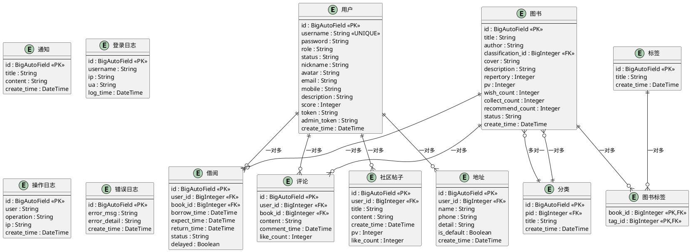
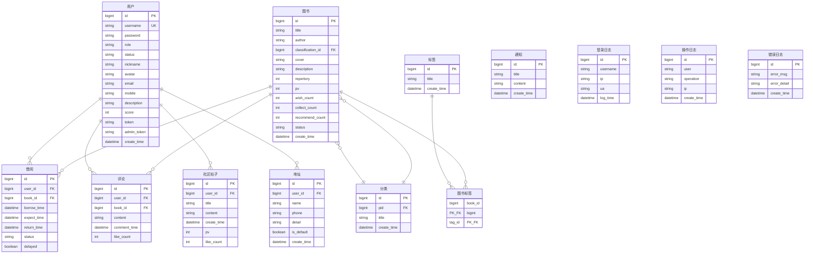

# 社区化图书共享与推荐平台 - 数据库内容设计

**文档版本**：1.0  
**设计时间**：2026年2月23日  
**项目名称**：社区化图书共享与推荐平台的设计与实现  
**设计人员**：Database Team

---

## 目录

1. [3.3 数据库设计](#33-数据库设计)
2. [3.3.1 概念结构设计](#331-概念结构设计)
3. [实体属性图](#实体属性图)
4. [3.3.2 逻辑结构设计](#332-逻辑结构设计)
5. [3.3.3 表结构设计](#333-表结构设计)
6. [E-R图代码](#er图代码)

---

# 3.3 数据库设计

数据库是系统开发的重要环节。从需求分析阶段的用例分析中可以得到用户、图书、分类、标签、借阅、评论、社区帖子、通知、日志等多个实体。通过深入分析这些实体的属性和相互关系，设计出高效、规范的数据库结构，为系统的稳定运行提供坚实基础。

---

# 3.3.1 概念结构设计

## 实体属性图

### 用户实体属性图

**用户实体** - 记录平台用户的基本信息

```
┌─────────────────────────────┐
│          用户实体            │
│      (User Entity)          │
├─────────────────────────────┤
│ 用户编号 (user_id)           │ ◆ 主键
│ 用户名 (username)            │ ◆ 唯一
│ 密码 (password)              │
│ 用户角色 (role)              │
│ 账号状态 (status)            │
│ 昵称 (nickname)              │
│ 头像 (avatar)                │
│ 邮箱 (email)                 │
│ 手机号 (mobile)              │
│ 个人简介 (description)       │
│ 积分 (score)                 │
│ 前台Token (token)            │
│ 后台Token (admin_token)      │
│ 创建时间 (create_time)       │
└─────────────────────────────┘
```

### 图书实体属性图

**图书实体** - 记录平台中的图书信息

```
┌─────────────────────────────┐
│          图书实体            │
│      (Book Entity)          │
├─────────────────────────────┤
│ 图书编号 (id)                │ ◆ 主键
│ 图书标题 (title)             │
│ 作者 (author)                │
│ 分类编号 (classification_id) │ ◇ 外键
│ 图书封面 (cover)             │
│ 图书描述 (description)       │
│ 库存数量 (repertory)         │
│ 浏览量 (pv)                  │
│ 愿望单数 (wish_count)        │
│ 收藏数 (collect_count)       │
│ 推荐数 (recommend_count)     │
│ 图书状态 (status)            │
│ 创建时间 (create_time)       │
└─────────────────────────────┘
```

### 分类实体属性图

**分类实体** - 记录图书分类信息

```
┌─────────────────────────────┐
│        分类实体              │
│   (Classification Entity)   │
├─────────────────────────────┤
│ 分类编号 (id)                │ ◆ 主键
│ 父分类编号 (pid)             │ ◇ 外键(自引用)
│ 分类标题 (title)             │
│ 创建时间 (create_time)       │
└─────────────────────────────┘
```

### 标签实体属性图

**标签实体** - 记录图书标签信息

```
┌─────────────────────────────┐
│          标签实体            │
│      (Tag Entity)           │
├─────────────────────────────┤
│ 标签编号 (id)                │ ◆ 主键
│ 标签标题 (title)             │
│ 创建时间 (create_time)       │
└─────────────────────────────┘
```

### 借阅实体属性图

**借阅实体** - 记录用户借阅信息

```
┌─────────────────────────────┐
│          借阅实体            │
│      (Borrow Entity)        │
├─────────────────────────────┤
│ 借阅编号 (id)                │ ◆ 主键
│ 用户编号 (user_id)           │ ◇ 外键
│ 图书编号 (book_id)           │ ◇ 外键
│ 借阅时间 (borrow_time)       │
│ 应还时间 (expect_time)       │
│ 实际还书时间 (return_time)   │
│ 借阅状态 (status)            │
│ 是否延期 (delayed)           │
└─────────────────────────────┘
```

### 评论实体属性图

**评论实体** - 记录用户对图书的评论

```
┌─────────────────────────────┐
│          评论实体            │
│      (Comment Entity)       │
├─────────────────────────────┤
│ 评论编号 (id)                │ ◆ 主键
│ 用户编号 (user_id)           │ ◇ 外键
│ 图书编号 (book_id)           │ ◇ 外键
│ 评论内容 (content)           │
│ 评论时间 (comment_time)      │
│ 点赞数 (like_count)          │
└─────────────────────────────┘
```

### 社区帖子实体属性图

**社区帖子实体** - 记录用户在社区发表的帖子

```
┌─────────────────────────────┐
│      社区帖子实体            │
│   (CommunityPost Entity)    │
├─────────────────────────────┤
│ 帖子编号 (id)                │ ◆ 主键
│ 用户编号 (user_id)           │ ◇ 外键
│ 帖子标题 (title)             │
│ 帖子内容 (content)           │
│ 创建时间 (create_time)       │
│ 浏览量 (pv)                  │
│ 点赞数 (like_count)          │
└─────────────────────────────┘
```

### 地址实体属性图

**地址实体** - 记录用户的地址信息

```
┌─────────────────────────────┐
│          地址实体            │
│      (Address Entity)       │
├─────────────────────────────┤
│ 地址编号 (id)                │ ◆ 主键
│ 用户编号 (user_id)           │ ◇ 外键
│ 收货人 (name)                │
│ 电话 (phone)                 │
│ 详细地址 (detail)            │
│ 是否默认 (is_default)        │
│ 创建时间 (create_time)       │
└─────────────────────────────┘
```

### 通知实体属性图

**通知实体** - 记录系统通知信息

```
┌─────────────────────────────┐
│          通知实体            │
│      (Notice Entity)        │
├─────────────────────────────┤
│ 通知编号 (id)                │ ◆ 主键
│ 通知标题 (title)             │
│ 通知内容 (content)           │
│ 创建时间 (create_time)       │
└─────────────────────────────┘
```

### 登录日志实体属性图

**登录日志实体** - 记录用户登录信息

```
┌─────────────────────────────┐
│        登录日志实体          │
│    (LoginLog Entity)        │
├─────────────────────────────┤
│ 日志编号 (id)                │ ◆ 主键
│ 用户名 (username)            │
│ 登录IP (ip)                  │
│ User-Agent (ua)              │
│ 登录时间 (log_time)          │
└─────────────────────────────┘
```

### 操作日志实体属性图

**操作日志实体** - 记录系统操作日志

```
┌─────────────────────────────┐
│        操作日志实体          │
│     (OpLog Entity)          │
├─────────────────────────────┤
│ 日志编号 (id)                │ ◆ 主键
│ 操作用户 (user)              │
│ 操作类型 (operation)         │
│ 操作IP (ip)                  │
│ 操作时间 (create_time)       │
└─────────────────────────────┘
```

### 错误日志实体属性图

**错误日志实体** - 记录系统错误信息

```
┌─────────────────────────────┐
│        错误日志实体          │
│    (ErrorLog Entity)        │
├─────────────────────────────┤
│ 日志编号 (id)                │ ◆ 主键
│ 错误信息 (error_msg)         │
│ 错误详情 (error_detail)      │
│ 创建时间 (create_time)       │
└─────────────────────────────┘
```

---

## 实体之间的关系

系统中各实体之间的关系如下：

1. **用户与图书**（多对多）
   - 一个用户可以浏览、收藏、添加到愿望单多本图书
   - 一本图书可以被多个用户浏览、收藏、添加到愿望单

2. **图书与分类**（多对一）
   - 多本图书属于一个分类
   - 一个分类可以包含多本图书

3. **图书与标签**（多对多）
   - 一本图书可以有多个标签
   - 一个标签可以标记多本图书

4. **用户与借阅**（一对多）
   - 一个用户可以进行多笔借阅
   - 一笔借阅只属于一个用户

5. **图书与借阅**（一对多）
   - 一本图书可以被多次借阅
   - 一笔借阅只涉及一本图书

6. **用户与评论**（一对多）
   - 一个用户可以发表多条评论
   - 一条评论只由一个用户发表

7. **图书与评论**（一对多）
   - 一本图书可以有多条评论
   - 一条评论只针对一本图书

8. **用户与社区帖子**（一对多）
   - 一个用户可以发表多篇帖子
   - 一篇帖子只由一个用户发表

9. **用户与地址**（一对多）
   - 一个用户可以有多个地址
   - 一个地址只属于一个用户

---

# 3.3.2 逻辑结构设计

根据实体之间的关系分析，设计如下逻辑结构（其中 **◆** 表示主键，**◇** 表示外键）：

```
1. 用户表 (b_user)
   ◆ id (BigAutoField) - 用户ID
   - username (String, UNIQUE) - 用户名
   - password (String) - 密码（MD5加密）
   - role (String) - 角色：0=管理员, 1=普通用户, 2=演示用户
   - status (String) - 账号状态：0=正常, 1=冻结
   - nickname (String) - 昵称
   - avatar (String) - 头像
   - email (String) - 邮箱
   - mobile (String) - 手机号
   - description (String) - 个人简介
   - score (Integer) - 积分
   - token (String) - 前台Token
   - admin_token (String) - 后台Token
   - create_time (DateTime) - 创建时间

2. 图书表 (b_book)
   ◆ id (BigAutoField) - 图书ID
   - title (String) - 标题
   - author (String) - 作者
   ◇ classification_id (ForeignKey) - 分类ID
   - cover (String) - 封面图片
   - description (String) - 描述
   - repertory (Integer) - 库存
   - pv (Integer) - 浏览量
   - wish_count (Integer) - 愿望单数
   - collect_count (Integer) - 收藏数
   - recommend_count (Integer) - 推荐数
   - status (String) - 状态：0=上架, 1=下架
   - create_time (DateTime) - 创建时间

3. 分类表 (b_classification)
   ◆ id (BigAutoField) - 分类ID
   ◇ pid (ForeignKey, NULL) - 父分类ID
   - title (String) - 分类名称
   - create_time (DateTime) - 创建时间

4. 标签表 (b_tag)
   ◆ id (BigAutoField) - 标签ID
   - title (String) - 标签名称
   - create_time (DateTime) - 创建时间

5. 图书标签关联表 (b_book_tag)
   ◆ book_id, tag_id - 复合主键
   ◇ book_id (ForeignKey) - 图书ID
   ◇ tag_id (ForeignKey) - 标签ID

6. 借阅表 (b_borrow)
   ◆ id (BigAutoField) - 借阅ID
   ◇ user_id (ForeignKey) - 用户ID
   ◇ book_id (ForeignKey) - 图书ID
   - borrow_time (DateTime) - 借阅时间
   - expect_time (DateTime) - 应还时间
   - return_time (DateTime, NULL) - 实际还书时间
   - status (String) - 状态：1=借阅中, 2=已归还, 3=逾期
   - delayed (Boolean) - 是否已延期

7. 评论表 (b_comment)
   ◆ id (BigAutoField) - 评论ID
   ◇ user_id (ForeignKey) - 用户ID
   ◇ book_id (ForeignKey) - 图书ID
   - content (String) - 评论内容
   - comment_time (DateTime) - 评论时间
   - like_count (Integer) - 点赞数

8. 社区帖子表 (b_community_post)
   ◆ id (BigAutoField) - 帖子ID
   ◇ user_id (ForeignKey) - 用户ID
   - title (String) - 帖子标题
   - content (String) - 帖子内容
   - create_time (DateTime) - 创建时间
   - pv (Integer) - 浏览量
   - like_count (Integer) - 点赞数

9. 地址表 (b_address)
   ◆ id (BigAutoField) - 地址ID
   ◇ user_id (ForeignKey) - 用户ID
   - name (String) - 收货人姓名
   - phone (String) - 电话
   - detail (String) - 详细地址
   - is_default (Boolean) - 是否默认
   - create_time (DateTime) - 创建时间

10. 通知表 (b_notice)
    ◆ id (BigAutoField) - 通知ID
    - title (String) - 标题
    - content (String) - 内容
    - create_time (DateTime) - 创建时间

11. 登录日志表 (b_login_log)
    ◆ id (BigAutoField) - 日志ID
    - username (String) - 用户名
    - ip (String) - IP地址
    - ua (String) - User-Agent
    - log_time (DateTime) - 登录时间

12. 操作日志表 (b_op_log)
    ◆ id (BigAutoField) - 日志ID
    - user (String) - 操作用户
    - operation (String) - 操作类型
    - ip (String) - IP地址
    - create_time (DateTime) - 操作时间

13. 错误日志表 (b_error_log)
    ◆ id (BigAutoField) - 日志ID
    - error_msg (String) - 错误信息
    - error_detail (String) - 错误详情
    - create_time (DateTime) - 创建时间
```

---

# 3.3.3 表结构设计

根据逻辑结构设计，系统共设计出13张数据表。下面给出所有数据表的详细信息。

## 表3-1 数据表概述

| 表名 | 说明 | 功能 | 记录数 |
|------|------|------|--------|
| b_user | 用户表 | 存储用户基本信息 | 可变 |
| b_book | 图书表 | 存储图书信息 | 可变 |
| b_classification | 分类表 | 存储图书分类 | 较少 |
| b_tag | 标签表 | 存储图书标签 | 较少 |
| b_book_tag | 图书标签关联表 | 管理图书与标签关系 | 可变 |
| b_borrow | 借阅表 | 存储借阅记录 | 可变 |
| b_comment | 评论表 | 存储图书评论 | 可变 |
| b_community_post | 社区帖子表 | 存储社区帖子 | 可变 |
| b_address | 地址表 | 存储用户地址 | 可变 |
| b_notice | 通知表 | 存储系统通知 | 较少 |
| b_login_log | 登录日志表 | 记录登录信息 | 可变（定期清理） |
| b_op_log | 操作日志表 | 记录系统操作 | 可变（定期清理） |
| b_error_log | 错误日志表 | 记录系统错误 | 可变（定期清理） |

---

## 表3-2 用户表 (b_user)

| 字段名 | 字段说明 | 数据类型 | 长度 | 约束 | 描述 |
|-------|--------|--------|------|------|------|
| id | 用户ID | BigAutoField | - | PK | 自增主键，用户唯一标识 |
| username | 用户名 | CharField | 50 | UNIQUE | 用户注册时使用的用户名/邮箱，不可重复 |
| password | 密码 | CharField | 50 | NOT NULL | MD5加密后的密码 |
| role | 用户角色 | CharField | 2 | DEFAULT '1' | 0=管理员, 1=普通用户, 2=演示用户 |
| status | 账号状态 | CharField | 1 | DEFAULT '0' | 0=正常, 1=冻结 |
| nickname | 昵称 | CharField | 20 | NULL | 用户昵称，可为空 |
| avatar | 头像 | FileField | - | NULL | 用户头像图片，存储文件路径 |
| email | 邮箱 | CharField | 50 | NULL | 用户邮箱 |
| mobile | 手机号 | CharField | 13 | NULL | 用户手机号码 |
| description | 个人简介 | TextField | 200 | NULL | 用户个人简介 |
| score | 积分 | IntegerField | - | DEFAULT 0 | 用户积分，用于兑换权益 |
| token | 前台Token | CharField | 32 | NULL | 前台用户Token，用于身份验证 |
| admin_token | 后台Token | CharField | 32 | NULL | 后台管理员Token，用于后台登录 |
| create_time | 创建时间 | DateTimeField | - | AUTO | 账号创建时间，自动设置 |

---

## 表3-3 图书表 (b_book)

| 字段名 | 字段说明 | 数据类型 | 长度 | 约束 | 描述 |
|-------|--------|--------|------|------|------|
| id | 图书ID | BigAutoField | - | PK | 自增主键，图书唯一标识 |
| title | 图书标题 | CharField | 100 | NOT NULL | 图书名称 |
| author | 作者 | CharField | 50 | NULL | 图书作者 |
| classification_id | 分类ID | ForeignKey | - | FK | 关联分类表，图书所属分类 |
| cover | 封面图片 | FileField | - | NULL | 图书封面图片 |
| description | 图书描述 | TextField | - | NULL | 图书简介、描述 |
| repertory | 库存数量 | IntegerField | - | DEFAULT 0 | 当前可借阅的图书数量 |
| pv | 浏览量 | IntegerField | - | DEFAULT 0 | 图书详情页浏览次数 |
| wish_count | 愿望单数 | IntegerField | - | DEFAULT 0 | 被添加到愿望单的次数 |
| collect_count | 收藏数 | IntegerField | - | DEFAULT 0 | 被收藏的次数 |
| recommend_count | 推荐数 | IntegerField | - | DEFAULT 0 | 被推荐的次数 |
| status | 图书状态 | CharField | 1 | DEFAULT '0' | 0=上架, 1=下架 |
| create_time | 创建时间 | DateTimeField | - | AUTO | 图书添加时间 |

---

## 表3-4 分类表 (b_classification)

| 字段名 | 字段说明 | 数据类型 | 长度 | 约束 | 描述 |
|-------|--------|--------|------|------|------|
| id | 分类ID | BigAutoField | - | PK | 自增主键，分类唯一标识 |
| pid | 父分类ID | ForeignKey | - | FK, NULL | 支持分类树形结构，可为空 |
| title | 分类名称 | CharField | 50 | NOT NULL | 分类名称，如"文学"、"科技" |
| create_time | 创建时间 | DateTimeField | - | AUTO | 分类创建时间 |

---

## 表3-5 标签表 (b_tag)

| 字段名 | 字段说明 | 数据类型 | 长度 | 约束 | 描述 |
|-------|--------|--------|------|------|------|
| id | 标签ID | BigAutoField | - | PK | 自增主键，标签唯一标识 |
| title | 标签名称 | CharField | 50 | NOT NULL | 标签名称，如"悬疑"、"爱情" |
| create_time | 创建时间 | DateTimeField | - | AUTO | 标签创建时间 |

---

## 表3-6 图书标签关联表 (b_book_tag)

| 字段名 | 字段说明 | 数据类型 | 长度 | 约束 | 描述 |
|-------|--------|--------|------|------|------|
| book_id | 图书ID | ForeignKey | - | PK, FK | 关联图书表，图书标识 |
| tag_id | 标签ID | ForeignKey | - | PK, FK | 关联标签表，标签标识 |

---

## 表3-7 借阅表 (b_borrow)

| 字段名 | 字段说明 | 数据类型 | 长度 | 约束 | 描述 |
|-------|--------|--------|------|------|------|
| id | 借阅ID | BigAutoField | - | PK | 自增主键，借阅记录唯一标识 |
| user_id | 用户ID | ForeignKey | - | FK | 关联用户表，借阅人ID |
| book_id | 图书ID | ForeignKey | - | FK | 关联图书表，被借图书ID |
| borrow_time | 借阅时间 | DateTimeField | - | NOT NULL | 用户借阅的时间 |
| expect_time | 应还时间 | DateTimeField | - | NOT NULL | 应该归还的时间（通常为30天后） |
| return_time | 实际还书时间 | DateTimeField | - | NULL | 用户实际归还的时间，可为空 |
| status | 借阅状态 | CharField | 1 | DEFAULT '1' | 1=借阅中, 2=已归还, 3=逾期 |
| delayed | 是否延期 | BooleanField | - | DEFAULT False | 是否已申请延期 |

---

## 表3-8 评论表 (b_comment)

| 字段名 | 字段说明 | 数据类型 | 长度 | 约束 | 描述 |
|-------|--------|--------|------|------|------|
| id | 评论ID | BigAutoField | - | PK | 自增主键，评论唯一标识 |
| user_id | 用户ID | ForeignKey | - | FK | 关联用户表，评论人ID |
| book_id | 图书ID | ForeignKey | - | FK | 关联图书表，被评论的图书ID |
| content | 评论内容 | TextField | - | NOT NULL | 用户的评论文本 |
| comment_time | 评论时间 | DateTimeField | - | AUTO | 评论发表时间 |
| like_count | 点赞数 | IntegerField | - | DEFAULT 0 | 评论被点赞的次数 |

---

## 表3-9 社区帖子表 (b_community_post)

| 字段名 | 字段说明 | 数据类型 | 长度 | 约束 | 描述 |
|-------|--------|--------|------|------|------|
| id | 帖子ID | BigAutoField | - | PK | 自增主键，帖子唯一标识 |
| user_id | 用户ID | ForeignKey | - | FK | 关联用户表，发布人ID |
| title | 帖子标题 | CharField | 100 | NOT NULL | 帖子标题 |
| content | 帖子内容 | TextField | - | NOT NULL | 帖子正文内容 |
| create_time | 创建时间 | DateTimeField | - | AUTO | 帖子发布时间 |
| pv | 浏览量 | IntegerField | - | DEFAULT 0 | 帖子被浏览的次数 |
| like_count | 点赞数 | IntegerField | - | DEFAULT 0 | 帖子被点赞的次数 |

---

## 表3-10 地址表 (b_address)

| 字段名 | 字段说明 | 数据类型 | 长度 | 约束 | 描述 |
|-------|--------|--------|------|------|------|
| id | 地址ID | BigAutoField | - | PK | 自增主键，地址唯一标识 |
| user_id | 用户ID | ForeignKey | - | FK | 关联用户表，所属用户ID |
| name | 收货人 | CharField | 50 | NOT NULL | 收货人姓名 |
| phone | 电话 | CharField | 13 | NOT NULL | 收货人电话 |
| detail | 详细地址 | CharField | 255 | NOT NULL | 具体地址信息 |
| is_default | 是否默认 | BooleanField | - | DEFAULT False | 是否为默认收货地址 |
| create_time | 创建时间 | DateTimeField | - | AUTO | 地址创建时间 |

---

## 表3-11 通知表 (b_notice)

| 字段名 | 字段说明 | 数据类型 | 长度 | 约束 | 描述 |
|-------|--------|--------|------|------|------|
| id | 通知ID | BigAutoField | - | PK | 自增主键，通知唯一标识 |
| title | 通知标题 | CharField | 100 | NOT NULL | 通知标题 |
| content | 通知内容 | TextField | - | NOT NULL | 通知内容 |
| create_time | 创建时间 | DateTimeField | - | AUTO | 通知发布时间 |

---

## 表3-12 登录日志表 (b_login_log)

| 字段名 | 字段说明 | 数据类型 | 长度 | 约束 | 描述 |
|-------|--------|--------|------|------|------|
| id | 日志ID | BigAutoField | - | PK | 自增主键，日志唯一标识 |
| username | 用户名 | CharField | 50 | NOT NULL | 登录用户的用户名 |
| ip | IP地址 | CharField | 50 | NOT NULL | 登录所使用的IP地址 |
| ua | User-Agent | CharField | 255 | NOT NULL | 登录所使用的浏览器信息 |
| log_time | 登录时间 | DateTimeField | - | AUTO | 登录时间 |

---

## 表3-13 操作日志表 (b_op_log)

| 字段名 | 字段说明 | 数据类型 | 长度 | 约束 | 描述 |
|-------|--------|--------|------|------|------|
| id | 日志ID | BigAutoField | - | PK | 自增主键，日志唯一标识 |
| user | 操作用户 | CharField | 50 | NULL | 进行操作的用户名 |
| operation | 操作类型 | CharField | 100 | NULL | 操作的具体内容描述 |
| ip | IP地址 | CharField | 50 | NULL | 操作发起的IP地址 |
| create_time | 操作时间 | DateTimeField | - | AUTO | 操作发生的时间 |

---

## 表3-14 错误日志表 (b_error_log)

| 字段名 | 字段说明 | 数据类型 | 长度 | 约束 | 描述 |
|-------|--------|--------|------|------|------|
| id | 日志ID | BigAutoField | - | PK | 自增主键，日志唯一标识 |
| error_msg | 错误信息 | CharField | 255 | NULL | 错误的简要信息 |
| error_detail | 错误详情 | TextField | - | NULL | 错误的详细堆栈信息 |
| create_time | 创建时间 | DateTimeField | - | AUTO | 错误发生的时间 |

---

# E-R图代码

## PlantUML E-R图代码

以下为使用PlantUML绘制的完整E-R图代码，可直接在PlantUML编辑器中使用：



## Mermaid E-R图代码

如果您使用Mermaid，以下是对应的代码：



---

## 数据库SQL DDL语句

完整的SQL建表语句（基于MySQL 8.0）：

```sql
-- 用户表
CREATE TABLE `b_user` (
  `id` bigint NOT NULL AUTO_INCREMENT COMMENT '用户ID',
  `username` varchar(50) NOT NULL UNIQUE COMMENT '用户名',
  `password` varchar(50) NOT NULL COMMENT 'MD5加密密码',
  `role` varchar(2) DEFAULT '1' COMMENT '角色：0=管理员,1=普通用户,2=演示用户',
  `status` varchar(1) DEFAULT '0' COMMENT '账号状态：0=正常,1=冻结',
  `nickname` varchar(20) NULL COMMENT '昵称',
  `avatar` varchar(255) NULL COMMENT '头像路径',
  `email` varchar(50) NULL COMMENT '邮箱',
  `mobile` varchar(13) NULL COMMENT '手机号',
  `description` longtext NULL COMMENT '个人简介',
  `score` int DEFAULT 0 COMMENT '用户积分',
  `token` varchar(32) NULL COMMENT '前台Token',
  `admin_token` varchar(32) NULL COMMENT '后台Token',
  `create_time` datetime DEFAULT CURRENT_TIMESTAMP COMMENT '创建时间',
  PRIMARY KEY (`id`),
  UNIQUE KEY `uk_username` (`username`)
) ENGINE=InnoDB DEFAULT CHARSET=utf8mb4 COLLATE=utf8mb4_unicode_ci COMMENT='用户表';

-- 分类表
CREATE TABLE `b_classification` (
  `id` bigint NOT NULL AUTO_INCREMENT COMMENT '分类ID',
  `pid` bigint NULL COMMENT '父分类ID',
  `title` varchar(50) NOT NULL COMMENT '分类名称',
  `create_time` datetime DEFAULT CURRENT_TIMESTAMP COMMENT '创建时间',
  PRIMARY KEY (`id`),
  KEY `fk_pid` (`pid`),
  FOREIGN KEY (`pid`) REFERENCES `b_classification` (`id`) ON DELETE SET NULL
) ENGINE=InnoDB DEFAULT CHARSET=utf8mb4 COLLATE=utf8mb4_unicode_ci COMMENT='分类表';

-- 标签表
CREATE TABLE `b_tag` (
  `id` bigint NOT NULL AUTO_INCREMENT COMMENT '标签ID',
  `title` varchar(50) NOT NULL COMMENT '标签名称',
  `create_time` datetime DEFAULT CURRENT_TIMESTAMP COMMENT '创建时间',
  PRIMARY KEY (`id`)
) ENGINE=InnoDB DEFAULT CHARSET=utf8mb4 COLLATE=utf8mb4_unicode_ci COMMENT='标签表';

-- 图书表
CREATE TABLE `b_book` (
  `id` bigint NOT NULL AUTO_INCREMENT COMMENT '图书ID',
  `title` varchar(100) NOT NULL COMMENT '图书标题',
  `author` varchar(50) NULL COMMENT '作者',
  `classification_id` bigint NOT NULL COMMENT '分类ID',
  `cover` varchar(255) NULL COMMENT '封面图片',
  `description` longtext NULL COMMENT '图书描述',
  `repertory` int DEFAULT 0 COMMENT '库存数量',
  `pv` int DEFAULT 0 COMMENT '浏览量',
  `wish_count` int DEFAULT 0 COMMENT '愿望单数',
  `collect_count` int DEFAULT 0 COMMENT '收藏数',
  `recommend_count` int DEFAULT 0 COMMENT '推荐数',
  `status` varchar(1) DEFAULT '0' COMMENT '状态：0=上架,1=下架',
  `create_time` datetime DEFAULT CURRENT_TIMESTAMP COMMENT '创建时间',
  PRIMARY KEY (`id`),
  KEY `fk_classification_id` (`classification_id`),
  FOREIGN KEY (`classification_id`) REFERENCES `b_classification` (`id`) ON DELETE CASCADE
) ENGINE=InnoDB DEFAULT CHARSET=utf8mb4 COLLATE=utf8mb4_unicode_ci COMMENT='图书表';

-- 图书标签关联表
CREATE TABLE `b_book_tag` (
  `book_id` bigint NOT NULL,
  `tag_id` bigint NOT NULL,
  PRIMARY KEY (`book_id`, `tag_id`),
  KEY `fk_tag_id` (`tag_id`),
  FOREIGN KEY (`book_id`) REFERENCES `b_book` (`id`) ON DELETE CASCADE,
  FOREIGN KEY (`tag_id`) REFERENCES `b_tag` (`id`) ON DELETE CASCADE
) ENGINE=InnoDB DEFAULT CHARSET=utf8mb4 COLLATE=utf8mb4_unicode_ci COMMENT='图书标签关联表';

-- 借阅表
CREATE TABLE `b_borrow` (
  `id` bigint NOT NULL AUTO_INCREMENT COMMENT '借阅ID',
  `user_id` bigint NOT NULL COMMENT '用户ID',
  `book_id` bigint NOT NULL COMMENT '图书ID',
  `borrow_time` datetime NOT NULL COMMENT '借阅时间',
  `expect_time` datetime NOT NULL COMMENT '应还时间',
  `return_time` datetime NULL COMMENT '实际还书时间',
  `status` varchar(1) DEFAULT '1' COMMENT '状态：1=借阅中,2=已归还,3=逾期',
  `delayed` tinyint(1) DEFAULT 0 COMMENT '是否延期',
  PRIMARY KEY (`id`),
  KEY `fk_user_id` (`user_id`),
  KEY `fk_book_id` (`book_id`),
  FOREIGN KEY (`user_id`) REFERENCES `b_user` (`id`) ON DELETE CASCADE,
  FOREIGN KEY (`book_id`) REFERENCES `b_book` (`id`) ON DELETE CASCADE
) ENGINE=InnoDB DEFAULT CHARSET=utf8mb4 COLLATE=utf8mb4_unicode_ci COMMENT='借阅表';

-- 评论表
CREATE TABLE `b_comment` (
  `id` bigint NOT NULL AUTO_INCREMENT COMMENT '评论ID',
  `user_id` bigint NOT NULL COMMENT '用户ID',
  `book_id` bigint NOT NULL COMMENT '图书ID',
  `content` longtext NOT NULL COMMENT '评论内容',
  `comment_time` datetime DEFAULT CURRENT_TIMESTAMP COMMENT '评论时间',
  `like_count` int DEFAULT 0 COMMENT '点赞数',
  PRIMARY KEY (`id`),
  KEY `fk_user_id` (`user_id`),
  KEY `fk_book_id` (`book_id`),
  UNIQUE KEY `uk_user_book` (`user_id`, `book_id`),
  FOREIGN KEY (`user_id`) REFERENCES `b_user` (`id`) ON DELETE CASCADE,
  FOREIGN KEY (`book_id`) REFERENCES `b_book` (`id`) ON DELETE CASCADE
) ENGINE=InnoDB DEFAULT CHARSET=utf8mb4 COLLATE=utf8mb4_unicode_ci COMMENT='评论表';

-- 社区帖子表
CREATE TABLE `b_community_post` (
  `id` bigint NOT NULL AUTO_INCREMENT COMMENT '帖子ID',
  `user_id` bigint NOT NULL COMMENT '用户ID',
  `title` varchar(100) NOT NULL COMMENT '帖子标题',
  `content` longtext NOT NULL COMMENT '帖子内容',
  `create_time` datetime DEFAULT CURRENT_TIMESTAMP COMMENT '创建时间',
  `pv` int DEFAULT 0 COMMENT '浏览量',
  `like_count` int DEFAULT 0 COMMENT '点赞数',
  PRIMARY KEY (`id`),
  KEY `fk_user_id` (`user_id`),
  FOREIGN KEY (`user_id`) REFERENCES `b_user` (`id`) ON DELETE CASCADE
) ENGINE=InnoDB DEFAULT CHARSET=utf8mb4 COLLATE=utf8mb4_unicode_ci COMMENT='社区帖子表';

-- 地址表
CREATE TABLE `b_address` (
  `id` bigint NOT NULL AUTO_INCREMENT COMMENT '地址ID',
  `user_id` bigint NOT NULL COMMENT '用户ID',
  `name` varchar(50) NOT NULL COMMENT '收货人',
  `phone` varchar(13) NOT NULL COMMENT '电话',
  `detail` varchar(255) NOT NULL COMMENT '详细地址',
  `is_default` tinyint(1) DEFAULT 0 COMMENT '是否默认',
  `create_time` datetime DEFAULT CURRENT_TIMESTAMP COMMENT '创建时间',
  PRIMARY KEY (`id`),
  KEY `fk_user_id` (`user_id`),
  FOREIGN KEY (`user_id`) REFERENCES `b_user` (`id`) ON DELETE CASCADE
) ENGINE=InnoDB DEFAULT CHARSET=utf8mb4 COLLATE=utf8mb4_unicode_ci COMMENT='地址表';

-- 通知表
CREATE TABLE `b_notice` (
  `id` bigint NOT NULL AUTO_INCREMENT COMMENT '通知ID',
  `title` varchar(100) NOT NULL COMMENT '标题',
  `content` longtext NOT NULL COMMENT '内容',
  `create_time` datetime DEFAULT CURRENT_TIMESTAMP COMMENT '创建时间',
  PRIMARY KEY (`id`)
) ENGINE=InnoDB DEFAULT CHARSET=utf8mb4 COLLATE=utf8mb4_unicode_ci COMMENT='通知表';

-- 登录日志表
CREATE TABLE `b_login_log` (
  `id` bigint NOT NULL AUTO_INCREMENT COMMENT '日志ID',
  `username` varchar(50) NOT NULL COMMENT '用户名',
  `ip` varchar(50) NOT NULL COMMENT 'IP地址',
  `ua` varchar(255) NOT NULL COMMENT 'User-Agent',
  `log_time` datetime DEFAULT CURRENT_TIMESTAMP COMMENT '登录时间',
  PRIMARY KEY (`id`)
) ENGINE=InnoDB DEFAULT CHARSET=utf8mb4 COLLATE=utf8mb4_unicode_ci COMMENT='登录日志表';

-- 操作日志表
CREATE TABLE `b_op_log` (
  `id` bigint NOT NULL AUTO_INCREMENT COMMENT '日志ID',
  `user` varchar(50) NULL COMMENT '操作用户',
  `operation` varchar(100) NULL COMMENT '操作类型',
  `ip` varchar(50) NULL COMMENT 'IP地址',
  `create_time` datetime DEFAULT CURRENT_TIMESTAMP COMMENT '操作时间',
  PRIMARY KEY (`id`)
) ENGINE=InnoDB DEFAULT CHARSET=utf8mb4 COLLATE=utf8mb4_unicode_ci COMMENT='操作日志表';

-- 错误日志表
CREATE TABLE `b_error_log` (
  `id` bigint NOT NULL AUTO_INCREMENT COMMENT '日志ID',
  `error_msg` varchar(255) NULL COMMENT '错误信息',
  `error_detail` longtext NULL COMMENT '错误详情',
  `create_time` datetime DEFAULT CURRENT_TIMESTAMP COMMENT '创建时间',
  PRIMARY KEY (`id`)
) ENGINE=InnoDB DEFAULT CHARSET=utf8mb4 COLLATE=utf8mb4_unicode_ci COMMENT='错误日志表';
```

---

## 数据库设计总结

| 特性 | 说明 |
|------|------|
| 总表数 | 13张 |
| 主键类型 | BigAutoField（自增长型，支持大规模数据） |
| 外键策略 | 级联删除（CASCADE），保持数据一致性 |
| 字符集 | UTF-8MB4（支持emoji和各种Unicode字符） |
| 排序规则 | utf8mb4_unicode_ci（不区分大小写的Unicode排序） |
| 时间字段 | 使用CURRENT_TIMESTAMP自动设置当前时间 |
| 索引策略 | 为所有FK字段建立索引，提高查询性能 |
| 约束管理 | 使用UNIQUE、NOT NULL等约束保证数据质量 |

---

**数据库设计文档完成** ✓  
**最后更新**：2026年2月23日
