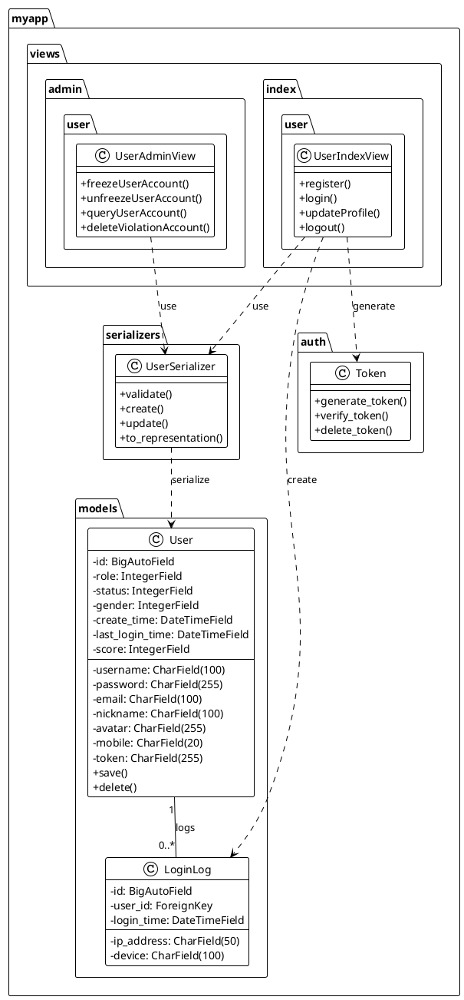
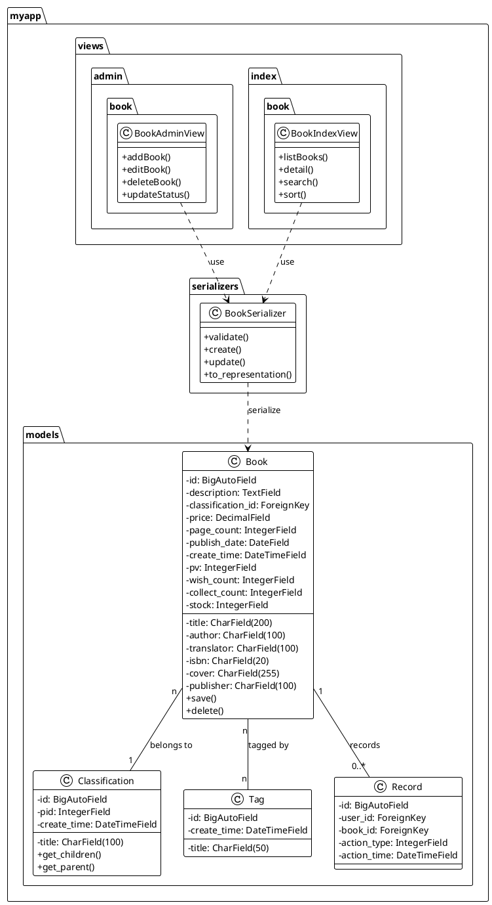
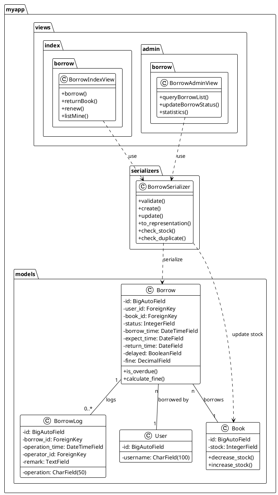
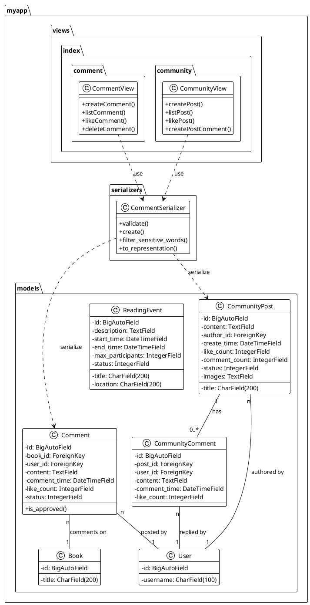
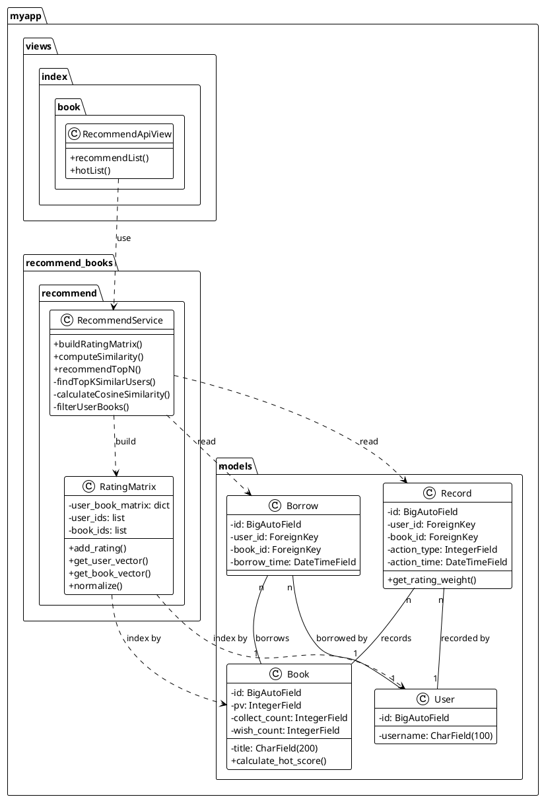
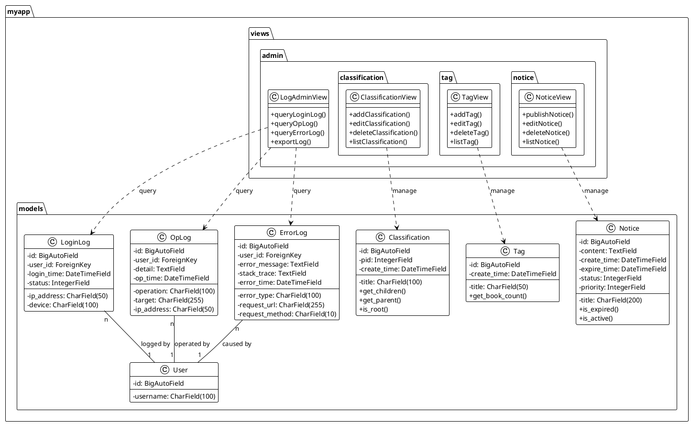

# 图书借阅推荐系统 - 模块设计类图

本文档包含系统6个核心功能模块的完整PlantUML类图代码，可直接在PlantUML网站或支持PlantUML的编辑器中渲染。

---

## 1. 用户管理模块类图



---

## 2. 图书管理模块类图



---

## 3. 借阅管理模块类图



---

## 4. 社区互动模块类图



---

## 5. 推荐算法模块类图



---

## 6. 系统管理模块类图



---

## 使用说明

### 在线渲染
1. 访问 [PlantUML在线编辑器](http://www.plantuml.com/plantuml/uml/)
2. 复制上述任意类图代码（包含 `@startuml` 到 `@enduml` 的完整代码）
3. 粘贴到编辑器中，即可查看渲染结果
4. 可以下载为PNG、SVG等格式

### 本地渲染
如果您使用支持PlantUML的编辑器（如VS Code + PlantUML扩展），可以直接在编辑器中预览这些图表。

### 主要类图关系说明

**关系符号**：
- `..>` : 依赖关系（虚线箭头）
- `--` : 关联关系（实线）
- `"n"` : 多重性（一对多、多对多等）

**包结构**：
- `myapp.views.admin.*` : 后台管理控制器
- `myapp.views.index.*` : 前台用户控制器
- `myapp.serializers` : DRF序列化器
- `myapp.models` : ORM数据模型
- `myapp.recommend_books.*` : 推荐算法服务

### 类图特点

1. **完整的类属性**：包含所有重要字段及其类型
2. **完整的类方法**：列出所有公共方法和关键私有方法
3. **清晰的依赖关系**：展示控制器、序列化器和模型之间的交互
4. **多重性标注**：明确1对多、多对多等数据库关系
5. **包结构清晰**：按照实际代码包路径组织类

### 自定义渲染主题

如需修改样式，可以在 `@startuml` 后添加主题设置：
```plantuml
!theme cerulean-outline
```

常用主题：`plain`, `cerulean`, `blueprint`, `mars`, `mimeograph`
