# 图书借阅推荐系统类图

本文档包含系统所有功能模块的PlantUML类图代码。

## 1. 数据模型类图（Django ORM Models）

### 1.1 用户与认证相关模型

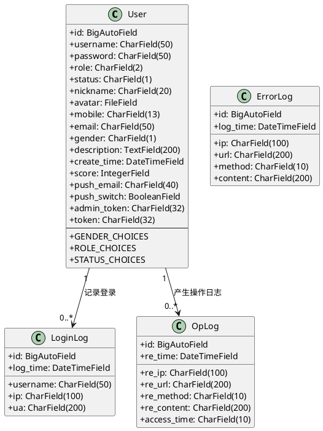

### 1.2 图书相关模型

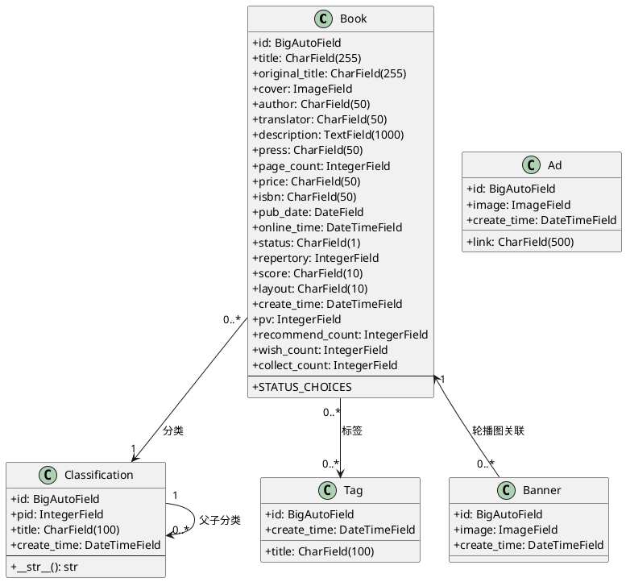

### 1.3 借阅相关模型

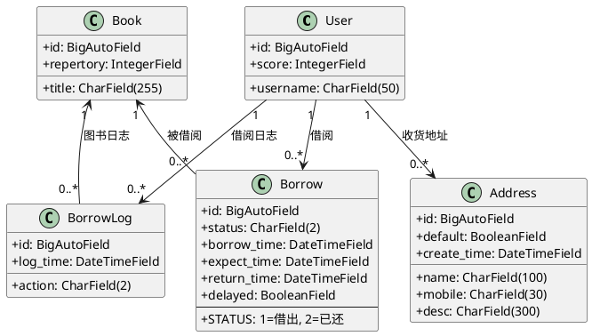

### 1.4 评论与社区模型

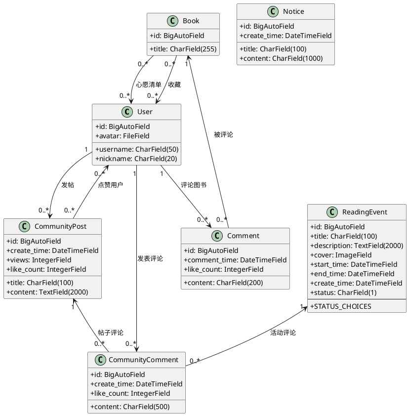

### 1.5 浏览记录模型

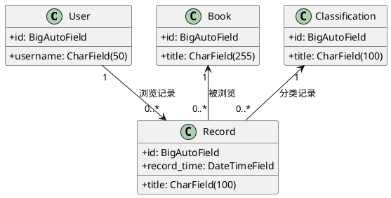

## 2. 序列化器类图（Django REST Framework Serializers）

```plantuml
@startuml 序列化器类图
skinparam classAttributeIconSize 0

abstract class ModelSerializer {
  + Meta
  --
  + to_representation()
  + validate()
}

class BookSerializer {
  + classification_title: ReadOnlyField
  --
  + Meta.model = Book
  + Meta.fields = '__all__'
  + to_representation(instance)
}

class DetailBookSerializer {
  + classification_title: ReadOnlyField
  --
  + Meta.model = Book
  + Meta.exclude = ('wish', 'collect')
  + to_representation(instance)
}

class UpdateBookSerializer {
  + classification_title: ReadOnlyField
  --
  + Meta.model = Book
  + Meta.exclude = ('wish', 'collect')
  + to_representation(instance)
}

class ListBookSerializer {
  + classification_title: ReadOnlyField
  --
  + Meta.model = Book
  + Meta.exclude = ('wish', 'collect', 'description')
  + to_representation(instance)
}

class UserSerializer {
  + create_time: DateTimeField
  --
  + Meta.model = User
  + Meta.fields = '__all__'
}

class CommentSerializer {
  + comment_time: DateTimeField
  + title: ReadOnlyField
  + username: ReadOnlyField
  --
  + Meta.model = Comment
}

class BorrowSerializer {
  + borrow_time: DateTimeField
  + expect_time: DateTimeField
  + return_time: DateTimeField
  + username: ReadOnlyField
  + title: ReadOnlyField
  + cover: FileField
  --
  + Meta.model = Borrow
  + to_representation(instance)
}

class ClassificationSerializer {
  --
  + Meta.model = Classification
  + Meta.fields = '__all__'
}

class TagSerializer {
  --
  + Meta.model = Tag
  + Meta.fields = '__all__'
}

class NoticeSerializer {
  + create_time: DateTimeField
  --
  + Meta.model = Notice
  + Meta.fields = '__all__'
}

class AddressSerializer {
  + create_time: DateTimeField
  --
  + Meta.model = Address
  + Meta.fields = '__all__'
}

class CommunityPostSerializer {
  + create_time: DateTimeField
  + username: ReadOnlyField
  + avatar: FileField
  + nickname: ReadOnlyField
  --
  + Meta.model = CommunityPost
  + Meta.fields = '__all__'
}

class ReadingEventSerializer {
  + start_time: DateTimeField
  + end_time: DateTimeField
  + create_time: DateTimeField
  --
  + Meta.model = ReadingEvent
  + Meta.fields = '__all__'
}

class CommunityCommentSerializer {
  + create_time: DateTimeField
  + username: ReadOnlyField
  + avatar: FileField
  + nickname: ReadOnlyField
  --
  + Meta.model = CommunityComment
  + Meta.fields = '__all__'
}

class BannerSerializer {
  + create_time: DateTimeField
  + title: ReadOnlyField
  --
  + Meta.model = Banner
  + Meta.fields = '__all__'
}

class AdSerializer {
  + create_time: DateTimeField
  --
  + Meta.model = Ad
  + Meta.fields = '__all__'
}

class LoginLogSerializer {
  + log_time: DateTimeField
  --
  + Meta.model = LoginLog
  + Meta.fields = '__all__'
}

class OpLogSerializer {
  + re_time: DateTimeField
  --
  + Meta.model = OpLog
  + Meta.fields = '__all__'
}

class ErrorLogSerializer {
  + log_time: DateTimeField
  --
  + Meta.model = ErrorLog
  + Meta.fields = '__all__'
}

class RecordSerializer {
  --
  + Meta.model = Record
  + Meta.fields = '__all__'
}

class BorrowLogSerializer {
  --
  + Meta.model = BorrowLog
  + Meta.fields = '__all__'
}

ModelSerializer <|-- BookSerializer
ModelSerializer <|-- DetailBookSerializer
ModelSerializer <|-- UpdateBookSerializer
ModelSerializer <|-- ListBookSerializer
ModelSerializer <|-- UserSerializer
ModelSerializer <|-- CommentSerializer
ModelSerializer <|-- BorrowSerializer
ModelSerializer <|-- ClassificationSerializer
ModelSerializer <|-- TagSerializer
ModelSerializer <|-- NoticeSerializer
ModelSerializer <|-- AddressSerializer
ModelSerializer <|-- CommunityPostSerializer
ModelSerializer <|-- ReadingEventSerializer
ModelSerializer <|-- CommunityCommentSerializer
ModelSerializer <|-- BannerSerializer
ModelSerializer <|-- AdSerializer
ModelSerializer <|-- LoginLogSerializer
ModelSerializer <|-- OpLogSerializer
ModelSerializer <|-- ErrorLogSerializer
ModelSerializer <|-- RecordSerializer
ModelSerializer <|-- BorrowLogSerializer
@enduml
```

## 3. 认证与权限类图

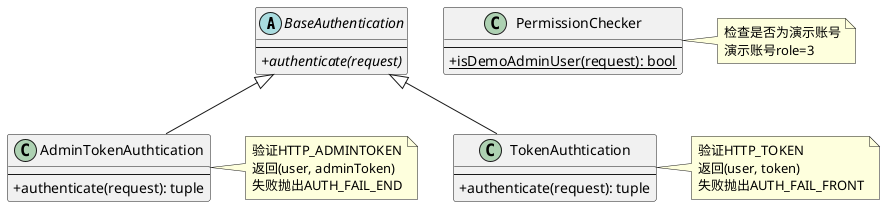

## 4. 中间件类图

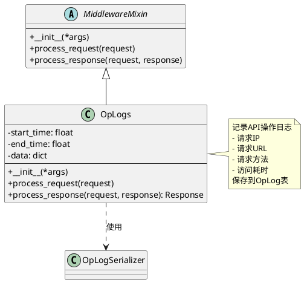

## 5. 工具类图

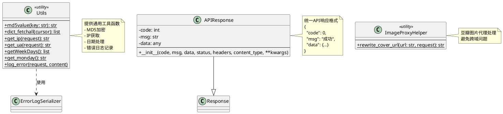

## 6. 推荐算法类图

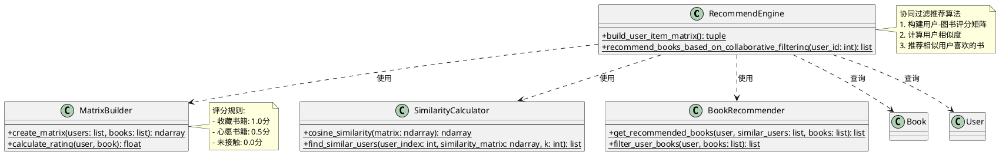

## 7. 视图层类图（后端Views）

### 7.1 后台管理视图

```plantuml
@startuml 后台管理视图
skinparam classAttributeIconSize 0

package "admin.book" {
  class BookAdminView <<view>> {
    --
    + list_api(request): Response
    + detail(request): Response
    + create(request): Response
    + update(request): Response
    + delete(request): Response
  }
}

package "admin.user" {
  class UserAdminView <<view>> {
    --
    + list_api(request): Response
    + create(request): Response
    + update(request): Response
    + updatePwd(request): Response
    + delete(request): Response
    + info(request): Response
    + admin_login(request): Response
  }
}

package "admin.borrow" {
  class BorrowAdminView <<view>> {
    --
    + list_api(request): Response
    + create(request): Response
    + update(request): Response
    + return_book(request): Response
    + delay(request): Response
    + delete(request): Response
  }
}

package "admin.comment" {
  class CommentAdminView <<view>> {
    --
    + list_api(request): Response
    + create(request): Response
    + update(request): Response
    + delete(request): Response
  }
}

package "admin.classification" {
  class ClassificationAdminView <<view>> {
    --
    + list_api(request): Response
    + create(request): Response
    + update(request): Response
    + delete(request): Response
  }
}

package "admin.tag" {
  class TagAdminView <<view>> {
    --
    + list_api(request): Response
    + create(request): Response
    + update(request): Response
    + delete(request): Response
  }
}

package "admin.overview" {
  class OverviewView <<view>> {
    --
    + count(request): Response
    + sysInfo(request): Response
  }
}

package "admin.loginLog" {
  class LoginLogAdminView <<view>> {
    --
    + list_api(request): Response
    + create(request): Response
    + update(request): Response
    + delete(request): Response
  }
}

package "admin.opLog" {
  class OpLogAdminView <<view>> {
    --
    + list_api(request): Response
  }
}

package "admin.errorLog" {
  class ErrorLogAdminView <<view>> {
    --
    + list_api(request): Response
  }
}

package "admin.banner" {
  class BannerAdminView <<view>> {
    --
    + list_api(request): Response
    + create(request): Response
    + update(request): Response
    + delete(request): Response
  }
}

package "admin.ad" {
  class AdAdminView <<view>> {
    --
    + list_api(request): Response
    + create(request): Response
    + update(request): Response
    + delete(request): Response
  }
}

package "admin.notice" {
  class NoticeAdminView <<view>> {
    --
    + list_api(request): Response
    + create(request): Response
    + update(request): Response
    + delete(request): Response
  }
}

package "admin.event" {
  class EventAdminView <<view>> {
    --
    + list_api(request): Response
    + create(request): Response
    + update(request): Response
    + delete(request): Response
  }
}

note bottom of BookAdminView
  需要AdminTokenAuthtication认证
  需要检查isDemoAdminUser
end note
@enduml
```

### 7.2 前台用户视图

```plantuml
@startuml 前台用户视图
skinparam classAttributeIconSize 0

package "index.book" {
  class BookIndexView <<view>> {
    --
    + list_api(request): Response
    + detail(request): Response
    + increaseWishCount(request): Response
    + addWishUser(request): Response
    + removeWishUser(request): Response
    + getWishBookList(request): Response
    + addCollectUser(request): Response
    + removeCollectUser(request): Response
    + getCollectBookList(request): Response
    + increaseRecommendCount(request): Response
  }
}

package "index.user" {
  class UserIndexView <<view>> {
    --
    + login(request): Response
    + register(request): Response
    + info(request): Response
    + update(request): Response
    + updatePwd(request): Response
  }
}

package "index.borrow" {
  class BorrowIndexView <<view>> {
    --
    + list_api(request): Response
    + create(request): Response
    + return_book(request): Response
    + delay(request): Response
  }
}

package "index.comment" {
  class CommentIndexView <<view>> {
    --
    + list_api(request): Response
    + list_my_comment(request): Response
    + create(request): Response
    + delete(request): Response
    + like(request): Response
  }
}

package "index.classification" {
  class ClassificationIndexView <<view>> {
    --
    + list_api(request): Response
  }
}

package "index.tag" {
  class TagIndexView <<view>> {
    --
    + list_api(request): Response
  }
}

package "index.notice" {
  class NoticeIndexView <<view>> {
    --
    + list_api(request): Response
  }
}

package "index.address" {
  class AddressIndexView <<view>> {
    --
    + list_api(request): Response
    + create(request): Response
    + update(request): Response
    + delete(request): Response
  }
}

package "index.community" {
  class CommunityIndexView <<view>> {
    --
    + post_list(request): Response
    + post_detail(request): Response
    + create_post(request): Response
    + like_post(request): Response
    + add_comment(request): Response
    + event_list(request): Response
    + event_detail(request): Response
  }
}

note bottom of BookIndexView
  list_api支持推荐排序
  调用RecommendEngine
end note

note bottom of BorrowIndexView
  需要TokenAuthtication认证
  借书时检查库存
  还书时增加积分
end note
@enduml
```

## 8. 前端架构类图

### 8.1 前端Store类图（Vuex）

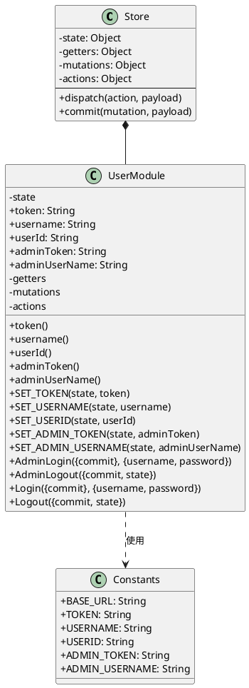

### 8.2 前端API层类图

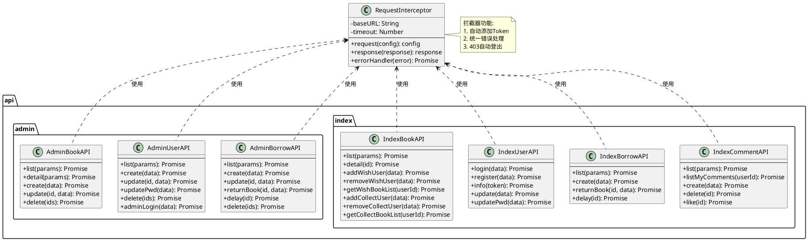

### 8.3 前端Router类图

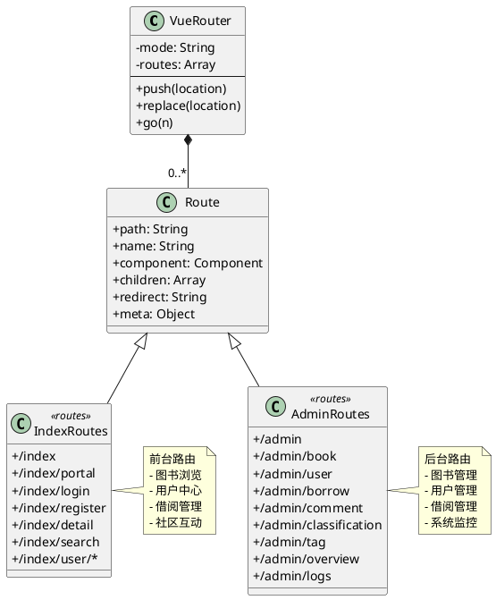

## 9. 整体系统架构类图

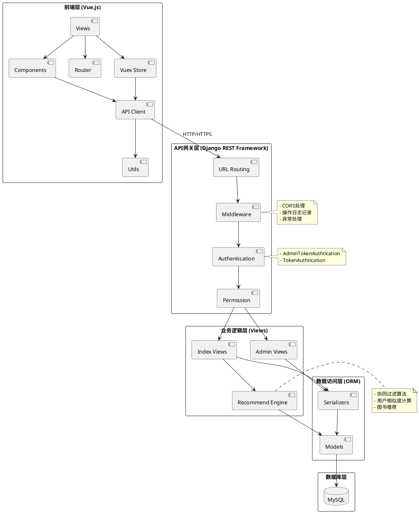

## 10. 核心业务流程类图

### 10.1 用户认证流程

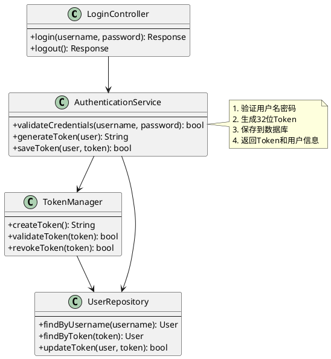

### 10.2 图书借阅流程

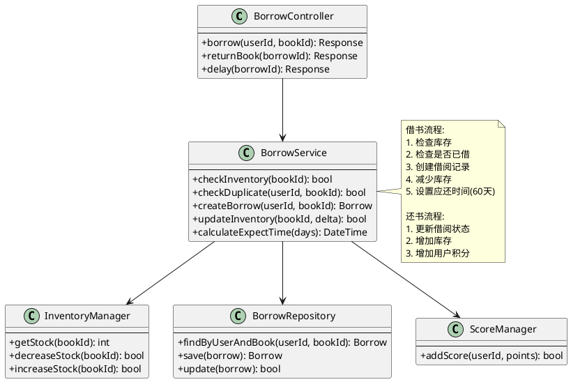

### 10.3 推荐算法流程

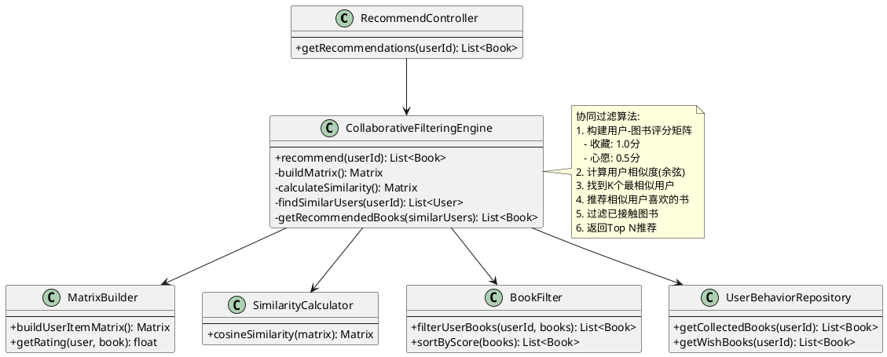

---

## 使用说明

1. **复制代码**：每个类图代码块都可以直接在PlantUML中使用
2. **在线编辑**：访问 http://www.plantuml.com/plantuml/ 粘贴代码即可查看
3. **本地渲染**：
   - 安装PlantUML插件（VS Code、IntelliJ等）
   - 或使用PlantUML命令行工具
4. **导出图片**：可导出为PNG、SVG等格式

## 类图说明

- **实线箭头**：关联关系
- **虚线箭头**：依赖关系
- **空心三角**：继承关系
- **实心菱形**：组合关系
- **空心菱形**：聚合关系
- **数字标注**：表示关联的多重性（1对多、多对多等）
