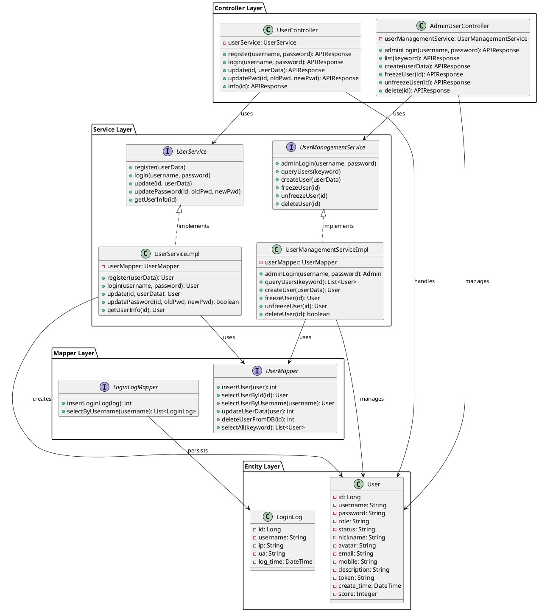
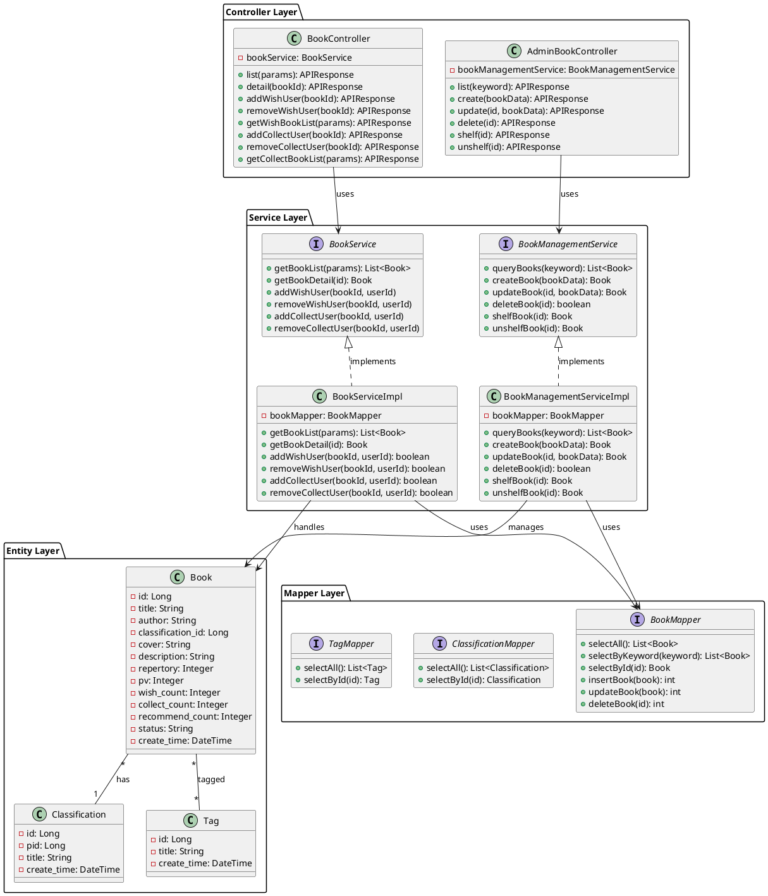
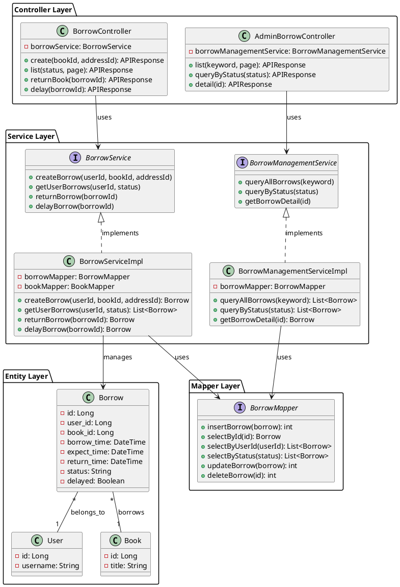
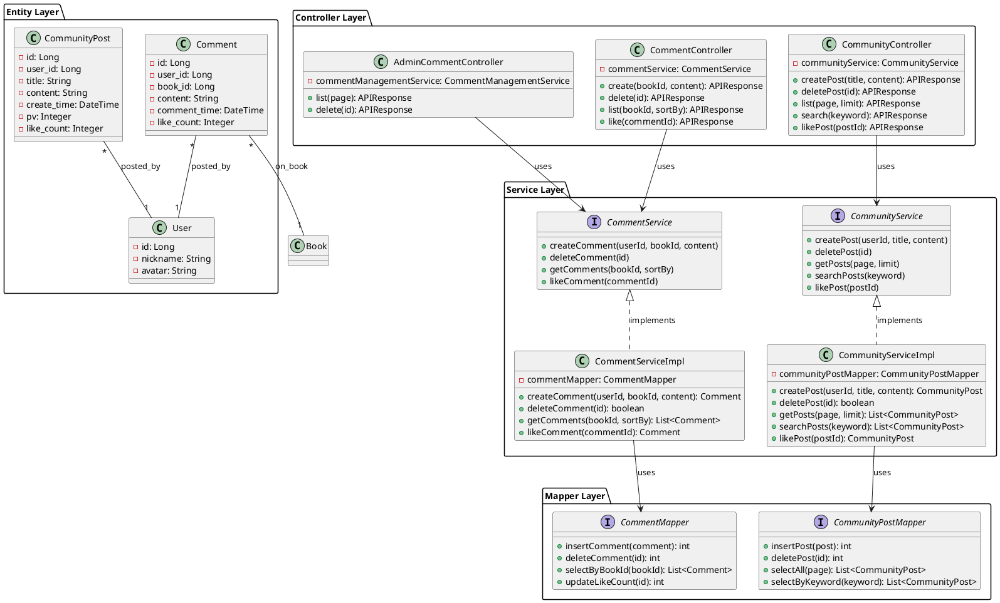
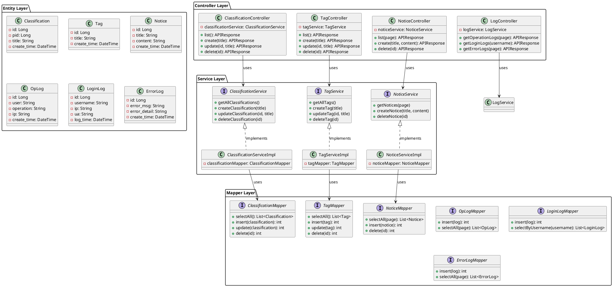

# 社区化图书共享与推荐平台 - 系统功能模块设计

**文档版本**：1.0  
**设计时间**：2026年2月23日  
**项目名称**：社区化图书共享与推荐平台的设计与实现  
**设计团队**：Architecture Team

---

## 目录

1. [3.2 系统功能模块设计](#32-系统功能模块设计)
2. [系统功能结构图](#系统功能结构图)
3. [3.2.1 用户信息管理模块设计](#321-用户信息管理模块设计)
4. [3.2.2 图书信息管理模块设计](#322-图书信息管理模块设计)
5. [3.2.3 借阅管理模块设计](#323-借阅管理模块设计)
6. [3.2.4 社区互动模块设计](#324-社区互动模块设计)
7. [3.2.5 系统管理模块设计](#325-系统管理模块设计)

---

# 3.2 系统功能模块设计

根据需求分析，本社区化图书共享与推荐平台为了满足普通用户、管理员的不同需求，将系统划分为以下功能模块：**用户信息管理模块**、**图书信息管理模块**、**借阅管理模块**、**社区互动模块**、**系统管理模块**。

## 模块功能概述

**用户信息管理模块**功能包括登录注册、个人信息编辑、账号冻结与解冻、账号查询与删除。其中，普通用户支持注册登录平台；平台管理员可对违规的账号进行冻结和删除等操作。

**图书信息管理模块**功能分为图书查询、图书搜索、图书分类筛选、图书标签筛选等操作。用户可按多种方式搜索图书；管理员可对图书进行上架、下架、修改、删除等操作；系统支持图书详情页面展示，辅助用户进行借阅决策。

**借阅管理模块**的核心功能有订阅创建、查询、还书、延期等。借阅记录在用户预借图书时创建；系统可按借阅状态进行筛选；用户可对未完成的借阅申请延期，由系统自动处理。

**社区互动模块**功能分为发表评论、社区帖子发表、内容管理等。用户可对图书发表评论和评分；用户可在社区发表帖子分享阅读心得；用户可对他人的内容进行点赞和互动。

**系统管理模块**功能分为分类管理、标签管理、通知管理、日志管理等。管理员可创建和管理图书分类；管理员可创建和管理标签；管理员可发布平台通知；系统自动记录操作日志和错误日志。

---

## 系统功能结构图

```
社区化图书共享与推荐平台
├── 用户信息管理模块 (User Management)
│   ├── 用户注册 (User Register)
│   ├── 用户登录 (User Login)
│   ├── 个人信息修改 (Profile Edit)
│   ├── 密码修改 (Change Password)
│   ├── 账号冻结 (Freeze Account)
│   ├── 账号解冻 (Unfreeze Account)
│   └── 账号删除 (Delete Account)
│
├── 图书信息管理模块 (Book Management)
│   ├── 图书列表查询 (Book List Query)
│   ├── 图书搜索 (Book Search)
│   ├── 分类筛选 (Classification Filter)
│   ├── 标签筛选 (Tag Filter)
│   ├── 图书详情查询 (Book Detail)
│   ├── 新增图书 (Add Book)
│   ├── 修改图书信息 (Edit Book)
│   ├── 图书上架/下架 (Shelf/Unshelf)
│   └── 删除图书 (Delete Book)
│
├── 借阅管理模块 (Borrow Management)
│   ├── 创建借阅 (Create Borrow)
│   ├── 查看借阅列表 (View Borrows)
│   ├── 还书 (Return Book)
│   ├── 延期 (Delay Borrow)
│   └── 借阅记录查询 (Query Borrow Records)
│
├── 社区互动模块 (Community Interaction)
│   ├── 发表评论 (Post Comment)
│   ├── 删除评论 (Delete Comment)
│   ├── 点赞评论 (Like Comment)
│   ├── 发表帖子 (Post Article)
│   ├── 删除帖子 (Delete Article)
│   └── 社区浏览 (Browse Community)
│
└── 系统管理模块 (System Management)
    ├── 分类管理 (Classification Management)
    ├── 标签管理 (Tag Management)
    ├── 通知管理 (Notice Management)
    ├── 操作日志管理 (Operation Log)
    ├── 登录日志管理 (Login Log)
    └── 错误日志管理 (Error Log)
```

---

# 3.2.1 用户信息管理模块设计

用户信息管理模块实现用户身份认证、信息维护等功能。普通用户可通过注册登录平台，编辑个人基本信息。系统管理员可对违规的账号进行冻结、删除等操作。

该模块包含控制类 `UserController`、`AdminUserController`，实体类 `User`、`LoginLog`，服务接口 `UserService`、`UserManagementService`，实现类 `UserServiceImpl`、`UserManagementServiceImpl`，以及数据访问层相关代码等。

## 用户信息管理模块类图代码

以下为可用于生成UML类图的PlantUML代码：



## 用户信息管理模块类说明

| 类名 | 包名 | 类型 | 描述 |
|------|------|------|------|
| UserController | controller | Controller | 处理用户登录、注册、个人信息修改等请求 |
| AdminUserController | controller | Controller | 处理管理员账号管理、冻结、删除等请求 |
| UserService | service | Interface | 用户业务方法接口，定义服务规范 |
| UserManagementService | service | Interface | 用户管理业务方法接口 |
| UserServiceImpl | service.impl | Implementation | 用户业务逻辑实现，包含验证、登录等 |
| UserManagementServiceImpl | service.impl | Implementation | 用户管理业务逻辑实现 |
| User | entity | Entity | 用户实体类，映射数据库User表 |
| LoginLog | entity | Entity | 登录日志实体类，记录用户登录信息 |
| UserMapper | mapper | Interface | 用户数据访问接口 |
| LoginLogMapper | mapper | Interface | 登录日志数据访问接口 |

## 用户信息管理模块方法说明

### 表3-1 UserController 类方法

| 方法权限 | 方法名称 | 参数 | 返回值 | 描述 |
|---------|--------|------|------|------|
| public | register | username, password | APIResponse | 用户注册，验证用户名唯一性，MD5加密密码 |
| public | login | username, password | APIResponse | 用户登录，生成Token，记录登录日志 |
| public | info | id | APIResponse | 获取用户信息 |
| public | update | id, userData | APIResponse | 修改用户个人信息，过滤敏感字段 |
| public | updatePwd | id, oldPwd, newPwd | APIResponse | 修改用户密码，验证原密码 |

### 表3-2 AdminUserController 类方法

| 方法权限 | 方法名称 | 参数 | 返回值 | 描述 |
|---------|--------|------|------|------|
| public | adminLogin | username, password | APIResponse | 管理员登录，生成AdminToken |
| public | list | keyword | APIResponse | 查询用户列表，支持关键词搜索 |
| public | create | userData | APIResponse | 创建新用户 |
| public | freezeUser | id | APIResponse | 冻结用户账号，阻止登录 |
| public | unfreezeUser | id | APIResponse | 解冻用户账号 |
| public | delete | id | APIResponse | 删除用户账号及关联数据 |

### 表3-3 User 实体类属性

| 属性名 | 类型 | 约束 | 描述 |
|------|------|------|------|
| id | Long | PK, AUTO | 用户唯一标识 |
| username | String | UNIQUE, NOT NULL | 用户名/邮箱 |
| password | String | NOT NULL | MD5加密后的密码 |
| role | String | DEFAULT '1' | 用户角色：0=管理员, 1=普通用户, 2=演示用户 |
| status | String | DEFAULT '0' | 账号状态：0=正常, 1=冻结 |
| nickname | String | | 用户昵称 |
| avatar | String | | 头像文件路径 |
| email | String | | 邮箱地址 |
| mobile | String | | 手机号码 |
| description | String | | 个人简介 |
| token | String | | 前台用户Token |
| create_time | DateTime | AUTO | 账号创建时间 |
| score | Integer | DEFAULT 0 | 用户积分 |

---

# 3.2.2 图书信息管理模块设计

图书信息管理模块实现图书的查询、搜索、分类/标签筛选、以及管理员的图书管理功能。用户可通过多种方式浏览和搜索图书；管理员可对图书进行全生命周期的管理。

该模块包含控制类 `BookController`、`AdminBookController`，实体类 `Book`、`Classification`、`Tag`，服务接口及实现类，以及数据访问层相关代码等。

## 图书信息管理模块类图代码



## 图书信息管理模块类说明

| 类名 | 包名 | 类型 | 描述 |
|------|------|------|------|
| BookController | controller | Controller | 处理图书查询、搜索、收藏等请求 |
| AdminBookController | controller | Controller | 处理管理员图书管理请求 |
| BookService | service | Interface | 图书业务方法接口 |
| BookManagementService | service | Interface | 图书管理业务方法接口 |
| BookServiceImpl | service.impl | Implementation | 图书业务逻辑实现 |
| BookManagementServiceImpl | service.impl | Implementation | 图书管理业务逻辑实现 |
| Book | entity | Entity | 图书实体类 |
| Classification | entity | Entity | 图书分类实体类 |
| Tag | entity | Entity | 图书标签实体类 |
| BookMapper | mapper | Interface | 图书数据访问接口 |
| ClassificationMapper | mapper | Interface | 分类数据访问接口 |
| TagMapper | mapper | Interface | 标签数据访问接口 |

## 图书信息管理模块方法说明

### 表3-4 BookController 类方法

| 方法权限 | 方法名称 | 参数 | 返回值 | 描述 |
|---------|--------|------|------|------|
| public | list | keyword, classId, tagId, page | APIResponse | 获取图书列表，支持分类/标签筛选 |
| public | detail | bookId | APIResponse | 获取图书详情，增加浏览量 |
| public | addWishUser | bookId | APIResponse | 添加图书到愿望单 |
| public | removeWishUser | bookId | APIResponse | 从愿望单移除图书 |
| public | getWishBookList | page, limit | APIResponse | 获取用户愿望单列表 |
| public | addCollectUser | bookId | APIResponse | 收藏图书 |
| public | removeCollectUser | bookId | APIResponse | 取消收藏图书 |
| public | getCollectBookList | page, limit | APIResponse | 获取用户收藏列表 |

### 表3-5 Book 实体类属性

| 属性名 | 类型 | 约束 | 描述 |
|------|------|------|------|
| id | Long | PK, AUTO | 图书唯一标识 |
| title | String | NOT NULL | 图书标题 |
| author | String | | 图书作者 |
| classification_id | Long | FK | 所属分类ID |
| cover | String | | 图书封面图片 |
| description | String | | 图书描述/简介 |
| repertory | Integer | DEFAULT 0 | 图书库存数量 |
| pv | Integer | DEFAULT 0 | 页面浏览量 |
| wish_count | Integer | DEFAULT 0 | 添加到愿望单的次数 |
| collect_count | Integer | DEFAULT 0 | 收藏次数 |
| recommend_count | Integer | DEFAULT 0 | 推荐次数 |
| status | String | DEFAULT '0' | 图书状态：0=上架, 1=下架 |
| create_time | DateTime | AUTO | 图书创建时间 |

---

# 3.2.3 借阅管理模块设计

借阅管理模块实现图书借阅、还书、延期等功能。用户可借阅图书，系统记录借阅信息；用户可在到期前还书或申请延期；管理员可查看和管理所有借阅记录。

该模块包含控制类 `BorrowController`、`AdminBorrowController`，实体类 `Borrow`，服务接口及实现类，以及数据访问层相关代码等。

## 借阅管理模块类图代码



## 借阅管理模块方法说明

### 表3-6 BorrowController 类方法

| 方法权限 | 方法名称 | 参数 | 返回值 | 描述 |
|---------|--------|------|------|------|
| public | create | bookId, addressId | APIResponse | 创建借阅，检查库存，设置30天应还期限 |
| public | list | status, page, limit | APIResponse | 获取用户借阅列表，支持状态筛选 |
| public | returnBook | borrowId | APIResponse | 还书，更新状态，恢复库存 |
| public | delay | borrowId | APIResponse | 延期，验证未逾期，延长7天 |

### 表3-7 Borrow 实体类属性

| 属性名 | 类型 | 约束 | 描述 |
|------|------|------|------|
| id | Long | PK, AUTO | 借阅唯一标识 |
| user_id | Long | FK | 用户ID |
| book_id | Long | FK | 图书ID |
| borrow_time | DateTime | NOT NULL | 借阅时间 |
| expect_time | DateTime | NOT NULL | 应还时间（默认30天后） |
| return_time | DateTime | | 实际还书时间 |
| status | String | DEFAULT '1' | 借阅状态：1=借阅中, 2=已归还, 3=逾期 |
| delayed | Boolean | DEFAULT FALSE | 是否已延期 |

---

# 3.2.4 社区互动模块设计

社区互动模块实现用户评论、社区帖子、点赞等社交功能。用户可在图书详情页发表评论；用户可在社区发表阅读心得；用户可对评论和帖子进行点赞。

该模块包含控制类 `CommentController`、`CommunityController`，实体类 `Comment`、`CommunityPost`，服务接口及实现类，以及数据访问层相关代码等。

## 社区互动模块类图代码



## 社区互动模块方法说明

### 表3-8 CommentController 类方法

| 方法权限 | 方法名称 | 参数 | 返回值 | 描述 |
|---------|--------|------|------|------|
| public | create | bookId, content | APIResponse | 创建评论，一个用户只能评论一次 |
| public | delete | id | APIResponse | 删除评论 |
| public | list | bookId, sortBy | APIResponse | 获取图书评论列表，支持排序 |
| public | like | commentId | APIResponse | 点赞评论 |

### 表3-9 CommunityPost 实体类属性

| 属性名 | 类型 | 约束 | 描述 |
|------|------|------|------|
| id | Long | PK, AUTO | 帖子唯一标识 |
| user_id | Long | FK | 发布用户ID |
| title | String | NOT NULL | 帖子标题 |
| content | String | NOT NULL | 帖子内容 |
| create_time | DateTime | AUTO | 创建时间 |
| pv | Integer | DEFAULT 0 | 浏览量 |
| like_count | Integer | DEFAULT 0 | 点赞数 |

---

# 3.2.5 系统管理模块设计

系统管理模块实现分类管理、标签管理、通知管理、日志管理等系统级功能。管理员可对这些资源进行全生命周期管理；系统自动记录操作日志、登录日志等。

该模块包含控制类 `ClassificationController`、`TagController`、`NoticeController`、`LogController`，实体类及服务、数据访问层相关代码等。

## 系统管理模块类图代码



## 系统管理模块方法说明

### 表3-10 ClassificationController 类方法

| 方法权限 | 方法名称 | 参数 | 返回值 | 描述 |
|---------|--------|------|------|------|
| public | list | - | APIResponse | 获取所有分类 |
| public | create | title | APIResponse | 创建新分类 |
| public | update | id, title | APIResponse | 更新分类信息 |
| public | delete | id | APIResponse | 删除分类 |

### 表3-11 TagController 类方法

| 方法权限 | 方法名称 | 参数 | 返回值 | 描述 |
|---------|--------|------|------|------|
| public | list | - | APIResponse | 获取所有标签 |
| public | create | title | APIResponse | 创建新标签 |
| public | update | id, title | APIResponse | 更新标签信息 |
| public | delete | id | APIResponse | 删除标签 |

### 表3-12 OpLog 实体类属性

| 属性名 | 类型 | 约束 | 描述 |
|------|------|------|------|
| id | Long | PK, AUTO | 日志唯一标识 |
| user | String | | 操作用户 |
| operation | String | | 操作内容 |
| ip | String | | 操作IP地址 |
| create_time | DateTime | AUTO | 操作时间 |

### 表3-13 LoginLog 实体类属性

| 属性名 | 类型 | 约束 | 描述 |
|------|------|------|------|
| id | Long | PK, AUTO | 日志唯一标识 |
| username | String | | 登录用户名 |
| ip | String | | 登录IP地址 |
| ua | String | | User-Agent信息 |
| log_time | DateTime | AUTO | 登录时间 |

---

## 数据库ER图代码

以下为用PlantUML表示的简化ER图：

```plantuml
@startuml DatabaseSchema
!define ENTITY(name,key) class name << (E,#FFD700) >> { key }
!define ATTRIBUTE(type,name) type : name

ENTITY(User, id) {
    ATTRIBUTE(String, username)
    ATTRIBUTE(String, password)
    ATTRIBUTE(String, role)
    ATTRIBUTE(String, status)
    ATTRIBUTE(String, nickname)
    ATTRIBUTE(String, avatar)
}

ENTITY(Book, id) {
    ATTRIBUTE(String, title)
    ATTRIBUTE(String, author)
    ATTRIBUTE(Long, classification_id)
    ATTRIBUTE(String, cover)
    ATTRIBUTE(Integer, repertory)
    ATTRIBUTE(String, status)
}

ENTITY(Classification, id) {
    ATTRIBUTE(Long, pid)
    ATTRIBUTE(String, title)
}

ENTITY(Tag, id) {
    ATTRIBUTE(String, title)
}

ENTITY(Borrow, id) {
    ATTRIBUTE(Long, user_id)
    ATTRIBUTE(Long, book_id)
    ATTRIBUTE(DateTime, borrow_time)
    ATTRIBUTE(DateTime, expect_time)
    ATTRIBUTE(String, status)
}

ENTITY(Comment, id) {
    ATTRIBUTE(Long, user_id)
    ATTRIBUTE(Long, book_id)
    ATTRIBUTE(String, content)
    ATTRIBUTE(Integer, like_count)
}

ENTITY(CommunityPost, id) {
    ATTRIBUTE(Long, user_id)
    ATTRIBUTE(String, title)
    ATTRIBUTE(String, content)
    ATTRIBUTE(Integer, like_count)
}

ENTITY(Notice, id) {
    ATTRIBUTE(String, title)
    ATTRIBUTE(String, content)
}

ENTITY(LoginLog, id) {
    ATTRIBUTE(String, username)
    ATTRIBUTE(String, ip)
    ATTRIBUTE(String, ua)
}

ENTITY(OpLog, id) {
    ATTRIBUTE(String, user)
    ATTRIBUTE(String, operation)
    ATTRIBUTE(String, ip)
}

Book --> Classification : belongs_to
Borrow --> User : user_id
Borrow --> Book : book_id
Comment --> User : user_id
Comment --> Book : book_id
CommunityPost --> User : user_id
@enduml
```

---

## 系统架构总结

| 模块名 | 职责 | 主要类 | 关键功能 |
|------|------|------|--------|
| 用户管理 | 用户认证、信息维护 | UserController, User, UserService | 登录、注册、冻结、删除 |
| 图书管理 | 图书信息、分类、标签 | BookController, Book, BookService | 搜索、筛选、收藏、愿望单 |
| 借阅管理 | 借阅流程、库存管理 | BorrowController, Borrow, BorrowService | 创建借阅、还书、延期 |
| 社区互动 | 用户交流、内容互动 | CommentController, CommunityController | 评论、帖子、点赞 |
| 系统管理 | 系统配置、日志记录 | ClassificationController, TagController | 分类、标签、日志 |

---

**模块设计文档完成** ✓  
**最后更新**：2026年2月23日
