# 第4章 系统实现

图书借阅推荐系统实现采用前后端分离架构，后端基于Django 4.1.4框架和MySQL数据库，前端基于Vue.js 2.x和Ant Design Vue组件库，实现了用户管理、图书管理、借阅管理、评论管理、社区互动、分类管理、通知管理等核心功能模块。本章将详细介绍各模块的实现过程，包括功能描述、业务流程和关键技术细节。

## 4.1 用户管理模块的实现

用户管理模块主要用于管理用户的登录、个人信息修改等操作，同时为管理员提供用户信息的管理功能，采用前后端分离的架构实现。

### 4.1.1 用户登录的实现

用户进入系统后，界面会提示登录。前端展示登录表单，用户输入用户名和密码后点击登录按钮。前端调用`loginApi`方法将用户名和密码封装成对象，向后端的`/myapp/index/user/login`接口发送POST请求。

后端的`UserIndexView`类中的login方法接收请求，首先根据用户名查询数据库中的b_user表获取用户记录。若用户不存在则返回404错误码及相应提示信息；若用户存在，则调用Django的`check_password`函数验证密码是否正确。

若密码验证通过，系统使用Python的uuid模块生成一个32位的唯一标识符作为Token，将Token更新到该用户的token字段中。同时，系统向b_login_log表插入一条登录日志记录，记录用户名、登录IP地址、用户代理信息和登录时间。后端将Token、用户ID、用户名、昵称等用户信息以JSON格式返回给前端。

前端收到响应后，将Token和用户信息存储到浏览器的localStorage中，并通过Vuex的`Login` action更新全局状态。之后前端自动跳转到图书列表首页，完成登录流程。

登录功能的时序图如图4-1所示。

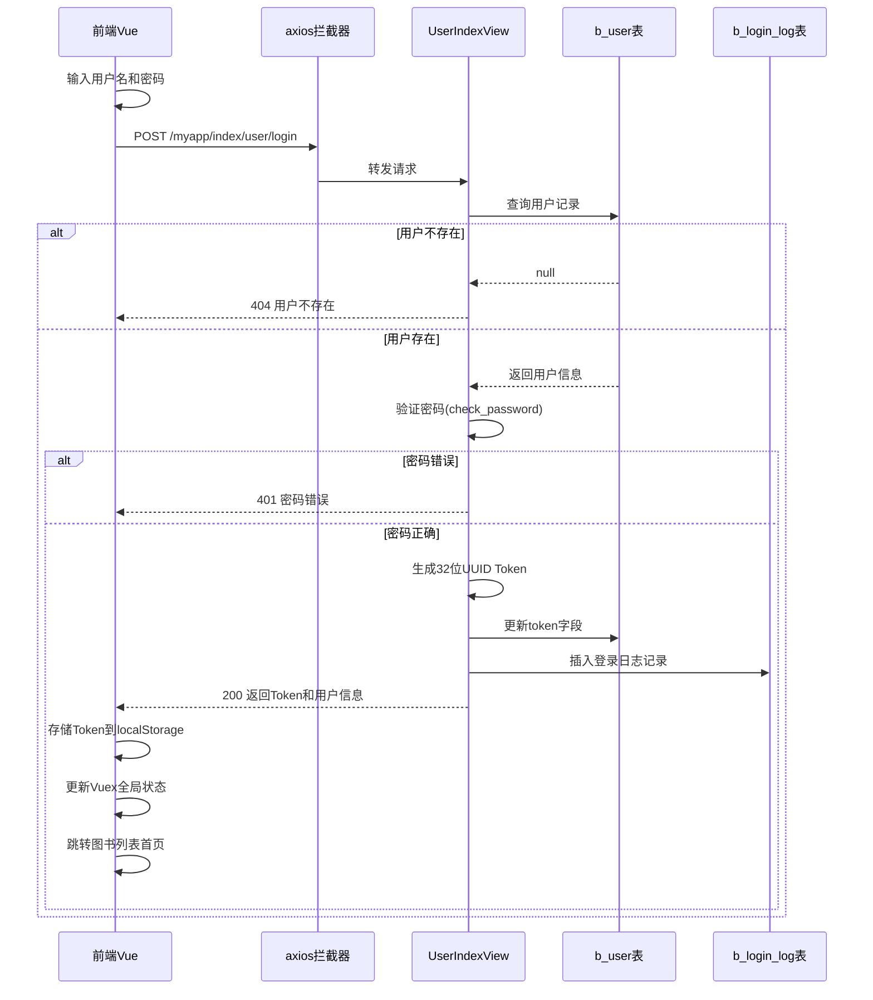
```mermaid
sequenceDiagram
    participant F as 前端Vue
    participant A as axios拦截器
    participant V as UserIndexView
    participant D as b_user表
    participant L as b_login_log表

    F->>F: 输入用户名和密码
    F->>A: POST /myapp/index/user/login
    A->>V: 转发请求
    V->>D: 查询用户记录
    alt 用户不存在
        D-->>V: null
        V-->>F: 404 用户不存在
    else 用户存在
        D-->>V: 返回用户信息
        V->>V: 验证密码(check_password)
        alt 密码错误
            V-->>F: 401 密码错误
        else 密码正确
            V->>V: 生成32位UUID Token
            V->>D: 更新token字段
            V->>L: 插入登录日志记录
            V-->>F: 200 返回Token和用户信息
            F->>F: 存储Token到localStorage
            F->>F: 更新Vuex全局状态
            F->>F: 跳转图书列表首页
        end
    end
```

图4-1 登录功能时序图

### 4.1.2 个人信息修改的实现

用户在已登录状态下，点击个人中心菜单进入个人资料页面，页面会展示用户当前的个人信息，包括昵称、头像、联系方式、邮箱等。用户修改信息后，点击"保存"按钮，前端将修改后的信息封装成对象，调用`updateUserInfo`方法发送到后端的`/myapp/index/user/update`接口，请求方式为PUT，请求头中携带用户的Token。

后端接收到请求后，首先通过Token验证中间件确认用户身份。中间件从HTTP请求头中提取Token，查询b_user表验证Token有效性。若Token无效，返回403错误和"AUTH_FAIL_FRONT"标识，前端执行Logout操作并刷新页面；若Token有效，中间件将User对象注入request.user，继续执行后续逻辑。

UserIndexView类中的update方法接收到对象后，会对传入的数据进行验证，如检查手机号格式是否正确、邮箱格式是否合法等。对于头像修改，前端需要先调用`/api/upload`接口上传图片文件到服务器的/upload/avatar/目录，后端返回图片的相对路径，前端再将路径更新到用户信息中。

验证通过后，系统调用Django ORM的update方法更新b_user表中的用户记录。系统允许用户只更新部分字段，未提供的字段保持原值不变。更新成功后向b_op_log表插入操作日志记录，记录请求IP、请求时间、请求URL、请求方法和访问耗时。后端返回包含成功信息的响应给前端。

前端收到成功响应后，同步更新localStorage中的用户信息和Vuex全局状态，确保界面显示的用户信息与数据库一致，并刷新页面展示更新后的数据。

个人信息修改时序图如图4-2所示。

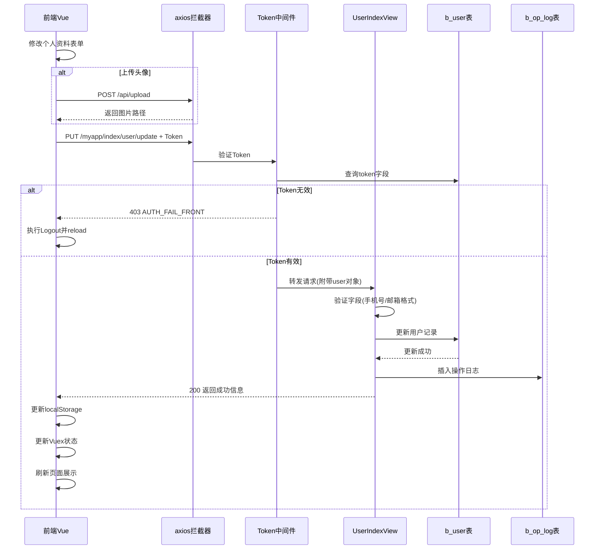
```mermaid
sequenceDiagram
    participant F as 前端Vue
    participant A as axios拦截器
    participant M as Token中间件
    participant V as UserIndexView
    participant D as b_user表
    participant L as b_op_log表

    F->>F: 修改个人资料表单
    alt 上传头像
        F->>A: POST /api/upload
        A-->>F: 返回图片路径
    end
    F->>A: PUT /myapp/index/user/update + Token
    A->>M: 验证Token
    M->>D: 查询token字段
    alt Token无效
        M-->>F: 403 AUTH_FAIL_FRONT
        F->>F: 执行Logout并reload
    else Token有效
        M->>V: 转发请求(附带user对象)
        V->>V: 验证字段(手机号/邮箱格式)
        V->>D: 更新用户记录
        D-->>V: 更新成功
        V->>L: 插入操作日志
        V-->>F: 200 返回成功信息
        F->>F: 更新localStorage
        F->>F: 更新Vuex状态
        F->>F: 刷新页面展示
    end
```

图4-2 个人信息修改时序图

### 4.1.3 用户账号冻结与解冻的实现

管理员登录后台管理界面后，点击用户管理菜单，前端调用`getUserListApi`方法向后端的`/myapp/admin/user/list`接口发送GET请求，请求头中携带adminToken。

后端通过AdminToken中间件验证管理员身份。中间件从HTTP请求头中提取adminToken，查询b_admin表验证Token有效性。验证通过后，UserAdminView类中的list方法查询b_user表获取所有用户信息列表，支持按用户名、状态等条件筛选，支持分页。后端将用户列表序列化后返回给前端，前端使用表格组件展示用户信息，包括用户编号、用户名、昵称、注册时间、账号状态等。

管理员找到需要冻结的用户，点击对应行的冻结按钮。前端弹出确认提示框，管理员确认后，前端调用`freezeUserApi`方法向`/myapp/admin/user/freeze`接口发送POST请求，携带用户ID和adminToken。

后端UserAdminView类中的freeze方法接收用户ID，查询b_user表找到对应用户记录，将status字段从'0'(正常)更新为'1'(冻结)。同时清空该用户的token字段，使其当前登录状态失效。更新成功后向b_op_log表插入操作日志，返回成功响应。前端刷新用户列表，被冻结用户的状态显示为"冻结"。

解冻操作流程类似，管理员点击解冻按钮，前端调用`unfreezeUserApi`方法，后端将status字段更新为'0'，账号恢复正常。

用户账号冻结与解冻的时序图如图4-3所示。

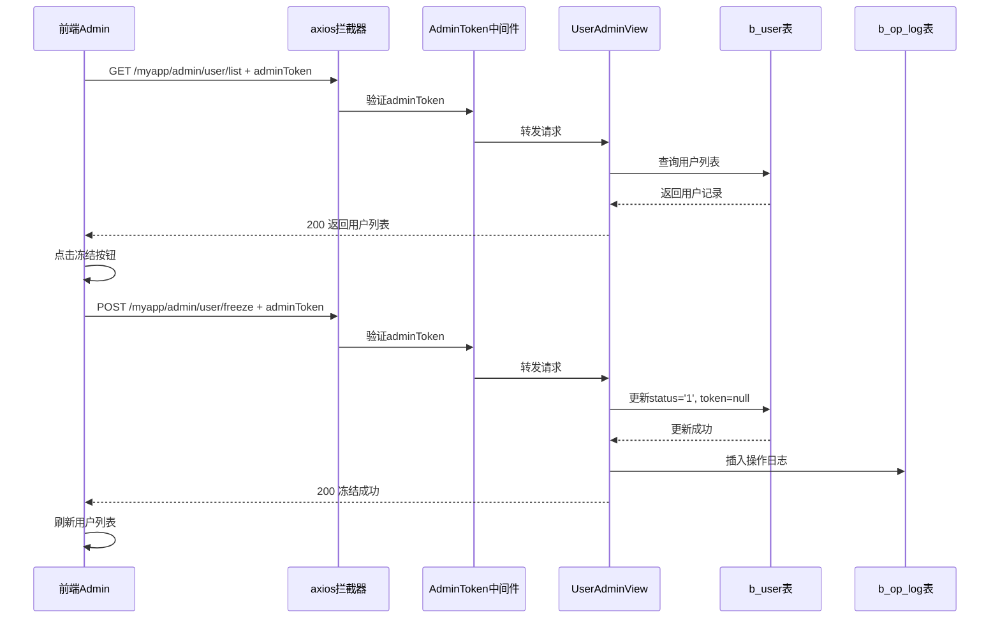
```mermaid
sequenceDiagram
    participant F as 前端Admin
    participant A as axios拦截器
    participant M as AdminToken中间件
    participant V as UserAdminView
    participant D as b_user表
    participant L as b_op_log表

    F->>A: GET /myapp/admin/user/list + adminToken
    A->>M: 验证adminToken
    M->>V: 转发请求
    V->>D: 查询用户列表
    D-->>V: 返回用户记录
    V-->>F: 200 返回用户列表
    F->>F: 点击冻结按钮
    F->>A: POST /myapp/admin/user/freeze + adminToken
    A->>M: 验证adminToken
    M->>V: 转发请求
    V->>D: 更新status='1', token=null
    D-->>V: 更新成功
    V->>L: 插入操作日志
    V-->>F: 200 冻结成功
    F->>F: 刷新用户列表
```

图4-3 账号冻结解冻时序图

### 4.1.4 用户账号删除的实现

平台管理员进入图书借阅系统的用户管理界面，找到需要删除的用户账号，点击对应行的删除按钮。前端弹出确认提示框询问"确认删除该用户?"，管理员确认后，前端调用`deleteUserApi`方法向后端的`/myapp/admin/user/delete`接口发送DELETE请求，携带用户ID和adminToken。

后端的UserAdminView类中的delete方法接收用户ID后，首先查询该用户是否存在未归还的借阅记录。系统查询b_borrow表，筛选user_id等于该用户ID且status='1'(借出中)的记录。若存在未归还图书，返回错误信息提示"该用户有未归还图书，无法删除"。

若无未归还图书，系统执行级联删除操作。首先删除b_comment表中user_id等于该用户ID的所有评论记录，然后删除b_community_post表中user_id等于该用户ID的所有社区帖子，最后删除b_borrow表中user_id等于该用户ID的所有借阅记录，最终删除b_user表中的用户记录。

删除成功后，系统向b_op_log表插入操作日志，记录管理员的删除操作。后端返回包含成功信息的响应给前端，前端刷新用户列表，被删除的用户不再显示。

账号删除的时序图如图4-4所示。

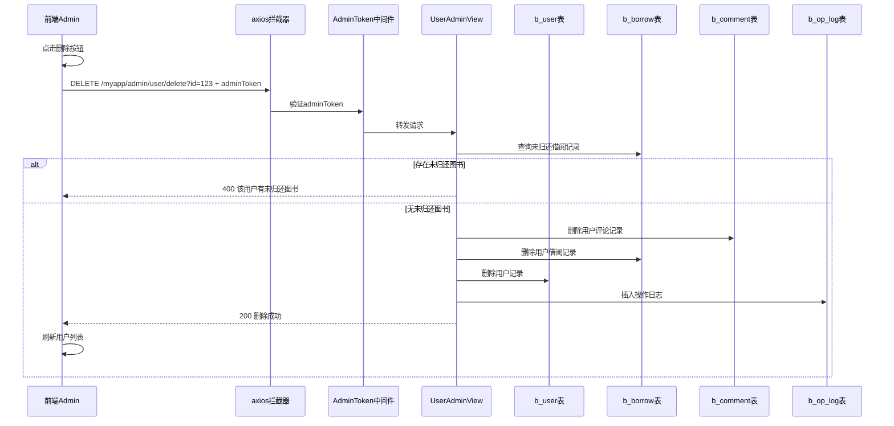
```mermaid
sequenceDiagram
    participant F as 前端Admin
    participant A as axios拦截器
    participant M as AdminToken中间件
    participant V as UserAdminView
    participant D1 as b_user表
    participant D2 as b_borrow表
    participant D3 as b_comment表
    participant L as b_op_log表

    F->>F: 点击删除按钮
    F->>A: DELETE /myapp/admin/user/delete?id=123 + adminToken
    A->>M: 验证adminToken
    M->>V: 转发请求
    V->>D2: 查询未归还借阅记录
    alt 存在未归还图书
        V-->>F: 400 该用户有未归还图书
    else 无未归还图书
        V->>D3: 删除用户评论记录
        V->>D2: 删除用户借阅记录
        V->>D1: 删除用户记录
        V->>L: 插入操作日志
        V-->>F: 200 删除成功
        F->>F: 刷新用户列表
    end
```

图4-4 账号删除时序图

## 4.2 图书管理模块的实现

该部分实现管理员对图书的添加、修改、删除功能，以及用户对图书的搜索、查看详情等功能。

### 4.2.1 图书添加的实现

管理员在后台图书管理页面点击"添加图书"按钮，系统跳转到图书信息录入页面。管理员填写图书相关信息，包括图书标题、作者、分类、出版时间、简介、库存数量等必填字段。

对于封面图片，前端先调用`/api/upload`接口上传图片文件。前端使用FormData对象封装图片文件，发送multipart/form-data格式的POST请求。后端接收文件后，验证文件类型是否为图片格式(jpg/png/gif等)，验证文件大小是否小于2MB。验证通过后，系统使用时间戳和随机数生成唯一文件名，将文件保存到/upload/cover/目录。后端返回图片的相对路径给前端，例如"/upload/cover/1234567890.jpg"。

管理员填写完所有信息后点击"提交"按钮，前端将图书信息封装成Book对象，调用`addBookApi`方法向`/myapp/admin/book/create`接口发送POST请求，携带图书信息和adminToken。

后端BookAdminView类中的create方法接收前端传来的Book对象。系统使用BookSerializer对请求数据进行序列化验证，检查必填字段title、author、classification_id是否完整，检查库存repertory是否为正整数。若验证失败，返回400错误和具体的验证错误信息。

验证通过后，系统创建Book记录并保存到b_book表。设置分类外键classification_id关联到b_classification表，设置初始浏览量pv=0、愿望单数wish_count=0、收藏数collect_count=0、图书状态status='0'(上架)。创建成功后，系统向b_op_log表插入操作日志，记录管理员的添加操作。后端返回新创建的图书ID和成功消息给前端。

前端收到成功响应后，自动跳转回图书列表页面并刷新数据，新添加的图书显示在列表中。

图书添加的时序图如图4-5所示。

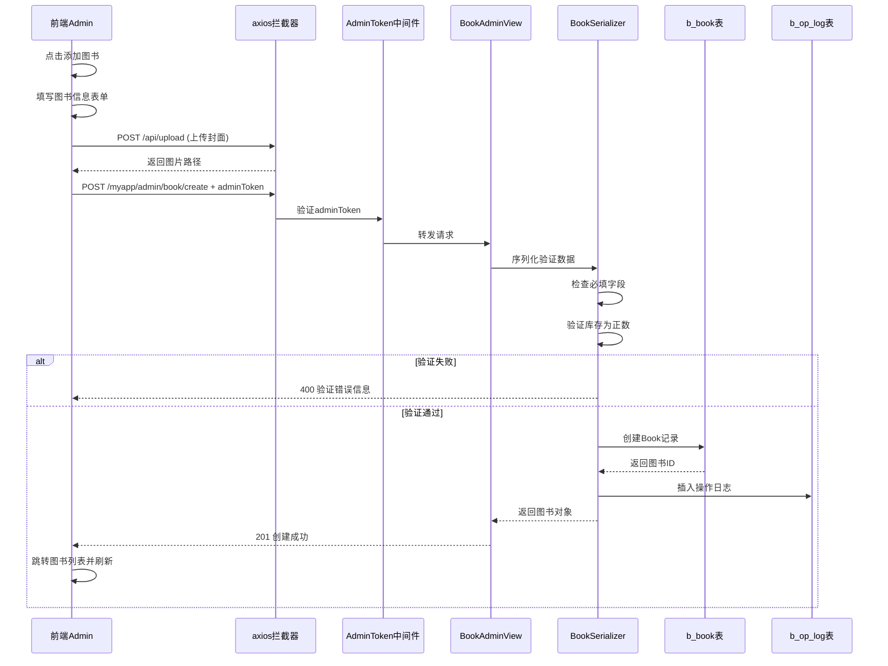
```mermaid
sequenceDiagram
    participant F as 前端Admin
    participant A as axios拦截器
    participant M as AdminToken中间件
    participant V as BookAdminView
    participant S as BookSerializer
    participant D as b_book表
    participant L as b_op_log表

    F->>F: 点击添加图书
    F->>F: 填写图书信息表单
    F->>A: POST /api/upload (上传封面)
    A-->>F: 返回图片路径
    F->>A: POST /myapp/admin/book/create + adminToken
    A->>M: 验证adminToken
    M->>V: 转发请求
    V->>S: 序列化验证数据
    S->>S: 检查必填字段
    S->>S: 验证库存为正数
    alt 验证失败
        S-->>F: 400 验证错误信息
    else 验证通过
        S->>D: 创建Book记录
        D-->>S: 返回图书ID
        S->>L: 插入操作日志
        S-->>V: 返回图书对象
        V-->>F: 201 创建成功
        F->>F: 跳转图书列表并刷新
    end
```

图4-5 图书添加时序图

### 4.2.2 图书搜索的实现

用户在前台首页的搜索框中输入图书相关关键字，如书名"红楼梦"或者作者"曹雪芹"，点击"搜索"按钮。前端将搜索关键词封装，调用`searchBookApi`方法向后端的`/myapp/index/book/search`接口发送GET请求，携带keyword参数。

后端的BookIndexView类中的search方法接收查询条件，使用Django ORM的Q对象构建多字段模糊查询条件。查询范围包括书名title字段、作者author字段等。系统使用`__icontains`查询操作符实现不区分大小写的模糊匹配，例如Q(title__icontains=keyword) | Q(author__icontains=keyword)。

查询时只返回status='0'(上架)状态的图书。查询结果按相关度排序，优先匹配书名的结果排在前面。系统使用Django的Paginator类实现分页，默认每页显示12本图书。查询结果通过BookSerializer序列化，包含图书的基本信息如ID、书名、作者、封面图片、分类名称等。后端将搜索结果和总记录数以JSON格式返回给前端。

前端收到响应后，在搜索结果页面使用Ant Design Vue的Card组件以卡片形式展示图书列表。每个卡片显示图书封面、书名、作者等信息，用户点击卡片可查看图书详情。

图书搜索的时序图如图4-6所示。

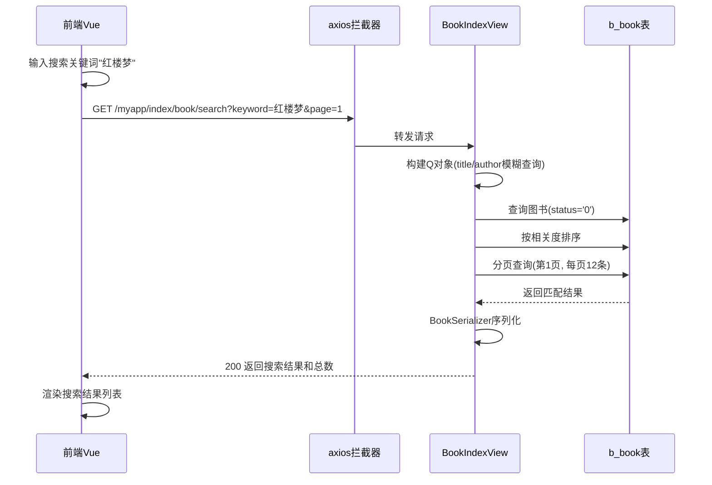
```mermaid
sequenceDiagram
    participant F as 前端Vue
    participant A as axios拦截器
    participant V as BookIndexView
    participant D as b_book表

    F->>F: 输入搜索关键词"红楼梦"
    F->>A: GET /myapp/index/book/search?keyword=红楼梦&page=1
    A->>V: 转发请求
    V->>V: 构建Q对象(title/author模糊查询)
    V->>D: 查询图书(status='0')
    V->>D: 按相关度排序
    V->>D: 分页查询(第1页, 每页12条)
    D-->>V: 返回匹配结果
    V->>V: BookSerializer序列化
    V-->>F: 200 返回搜索结果和总数
    F->>F: 渲染搜索结果列表
```

图4-6 图书搜索时序图

### 4.2.3 图书信息更新的实现

管理员在后台图书管理页面找到需要修改的图书，点击该图书对应行的"编辑"按钮。前端调用`getBookDetailApi`方法向`/myapp/admin/book/detail`接口发送GET请求，携带图书ID和adminToken，以获取该图书的详细信息。

后端BookAdminView类中的detail方法接收请求，根据图书ID查询b_book表获取图书记录，通过BookSerializer序列化图书信息并返回给前端。前端将获取到的信息填充到编辑表单中，管理员可以修改图书的标题、作者、分类、简介、库存、状态等字段。

管理员修改完信息后点击"保存"按钮，前端将修改后的Book对象调用`updateBookApi`方法以PUT请求的方式发送至`/myapp/admin/book/update`接口，携带图书ID和adminToken。

后端BookAdminView类中的update方法接收修改后的Book对象，使用BookSerializer对数据进行验证，检查必填字段的完整性和数据格式的正确性。验证通过后，系统调用Django ORM的update方法更新b_book表中的图书记录。系统允许只更新部分字段，未修改的字段保持原值不变。

更新成功后，系统向b_op_log表插入操作日志，记录管理员的修改操作。后端返回包含成功信息的响应给前端。前端收到成功响应后，自动跳转回图书列表页面并刷新数据，显示更新后的图书信息。

图书信息更新时序图如图4-7所示。

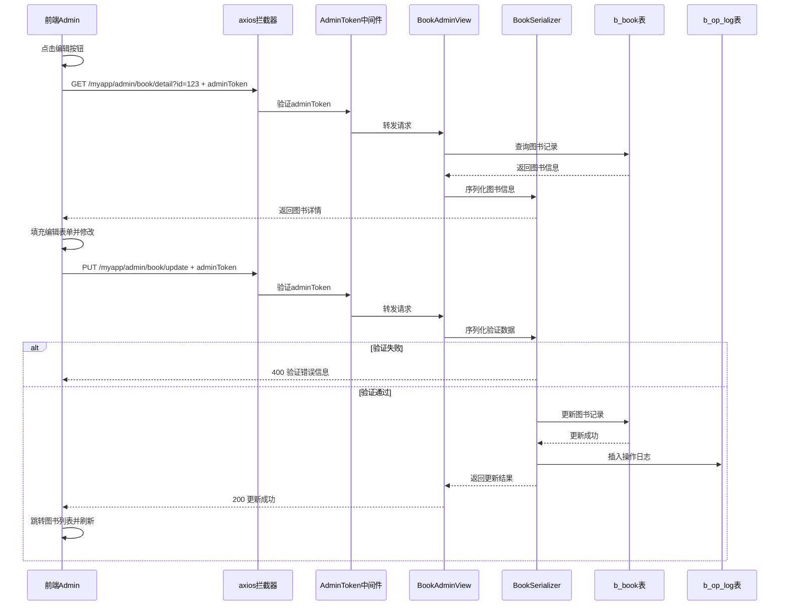
```mermaid
sequenceDiagram
    participant F as 前端Admin
    participant A as axios拦截器
    participant M as AdminToken中间件
    participant V as BookAdminView
    participant S as BookSerializer
    participant D as b_book表
    participant L as b_op_log表

    F->>F: 点击编辑按钮
    F->>A: GET /myapp/admin/book/detail?id=123 + adminToken
    A->>M: 验证adminToken
    M->>V: 转发请求
    V->>D: 查询图书记录
    D-->>V: 返回图书信息
    V->>S: 序列化图书信息
    S-->>F: 返回图书详情
    F->>F: 填充编辑表单并修改
    F->>A: PUT /myapp/admin/book/update + adminToken
    A->>M: 验证adminToken
    M->>V: 转发请求
    V->>S: 序列化验证数据
    alt 验证失败
        S-->>F: 400 验证错误信息
    else 验证通过
        S->>D: 更新图书记录
        D-->>S: 更新成功
        S->>L: 插入操作日志
        S-->>V: 返回更新结果
        V-->>F: 200 更新成功
        F->>F: 跳转图书列表并刷新
    end
```

图4-7 图书信息更新时序图

### 4.2.4 图书删除的实现

管理员在后台图书管理页面找到需要删除的图书，点击该图书对应行的删除按钮。前端弹出确认提示框询问"确认删除该图书?"，管理员确认后，前端调用`deleteBookApi`方法向`/myapp/admin/book/delete`接口发送DELETE请求，携带图书ID和adminToken。

后端BookAdminView类中的delete方法接收图书ID后，首先检查该图书是否有未归还的借阅记录。系统查询b_borrow表，筛选book_id等于该图书ID且status='1'(借出中)的记录。若存在未归还的借阅，返回错误信息提示"该图书有未归还的借阅记录，无法删除"。

若无未归还借阅，系统执行级联删除操作。首先删除b_comment表中book_id等于该图书ID的所有评论记录，然后删除b_borrow表中book_id等于该图书ID的所有借阅历史记录，最后删除b_book表中的图书记录。

删除成功后，系统向b_op_log表插入操作日志，记录管理员的删除操作。后端返回包含成功信息的响应给前端，前端刷新图书列表，被删除的图书不再显示。

图书删除的时序图如图4-8所示。

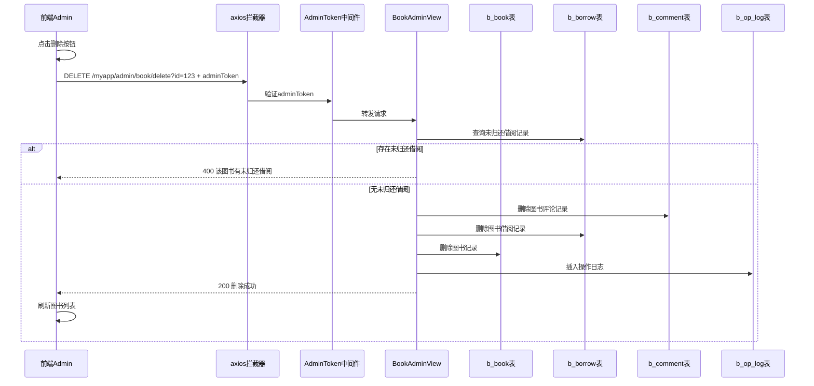
```mermaid
sequenceDiagram
    participant F as 前端Admin
    participant A as axios拦截器
    participant M as AdminToken中间件
    participant V as BookAdminView
    participant D1 as b_book表
    participant D2 as b_borrow表
    participant D3 as b_comment表
    participant L as b_op_log表

    F->>F: 点击删除按钮
    F->>A: DELETE /myapp/admin/book/delete?id=123 + adminToken
    A->>M: 验证adminToken
    M->>V: 转发请求
    V->>D2: 查询未归还借阅记录
    alt 存在未归还借阅
        V-->>F: 400 该图书有未归还借阅
    else 无未归还借阅
        V->>D3: 删除图书评论记录
        V->>D2: 删除图书借阅记录
        V->>D1: 删除图书记录
        V->>L: 插入操作日志
        V-->>F: 200 删除成功
        F->>F: 刷新图书列表
    end
```

图4-8 图书删除时序图

### 4.2.5 图书上下架的实现

管理员在后台图书管理页面找到需要进行上下架操作的图书，点击对应行的上架或下架按钮。前端调用`updateBookStatusApi`方法向`/myapp/admin/book/updatestatus`接口发送POST请求，携带图书ID、目标状态(status)和adminToken。

后端通过AdminToken中间件验证管理员身份。BookAdminView类中的updateStatus方法接收请求，根据图书ID查询b_book表获取图书记录。系统检查图书当前状态，如果为'0'(上架)则更新为'1'(下架)，如果为'1'(下架)则更新为'0'(上架)。

下架的图书在前台用户端不会显示在图书列表中，已下架的图书无法被用户借阅。系统在更新状态字段后自动创建OpLog操作日志记录，记录管理员的状态变更操作。后端返回包含成功信息的响应给前端，前端刷新图书列表，新的图书状态生效。

图书上下架的时序图如图4-9所示。

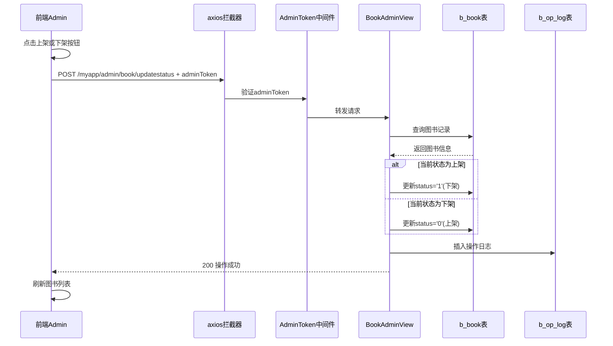
```mermaid
sequenceDiagram
    participant F as 前端Admin
    participant A as axios拦截器
    participant M as AdminToken中间件
    participant V as BookAdminView
    participant D as b_book表
    participant L as b_op_log表

    F->>F: 点击上架或下架按钮
    F->>A: POST /myapp/admin/book/updatestatus + adminToken
    A->>M: 验证adminToken
    M->>V: 转发请求
    V->>D: 查询图书记录
    D-->>V: 返回图书信息
    alt 当前状态为上架
        V->>D: 更新status='1'(下架)
    else 当前状态为下架
        V->>D: 更新status='0'(上架)
    end
    V->>L: 插入操作日志
    V-->>F: 200 操作成功
    F->>F: 刷新图书列表
```

图4-9 图书上下架时序图

## 4.3 分类管理模块的实现

图书借阅推荐系统的分类管理功能模块实现图书分类的查询、添加、修改、删除等功能。

### 4.3.1 分类查询的实现

用户在前台首页或图书列表页面可以查看图书分类菜单。前端调用`listClassificationApi`方法向`/myapp/index/classification/list`接口发送GET请求。

后端ClassificationIndexView类中的list方法接收请求，查询b_classification表获取所有分类记录。系统根据pid字段构建树形结构，其中pid=-1表示顶级分类。系统遍历所有分类记录，将子分类归类到对应的父分类下，形成层级结构。

后端将树形分类数据序列化后返回给前端。前端使用树形组件(如Ant Design Vue的Tree组件)展示分类菜单，用户可以展开或收缩分类节点进行浏览。用户点击某个分类，前端调用图书列表接口，传递classification_id参数，查询该分类下的所有图书。

分类查询的时序图如图4-10所示。

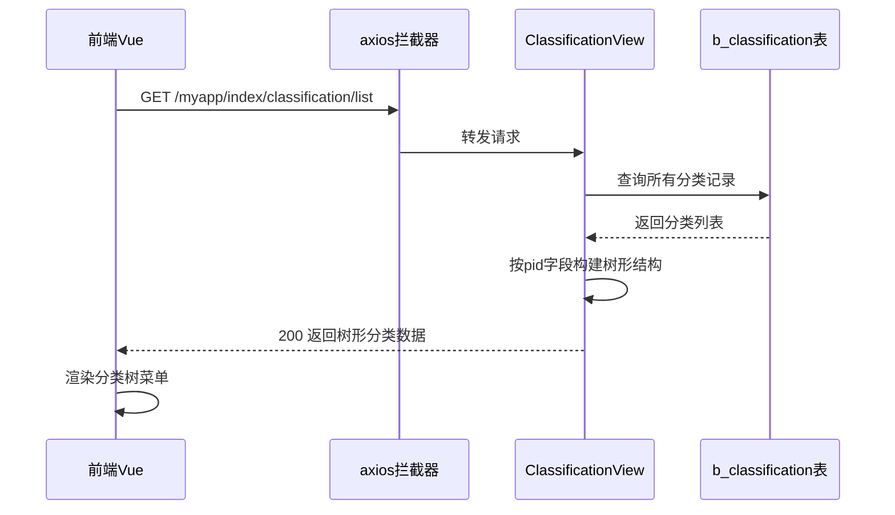
```mermaid
sequenceDiagram
    participant F as 前端Vue
    participant A as axios拦截器
    participant V as ClassificationView
    participant D as b_classification表

    F->>A: GET /myapp/index/classification/list
    A->>V: 转发请求
    V->>D: 查询所有分类记录
    D-->>V: 返回分类列表
    V->>V: 按pid字段构建树形结构
    V-->>F: 200 返回树形分类数据
    F->>F: 渲染分类树菜单
```

图4-10 分类查询时序图

### 4.3.2 分类添加的实现

管理员在后台分类管理页面点击"添加分类"按钮，系统跳转到分类信息录入页面。管理员填写分类名称，选择父分类(若为顶级分类则不选择)，点击"提交"按钮。前端将分类信息封装成对象，调用`addClassificationApi`方法向`/myapp/admin/classification/create`接口发送POST请求，携带分类信息和adminToken。

后端ClassificationAdminView类中的create方法接收前端传来的对象。系统首先检查分类名称是否重复，查询b_classification表中是否已存在同名分类。若存在重复，返回错误信息"该分类名称已存在"。

若无重复，系统创建Classification记录。若管理员选择了父分类，设置pid字段为父分类的ID；否则设置pid为-1，表示该分类为顶级分类。系统将分类记录保存到b_classification表。

创建成功后，系统向b_op_log表插入操作日志，记录管理员的添加操作。后端返回包含成功信息的响应给前端。前端收到成功响应后，自动跳转回分类列表页面并刷新数据，新添加的分类显示在列表中。

分类添加的时序图如图4-11所示。

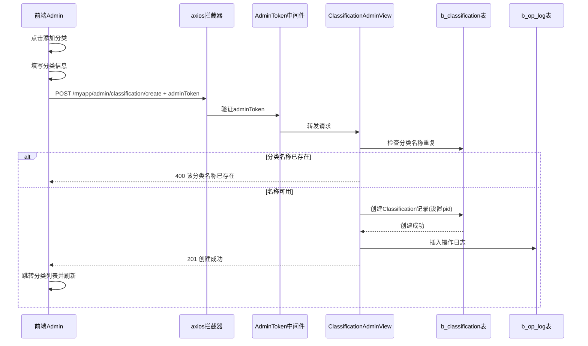
```mermaid
sequenceDiagram
    participant F as 前端Admin
    participant A as axios拦截器
    participant M as AdminToken中间件
    participant V as ClassificationAdminView
    participant D as b_classification表
    participant L as b_op_log表

    F->>F: 点击添加分类
    F->>F: 填写分类信息
    F->>A: POST /myapp/admin/classification/create + adminToken
    A->>M: 验证adminToken
    M->>V: 转发请求
    V->>D: 检查分类名称重复
    alt 分类名称已存在
        V-->>F: 400 该分类名称已存在
    else 名称可用
        V->>D: 创建Classification记录(设置pid)
        D-->>V: 创建成功
        V->>L: 插入操作日志
        V-->>F: 201 创建成功
        F->>F: 跳转分类列表并刷新
    end
```

图4-11 分类添加时序图

### 4.3.3 分类修改的实现

管理员在后台分类管理页面找到需要修改的分类，点击编辑按钮。前端调用`getClassificationDetailApi`方法获取分类详情，将信息填充到编辑表单中。管理员修改分类名称或父分类后，点击"保存"按钮。前端调用`updateClassificationApi`方法向`/myapp/admin/classification/update`接口发送PUT请求，携带分类ID、修改后的信息和adminToken。

后端ClassificationAdminView类中的update方法接收修改后的对象，验证分类名称不为空。系统允许修改分类的名称和父分类，但不允许将分类设置为自己的子分类，避免形成循环引用。

验证通过后，系统更新b_classification表中的分类记录。更新成功后向b_op_log表插入操作日志，返回成功响应。前端刷新分类列表，显示更新后的分类信息。

分类修改的时序图如图4-12所示。

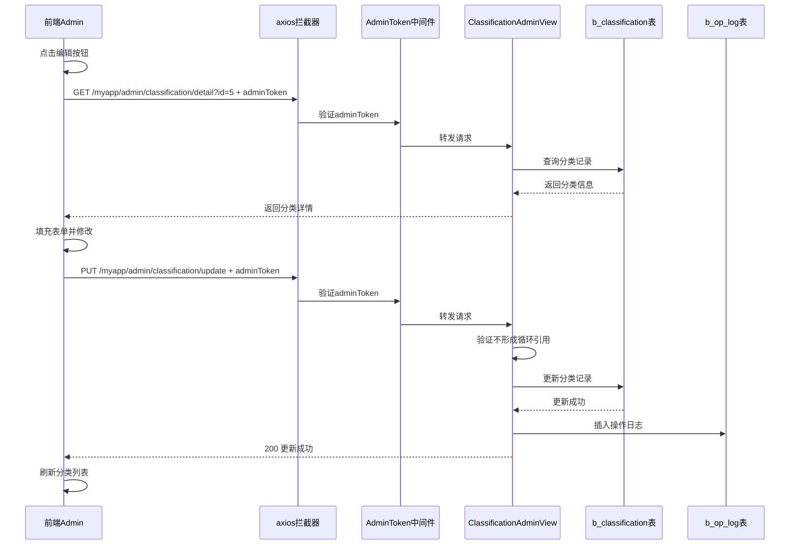
```mermaid
sequenceDiagram
    participant F as 前端Admin
    participant A as axios拦截器
    participant M as AdminToken中间件
    participant V as ClassificationAdminView
    participant D as b_classification表
    participant L as b_op_log表

    F->>F: 点击编辑按钮
    F->>A: GET /myapp/admin/classification/detail?id=5 + adminToken
    A->>M: 验证adminToken
    M->>V: 转发请求
    V->>D: 查询分类记录
    D-->>V: 返回分类信息
    V-->>F: 返回分类详情
    F->>F: 填充表单并修改
    F->>A: PUT /myapp/admin/classification/update + adminToken
    A->>M: 验证adminToken
    M->>V: 转发请求
    V->>V: 验证不形成循环引用
    V->>D: 更新分类记录
    D-->>V: 更新成功
    V->>L: 插入操作日志
    V-->>F: 200 更新成功
    F->>F: 刷新分类列表
```

图4-12 分类修改时序图

### 4.3.4 分类删除的实现

管理员在后台分类管理页面找到需要删除的分类，点击删除按钮。前端弹出确认提示框，管理员确认后，前端调用`deleteClassificationApi`方法向`/myapp/admin/classification/delete`接口发送DELETE请求，携带分类ID和adminToken。

后端ClassificationAdminView类中的delete方法接收分类ID后，首先检查该分类下是否有图书。系统查询b_book表，筛选classification_id等于该分类ID的记录。若存在图书，返回错误信息"该分类下有图书，无法删除"。

系统还要检查该分类是否有子分类。查询b_classification表，筛选pid等于该分类ID的记录。若存在子分类，返回错误信息"该分类有子分类，无法删除"。

若以上检查都通过，系统删除b_classification表中的分类记录。删除成功后向b_op_log表插入操作日志，返回成功响应。前端刷新分类列表，被删除的分类不再显示。

分类删除的时序图如图4-13所示。

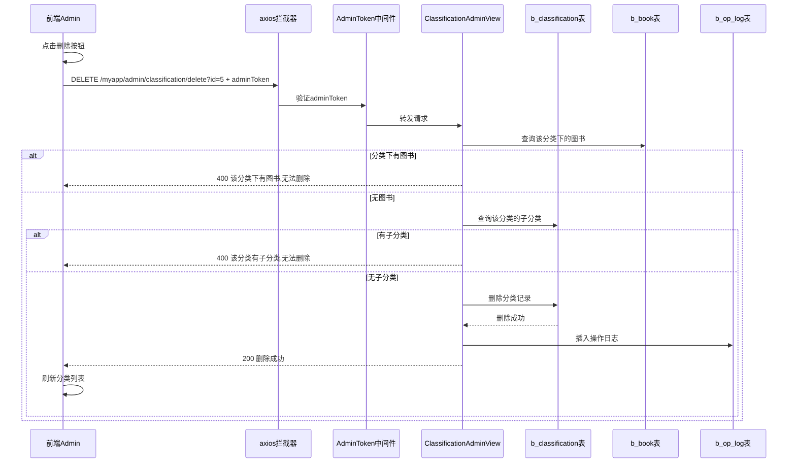
```mermaid
sequenceDiagram
    participant F as 前端Admin
    participant A as axios拦截器
    participant M as AdminToken中间件
    participant V as ClassificationAdminView
    participant D1 as b_classification表
    participant D2 as b_book表
    participant L as b_op_log表

    F->>F: 点击删除按钮
    F->>A: DELETE /myapp/admin/classification/delete?id=5 + adminToken
    A->>M: 验证adminToken
    M->>V: 转发请求
    V->>D2: 查询该分类下的图书
    alt 分类下有图书
        V-->>F: 400 该分类下有图书,无法删除
    else 无图书
        V->>D1: 查询该分类的子分类
        alt 有子分类
            V-->>F: 400 该分类有子分类,无法删除
        else 无子分类
            V->>D1: 删除分类记录
            D1-->>V: 删除成功
            V->>L: 插入操作日志
            V-->>F: 200 删除成功
            F->>F: 刷新分类列表
        end
    end
```

图4-13 分类删除时序图

## 4.4 借阅管理模块的实现

图书借阅推荐系统的借阅管理模块主要用于管理用户的图书借阅操作，涵盖借书、还书、借阅记录查询等功能。

### 4.4.1 借书功能的实现

用户在前台浏览到想要借阅的图书后，进入图书详情页。页面显示图书的基本信息、简介、库存数量、借阅按钮等。用户点击"借阅"按钮，前端调用`borrowBookApi`方法向`/myapp/index/borrow/create`接口发送POST请求，携带图书ID和Token。

后端通过Token验证中间件确认用户身份。BorrowIndexView类中的create方法接收请求后，进行一系列业务规则检查。

首先，系统查询b_book表获取图书信息，检查库存repertory字段是否大于0。若库存不足(repertory<=0)，返回错误信息"该图书库存不足，无法借阅"。

其次，系统检查用户是否已借阅该图书且未归还。查询b_borrow表，筛选user_id等于当前用户ID、book_id等于该图书ID、status='1'(借出中)的记录。若存在这样的记录，返回错误信息"您已借阅该图书，请勿重复借阅"。

若所有检查通过，系统创建Borrow记录。设置user_id为当前用户ID，book_id为图书ID，borrow_time为当前时间，expect_time为当前时间后60天(借阅期限为60天)，status='1'(借出中)。将Borrow记录保存到b_borrow表。

同时，系统更新b_book表，将该图书的库存repertory字段减1。更新成功后向b_op_log表插入操作日志，记录用户的借阅操作。后端返回包含借阅成功信息的响应给前端。

前端收到成功响应后，提示用户"借阅成功"，并自动跳转到"我的借阅"页面，显示该用户的所有借阅记录。

借书功能的时序图如图4-14所示。

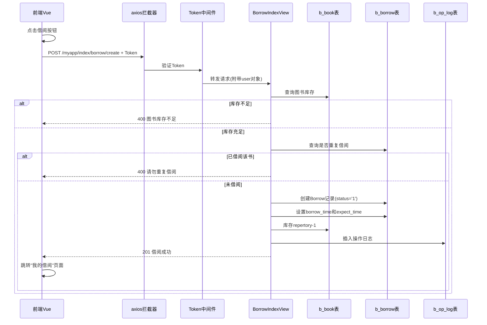
```mermaid
sequenceDiagram
    participant F as 前端Vue
    participant A as axios拦截器
    participant M as Token中间件
    participant V as BorrowIndexView
    participant D1 as b_book表
    participant D2 as b_borrow表
    participant L as b_op_log表

    F->>F: 点击借阅按钮
    F->>A: POST /myapp/index/borrow/create + Token
    A->>M: 验证Token
    M->>V: 转发请求(附带user对象)
    V->>D1: 查询图书库存
    alt 库存不足
        V-->>F: 400 图书库存不足
    else 库存充足
        V->>D2: 查询是否重复借阅
        alt 已借阅该书
            V-->>F: 400 请勿重复借阅
        else 未借阅
            V->>D2: 创建Borrow记录(status='1')
            V->>D2: 设置borrow_time和expect_time
            V->>D1: 库存repertory-1
            V->>L: 插入操作日志
            V-->>F: 201 借阅成功
            F->>F: 跳转"我的借阅"页面
        end
    end
```

图4-14 借书功能时序图

### 4.4.2 还书功能的实现

用户进入"我的借阅"页面，系统显示该用户的所有借阅记录列表，包括图书名称、作者、借阅时间、应还时间、状态等信息。用户找到需要归还的借阅记录，点击对应行的"还书"按钮。前端调用`returnBookApi`方法向`/myapp/index/borrow/return`接口发送POST请求，携带借阅记录ID和Token。

后端通过Token验证中间件确认用户身份。BorrowIndexView类中的returnBook方法接收借阅记录ID后，查询b_borrow表获取借阅记录。

系统首先检查该借阅记录是否属于当前用户，验证borrow记录的user_id是否等于当前用户ID。若不属于，返回错误信息"无权操作该借阅记录"。

其次，系统检查借阅记录的status字段是否为'1'(借出中)。若status不为'1'(例如已经归还)，返回错误信息"该借阅记录状态异常，无法归还"。

若检查通过，系统更新b_borrow表中的借阅记录，将status字段从'1'更新为'2'(已归还)。

同时，系统更新b_book表，将对应图书的库存repertory字段加1，恢复库存。更新成功后向b_op_log表插入操作日志，记录用户的还书操作。后端返回包含还书成功信息的响应给前端。

前端收到成功响应后，提示用户"还书成功"，并刷新"我的借阅"页面，该借阅记录的状态显示为"已归还"。

还书功能的时序图如图4-15所示。

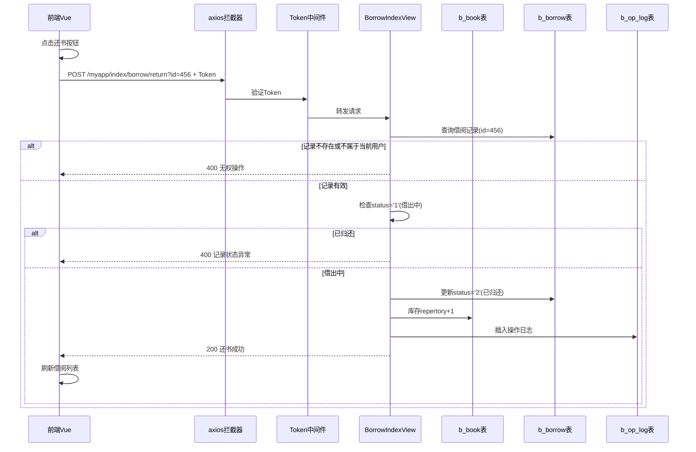
```mermaid
sequenceDiagram
    participant F as 前端Vue
    participant A as axios拦截器
    participant M as Token中间件
    participant V as BorrowIndexView
    participant D1 as b_book表
    participant D2 as b_borrow表
    participant L as b_op_log表

    F->>F: 点击还书按钮
    F->>A: POST /myapp/index/borrow/return?id=456 + Token
    A->>M: 验证Token
    M->>V: 转发请求
    V->>D2: 查询借阅记录(id=456)
    alt 记录不存在或不属于当前用户
        V-->>F: 400 无权操作
    else 记录有效
        V->>V: 检查status='1'(借出中)
        alt 已归还
            V-->>F: 400 记录状态异常
        else 借出中
            V->>D2: 更新status='2'(已归还)
            V->>D1: 库存repertory+1
            V->>L: 插入操作日志
            V-->>F: 200 还书成功
            F->>F: 刷新借阅列表
        end
    end
```

图4-15 还书功能时序图

### 4.4.3 借阅记录查询的实现

用户点击导航菜单中的"我的借阅"选项，进入借阅记录页面。前端调用`listBorrowApi`方法向`/myapp/index/borrow/list`接口发送GET请求，携带Token和可选的状态筛选参数status。

后端通过Token验证中间件确认用户身份。BorrowIndexView类中的list方法接收请求，查询b_borrow表获取该用户的所有借阅记录，筛选条件为user_id等于当前用户ID。

若前端传递了status参数，系统进一步筛选借阅记录。status='1'表示只查询借出中的记录，status='2'表示只查询已归还的记录。系统使用Django ORM的filter方法进行筛选。

查询时需要关联查询图书信息。系统使用select_related('book')优化查询，一次性获取借阅记录和对应的图书信息(书名、作者、封面等)。这样可以避免N+1查询问题，提高查询效率。

系统使用Django的Paginator类实现分页，默认每页显示10条记录。查询结果通过BorrowSerializer序列化，包含借阅编号、图书信息、借阅时间、应还时间、状态等字段。后端将借阅记录列表和总记录数以JSON格式返回给前端。

前端收到响应后，使用Ant Design Vue的Table组件展示借阅记录列表。列表显示图书封面缩略图、书名、作者、借阅时间、应还时间、状态等信息。对于借出中的记录，显示"还书"按钮；对于已归还的记录，显示"已归还"标签。

借阅记录查询的时序图如图4-16所示。

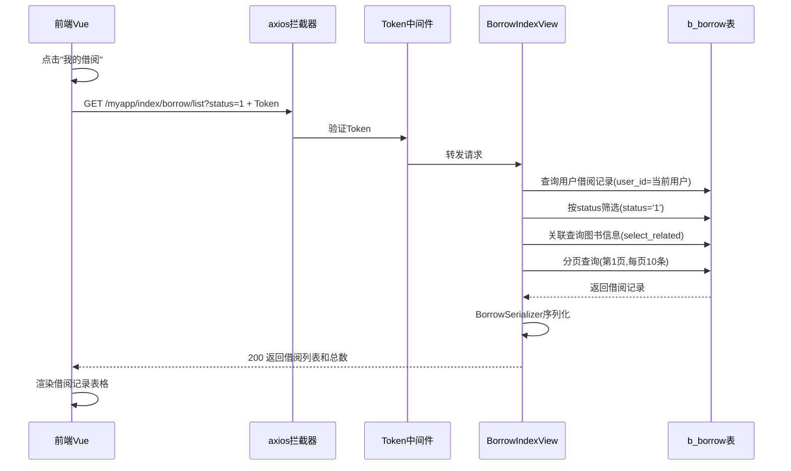
```mermaid
sequenceDiagram
    participant F as 前端Vue
    participant A as axios拦截器
    participant M as Token中间件
    participant V as BorrowIndexView
    participant D as b_borrow表

    F->>F: 点击"我的借阅"
    F->>A: GET /myapp/index/borrow/list?status=1 + Token
    A->>M: 验证Token
    M->>V: 转发请求
    V->>D: 查询用户借阅记录(user_id=当前用户)
    V->>D: 按status筛选(status='1')
    V->>D: 关联查询图书信息(select_related)
    V->>D: 分页查询(第1页,每页10条)
    D-->>V: 返回借阅记录
    V->>V: BorrowSerializer序列化
    V-->>F: 200 返回借阅列表和总数
    F->>F: 渲染借阅记录表格
```

图4-16 借阅记录查询时序图

### 4.4.4 订单筛选的实现

用户在"我的借阅"页面可以按状态筛选借阅记录。页面顶部提供筛选条件选择框，用户可以选择"全部"、"借出中"或"已归还"。用户选择筛选条件后，前端调用`listBorrowApi`方法，向`/myapp/index/borrow/list`接口发送GET请求，携带status参数('1'表示借出中，'2'表示已归还)和Token。

后端BorrowIndexView类中的list方法接收status参数，在查询b_borrow表时增加status字段的筛选条件。例如status='1'时只返回借出中的记录，status='2'时只返回已归还的记录。查询结果序列化后返回给前端，前端刷新列表展示符合条件的借阅记录。

订单筛选的时序图如图4-17所示。

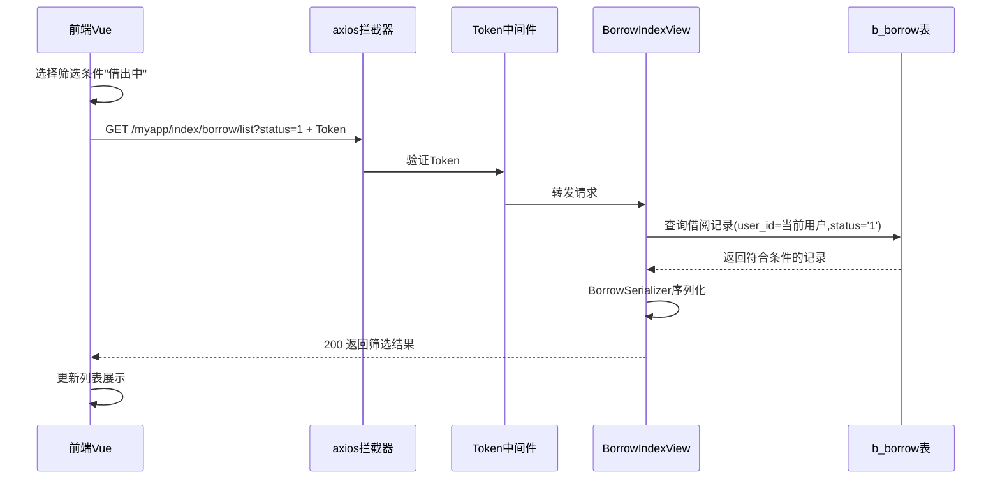
```mermaid
sequenceDiagram
    participant F as 前端Vue
    participant A as axios拦截器
    participant M as Token中间件
    participant V as BorrowIndexView
    participant D as b_borrow表

    F->>F: 选择筛选条件"借出中"
    F->>A: GET /myapp/index/borrow/list?status=1 + Token
    A->>M: 验证Token
    M->>V: 转发请求
    V->>D: 查询借阅记录(user_id=当前用户,status='1')
    D-->>V: 返回符合条件的记录
    V->>V: BorrowSerializer序列化
    V-->>F: 200 返回筛选结果
    F->>F: 更新列表展示
```

图4-17 订单筛选时序图

## 4.5 社区互动模块的实现

图书借阅推荐系统的社区互动模块主要用于实现用户之间的交流功能，包括评论管理和社区帖子管理。

### 4.5.1 发表评论的实现

用户在图书详情页浏览图书信息后，可以在页面底部的评论区发表自己的看法。用户在评论输入框中填写评论内容，点击"发表评论"按钮。前端调用`createCommentApi`方法向`/myapp/index/comment/create`接口发送POST请求，携带图书ID、评论内容和Token。

后端通过Token验证中间件确认用户身份。CommentIndexView类中的create方法接收请求，首先验证评论内容不为空且长度不超过200个字符。若验证失败，返回错误信息。

验证通过后，系统创建Comment记录。设置user_id为当前用户ID，book_id为图书ID，content为评论内容，comment_time为当前时间，like_count初始值为0。将Comment记录保存到b_comment表。

创建成功后，系统向b_op_log表插入操作日志，记录用户的评论操作。后端返回包含评论成功信息的响应给前端。

前端收到成功响应后，提示用户"评论成功"，并刷新评论列表，新发表的评论显示在列表顶部。

发表评论的时序图如图4-18所示。

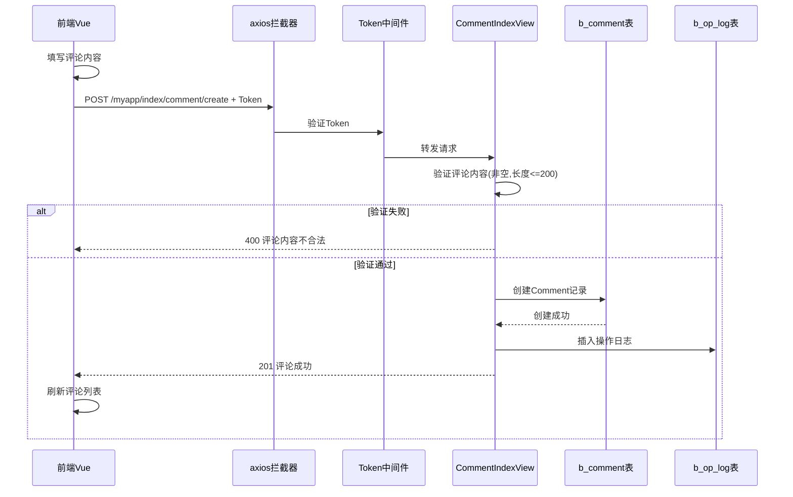
```mermaid
sequenceDiagram
    participant F as 前端Vue
    participant A as axios拦截器
    participant M as Token中间件
    participant V as CommentIndexView
    participant D as b_comment表
    participant L as b_op_log表

    F->>F: 填写评论内容
    F->>A: POST /myapp/index/comment/create + Token
    A->>M: 验证Token
    M->>V: 转发请求
    V->>V: 验证评论内容(非空,长度<=200)
    alt 验证失败
        V-->>F: 400 评论内容不合法
    else 验证通过
        V->>D: 创建Comment记录
        D-->>V: 创建成功
        V->>L: 插入操作日志
        V-->>F: 201 评论成功
        F->>F: 刷新评论列表
    end
```

图4-18 发表评论时序图

### 4.5.2 评论列表查询的实现

用户进入图书详情页时，系统自动加载该图书的评论列表。前端调用`listCommentApi`方法向`/myapp/index/comment/list`接口发送GET请求，携带图书ID(bookId)和可选的排序参数(sort)。

后端CommentIndexView类中的list方法接收请求，查询b_comment表获取该图书的所有评论，筛选条件为book_id等于传入的图书ID。

系统支持两种排序方式。若sort参数为'recent'，按comment_time字段降序排列(最新评论优先)；若sort参数为'hot'，按like_count字段降序排列(点赞最多的评论优先)。

查询时需要关联查询用户信息。系统使用select_related('user')优化查询，一次性获取评论和对应的用户信息(用户名、昵称、头像等)。这样可以在评论列表中显示每条评论的发布者信息。

系统使用Django的Paginator类实现分页，默认每页显示10条评论。查询结果通过CommentSerializer序列化，包含评论ID、内容、发布时间、点赞数、用户信息等字段。后端将评论列表和总记录数以JSON格式返回给前端。

前端收到响应后，展示评论列表。每条评论显示用户头像、用户昵称、评论内容、发布时间、点赞数和点赞按钮等信息。

评论列表查询的时序图如图4-19所示。

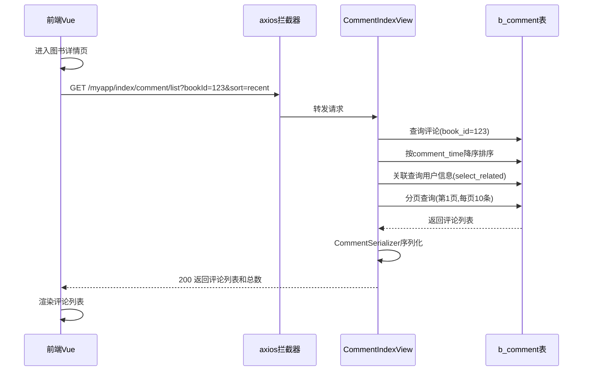
```mermaid
sequenceDiagram
    participant F as 前端Vue
    participant A as axios拦截器
    participant V as CommentIndexView
    participant D as b_comment表

    F->>F: 进入图书详情页
    F->>A: GET /myapp/index/comment/list?bookId=123&sort=recent
    A->>V: 转发请求
    V->>D: 查询评论(book_id=123)
    V->>D: 按comment_time降序排序
    V->>D: 关联查询用户信息(select_related)
    V->>D: 分页查询(第1页,每页10条)
    D-->>V: 返回评论列表
    V->>V: CommentSerializer序列化
    V-->>F: 200 返回评论列表和总数
    F->>F: 渲染评论列表
```

图4-19 评论列表查询时序图

### 4.5.3 评论点赞的实现

用户在浏览评论列表时，可以为认可的评论点赞。用户点击某条评论的点赞按钮，前端调用`likeCommentApi`方法向`/myapp/index/comment/like`接口发送POST请求，携带评论ID。

后端CommentIndexView类中的like方法接收评论ID，查询b_comment表获取评论记录。系统将该评论的like_count字段加1，使用Django ORM的F表达式实现原子性更新，避免并发问题。更新语句为Comment.objects.filter(id=comment_id).update(like_count=F('like_count') + 1)。

更新成功后，系统重新查询该评论记录，获取更新后的like_count值，并返回给前端。前端收到响应后，实时更新评论卡片中显示的点赞数，无需刷新整个页面。

评论点赞的时序图如图4-20所示。

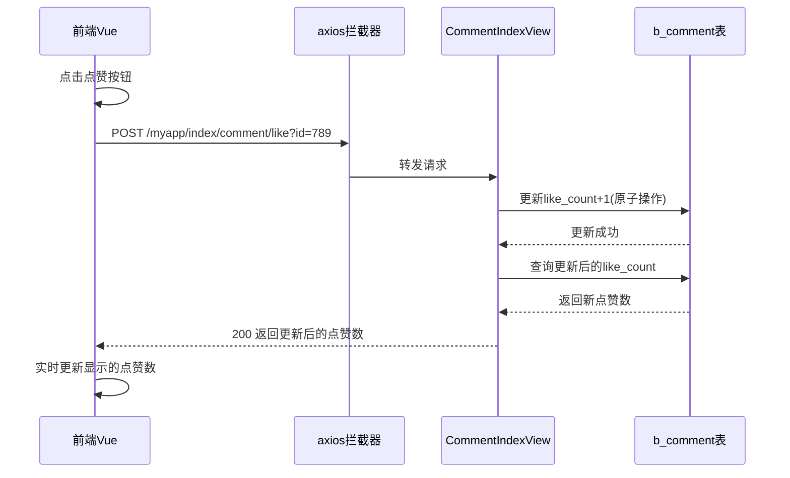
```mermaid
sequenceDiagram
    participant F as 前端Vue
    participant A as axios拦截器
    participant V as CommentIndexView
    participant D as b_comment表

    F->>F: 点击点赞按钮
    F->>A: POST /myapp/index/comment/like?id=789
    A->>V: 转发请求
    V->>D: 更新like_count+1(原子操作)
    D-->>V: 更新成功
    V->>D: 查询更新后的like_count
    D-->>V: 返回新点赞数
    V-->>F: 200 返回更新后的点赞数
    F->>F: 实时更新显示的点赞数
```

图4-20 评论点赞时序图

### 4.5.4 发布社区帖子的实现

用户在社区页面点击"发布新话题"按钮，系统跳转到帖子编辑页面。用户填写帖子标题和内容，点击"发布"按钮。前端调用`createPostApi`方法向`/myapp/index/community/post/create`接口发送POST请求，携带标题、内容和Token。

后端通过Token验证中间件确认用户身份。CommunityPostView类中的create方法接收请求，验证标题不为空且长度不超过100个字符，验证内容不为空。若验证失败，返回错误信息。

验证通过后，系统创建CommunityPost记录。设置user_id为当前用户ID，title为帖子标题，content为帖子内容，create_time为当前时间，views初始值为0，like_count初始值为0。将CommunityPost记录保存到b_community_post表。

创建成功后，系统向b_op_log表插入操作日志，记录用户的发帖操作。后端返回包含帖子ID和成功信息的响应给前端。

前端收到成功响应后，提示用户"发布成功"，并自动跳转回社区首页，新发布的帖子显示在列表顶部。

发布社区帖子的时序图如图4-21所示。

```mermaid
sequenceDiagram
    participant F as 前端Vue
    participant A as axios拦截器
    participant M as Token中间件
    participant V as CommunityPostView
    participant D as b_community_post表
    participant L as b_op_log表

    F->>F: 填写帖子标题和内容
    F->>A: POST /myapp/index/community/post/create + Token
    A->>M: 验证Token
    M->>V: 转发请求
    V->>V: 验证标题和内容
    alt 验证失败
        V-->>F: 400 数据不合法
    else 验证通过
        V->>D: 创建CommunityPost记录
        D-->>V: 创建成功
        V->>L: 插入操作日志
        V-->>F: 201 发布成功
        F->>F: 跳转社区首页
    end
```

图4-21 发布社区帖子时序图

### 4.5.5 社区帖子列表查询的实现

用户进入社区页面时，系统自动加载社区帖子列表。前端调用`listPostApi`方法向`/myapp/index/community/post/list`接口发送GET请求，可携带排序参数sort。

后端CommunityPostView类中的list方法接收请求，查询b_community_post表获取所有帖子。

系统支持两种排序方式。若sort参数为'recent'，按create_time字段降序排列(最新帖子优先)；若sort参数为'hot'，按views和like_count字段综合排序，计算热度值为views + like_count * 2，按热度值降序排列(最热帖子优先)。

查询时需要关联查询用户信息。系统使用select_related('user')优化查询，获取帖子和对应的用户信息(用户名、昵称、头像等)。

系统使用Django的Paginator类实现分页，默认每页显示15条帖子。查询结果通过CommunityPostSerializer序列化，包含帖子ID、标题、内容摘要(截取前100个字符)、发布时间、浏览量、点赞数、用户信息等字段。后端将帖子列表和总记录数以JSON格式返回给前端。

前端收到响应后，使用Ant Design Vue的List组件展示帖子列表。每个列表项显示帖子标题、内容摘要、发布者昵称和头像、发布时间、浏览量、点赞数等信息。用户点击帖子标题可进入帖子详情页。

社区帖子列表查询的时序图如图4-22所示。

```mermaid
sequenceDiagram
    participant F as 前端Vue
    participant A as axios拦截器
    participant V as CommunityPostView
    participant D as b_community_post表

    F->>F: 进入社区页面
    F->>A: GET /myapp/index/community/post/list?sort=hot
    A->>V: 转发请求
    V->>D: 查询所有帖子
    V->>V: 计算热度(views + like_count*2)
    V->>D: 按热度降序排序
    V->>D: 关联查询用户信息(select_related)
    V->>D: 分页查询(第1页,每页15条)
    D-->>V: 返回帖子列表
    V->>V: CommunityPostSerializer序列化
    V-->>F: 200 返回帖子列表和总数
    F->>F: 渲染帖子列表
```

图4-22 社区帖子列表查询时序图

### 4.5.6 社区帖子详情查看的实现

用户在社区首页点击某个帖子的标题链接，前端调用`postDetailApi`方法向`/myapp/index/community/post/detail`接口发送GET请求，携带帖子ID。

后端CommunityPostView类中的detail方法接收帖子ID，查询b_community_post表获取帖子记录。若帖子不存在，返回404错误。

若帖子存在，系统将该帖子的views字段加1，记录浏览量。使用Django ORM的F表达式实现原子性更新，更新语句为CommunityPost.objects.filter(id=post_id).update(views=F('views') + 1)。

系统关联查询用户信息，获取帖子发布者的昵称、头像等。将帖子详细信息通过CommunityPostSerializer序列化，包含标题、完整内容、发布时间、浏览量、点赞数、用户信息等字段。后端返回帖子详情给前端。

前端收到响应后，渲染帖子详情页面。页面显示帖子标题、发布者昵称和头像、发布时间、完整内容、浏览量、点赞数和点赞按钮等信息。

社区帖子详情查看的时序图如图4-23所示。

```mermaid
sequenceDiagram
    participant F as 前端Vue
    participant A as axios拦截器
    participant V as CommunityPostView
    participant D as b_community_post表

    F->>F: 点击帖子标题
    F->>A: GET /myapp/index/community/post/detail?id=456
    A->>V: 转发请求
    V->>D: 查询帖子记录(id=456)
    alt 帖子不存在
        V-->>F: 404 帖子不存在
    else 帖子存在
        V->>D: 更新views+1(原子操作)
        V->>D: 关联查询用户信息
        D-->>V: 返回完整信息
        V->>V: CommunityPostSerializer序列化
        V-->>F: 200 返回帖子详情
        F->>F: 渲染详情页面
    end
```

图4-23 社区帖子详情查看时序图

## 4.6 通知管理模块的实现

图书借阅推荐系统的通知管理模块主要用于管理员发布系统通知和用户查看通知。

### 4.6.1 发布通知的实现

管理员在后台通知管理页面点击"发布通知"按钮，系统跳转到通知编辑页面。管理员填写通知标题和内容，点击"发布"按钮。前端调用`publishNoticeApi`方法向`/myapp/admin/notice/create`接口发送POST请求，携带通知信息和adminToken。

后端通过AdminToken中间件验证管理员身份。NoticeAdminView类中的create方法接收请求，验证标题不为空且长度不超过100个字符，验证内容不为空且长度不超过1000个字符。若验证失败，返回错误信息。

验证通过后，系统创建Notice记录。设置title为通知标题，content为通知内容，create_time为当前时间。将Notice记录保存到b_notice表。

创建成功后，系统向b_op_log表插入操作日志，记录管理员的发布操作。后端返回包含成功信息的响应给前端。

前端收到成功响应后，提示管理员"发布成功"，并自动跳转回通知列表页面，新发布的通知显示在列表顶部。

发布通知的时序图如图4-24所示。

```mermaid
sequenceDiagram
    participant F as 前端Admin
    participant A as axios拦截器
    participant M as AdminToken中间件
    participant V as NoticeAdminView
    participant D as b_notice表
    participant L as b_op_log表

    F->>F: 填写通知标题和内容
    F->>A: POST /myapp/admin/notice/create + adminToken
    A->>M: 验证adminToken
    M->>V: 转发请求
    V->>V: 验证标题和内容
    alt 验证失败
        V-->>F: 400 数据不合法
    else 验证通过
        V->>D: 创建Notice记录
        D-->>V: 创建成功
        V->>L: 插入操作日志
        V-->>F: 201 发布成功
        F->>F: 跳转通知列表
    end
```

图4-24 发布通知时序图

### 4.6.2 通知查询的实现

用户进入系统首页时，系统自动加载通知列表。前端调用`listNoticeApi`方法向`/myapp/index/notice/list`接口发送GET请求。

后端NoticeIndexView类中的list方法接收请求，查询b_notice表获取所有通知记录，按create_time字段降序排列(最新通知优先)。系统使用Django的Paginator类实现分页，默认每页显示5条通知。

查询结果通过NoticeSerializer序列化，包含通知ID、标题、内容、发布时间等字段。后端将通知列表和总记录数以JSON格式返回给前端。

前端收到响应后，在首页顶部展示通知列表。列表显示通知标题、发布时间等信息，用户点击可展开查看完整内容。

通知查询的时序图如图4-25所示。

```mermaid
sequenceDiagram
    participant F as 前端Vue
    participant A as axios拦截器
    participant V as NoticeIndexView
    participant D as b_notice表

    F->>F: 进入系统首页
    F->>A: GET /myapp/index/notice/list
    A->>V: 转发请求
    V->>D: 查询所有通知
    V->>D: 按create_time降序排序
    V->>D: 分页查询(第1页,每页5条)
    D-->>V: 返回通知列表
    V->>V: NoticeSerializer序列化
    V-->>F: 200 返回通知列表和总数
    F->>F: 渲染通知列表
```

图4-25 通知查询时序图

## 4.7 日志管理模块的实现

图书借阅推荐系统的日志管理模块主要用于记录和查询系统的登录日志和操作日志。

### 4.7.1 登录日志记录的实现

当用户或管理员登录系统时，后端自动记录登录日志。在UserIndexView类的login方法或AdminLoginView类的login方法中，验证用户身份成功后，系统创建LoginLog记录。

系统从Django的request对象中提取登录信息。从request.META['REMOTE_ADDR']获取客户端IP地址，从request.META['HTTP_USER_AGENT']获取浏览器用户代理信息。设置username为登录的用户名或管理员账号，log_time为当前时间。将LoginLog记录保存到b_login_log表。

这个过程在用户登录成功后自动执行，无需用户手动操作，为系统提供完整的登录审计记录。

登录日志记录的时序图如图4-26所示。

```mermaid
sequenceDiagram
    participant U as 用户/管理员
    participant V as UserIndexView/AdminLoginView
    participant R as Django Request对象
    participant L as b_login_log表

    U->>V: 发送登录请求(用户名/密码)
    V->>V: 验证用户身份
    alt 身份验证成功
        V->>R: 提取request.META数据
        V->>V: 获取REMOTE_ADDR(客户端IP)
        V->>V: 获取HTTP_USER_AGENT(浏览器信息)
        V->>V: 设置当前时间为log_time
        V->>L: 创建LoginLog记录
        L-->>V: 保存成功
        V-->>U: 200 登录成功,返回Token
    else 身份验证失败
        V-->>U: 401 验证失败
    end
```

图4-26 登录日志记录时序图

### 4.7.2 操作日志记录的实现

系统通过LogMiddleware中间件自动拦截所有HTTP请求，记录操作日志。中间件在Django的settings.py的MIDDLEWARE配置中注册，对所有请求自动生效。

中间件在接收到请求时，记录请求开始时间。从request对象中提取信息，包括re_ip(客户端IP地址，从request.META['REMOTE_ADDR']获取)，re_url(请求的URL路径，从request.path获取)，re_method(HTTP请求方法，如GET/POST/PUT/DELETE，从request.method获取)。

请求处理完成后，中间件计算处理耗时，即当前时间减去开始时间，单位为毫秒。设置re_time为请求时间，access_time为处理耗时。创建OpLog记录并保存到b_op_log表。

这个过程对所有请求自动执行，为系统监控、性能分析、问题排查提供详细的操作记录。

操作日志记录的时序图如图4-27所示。

```mermaid
sequenceDiagram
    participant R as HTTP请求
    participant M as LogMiddleware中间件
    participant H as View处理器
    participant L as b_op_log表

    R->>M: 请求到达中间件
    M->>M: 记录请求开始时间(start_time)
    M->>M: 从request提取re_ip
    M->>M: 从request提取re_url
    M->>M: 从request提取re_method
    M->>H: 将请求转发给View处理
    H->>H: 处理业务逻辑
    H-->>M: 返回响应
    M->>M: 计算处理耗时(end_time - start_time)
    M->>M: 设置re_time为当前时间
    M->>M: 设置access_time为耗时(毫秒)
    M->>L: 创建OpLog记录
    L-->>M: 保存成功
    M-->>R: 返回响应给客户端
```

图4-27 操作日志记录时序图

### 4.7.3 登录日志查询的实现

管理员在后台日志管理页面点击"登录日志"选项卡，前端调用`queryLoginLogApi`方法向`/myapp/admin/log/login`接口发送GET请求，携带adminToken和可选的筛选参数(如时间范围、用户名等)。

后端通过AdminToken中间件验证管理员身份。LoginLogAdminView类中的list方法接收请求，查询b_login_log表获取登录日志记录。

系统支持多种筛选条件。可按用户名模糊搜索，可按时间范围筛选(startDate至endDate)，可按IP地址筛选。查询结果按log_time字段降序排列(最新日志优先)。

系统使用Django的Paginator类实现分页，默认每页显示20条日志。查询结果通过LoginLogSerializer序列化，包含日志ID、用户名、IP地址、用户代理、登录时间等字段。后端将日志列表和总记录数以JSON格式返回给前端。

前端收到响应后，使用Ant Design Vue的Table组件展示登录日志列表。列表显示用户名、IP地址、登录时间、浏览器信息等列，支持排序和筛选。

登录日志查询的时序图如图4-28所示。

```mermaid
sequenceDiagram
    participant F as 前端Admin
    participant A as axios拦截器
    participant M as AdminToken中间件
    participant V as LoginLogAdminView
    participant D as b_login_log表

    F->>F: 进入登录日志页面
    F->>A: GET /myapp/admin/log/login?page=1 + adminToken
    A->>M: 验证adminToken
    M->>V: 转发请求
    V->>D: 查询登录日志
    V->>D: 按筛选条件过滤
    V->>D: 按log_time降序排序
    V->>D: 分页查询(第1页,每页20条)
    D-->>V: 返回日志列表
    V->>V: LoginLogSerializer序列化
    V-->>F: 200 返回日志列表和总数
    F->>F: 渲染日志表格
```

图4-28 登录日志查询时序图

### 4.7.4 操作日志查询的实现

管理员在后台日志管理页面点击"操作日志"选项卡，前端调用`queryOpLogApi`方法向`/myapp/admin/log/op`接口发送GET请求，携带adminToken和可选的筛选参数。

后端通过AdminToken中间件验证管理员身份。OpLogAdminView类中的list方法接收请求，查询b_op_log表获取操作日志记录。

系统支持多种筛选条件。可按URL路径模糊搜索，可按请求方法筛选(GET/POST/PUT/DELETE等)，可按时间范围筛选，可按IP地址筛选。查询结果按re_time字段降序排列(最新日志优先)。

系统使用Django的Paginator类实现分页，默认每页显示20条日志。查询结果通过OpLogSerializer序列化，包含日志ID、请求IP、请求时间、请求URL、请求方法、访问耗时等字段。后端将日志列表和总记录数以JSON格式返回给前端。

前端收到响应后，使用Ant Design Vue的Table组件展示操作日志列表。列表显示请求IP、请求时间、请求URL、请求方法、访问耗时等列，支持排序和筛选。管理员可以通过访问耗时列发现系统性能问题，通过请求URL分析用户行为。

操作日志查询的时序图如图4-29所示。

```mermaid
sequenceDiagram
    participant F as 前端Admin
    participant A as axios拦截器
    participant M as AdminToken中间件
    participant V as OpLogAdminView
    participant D as b_op_log表

    F->>F: 进入操作日志页面
    F->>A: GET /myapp/admin/log/op?page=1 + adminToken
    A->>M: 验证adminToken
    M->>V: 转发请求
    V->>D: 查询操作日志
    V->>D: 按筛选条件过滤
    V->>D: 按re_time降序排序
    V->>D: 分页查询(第1页,每页20条)
    D-->>V: 返回日志列表
    V->>V: OpLogSerializer序列化
    V-->>F: 200 返回日志列表和总数
    F->>F: 渲染日志表格
```

图4-29 操作日志查询时序图

## 4.8 推荐算法模块的实现

图书借阅推荐系统实现了基于协同过滤的图书推荐算法，为用户推荐可能感兴趣的图书。

### 4.8.1 推荐算法的实现

系统采用基于用户的协同过滤推荐算法，通过分析用户的借阅历史，找到相似用户，推荐相似用户借阅过但当前用户未借阅的图书。

推荐流程如下：

1. **数据收集**：系统查询b_borrow表，获取所有用户的借阅记录，构建用户-图书矩阵。每个用户对应一个图书集合，集合中包含该用户借阅过的所有图书ID。

2. **相似度计算**：对于目标用户，系统遍历所有其他用户，计算相似度。相似度计算采用Jaccard相似系数。设用户u借阅的图书集合为Ru，用户v借阅的图书集合为Rv，则用户u和用户v的相似度计算公式为：

   sim(u,v) = |Ru ∩ Rv| / |Ru ∪ Rv|

   其中，|Ru ∩ Rv|表示集合Ru和Rv的交集的元素个数(两个用户都借阅过的图书数量)，|Ru ∪ Rv|表示集合Ru和Rv的并集的元素个数(两个用户借阅过的图书总数，去重)。

   例如，用户A借阅过图书{1, 2, 3}，用户B借阅过图书{2, 3, 4}，则交集为{2, 3}，大小为2；并集为{1, 2, 3, 4}，大小为4；相似度为2/4=0.5。

3. **选取相似用户**：系统将所有用户按相似度降序排列，选取相似度最高的K个用户作为相似用户集合。K值通常设置为5-10，可根据实际情况调整。

4. **生成推荐**：系统查找相似用户借阅过但目标用户未借阅的图书。遍历相似用户集合中每个用户的借阅记录，收集所有图书ID，去除目标用户已借阅的图书ID，剩余的图书ID即为推荐候选。

5. **推荐排序**：系统可以根据图书的浏览量pv、收藏数collect_count等指标对推荐候选进行排序，优先推荐热门图书。也可以根据图书被相似用户借阅的次数进行排序，优先推荐被多个相似用户借阅的图书。

6. **返回推荐结果**：系统返回推荐图书的ID列表，前端调用图书详情接口获取推荐图书的完整信息并展示给用户。

推荐算法的核心代码实现如下：

```python
def recommend_books(user_id, k=5, limit=10):
    # 获取所有用户的借阅记录
    borrows = Borrow.objects.all().values('user_id', 'book_id')
    
    # 构建用户-图书映射
    user_books = {}
    for borrow in borrows:
        uid = borrow['user_id']
        bid = borrow['book_id']
        if uid not in user_books:
            user_books[uid] = set()
        user_books[uid].add(bid)
    
    # 获取目标用户借阅的图书集合
    target_books = user_books.get(user_id, set())
    
    # 计算与其他用户的相似度
    similarities = []
    for uid, books in user_books.items():
        if uid == user_id:
            continue
        # 计算Jaccard相似度
        intersection = len(target_books & books)
        union = len(target_books | books)
        if union > 0:
            similarity = intersection / union
            similarities.append((uid, similarity))
    
    # 按相似度降序排序，选取前K个相似用户
    similarities.sort(key=lambda x: x[1], reverse=True)
    similar_users = [uid for uid, _ in similarities[:k]]
    
    # 收集相似用户借阅的图书
    recommend_books = set()
    for uid in similar_users:
        recommend_books |= user_books[uid]
    
    # 去除目标用户已借阅的图书
    recommend_books -= target_books
    
    # 查询推荐图书的详细信息并按浏览量排序
    books = Book.objects.filter(id__in=recommend_books, status='0').order_by('-pv')[:limit]
    
    return books
```

系统在用户登录后，自动调用推荐算法，在首页展示个性化推荐图书列表。用户也可以在图书列表页面点击"为我推荐"按钮，触发推荐算法获取推荐结果。

推荐算法执行的时序图如图4-30所示。

```mermaid
sequenceDiagram
    participant F as 前端Vue
    participant A as axios拦截器
    participant M as Token中间件
    participant V as RecommendView
    participant D1 as b_borrow表
    participant D2 as b_book表

    F->>F: 用户登录后进入首页
    F->>A: GET /myapp/index/recommend + Token
    A->>M: 验证Token
    M->>V: 转发请求
    V->>D1: 查询所有借阅记录
    D1-->>V: 返回借阅数据
    V->>V: 构建用户-图书映射
    V->>V: 计算用户相似度(Jaccard)
    V->>V: 选取Top K相似用户
    V->>V: 收集相似用户借阅的图书
    V->>V: 去除已借阅图书
    V->>D2: 查询推荐图书信息
    D2-->>V: 返回图书列表
    V->>V: 按pv排序
    V-->>F: 200 返回推荐图书列表
    F->>F: 渲染推荐图书卡片
```

图4-30 推荐算法执行时序图

## 总结

本系统通过采用前后端分离架构、Token认证机制、模块化设计等技术，实现了一个功能完整、安全高效的图书借阅推荐系统。各个模块相互独立但又紧密协作，通过清晰的接口设计和规范的编码实践，确保系统的可维护性和可扩展性。时序图详细展示了关键功能的交互流程，便于理解系统运行机制。
