# 第4章 系统实现

图书借阅推荐系统实现采用前后端分离架构，后端基于Django 4.1.4框架和MySQL数据库，前端基于Vue.js 2.x和Ant Design Vue组件库，实现了用户管理、图书管理、借阅管理、评论管理、社区互动、分类管理、通知管理等核心功能模块。本章将详细介绍各模块的实现过程。

## 4.1 用户管理模块的实现

### 4.1.1 用户登录的实现

用户进入系统后，界面会提示登录。前端调用`loginApi`方法将用户名和密码发送到`/myapp/index/user/login`接口。后端UserIndexView类中的login方法接收请求，查询b_user表验证用户身份，调用`check_password`函数验证密码。若验证通过，系统使用uuid模块生成32位Token并更新到用户的token字段，同时向b_login_log表插入登录日志记录。后端将Token、用户ID、用户名等信息返回给前端，前端存储到localStorage并通过Vuex更新全局状态，自动跳转到图书列表首页。登录功能的时序图如图4-1所示。

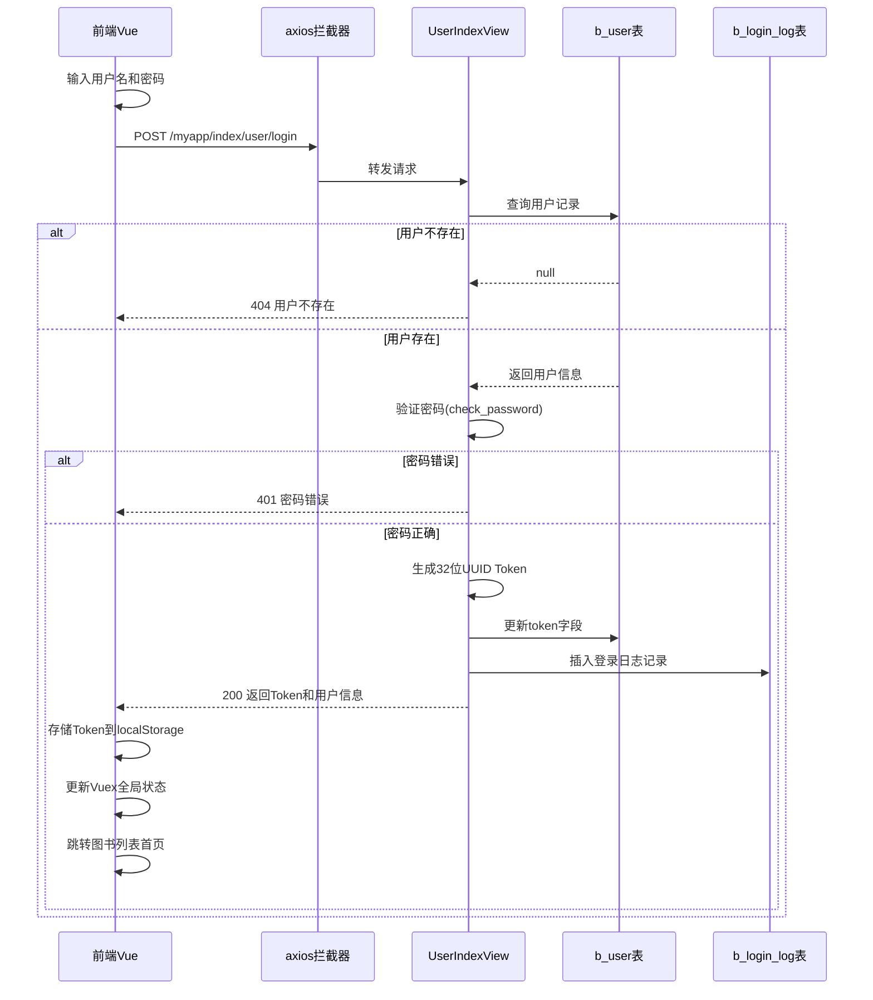
```mermaid
sequenceDiagram
    participant F as 前端Vue
    participant A as axios拦截器
    participant V as UserIndexView
    participant D as b_user表
    participant L as b_login_log表

    F->>F: 输入用户名和密码
    F->>A: POST /myapp/index/user/login
    A->>V: 转发请求
    V->>D: 查询用户记录
    alt 用户不存在
        D-->>V: null
        V-->>F: 404 用户不存在
    else 用户存在
        D-->>V: 返回用户信息
        V->>V: 验证密码(check_password)
        alt 密码错误
            V-->>F: 401 密码错误
        else 密码正确
            V->>V: 生成32位UUID Token
            V->>D: 更新token字段
            V->>L: 插入登录日志记录
            V-->>F: 200 返回Token和用户信息
            F->>F: 存储Token到localStorage
            F->>F: 更新Vuex全局状态
            F->>F: 跳转图书列表首页
        end
    end
```

图4-1 登录功能时序图

### 4.1.2 个人信息修改的实现

用户在前端个人中心页面修改昵称、头像等信息后点击保存，前端调用`updateUserInfoApi`方法向`/myapp/index/user/update`接口发送PUT请求，携带Token和修改后的用户信息。后端通过Token中间件验证用户身份，UserIndexView类中的update方法接收请求，查询b_user表找到对应用户记录。系统使用UserSerializer序列化器验证数据有效性，若验证通过则更新昵称、头像等字段到b_user表。后端返回更新后的用户信息给前端，前端刷新页面显示新信息。个人信息修改时序图如图4-2所示。

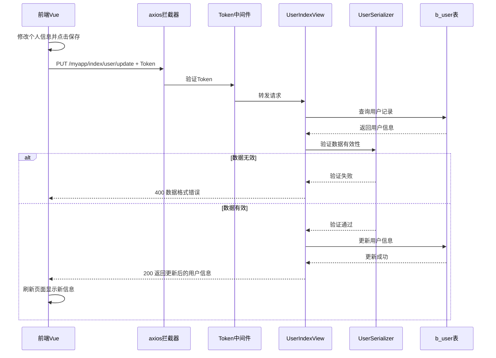
```mermaid
sequenceDiagram
    participant F as 前端Vue
    participant A as axios拦截器
    participant M as Token中间件
    participant V as UserIndexView
    participant S as UserSerializer
    participant D as b_user表

    F->>F: 修改个人信息并点击保存
    F->>A: PUT /myapp/index/user/update + Token
    A->>M: 验证Token
    M->>V: 转发请求
    V->>D: 查询用户记录
    D-->>V: 返回用户信息
    V->>S: 验证数据有效性
    alt 数据无效
        S-->>V: 验证失败
        V-->>F: 400 数据格式错误
    else 数据有效
        S-->>V: 验证通过
        V->>D: 更新用户信息
        D-->>V: 更新成功
        V-->>F: 200 返回更新后的用户信息
        F->>F: 刷新页面显示新信息
    end
```

图4-2 个人信息修改时序图

### 4.1.3 用户账号冻结与解冻的实现

管理员在后台用户管理页面找到需要冻结或解冻的用户，点击对应操作按钮。前端调用`updateUserStatusApi`方法向`/myapp/admin/user/updatestatus`接口发送POST请求，携带adminToken、用户ID和目标状态。后端通过AdminToken中间件验证管理员身份，UserAdminView类中的updateStatus方法接收请求，查询b_user表找到对应用户记录，将status字段从'0'(正常)更新为'1'(冻结)或从'1'更新为'0'。系统向b_op_log表插入操作日志，后端返回成功信息，前端刷新用户列表显示新状态。用户账号冻结与解冻的时序图如图4-3所示。

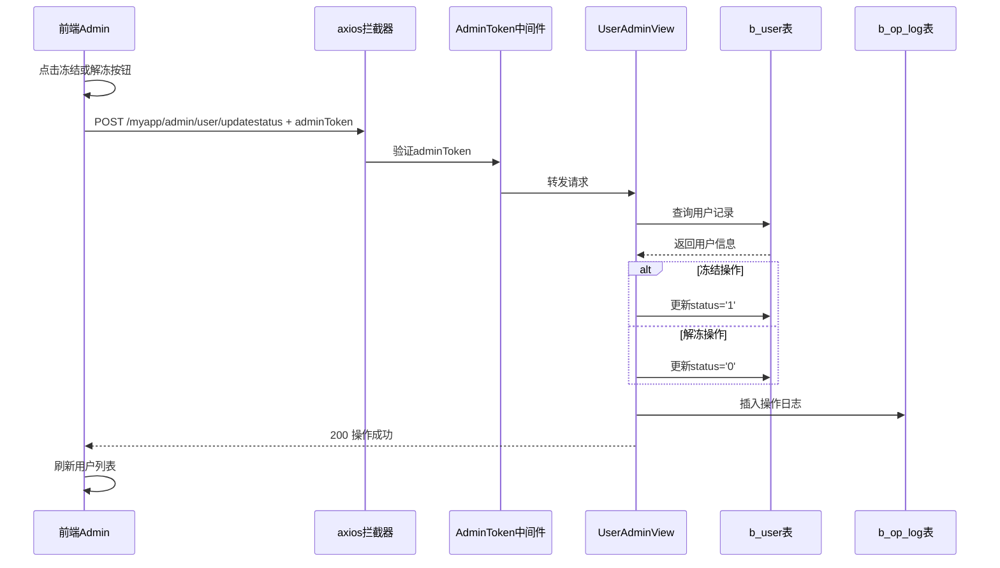
```mermaid
sequenceDiagram
    participant F as 前端Admin
    participant A as axios拦截器
    participant M as AdminToken中间件
    participant V as UserAdminView
    participant D as b_user表
    participant L as b_op_log表

    F->>F: 点击冻结或解冻按钮
    F->>A: POST /myapp/admin/user/updatestatus + adminToken
    A->>M: 验证adminToken
    M->>V: 转发请求
    V->>D: 查询用户记录
    D-->>V: 返回用户信息
    alt 冻结操作
        V->>D: 更新status='1'
    else 解冻操作
        V->>D: 更新status='0'
    end
    V->>L: 插入操作日志
    V-->>F: 200 操作成功
    F->>F: 刷新用户列表
```

图4-3 账号冻结解冻时序图

### 4.1.4 用户账号删除的实现

管理员在后台用户管理页面点击删除按钮，前端弹出确认提示框。确认后，前端调用`deleteUserApi`方法向`/myapp/admin/user/delete`接口发送DELETE请求，携带adminToken和用户ID。后端UserAdminView类中的delete方法接收请求，首先检查该用户是否有未归还的借阅记录，若存在则返回错误提示。若无未归还借阅，系统执行级联删除，依次删除b_comment、b_community_post、b_borrow表中该用户的相关记录，最后删除b_user表中的用户记录。系统向b_op_log表插入操作日志，后端返回成功信息，前端刷新用户列表。账号删除的时序图如图4-4所示。

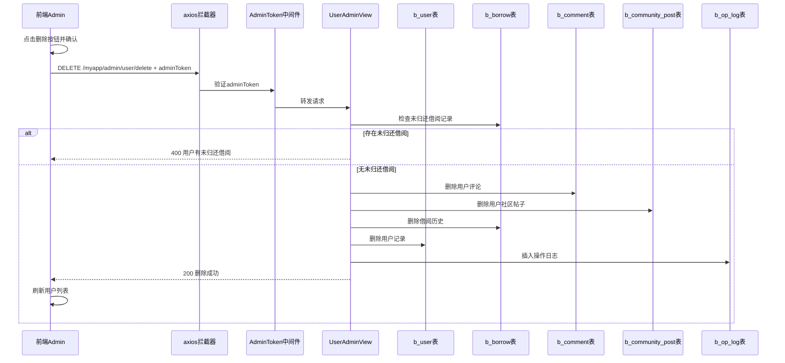
```mermaid
sequenceDiagram
    participant F as 前端Admin
    participant A as axios拦截器
    participant M as AdminToken中间件
    participant V as UserAdminView
    participant D1 as b_user表
    participant D2 as b_borrow表
    participant D3 as b_comment表
    participant D4 as b_community_post表
    participant L as b_op_log表

    F->>F: 点击删除按钮并确认
    F->>A: DELETE /myapp/admin/user/delete + adminToken
    A->>M: 验证adminToken
    M->>V: 转发请求
    V->>D2: 检查未归还借阅记录
    alt 存在未归还借阅
        V-->>F: 400 用户有未归还借阅
    else 无未归还借阅
        V->>D3: 删除用户评论
        V->>D4: 删除用户社区帖子
        V->>D2: 删除借阅历史
        V->>D1: 删除用户记录
        V->>L: 插入操作日志
        V-->>F: 200 删除成功
        F->>F: 刷新用户列表
    end
```

图4-4 账号删除时序图

## 4.2 图书管理模块的实现

### 4.2.1 图书添加的实现

管理员在后台图书管理页面点击"添加图书"按钮，填写图书信息并上传封面图片。前端调用`createBookApi`方法向`/myapp/admin/book/create`接口发送POST请求，携带adminToken和图书信息。后端BookAdminView类中的create方法接收请求，使用BookSerializer序列化器验证数据。若封面图片已上传，系统将图片保存到upload/cover/目录并存储路径。系统将图书信息插入b_book表，字段包括书名、作者、分类ID、ISBN、库存、简介、封面路径等，创建时间自动设置为当前时间。系统向b_op_log表插入操作日志，后端返回成功信息，前端跳转回图书列表页面。图书添加的时序图如图4-5所示。

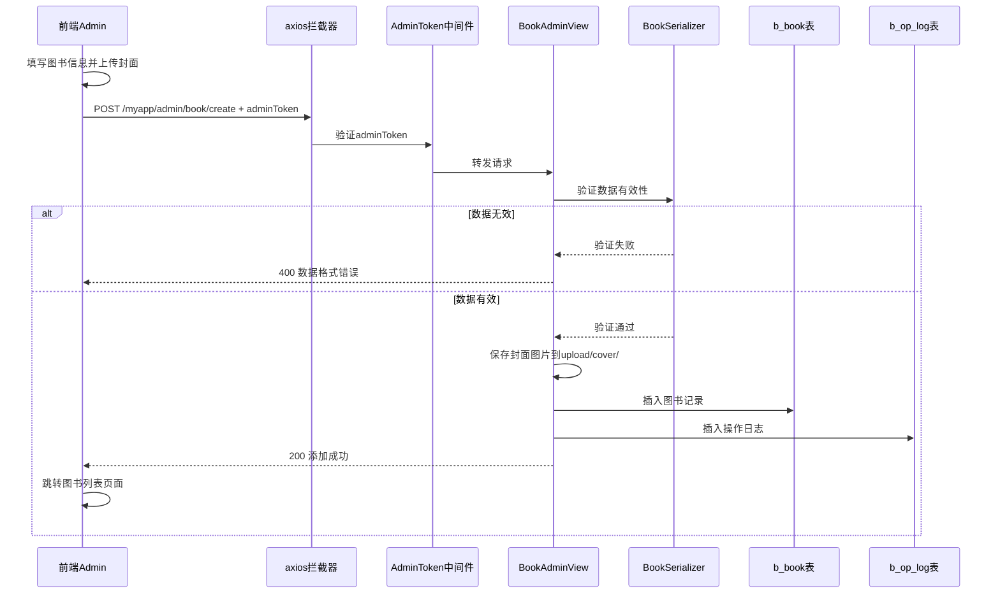
```mermaid
sequenceDiagram
    participant F as 前端Admin
    participant A as axios拦截器
    participant M as AdminToken中间件
    participant V as BookAdminView
    participant S as BookSerializer
    participant D as b_book表
    participant L as b_op_log表

    F->>F: 填写图书信息并上传封面
    F->>A: POST /myapp/admin/book/create + adminToken
    A->>M: 验证adminToken
    M->>V: 转发请求
    V->>S: 验证数据有效性
    alt 数据无效
        S-->>V: 验证失败
        V-->>F: 400 数据格式错误
    else 数据有效
        S-->>V: 验证通过
        V->>V: 保存封面图片到upload/cover/
        V->>D: 插入图书记录
        V->>L: 插入操作日志
        V-->>F: 200 添加成功
        F->>F: 跳转图书列表页面
    end
```

图4-5 图书添加时序图

### 4.2.2 图书搜索的实现

用户在前台图书列表页面的搜索框输入关键词后点击搜索。前端调用`searchBookApi`方法向`/myapp/index/book/list`接口发送GET请求，携带搜索关键词作为参数。后端BookIndexView类中的list方法接收请求，查询b_book表，使用Django的Q对象实现多字段模糊搜索，在书名、作者、简介等字段中查找匹配的图书。系统筛选status='0'(上架)的图书，按创建时间降序排列。查询结果通过BookSerializer序列化，使用Paginator类实现分页，默认每页显示12本图书。后端返回图书列表和总记录数，前端渲染图书卡片显示搜索结果。图书搜索的时序图如图4-6所示。

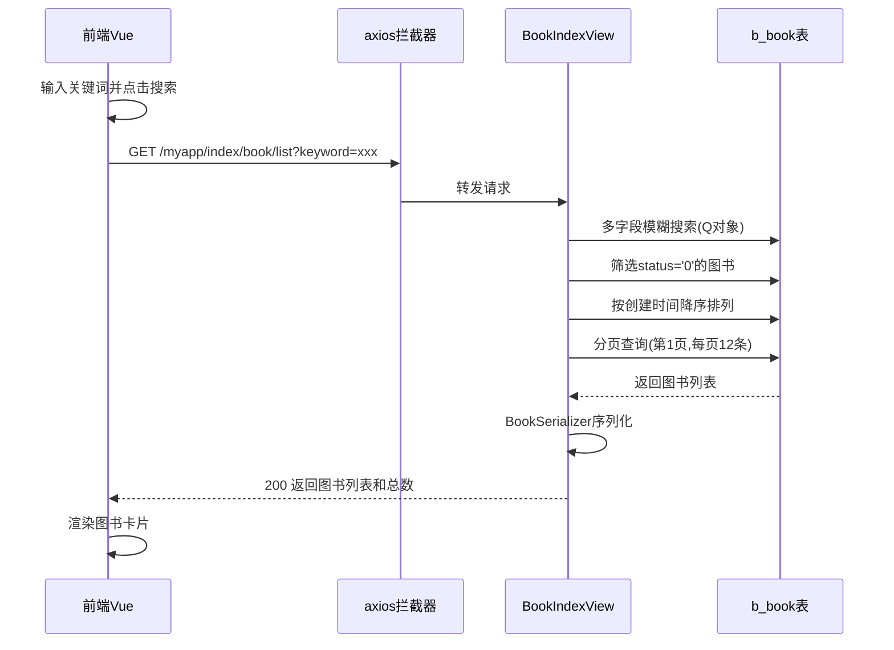
```mermaid
sequenceDiagram
    participant F as 前端Vue
    participant A as axios拦截器
    participant V as BookIndexView
    participant D as b_book表

    F->>F: 输入关键词并点击搜索
    F->>A: GET /myapp/index/book/list?keyword=xxx
    A->>V: 转发请求
    V->>D: 多字段模糊搜索(Q对象)
    V->>D: 筛选status='0'的图书
    V->>D: 按创建时间降序排列
    V->>D: 分页查询(第1页,每页12条)
    D-->>V: 返回图书列表
    V->>V: BookSerializer序列化
    V-->>F: 200 返回图书列表和总数
    F->>F: 渲染图书卡片
```

图4-6 图书搜索时序图

### 4.2.3 图书信息更新的实现

管理员在后台图书管理页面找到需要修改的图书，点击编辑按钮进入编辑页面。修改图书信息后点击保存，前端调用`updateBookApi`方法向`/myapp/admin/book/update`接口发送PUT请求，携带adminToken和修改后的图书信息。后端BookAdminView类中的update方法接收请求，查询b_book表找到对应图书记录。使用BookSerializer序列化器验证数据，若验证通过则更新书名、作者、分类、库存、简介等字段。若上传了新封面，系统删除旧封面文件并保存新封面到upload/cover/目录。系统向b_op_log表插入操作日志，后端返回更新后的图书信息，前端跳转回图书列表页面。图书信息更新时序图如图4-7所示。

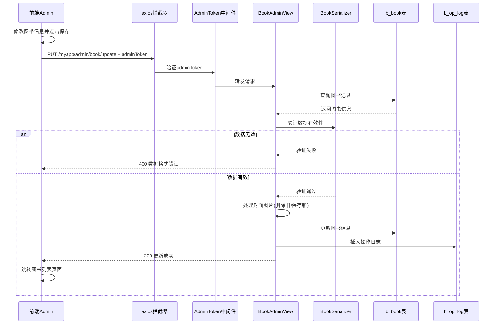
```mermaid
sequenceDiagram
    participant F as 前端Admin
    participant A as axios拦截器
    participant M as AdminToken中间件
    participant V as BookAdminView
    participant S as BookSerializer
    participant D as b_book表
    participant L as b_op_log表

    F->>F: 修改图书信息并点击保存
    F->>A: PUT /myapp/admin/book/update + adminToken
    A->>M: 验证adminToken
    M->>V: 转发请求
    V->>D: 查询图书记录
    D-->>V: 返回图书信息
    V->>S: 验证数据有效性
    alt 数据无效
        S-->>V: 验证失败
        V-->>F: 400 数据格式错误
    else 数据有效
        S-->>V: 验证通过
        V->>V: 处理封面图片(删除旧/保存新)
        V->>D: 更新图书信息
        V->>L: 插入操作日志
        V-->>F: 200 更新成功
        F->>F: 跳转图书列表页面
    end
```

图4-7 图书信息更新时序图

### 4.2.4 图书删除的实现

管理员在后台图书管理页面点击删除按钮，前端弹出确认提示框。确认后，前端调用`deleteBookApi`方法向`/myapp/admin/book/delete`接口发送DELETE请求，携带adminToken和图书ID。后端BookAdminView类中的delete方法接收请求，首先查询b_borrow表检查该图书是否有未归还的借阅记录。若存在未归还借阅，返回错误提示。若无未归还借阅，系统执行级联删除，依次删除b_comment表中的图书评论、b_borrow表中的借阅历史，最后删除b_book表中的图书记录。系统向b_op_log表插入操作日志，后端返回成功信息，前端刷新图书列表。图书删除的时序图如图4-8所示。

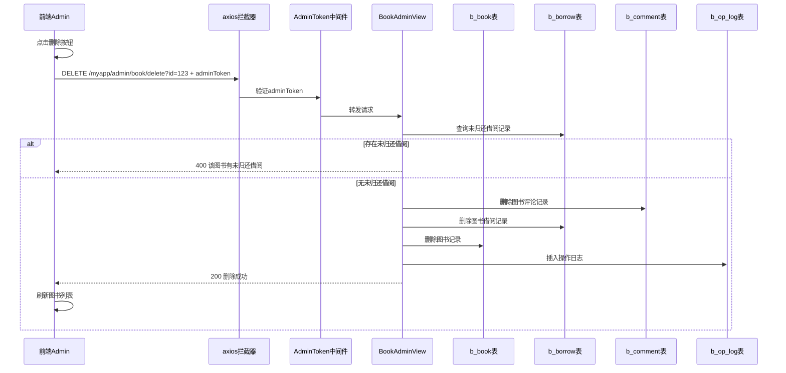
```mermaid
sequenceDiagram
    participant F as 前端Admin
    participant A as axios拦截器
    participant M as AdminToken中间件
    participant V as BookAdminView
    participant D1 as b_book表
    participant D2 as b_borrow表
    participant D3 as b_comment表
    participant L as b_op_log表

    F->>F: 点击删除按钮
    F->>A: DELETE /myapp/admin/book/delete?id=123 + adminToken
    A->>M: 验证adminToken
    M->>V: 转发请求
    V->>D2: 查询未归还借阅记录
    alt 存在未归还借阅
        V-->>F: 400 该图书有未归还借阅
    else 无未归还借阅
        V->>D3: 删除图书评论记录
        V->>D2: 删除图书借阅记录
        V->>D1: 删除图书记录
        V->>L: 插入操作日志
        V-->>F: 200 删除成功
        F->>F: 刷新图书列表
    end
```

图4-8 图书删除时序图

### 4.2.5 图书上下架的实现

管理员在后台图书管理页面点击上架或下架按钮。前端调用`updateBookStatusApi`方法向`/myapp/admin/book/updatestatus`接口发送POST请求，携带adminToken、图书ID和目标状态。后端BookAdminView类中的updateStatus方法接收请求，查询b_book表找到对应图书记录，将status字段从'0'(上架)更新为'1'(下架)或从'1'更新为'0'。下架的图书在前台用户端不会显示，用户无法借阅。系统向b_op_log表插入操作日志，后端返回成功信息，前端刷新图书列表显示新状态。图书上下架的时序图如图4-9所示。

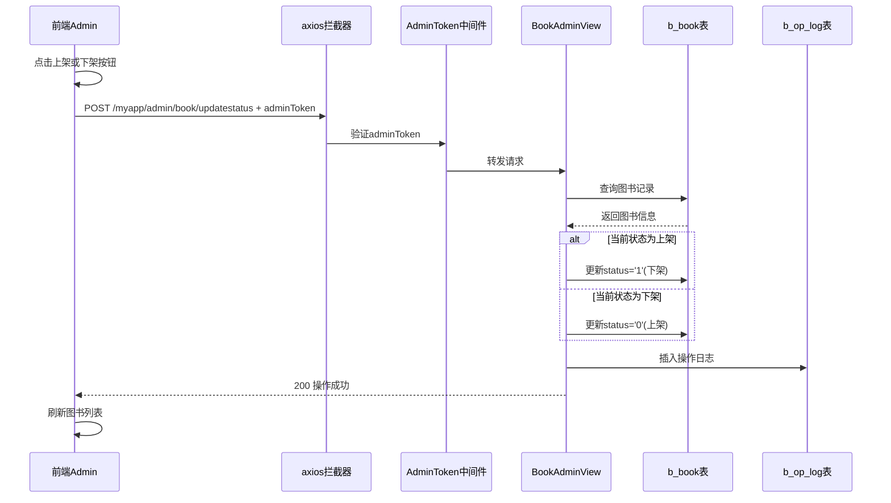
```mermaid
sequenceDiagram
    participant F as 前端Admin
    participant A as axios拦截器
    participant M as AdminToken中间件
    participant V as BookAdminView
    participant D as b_book表
    participant L as b_op_log表

    F->>F: 点击上架或下架按钮
    F->>A: POST /myapp/admin/book/updatestatus + adminToken
    A->>M: 验证adminToken
    M->>V: 转发请求
    V->>D: 查询图书记录
    D-->>V: 返回图书信息
    alt 当前状态为上架
        V->>D: 更新status='1'(下架)
    else 当前状态为下架
        V->>D: 更新status='0'(上架)
    end
    V->>L: 插入操作日志
    V-->>F: 200 操作成功
    F->>F: 刷新图书列表
```

图4-9 图书上下架时序图

## 4.3 分类管理模块的实现

### 4.3.1 分类查询的实现

用户在前台首页或图书列表页面查看图书分类菜单。前端调用`listClassificationApi`方法向`/myapp/index/classification/list`接口发送GET请求。后端ClassificationIndexView类中的list方法接收请求，查询b_classification表获取所有分类记录。系统使用ClassificationSerializer序列化，包含分类ID、标题、父分类ID等字段。后端返回分类列表，前端根据pid字段构建树形结构菜单。分类查询的时序图如图4-10所示。

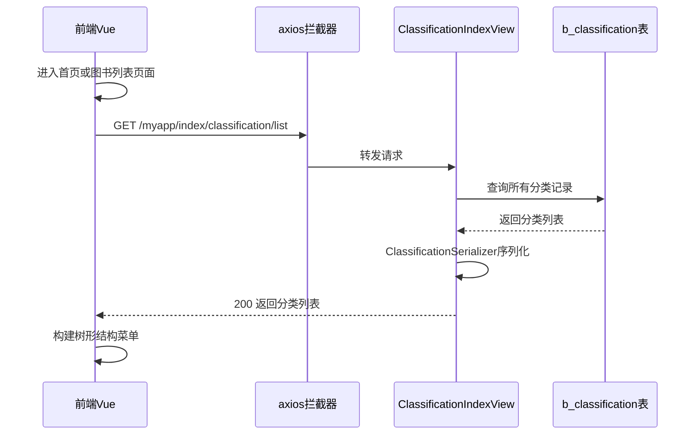
```mermaid
sequenceDiagram
    participant F as 前端Vue
    participant A as axios拦截器
    participant V as ClassificationIndexView
    participant D as b_classification表

    F->>F: 进入首页或图书列表页面
    F->>A: GET /myapp/index/classification/list
    A->>V: 转发请求
    V->>D: 查询所有分类记录
    D-->>V: 返回分类列表
    V->>V: ClassificationSerializer序列化
    V-->>F: 200 返回分类列表
    F->>F: 构建树形结构菜单
```

图4-10 分类查询时序图

### 4.3.2 分类添加的实现

管理员在后台分类管理页面点击"添加分类"按钮，填写分类标题并选择父分类。前端调用`createClassificationApi`方法向`/myapp/admin/classification/create`接口发送POST请求，携带adminToken和分类信息。后端ClassificationAdminView类中的create方法接收请求，使用ClassificationSerializer序列化器验证数据。若为一级分类则pid设为null，若为二级分类则设置对应的pid值。系统将分类信息插入b_classification表，自动设置创建时间。系统向b_op_log表插入操作日志，后端返回成功信息，前端刷新分类列表。分类添加的时序图如图4-11所示。

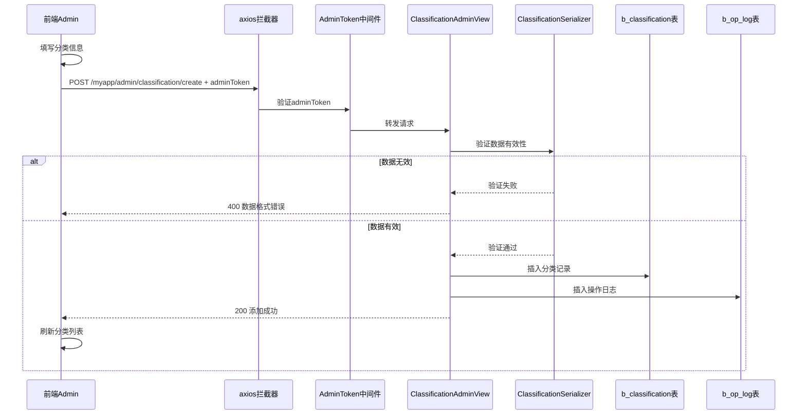
```mermaid
sequenceDiagram
    participant F as 前端Admin
    participant A as axios拦截器
    participant M as AdminToken中间件
    participant V as ClassificationAdminView
    participant S as ClassificationSerializer
    participant D as b_classification表
    participant L as b_op_log表

    F->>F: 填写分类信息
    F->>A: POST /myapp/admin/classification/create + adminToken
    A->>M: 验证adminToken
    M->>V: 转发请求
    V->>S: 验证数据有效性
    alt 数据无效
        S-->>V: 验证失败
        V-->>F: 400 数据格式错误
    else 数据有效
        S-->>V: 验证通过
        V->>D: 插入分类记录
        V->>L: 插入操作日志
        V-->>F: 200 添加成功
        F->>F: 刷新分类列表
    end
```

图4-11 分类添加时序图

### 4.3.3 分类修改的实现

管理员在后台分类管理页面点击编辑按钮，修改分类标题后点击保存。前端调用`updateClassificationApi`方法向`/myapp/admin/classification/update`接口发送PUT请求，携带adminToken和修改后的分类信息。后端ClassificationAdminView类中的update方法接收请求，查询b_classification表找到对应分类记录。使用ClassificationSerializer序列化器验证数据，若验证通过则更新标题等字段。系统向b_op_log表插入操作日志，后端返回更新后的分类信息，前端刷新分类列表。分类修改的时序图如图4-12所示。

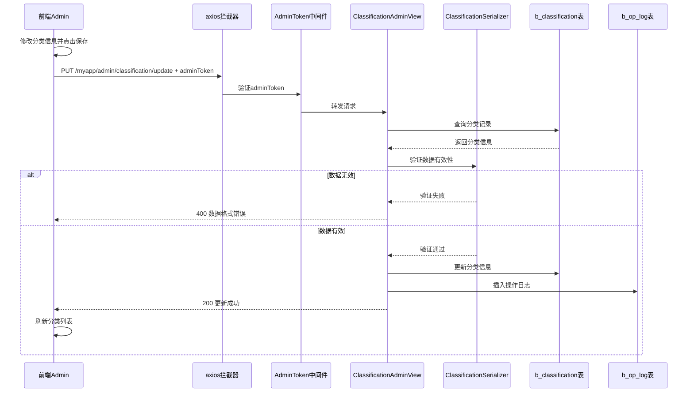
```mermaid
sequenceDiagram
    participant F as 前端Admin
    participant A as axios拦截器
    participant M as AdminToken中间件
    participant V as ClassificationAdminView
    participant S as ClassificationSerializer
    participant D as b_classification表
    participant L as b_op_log表

    F->>F: 修改分类信息并点击保存
    F->>A: PUT /myapp/admin/classification/update + adminToken
    A->>M: 验证adminToken
    M->>V: 转发请求
    V->>D: 查询分类记录
    D-->>V: 返回分类信息
    V->>S: 验证数据有效性
    alt 数据无效
        S-->>V: 验证失败
        V-->>F: 400 数据格式错误
    else 数据有效
        S-->>V: 验证通过
        V->>D: 更新分类信息
        V->>L: 插入操作日志
        V-->>F: 200 更新成功
        F->>F: 刷新分类列表
    end
```

图4-12 分类修改时序图

### 4.3.4 分类删除的实现

管理员在后台分类管理页面点击删除按钮，前端弹出确认提示框。确认后，前端调用`deleteClassificationApi`方法向`/myapp/admin/classification/delete`接口发送DELETE请求，携带adminToken和分类ID。后端ClassificationAdminView类中的delete方法接收请求，首先检查该分类是否被图书引用，查询b_book表中classification_id等于该分类ID的图书数量。若存在关联图书，返回错误提示。若无关联，系统还需检查是否有子分类。若均无关联，系统删除b_classification表中的分类记录。系统向b_op_log表插入操作日志，后端返回成功信息,前端刷新分类列表。分类删除的时序图如图4-13所示。

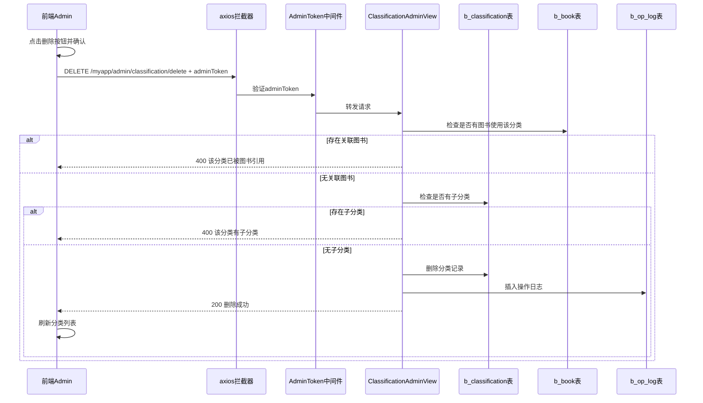
```mermaid
sequenceDiagram
    participant F as 前端Admin
    participant A as axios拦截器
    participant M as AdminToken中间件
    participant V as ClassificationAdminView
    participant D1 as b_classification表
    participant D2 as b_book表
    participant L as b_op_log表

    F->>F: 点击删除按钮并确认
    F->>A: DELETE /myapp/admin/classification/delete + adminToken
    A->>M: 验证adminToken
    M->>V: 转发请求
    V->>D2: 检查是否有图书使用该分类
    alt 存在关联图书
        V-->>F: 400 该分类已被图书引用
    else 无关联图书
        V->>D1: 检查是否有子分类
        alt 存在子分类
            V-->>F: 400 该分类有子分类
        else 无子分类
            V->>D1: 删除分类记录
            V->>L: 插入操作日志
            V-->>F: 200 删除成功
            F->>F: 刷新分类列表
        end
    end
```

图4-13 分类删除时序图

## 4.4 借阅管理模块的实现

### 4.4.1 借书功能的实现

用户在图书详情页面点击"借阅"按钮。前端调用`borrowBookApi`方法向`/myapp/index/borrow/create`接口发送POST请求，携带Token、图书ID和借阅天数。后端BorrowIndexView类中的create方法接收请求，通过Token中间件获取用户ID，查询b_user表验证用户状态是否为正常。系统检查用户是否有该图书的未归还借阅记录，检查图书库存是否充足。若检查通过，系统在b_borrow表插入借阅记录，字段包括user_id、book_id、borrow_time(当前时间)、return_time(预计归还时间，根据借阅天数计算)、status='1'(借出中)。同时更新b_book表的库存字段减1。系统返回成功信息，前端显示借阅成功提示。借书功能的时序图如图4-14所示。

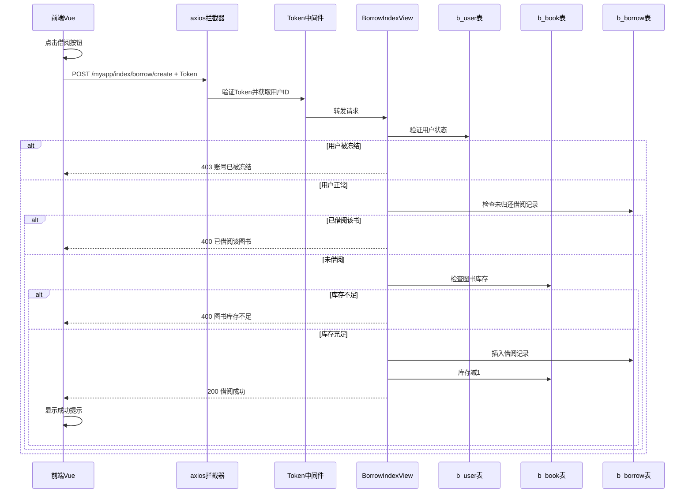
```mermaid
sequenceDiagram
    participant F as 前端Vue
    participant A as axios拦截器
    participant M as Token中间件
    participant V as BorrowIndexView
    participant D1 as b_user表
    participant D2 as b_book表
    participant D3 as b_borrow表

    F->>F: 点击借阅按钮
    F->>A: POST /myapp/index/borrow/create + Token
    A->>M: 验证Token并获取用户ID
    M->>V: 转发请求
    V->>D1: 验证用户状态
    alt 用户被冻结
        V-->>F: 403 账号已被冻结
    else 用户正常
        V->>D3: 检查未归还借阅记录
        alt 已借阅该书
            V-->>F: 400 已借阅该图书
        else 未借阅
            V->>D2: 检查图书库存
            alt 库存不足
                V-->>F: 400 图书库存不足
            else 库存充足
                V->>D3: 插入借阅记录
                V->>D2: 库存减1
                V-->>F: 200 借阅成功
                F->>F: 显示成功提示
            end
        end
    end
```

图4-14 借书功能时序图

### 4.4.2 还书功能的实现

用户在个人中心的借阅记录页面找到需要归还的图书，点击"归还"按钮。前端调用`returnBookApi`方法向`/myapp/index/borrow/return`接口发送PUT请求，携带Token和借阅记录ID。后端BorrowIndexView类中的returnBook方法接收请求，查询b_borrow表找到对应借阅记录。系统检查借阅记录的status字段是否为'1'(借出中)，若已归还则返回错误提示。若未归还，系统更新status='2'(已归还)，记录实际归还时间为当前时间。系统检查是否逾期，若实际归还时间超过预计归还时间则标记为逾期。同时更新b_book表的库存字段加1。系统返回成功信息，前端刷新借阅记录列表。还书功能的时序图如图4-15所示。

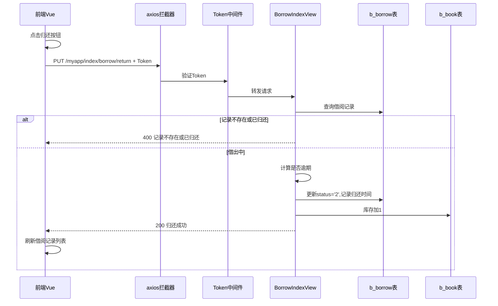
```mermaid
sequenceDiagram
    participant F as 前端Vue
    participant A as axios拦截器
    participant M as Token中间件
    participant V as BorrowIndexView
    participant D1 as b_borrow表
    participant D2 as b_book表

    F->>F: 点击归还按钮
    F->>A: PUT /myapp/index/borrow/return + Token
    A->>M: 验证Token
    M->>V: 转发请求
    V->>D1: 查询借阅记录
    alt 记录不存在或已归还
        V-->>F: 400 记录不存在或已归还
    else 借出中
        V->>V: 计算是否逾期
        V->>D1: 更新status='2',记录归还时间
        V->>D2: 库存加1
        V-->>F: 200 归还成功
        F->>F: 刷新借阅记录列表
    end
```

图4-15 还书功能时序图

### 4.4.3 借阅记录查询的实现

用户在个人中心点击"我的借阅"选项卡。前端调用`listBorrowApi`方法向`/myapp/index/borrow/list`接口发送GET请求，携带Token。后端BorrowIndexView类中的list方法接收请求，通过Token中间件获取用户ID，查询b_borrow表筛选user_id等于该用户ID的所有借阅记录。系统通过Django的select_related方法关联查询b_book和b_user表，获取图书标题、封面和用户名等信息。查询结果按借阅时间降序排列，使用BorrowSerializer序列化。后端返回借阅记录列表和总数，前端渲染表格显示图书信息、借阅时间、预计归还时间、状态等列。借阅记录查询的时序图如图4-16所示。

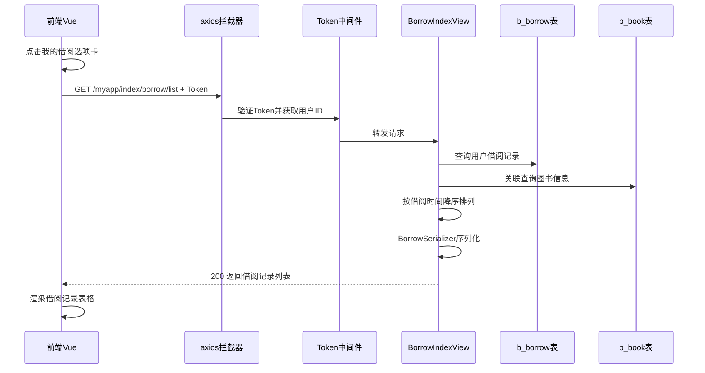
```mermaid
sequenceDiagram
    participant F as 前端Vue
    participant A as axios拦截器
    participant M as Token中间件
    participant V as BorrowIndexView
    participant D1 as b_borrow表
    participant D2 as b_book表

    F->>F: 点击我的借阅选项卡
    F->>A: GET /myapp/index/borrow/list + Token
    A->>M: 验证Token并获取用户ID
    M->>V: 转发请求
    V->>D1: 查询用户借阅记录
    V->>D2: 关联查询图书信息
    V->>V: 按借阅时间降序排列
    V->>V: BorrowSerializer序列化
    V-->>F: 200 返回借阅记录列表
    F->>F: 渲染借阅记录表格
```

图4-16 借阅记录查询时序图

### 4.4.4 订单筛选的实现

管理员在后台借阅管理页面可以按多种条件筛选借阅订单。前端调用`filterBorrowApi`方法向`/myapp/admin/borrow/list`接口发送GET请求，携带adminToken和筛选条件(如用户名、图书名、借阅状态、时间范围等)。后端BorrowAdminView类中的list方法接收请求，查询b_borrow表。系统使用Django的Q对象构建复杂查询条件，支持按用户名模糊匹配、按图书名模糊匹配、按status精确匹配、按时间范围筛选。查询结果按借阅时间降序排列，使用Paginator类实现分页。后端返回借阅订单列表和总数，前端渲染表格显示筛选结果。订单筛选的时序图如图4-17所示。

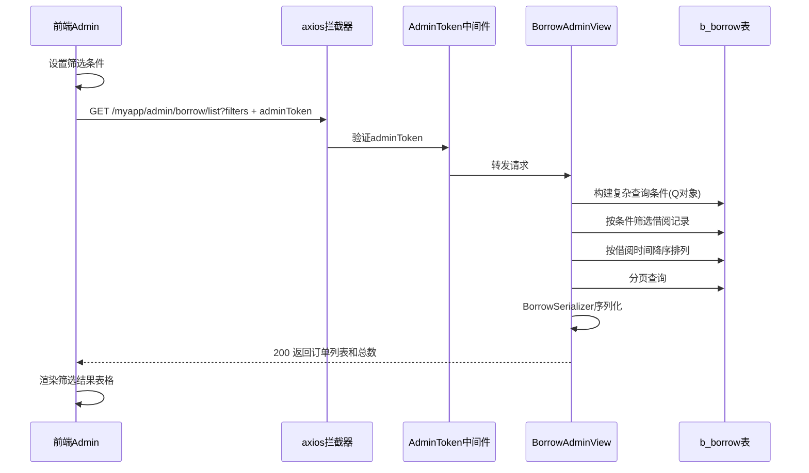
```mermaid
sequenceDiagram
    participant F as 前端Admin
    participant A as axios拦截器
    participant M as AdminToken中间件
    participant V as BorrowAdminView
    participant D as b_borrow表

    F->>F: 设置筛选条件
    F->>A: GET /myapp/admin/borrow/list?filters + adminToken
    A->>M: 验证adminToken
    M->>V: 转发请求
    V->>D: 构建复杂查询条件(Q对象)
    V->>D: 按条件筛选借阅记录
    V->>D: 按借阅时间降序排列
    V->>D: 分页查询
    V->>V: BorrowSerializer序列化
    V-->>F: 200 返回订单列表和总数
    F->>F: 渲染筛选结果表格
```

图4-17 订单筛选时序图

## 4.5 社区互动模块的实现

### 4.5.1 发表评论的实现

用户在图书详情页面的评论区填写评论内容和评分后点击发表。前端调用`createCommentApi`方法向`/myapp/index/comment/create`接口发送POST请求，携带Token、图书ID、评论内容和评分。后端CommentIndexView类中的create方法接收请求，通过Token中间件获取用户ID。系统使用CommentSerializer序列化器验证数据，检查评论内容不为空、评分在1-5之间。若验证通过，系统在b_comment表插入评论记录，字段包括user_id、book_id、content、rate、create_time(当前时间)。系统返回成功信息，前端刷新评论列表显示新评论。发表评论的时序图如图4-18所示。

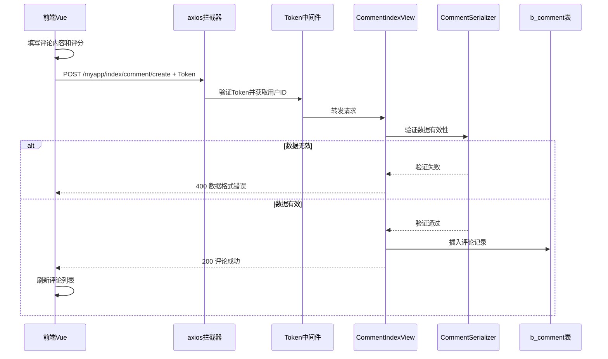
```mermaid
sequenceDiagram
    participant F as 前端Vue
    participant A as axios拦截器
    participant M as Token中间件
    participant V as CommentIndexView
    participant S as CommentSerializer
    participant D as b_comment表

    F->>F: 填写评论内容和评分
    F->>A: POST /myapp/index/comment/create + Token
    A->>M: 验证Token并获取用户ID
    M->>V: 转发请求
    V->>S: 验证数据有效性
    alt 数据无效
        S-->>V: 验证失败
        V-->>F: 400 数据格式错误
    else 数据有效
        S-->>V: 验证通过
        V->>D: 插入评论记录
        V-->>F: 200 评论成功
        F->>F: 刷新评论列表
    end
```

图4-18 发表评论时序图

### 4.5.2 评论列表查询的实现

用户在图书详情页面查看评论列表。前端调用`listCommentApi`方法向`/myapp/index/comment/list`接口发送GET请求，携带图书ID。后端CommentIndexView类中的list方法接收请求，查询b_comment表筛选book_id等于该图书ID的所有评论。系统通过select_related方法关联查询b_user表，获取评论者的用户名和头像。查询结果按创建时间降序排列(最新评论优先)，使用CommentSerializer序列化。后端返回评论列表，前端渲染评论卡片显示用户名、头像、评论内容、评分、发表时间等信息。评论列表查询的时序图如图4-19所示。

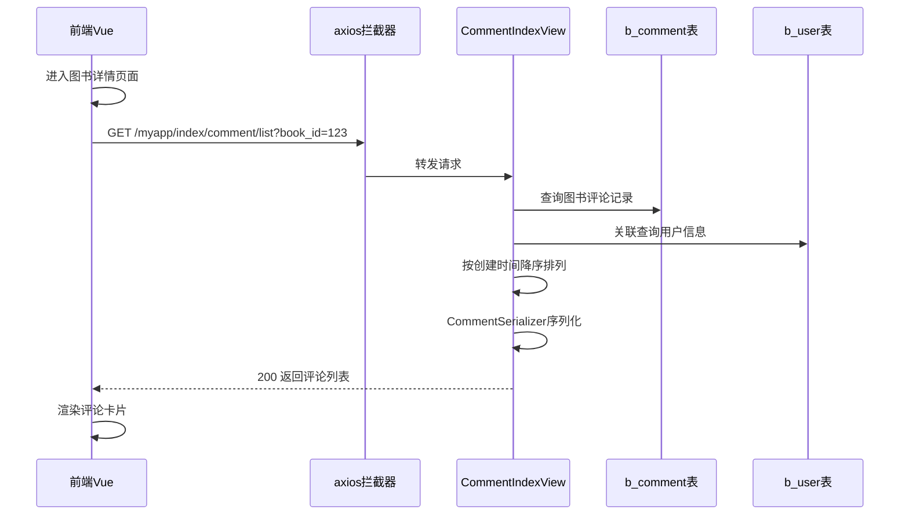
```mermaid
sequenceDiagram
    participant F as 前端Vue
    participant A as axios拦截器
    participant V as CommentIndexView
    participant D1 as b_comment表
    participant D2 as b_user表

    F->>F: 进入图书详情页面
    F->>A: GET /myapp/index/comment/list?book_id=123
    A->>V: 转发请求
    V->>D1: 查询图书评论记录
    V->>D2: 关联查询用户信息
    V->>V: 按创建时间降序排列
    V->>V: CommentSerializer序列化
    V-->>F: 200 返回评论列表
    F->>F: 渲染评论卡片
```

图4-19 评论列表查询时序图

### 4.5.3 评论点赞的实现

用户在评论列表中点击某条评论的点赞按钮。前端调用`likeCommentApi`方法向`/myapp/index/comment/like`接口发送POST请求，携带Token和评论ID。后端CommentIndexView类中的like方法接收请求,查询b_comment表找到对应评论记录。系统将该评论的like_count字段加1。系统返回成功信息和新的点赞数，前端更新点赞数显示。评论点赞的时序图如图4-20所示。

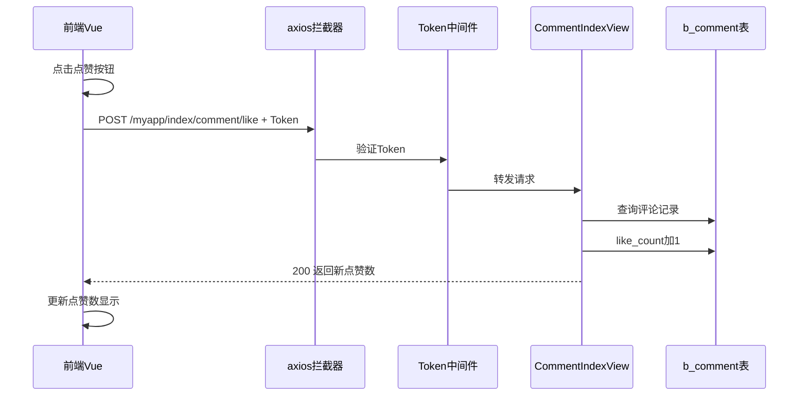
```mermaid
sequenceDiagram
    participant F as 前端Vue
    participant A as axios拦截器
    participant M as Token中间件
    participant V as CommentIndexView
    participant D as b_comment表

    F->>F: 点击点赞按钮
    F->>A: POST /myapp/index/comment/like + Token
    A->>M: 验证Token
    M->>V: 转发请求
    V->>D: 查询评论记录
    V->>D: like_count加1
    V-->>F: 200 返回新点赞数
    F->>F: 更新点赞数显示
```

图4-20 评论点赞时序图

### 4.5.4 发布社区帖子的实现

用户在社区页面点击"发帖"按钮，填写帖子标题和内容后点击发布。前端调用`createPostApi`方法向`/myapp/index/community/create`接口发送POST请求，携带Token、标题和内容。后端CommunityIndexView类中的create方法接收请求，通过Token中间件获取用户ID。系统使用CommunityPostSerializer序列化器验证数据，检查标题和内容不为空。若验证通过，系统在b_community_post表插入帖子记录，字段包括user_id、title、content、create_time(当前时间)、view_count初始化为0。系统返回成功信息，前端跳转到帖子详情页面。发布社区帖子的时序图如图4-21所示。

```mermaid
sequenceDiagram
    participant F as 前端Vue
    participant A as axios拦截器
    participant M as Token中间件
    participant V as CommunityIndexView
    participant S as CommunityPostSerializer
    participant D as b_community_post表

    F->>F: 填写标题和内容
    F->>A: POST /myapp/index/community/create + Token
    A->>M: 验证Token并获取用户ID
    M->>V: 转发请求
    V->>S: 验证数据有效性
    alt 数据无效
        S-->>V: 验证失败
        V-->>F: 400 数据格式错误
    else 数据有效
        S-->>V: 验证通过
        V->>D: 插入帖子记录
        V-->>F: 200 发布成功
        F->>F: 跳转帖子详情页面
    end
```

图4-21 发布社区帖子时序图

### 4.5.5 社区帖子列表查询的实现

用户进入社区页面查看帖子列表。前端调用`listPostApi`方法向`/myapp/index/community/list`接口发送GET请求。后端CommunityIndexView类中的list方法接收请求，查询b_community_post表获取所有帖子。系统通过select_related方法关联查询b_user表，获取发帖用户的用户名和头像。查询结果按创建时间降序排列(最新帖子优先)，使用Paginator类实现分页，默认每页显示15条帖子。使用CommunityPostSerializer序列化，后端返回帖子列表和总数，前端渲染帖子卡片显示标题、作者、发布时间、浏览量等信息。社区帖子列表查询的时序图如图4-22所示。

```mermaid
sequenceDiagram
    participant F as 前端Vue
    participant A as axios拦截器
    participant V as CommunityIndexView
    participant D1 as b_community_post表
    participant D2 as b_user表

    F->>F: 进入社区页面
    F->>A: GET /myapp/index/community/list
    A->>V: 转发请求
    V->>D1: 查询所有帖子
    V->>D2: 关联查询用户信息
    V->>V: 按创建时间降序排列
    V->>V: 分页查询(每页15条)
    V->>V: CommunityPostSerializer序列化
    V-->>F: 200 返回帖子列表和总数
    F->>F: 渲染帖子卡片
```

图4-22 社区帖子列表查询时序图

### 4.5.6 社区帖子详情查看的实现

用户在社区列表中点击某个帖子标题。前端调用`getPostDetailApi`方法向`/myapp/index/community/detail`接口发送GET请求，携带帖子ID。后端CommunityIndexView类中的detail方法接收请求，查询b_community_post表找到对应帖子记录。系统将该帖子的view_count字段加1，记录浏览次数。系统通过select_related方法关联查询b_user表，获取发帖用户的详细信息。使用CommunityPostSerializer序列化，后端返回帖子详情，前端渲染详情页面显示完整标题、内容、作者信息、发布时间、浏览量等。社区帖子详情查看的时序图如图4-23所示。

```mermaid
sequenceDiagram
    participant F as 前端Vue
    participant A as axios拦截器
    participant V as CommunityIndexView
    participant D1 as b_community_post表
    participant D2 as b_user表

    F->>F: 点击帖子标题
    F->>A: GET /myapp/index/community/detail?id=123
    A->>V: 转发请求
    V->>D1: 查询帖子记录
    V->>D1: view_count加1
    V->>D2: 关联查询用户信息
    V->>V: CommunityPostSerializer序列化
    V-->>F: 200 返回帖子详情
    F->>F: 渲染详情页面
```

图4-23 社区帖子详情查看时序图

## 4.6 通知管理模块的实现

### 4.6.1 发布通知的实现

管理员在后台通知管理页面点击"发布通知"按钮，填写通知标题和内容。前端调用`createNoticeApi`方法向`/myapp/admin/notice/create`接口发送POST请求，携带adminToken、标题和内容。后端NoticeAdminView类中的create方法接收请求，使用NoticeSerializer序列化器验证数据。若验证通过，系统在b_notice表插入通知记录，字段包括title、content、create_time(当前时间)。系统向b_op_log表插入操作日志，后端返回成功信息，前端跳转回通知列表页面。发布通知的时序图如图4-24所示。

```mermaid
sequenceDiagram
    participant F as 前端Admin
    participant A as axios拦截器
    participant M as AdminToken中间件
    participant V as NoticeAdminView
    participant S as NoticeSerializer
    participant D as b_notice表
    participant L as b_op_log表

    F->>F: 填写通知标题和内容
    F->>A: POST /myapp/admin/notice/create + adminToken
    A->>M: 验证adminToken
    M->>V: 转发请求
    V->>S: 验证数据有效性
    alt 数据无效
        S-->>V: 验证失败
        V-->>F: 400 数据格式错误
    else 数据有效
        S-->>V: 验证通过
        V->>D: 插入通知记录
        V->>L: 插入操作日志
        V-->>F: 200 发布成功
        F->>F: 跳转通知列表页面
    end
```

图4-24 发布通知时序图

### 4.6.2 通知查询的实现

用户在前台首页或通知中心查看系统通知。前端调用`listNoticeApi`方法向`/myapp/index/notice/list`接口发送GET请求。后端NoticeIndexView类中的list方法接收请求，查询b_notice表获取所有通知记录。查询结果按创建时间降序排列(最新通知优先)，使用NoticeSerializer序列化。后端返回通知列表，前端渲染通知卡片显示标题、内容、发布时间等信息。通知查询的时序图如图4-25所示。

```mermaid
sequenceDiagram
    participant F as 前端Vue
    participant A as axios拦截器
    participant V as NoticeIndexView
    participant D as b_notice表

    F->>F: 进入通知中心
    F->>A: GET /myapp/index/notice/list
    A->>V: 转发请求
    V->>D: 查询所有通知
    V->>V: 按创建时间降序排列
    V->>V: NoticeSerializer序列化
    V-->>F: 200 返回通知列表
    F->>F: 渲染通知卡片
```

图4-25 通知查询时序图

## 4.7 日志管理模块的实现

### 4.7.1 登录日志记录的实现

当用户或管理员登录系统时，后端自动记录登录日志。在UserIndexView类或AdminLoginView类的login方法中，验证用户身份成功后，系统从request.META中提取REMOTE_ADDR获取客户端IP地址，提取HTTP_USER_AGENT获取浏览器信息。系统创建LoginLog记录并保存到b_login_log表，字段包括username、log_ip、log_agent、log_time(当前时间)。这个过程自动执行，为系统提供完整的登录审计记录。登录日志记录的时序图如图4-26所示。

```mermaid
sequenceDiagram
    participant U as 用户/管理员
    participant V as UserIndexView/AdminLoginView
    participant R as Django Request对象
    participant L as b_login_log表

    U->>V: 发送登录请求(用户名/密码)
    V->>V: 验证用户身份
    alt 身份验证成功
        V->>R: 提取request.META数据
        V->>V: 获取REMOTE_ADDR(客户端IP)
        V->>V: 获取HTTP_USER_AGENT(浏览器信息)
        V->>V: 设置当前时间为log_time
        V->>L: 创建LoginLog记录
        L-->>V: 保存成功
        V-->>U: 200 登录成功,返回Token
    else 身份验证失败
        V-->>U: 401 验证失败
    end
```

图4-26 登录日志记录时序图

### 4.7.2 操作日志记录的实现

系统通过LogMiddleware中间件自动拦截所有HTTP请求记录操作日志。中间件在接收到请求时记录开始时间，从request对象提取re_ip(客户端IP)、re_url(请求URL路径)、re_method(HTTP方法)。请求处理完成后，中间件计算处理耗时(当前时间减去开始时间，单位毫秒)，创建OpLog记录并保存到b_op_log表，字段包括re_ip、re_url、re_method、re_time(请求时间)、access_time(处理耗时)。这个过程对所有请求自动执行，为系统提供详细的操作记录。操作日志记录的时序图如图4-27所示。

```mermaid
sequenceDiagram
    participant R as HTTP请求
    participant M as LogMiddleware中间件
    participant H as View处理器
    participant L as b_op_log表

    R->>M: 请求到达中间件
    M->>M: 记录请求开始时间(start_time)
    M->>M: 从request提取re_ip
    M->>M: 从request提取re_url
    M->>M: 从request提取re_method
    M->>H: 将请求转发给View处理
    H->>H: 处理业务逻辑
    H-->>M: 返回响应
    M->>M: 计算处理耗时(end_time - start_time)
    M->>M: 设置re_time为当前时间
    M->>M: 设置access_time为耗时(毫秒)
    M->>L: 创建OpLog记录
    L-->>M: 保存成功
    M-->>R: 返回响应给客户端
```

图4-27 操作日志记录时序图

### 4.7.3 登录日志查询的实现

管理员在后台日志管理页面点击"登录日志"选项卡。前端调用`queryLoginLogApi`方法向`/myapp/admin/log/login`接口发送GET请求，携带adminToken和筛选参数(如时间范围、用户名等)。后端LoginLogAdminView类中的list方法接收请求，查询b_login_log表。系统支持按用户名模糊搜索、按时间范围筛选、按IP地址筛选，查询结果按log_time降序排列。使用Paginator类实现分页(默认每页20条)，通过LoginLogSerializer序列化。后端返回日志列表和总数，前端渲染表格显示用户名、IP地址、登录时间、浏览器信息等列。登录日志查询的时序图如图4-28所示。

```mermaid
sequenceDiagram
    participant F as 前端Admin
    participant A as axios拦截器
    participant M as AdminToken中间件
    participant V as LoginLogAdminView
    participant D as b_login_log表

    F->>F: 进入登录日志页面
    F->>A: GET /myapp/admin/log/login?page=1 + adminToken
    A->>M: 验证adminToken
    M->>V: 转发请求
    V->>D: 查询登录日志
    V->>D: 按筛选条件过滤
    V->>D: 按log_time降序排序
    V->>D: 分页查询(第1页,每页20条)
    D-->>V: 返回日志列表
    V->>V: LoginLogSerializer序列化
    V-->>F: 200 返回日志列表和总数
    F->>F: 渲染日志表格
```

图4-28 登录日志查询时序图

### 4.7.4 操作日志查询的实现

管理员在后台日志管理页面点击"操作日志"选项卡。前端调用`queryOpLogApi`方法向`/myapp/admin/log/op`接口发送GET请求，携带adminToken和筛选参数。后端OpLogAdminView类中的list方法接收请求，查询b_op_log表。系统支持按URL路径模糊搜索、按请求方法筛选、按时间范围筛选、按IP地址筛选，查询结果按re_time降序排列。使用Paginator类实现分页(默认每页20条)，通过OpLogSerializer序列化。后端返回日志列表和总数，前端渲染表格显示请求IP、请求时间、请求URL、请求方法、访问耗时等列。操作日志查询的时序图如图4-29所示。

```mermaid
sequenceDiagram
    participant F as 前端Admin
    participant A as axios拦截器
    participant M as AdminToken中间件
    participant V as OpLogAdminView
    participant D as b_op_log表

    F->>F: 进入操作日志页面
    F->>A: GET /myapp/admin/log/op?page=1 + adminToken
    A->>M: 验证adminToken
    M->>V: 转发请求
    V->>D: 查询操作日志
    V->>D: 按筛选条件过滤
    V->>D: 按re_time降序排序
    V->>D: 分页查询(第1页,每页20条)
    D-->>V: 返回日志列表
    V->>V: OpLogSerializer序列化
    V-->>F: 200 返回日志列表和总数
    F->>F: 渲染日志表格
```

图4-29 操作日志查询时序图

## 4.8 推荐算法模块的实现

### 4.8.1 协同过滤推荐算法的实现

系统采用基于用户的协同过滤算法为用户推荐图书。用户登录后，前端调用`recommendBooksApi`方法向`/myapp/index/recommend`接口发送GET请求，携带Token。后端RecommendView类接收请求，首先查询b_borrow表获取所有用户的借阅记录，构建用户-图书映射字典。系统计算目标用户与其他所有用户的Jaccard相似度(交集大小除以并集大小)，按相似度降序排序并选取Top K个相似用户(K通常设为5-10)。系统收集这些相似用户借阅过但目标用户未借阅的图书作为推荐候选，查询b_book表获取推荐图书信息并按浏览量pv降序排序，返回前N本图书(N默认为10)。后端返回推荐图书列表，前端渲染推荐卡片。推荐算法执行的时序图如图4-30所示。

推荐算法的核心代码实现如下：

```python
def recommend_books(user_id, k=5, limit=10):
    # 获取所有用户的借阅记录
    borrows = Borrow.objects.all().values('user_id', 'book_id')
    
    # 构建用户-图书映射
    user_books = {}
    for borrow in borrows:
        uid = borrow['user_id']
        bid = borrow['book_id']
        if uid not in user_books:
            user_books[uid] = set()
        user_books[uid].add(bid)
    
    # 获取目标用户借阅的图书集合
    target_books = user_books.get(user_id, set())
    
    # 计算与其他用户的相似度
    similarities = []
    for uid, books in user_books.items():
        if uid == user_id:
            continue
        # 计算Jaccard相似度
        intersection = len(target_books & books)
        union = len(target_books | books)
        if union > 0:
            similarity = intersection / union
            similarities.append((uid, similarity))
    
    # 按相似度降序排序，选取前K个相似用户
    similarities.sort(key=lambda x: x[1], reverse=True)
    similar_users = [uid for uid, _ in similarities[:k]]
    
    # 收集相似用户借阅的图书
    recommend_books = set()
    for uid in similar_users:
        recommend_books |= user_books[uid]
    
    # 去除目标用户已借阅的图书
    recommend_books -= target_books
    
    # 查询推荐图书的详细信息并按浏览量排序
    books = Book.objects.filter(id__in=recommend_books, status='0').order_by('-pv')[:limit]
    
    return books
```

```mermaid
sequenceDiagram
    participant F as 前端Vue
    participant A as axios拦截器
    participant M as Token中间件
    participant V as RecommendView
    participant D1 as b_borrow表
    participant D2 as b_book表

    F->>F: 用户登录后进入首页
    F->>A: GET /myapp/index/recommend + Token
    A->>M: 验证Token
    M->>V: 转发请求
    V->>D1: 查询所有借阅记录
    D1-->>V: 返回借阅数据
    V->>V: 构建用户-图书映射
    V->>V: 计算用户相似度(Jaccard)
    V->>V: 选取Top K相似用户
    V->>V: 收集相似用户借阅的图书
    V->>V: 去除已借阅图书
    V->>D2: 查询推荐图书信息
    D2-->>V: 返回图书列表
    V->>V: 按pv排序
    V-->>F: 200 返回推荐图书列表
    F->>F: 渲染推荐图书卡片
```

图4-30 推荐算法执行时序图

## 总结

本系统通过采用前后端分离架构、Token认证机制、模块化设计等技术，实现了一个功能完整、安全高效的图书借阅推荐系统。各个模块相互独立但又紧密协作，通过清晰的接口设计和规范的编码实践，确保系统的可维护性和可扩展性。时序图详细展示了关键功能的交互流程，便于理解系统运行机制。
