# 图书借阅推荐系统 - 系统实现模块时序图

本文档包含系统6个核心功能模块共26个功能实现的完整PlantUML时序图代码，可直接在PlantUML网站或支持PlantUML的编辑器中渲染。

---

## 1. 用户管理模块时序图

### 1.1 用户注册时序图

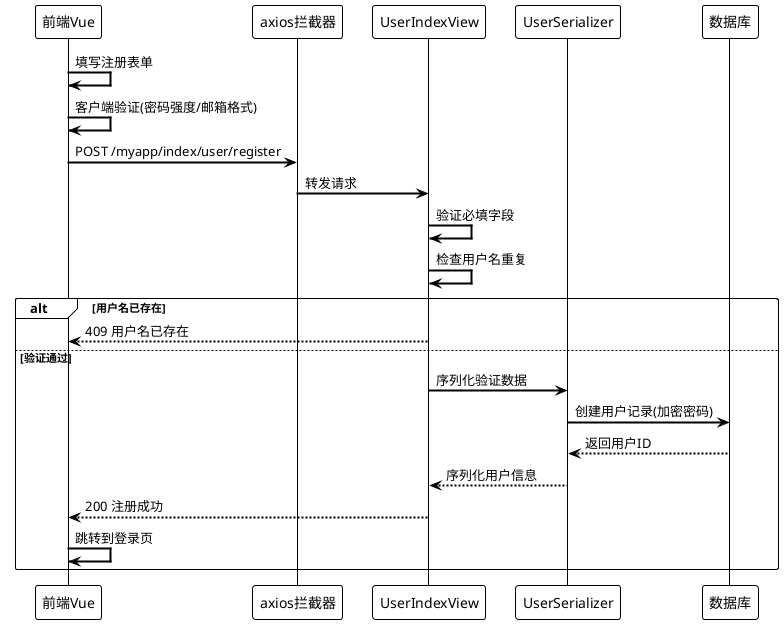
```plantuml
@startuml 用户注册
!theme plain
skinparam sequenceArrowThickness 2
skinparam roundcorner 5

participant "前端Vue" as F
participant "axios拦截器" as A
participant "UserIndexView" as B
participant "UserSerializer" as S
participant "数据库" as D

F -> F: 填写注册表单
F -> F: 客户端验证(密码强度/邮箱格式)
F -> A: POST /myapp/index/user/register
A -> B: 转发请求
B -> B: 验证必填字段
B -> B: 检查用户名重复

alt 用户名已存在
    B --> F: 409 用户名已存在
else 验证通过
    B -> S: 序列化验证数据
    S -> D: 创建用户记录(加密密码)
    D --> S: 返回用户ID
    S --> B: 序列化用户信息
    B --> F: 200 注册成功
    F -> F: 跳转到登录页
end

@enduml
```

### 1.2 用户登录时序图

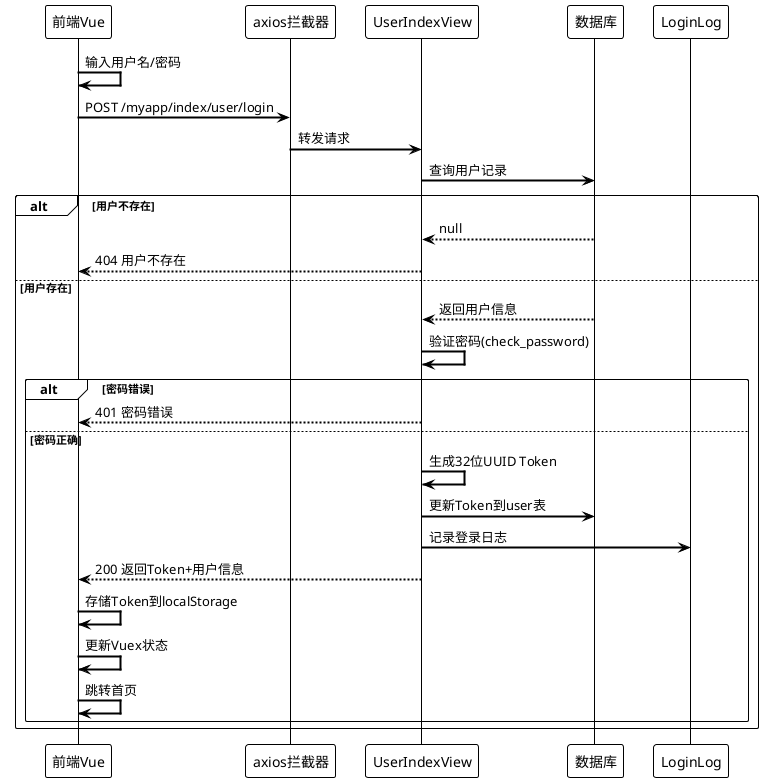
```plantuml
@startuml 用户登录
!theme plain
skinparam sequenceArrowThickness 2
skinparam roundcorner 5

participant "前端Vue" as F
participant "axios拦截器" as A
participant "UserIndexView" as B
participant "数据库" as D
participant "LoginLog" as L

F -> F: 输入用户名/密码
F -> A: POST /myapp/index/user/login
A -> B: 转发请求
B -> D: 查询用户记录

alt 用户不存在
    D --> B: null
    B --> F: 404 用户不存在
else 用户存在
    D --> B: 返回用户信息
    B -> B: 验证密码(check_password)
    alt 密码错误
        B --> F: 401 密码错误
    else 密码正确
        B -> B: 生成32位UUID Token
        B -> D: 更新Token到user表
        B -> L: 记录登录日志
        B --> F: 200 返回Token+用户信息
        F -> F: 存储Token到localStorage
        F -> F: 更新Vuex状态
        F -> F: 跳转首页
    end
end

@enduml
```

### 1.3 用户资料更新时序图

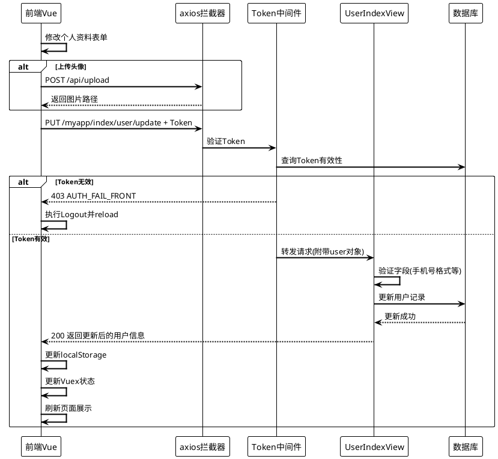
```plantuml
@startuml 用户资料更新
!theme plain
skinparam sequenceArrowThickness 2
skinparam roundcorner 5

participant "前端Vue" as F
participant "axios拦截器" as A
participant "Token中间件" as M
participant "UserIndexView" as B
participant "数据库" as D

F -> F: 修改个人资料表单

alt 上传头像
    F -> A: POST /api/upload
    A --> F: 返回图片路径
end

F -> A: PUT /myapp/index/user/update + Token
A -> M: 验证Token
M -> D: 查询Token有效性

alt Token无效
    M --> F: 403 AUTH_FAIL_FRONT
    F -> F: 执行Logout并reload
else Token有效
    M -> B: 转发请求(附带user对象)
    B -> B: 验证字段(手机号格式等)
    B -> D: 更新用户记录
    D --> B: 更新成功
    B --> F: 200 返回更新后的用户信息
    F -> F: 更新localStorage
    F -> F: 更新Vuex状态
    F -> F: 刷新页面展示
end

@enduml
```

### 1.4 用户账号冻结/解冻时序图

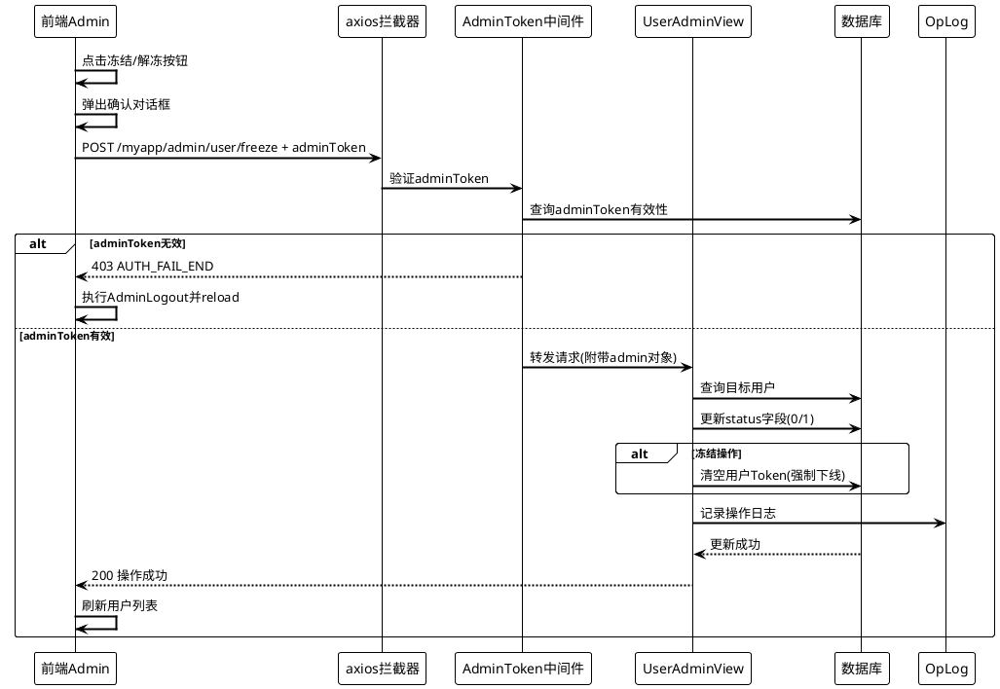
```plantuml
@startuml 用户账号冻结解冻
!theme plain
skinparam sequenceArrowThickness 2
skinparam roundcorner 5

participant "前端Admin" as F
participant "axios拦截器" as A
participant "AdminToken中间件" as M
participant "UserAdminView" as B
participant "数据库" as D
participant "OpLog" as L

F -> F: 点击冻结/解冻按钮
F -> F: 弹出确认对话框
F -> A: POST /myapp/admin/user/freeze + adminToken
A -> M: 验证adminToken
M -> D: 查询adminToken有效性

alt adminToken无效
    M --> F: 403 AUTH_FAIL_END
    F -> F: 执行AdminLogout并reload
else adminToken有效
    M -> B: 转发请求(附带admin对象)
    B -> D: 查询目标用户
    B -> D: 更新status字段(0/1)
    alt 冻结操作
        B -> D: 清空用户Token(强制下线)
    end
    B -> L: 记录操作日志
    D --> B: 更新成功
    B --> F: 200 操作成功
    F -> F: 刷新用户列表
end

@enduml
```

### 1.5 用户账号删除时序图

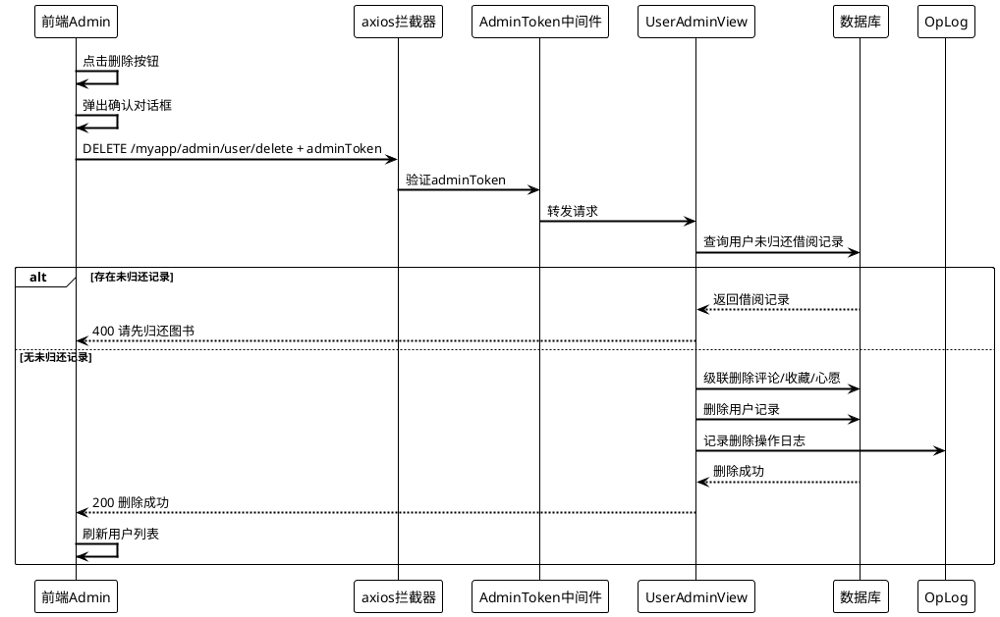
```plantuml
@startuml 用户账号删除
!theme plain
skinparam sequenceArrowThickness 2
skinparam roundcorner 5

participant "前端Admin" as F
participant "axios拦截器" as A
participant "AdminToken中间件" as M
participant "UserAdminView" as B
participant "数据库" as D
participant "OpLog" as L

F -> F: 点击删除按钮
F -> F: 弹出确认对话框
F -> A: DELETE /myapp/admin/user/delete + adminToken
A -> M: 验证adminToken
M -> B: 转发请求
B -> D: 查询用户未归还借阅记录

alt 存在未归还记录
    D --> B: 返回借阅记录
    B --> F: 400 请先归还图书
else 无未归还记录
    B -> D: 级联删除评论/收藏/心愿
    B -> D: 删除用户记录
    B -> L: 记录删除操作日志
    D --> B: 删除成功
    B --> F: 200 删除成功
    F -> F: 刷新用户列表
end

@enduml
```

---

## 2. 图书管理模块时序图

### 2.1 图书添加时序图

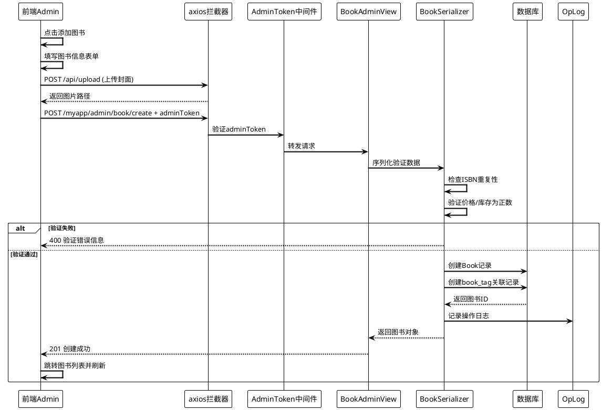
```plantuml
@startuml 图书添加
!theme plain
skinparam sequenceArrowThickness 2
skinparam roundcorner 5

participant "前端Admin" as F
participant "axios拦截器" as A
participant "AdminToken中间件" as M
participant "BookAdminView" as B
participant "BookSerializer" as S
participant "数据库" as D
participant "OpLog" as L

F -> F: 点击添加图书
F -> F: 填写图书信息表单
F -> A: POST /api/upload (上传封面)
A --> F: 返回图片路径
F -> A: POST /myapp/admin/book/create + adminToken
A -> M: 验证adminToken
M -> B: 转发请求
B -> S: 序列化验证数据
S -> S: 检查ISBN重复性
S -> S: 验证价格/库存为正数

alt 验证失败
    S --> F: 400 验证错误信息
else 验证通过
    S -> D: 创建Book记录
    S -> D: 创建book_tag关联记录
    D --> S: 返回图书ID
    S -> L: 记录操作日志
    S --> B: 返回图书对象
    B --> F: 201 创建成功
    F -> F: 跳转图书列表并刷新
end

@enduml
```

### 2.2 图书列表查询时序图

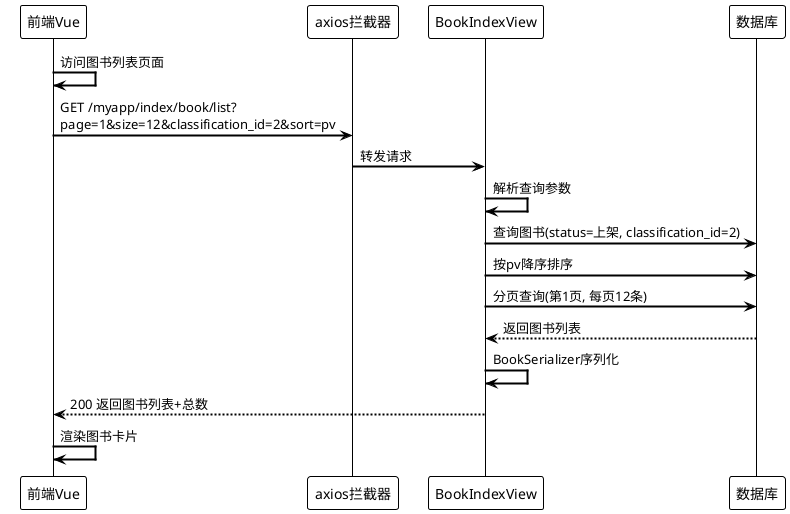
```plantuml
@startuml 图书列表查询
!theme plain
skinparam sequenceArrowThickness 2
skinparam roundcorner 5

participant "前端Vue" as F
participant "axios拦截器" as A
participant "BookIndexView" as B
participant "数据库" as D

F -> F: 访问图书列表页面
F -> A: GET /myapp/index/book/list?\npage=1&size=12&classification_id=2&sort=pv
A -> B: 转发请求
B -> B: 解析查询参数
B -> D: 查询图书(status=上架, classification_id=2)
B -> D: 按pv降序排序
B -> D: 分页查询(第1页, 每页12条)
D --> B: 返回图书列表
B -> B: BookSerializer序列化
B --> F: 200 返回图书列表+总数
F -> F: 渲染图书卡片

@enduml
```

### 2.3 图书详情查看时序图

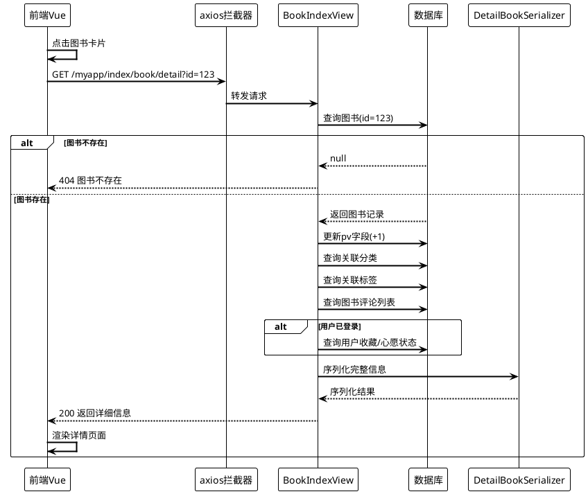
```plantuml
@startuml 图书详情查看
!theme plain
skinparam sequenceArrowThickness 2
skinparam roundcorner 5

participant "前端Vue" as F
participant "axios拦截器" as A
participant "BookIndexView" as B
participant "数据库" as D
participant "DetailBookSerializer" as S

F -> F: 点击图书卡片
F -> A: GET /myapp/index/book/detail?id=123
A -> B: 转发请求
B -> D: 查询图书(id=123)

alt 图书不存在
    D --> B: null
    B --> F: 404 图书不存在
else 图书存在
    D --> B: 返回图书记录
    B -> D: 更新pv字段(+1)
    B -> D: 查询关联分类
    B -> D: 查询关联标签
    B -> D: 查询图书评论列表
    alt 用户已登录
        B -> D: 查询用户收藏/心愿状态
    end
    B -> S: 序列化完整信息
    S --> B: 序列化结果
    B --> F: 200 返回详细信息
    F -> F: 渲染详情页面
end

@enduml
```

### 2.4 图书搜索时序图

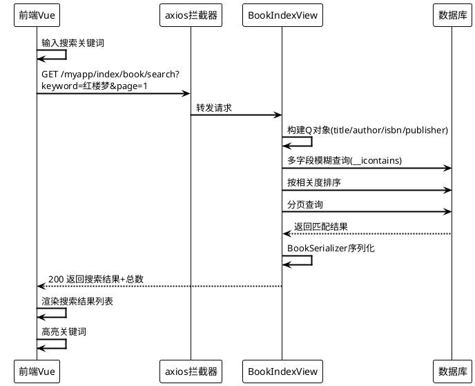
```plantuml
@startuml 图书搜索
!theme plain
skinparam sequenceArrowThickness 2
skinparam roundcorner 5

participant "前端Vue" as F
participant "axios拦截器" as A
participant "BookIndexView" as B
participant "数据库" as D

F -> F: 输入搜索关键词
F -> A: GET /myapp/index/book/search?\nkeyword=红楼梦&page=1
A -> B: 转发请求
B -> B: 构建Q对象(title/author/isbn/publisher)
B -> D: 多字段模糊查询(__icontains)
B -> D: 按相关度排序
B -> D: 分页查询
D --> B: 返回匹配结果
B -> B: BookSerializer序列化
B --> F: 200 返回搜索结果+总数
F -> F: 渲染搜索结果列表
F -> F: 高亮关键词

@enduml
```

### 2.5 图书编辑时序图

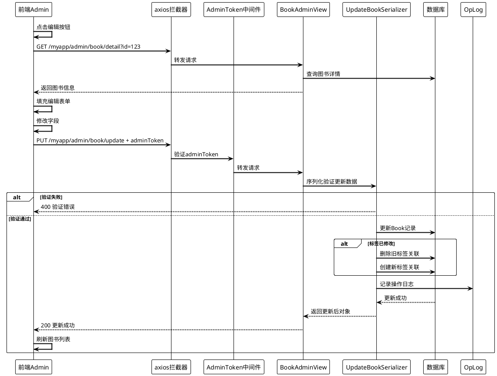
```plantuml
@startuml 图书编辑
!theme plain
skinparam sequenceArrowThickness 2
skinparam roundcorner 5

participant "前端Admin" as F
participant "axios拦截器" as A
participant "AdminToken中间件" as M
participant "BookAdminView" as B
participant "UpdateBookSerializer" as S
participant "数据库" as D
participant "OpLog" as L

F -> F: 点击编辑按钮
F -> A: GET /myapp/admin/book/detail?id=123
A -> B: 转发请求
B -> D: 查询图书详情
B --> F: 返回图书信息
F -> F: 填充编辑表单
F -> F: 修改字段
F -> A: PUT /myapp/admin/book/update + adminToken
A -> M: 验证adminToken
M -> B: 转发请求
B -> S: 序列化验证更新数据

alt 验证失败
    S --> F: 400 验证错误
else 验证通过
    S -> D: 更新Book记录
    alt 标签已修改
        S -> D: 删除旧标签关联
        S -> D: 创建新标签关联
    end
    S -> L: 记录操作日志
    D --> S: 更新成功
    S --> B: 返回更新后对象
    B --> F: 200 更新成功
    F -> F: 刷新图书列表
end

@enduml
```

---

## 3. 借阅管理模块时序图

### 3.1 借书功能时序图

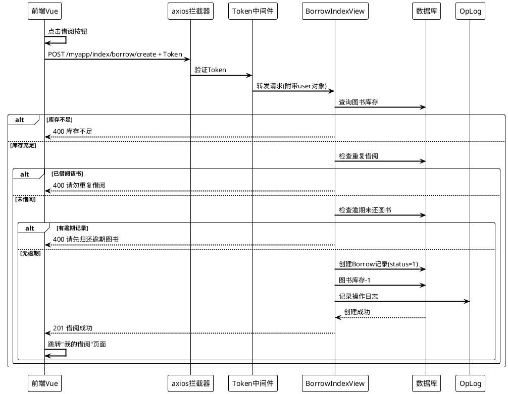
```plantuml
@startuml 借书功能
!theme plain
skinparam sequenceArrowThickness 2
skinparam roundcorner 5

participant "前端Vue" as F
participant "axios拦截器" as A
participant "Token中间件" as M
participant "BorrowIndexView" as B
participant "数据库" as D
participant "OpLog" as L

F -> F: 点击借阅按钮
F -> A: POST /myapp/index/borrow/create + Token
A -> M: 验证Token
M -> B: 转发请求(附带user对象)
B -> D: 查询图书库存

alt 库存不足
    B --> F: 400 库存不足
else 库存充足
    B -> D: 检查重复借阅
    alt 已借阅该书
        B --> F: 400 请勿重复借阅
    else 未借阅
        B -> D: 检查逾期未还图书
        alt 有逾期记录
            B --> F: 400 请先归还逾期图书
        else 无逾期
            B -> D: 创建Borrow记录(status=1)
            B -> D: 图书库存-1
            B -> L: 记录操作日志
            D --> B: 创建成功
            B --> F: 201 借阅成功
            F -> F: 跳转"我的借阅"页面
        end
    end
end

@enduml
```

### 3.2 还书功能时序图

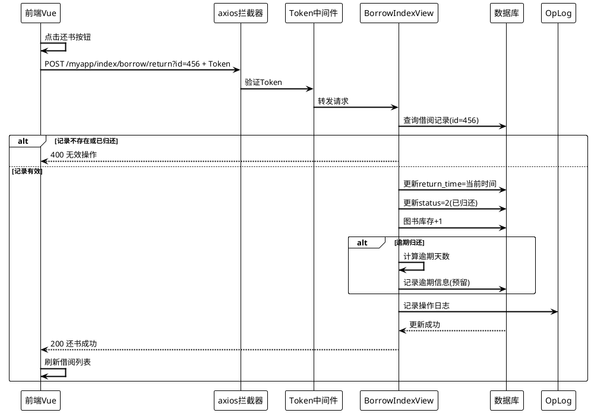
```plantuml
@startuml 还书功能
!theme plain
skinparam sequenceArrowThickness 2
skinparam roundcorner 5

participant "前端Vue" as F
participant "axios拦截器" as A
participant "Token中间件" as M
participant "BorrowIndexView" as B
participant "数据库" as D
participant "OpLog" as L

F -> F: 点击还书按钮
F -> A: POST /myapp/index/borrow/return?id=456 + Token
A -> M: 验证Token
M -> B: 转发请求
B -> D: 查询借阅记录(id=456)

alt 记录不存在或已归还
    B --> F: 400 无效操作
else 记录有效
    B -> D: 更新return_time=当前时间
    B -> D: 更新status=2(已归还)
    B -> D: 图书库存+1
    alt 逾期归还
        B -> B: 计算逾期天数
        B -> D: 记录逾期信息(预留)
    end
    B -> L: 记录操作日志
    D --> B: 更新成功
    B --> F: 200 还书成功
    F -> F: 刷新借阅列表
end

@enduml
```

### 3.3 续借功能时序图

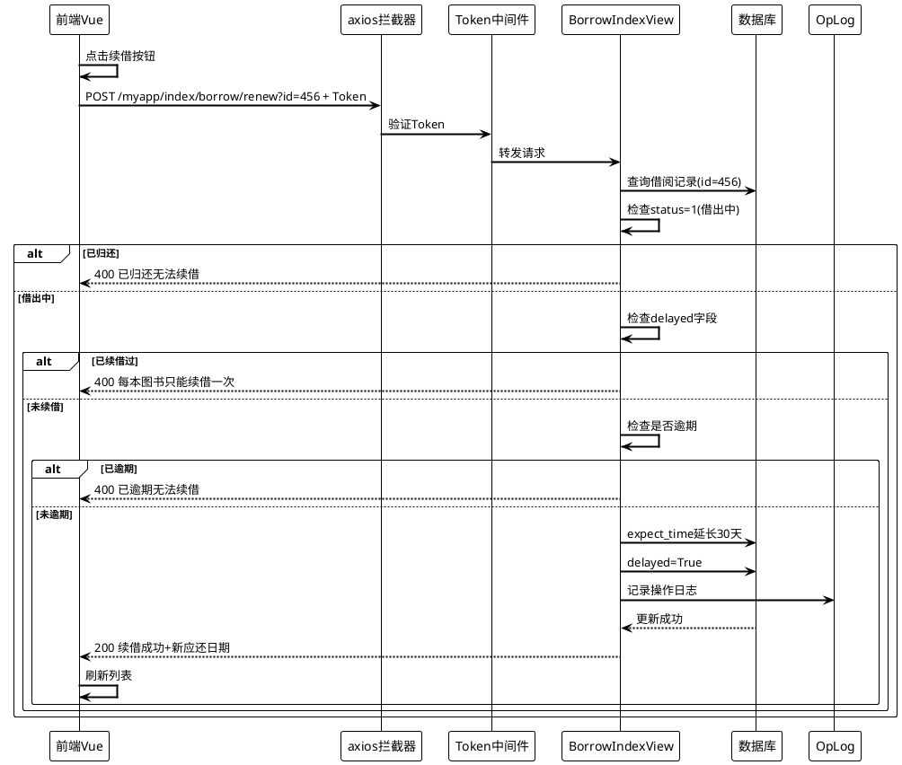
```plantuml
@startuml 续借功能
!theme plain
skinparam sequenceArrowThickness 2
skinparam roundcorner 5

participant "前端Vue" as F
participant "axios拦截器" as A
participant "Token中间件" as M
participant "BorrowIndexView" as B
participant "数据库" as D
participant "OpLog" as L

F -> F: 点击续借按钮
F -> A: POST /myapp/index/borrow/renew?id=456 + Token
A -> M: 验证Token
M -> B: 转发请求
B -> D: 查询借阅记录(id=456)
B -> B: 检查status=1(借出中)

alt 已归还
    B --> F: 400 已归还无法续借
else 借出中
    B -> B: 检查delayed字段
    alt 已续借过
        B --> F: 400 每本图书只能续借一次
    else 未续借
        B -> B: 检查是否逾期
        alt 已逾期
            B --> F: 400 已逾期无法续借
        else 未逾期
            B -> D: expect_time延长30天
            B -> D: delayed=True
            B -> L: 记录操作日志
            D --> B: 更新成功
            B --> F: 200 续借成功+新应还日期
            F -> F: 刷新列表
        end
    end
end

@enduml
```

### 3.4 借阅记录查询时序图

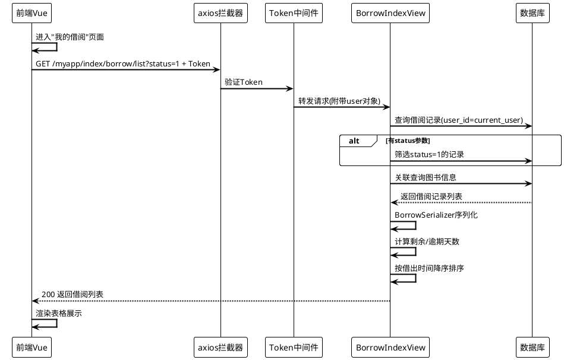
```plantuml
@startuml 借阅记录查询
!theme plain
skinparam sequenceArrowThickness 2
skinparam roundcorner 5

participant "前端Vue" as F
participant "axios拦截器" as A
participant "Token中间件" as M
participant "BorrowIndexView" as B
participant "数据库" as D

F -> F: 进入"我的借阅"页面
F -> A: GET /myapp/index/borrow/list?status=1 + Token
A -> M: 验证Token
M -> B: 转发请求(附带user对象)
B -> D: 查询借阅记录(user_id=current_user)

alt 有status参数
    B -> D: 筛选status=1的记录
end

B -> D: 关联查询图书信息
D --> B: 返回借阅记录列表
B -> B: BorrowSerializer序列化
B -> B: 计算剩余/逾期天数
B -> B: 按借出时间降序排序
B --> F: 200 返回借阅列表
F -> F: 渲染表格展示

@enduml
```

### 3.5 借阅统计时序图

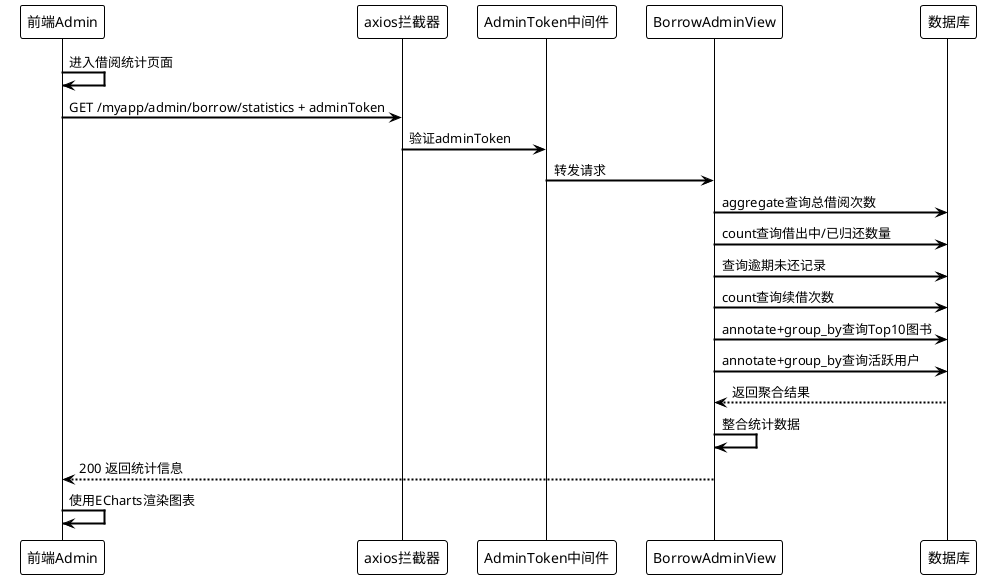
```plantuml
@startuml 借阅统计
!theme plain
skinparam sequenceArrowThickness 2
skinparam roundcorner 5

participant "前端Admin" as F
participant "axios拦截器" as A
participant "AdminToken中间件" as M
participant "BorrowAdminView" as B
participant "数据库" as D

F -> F: 进入借阅统计页面
F -> A: GET /myapp/admin/borrow/statistics + adminToken
A -> M: 验证adminToken
M -> B: 转发请求
B -> D: aggregate查询总借阅次数
B -> D: count查询借出中/已归还数量
B -> D: 查询逾期未还记录
B -> D: count查询续借次数
B -> D: annotate+group_by查询Top10图书
B -> D: annotate+group_by查询活跃用户
D --> B: 返回聚合结果
B -> B: 整合统计数据
B --> F: 200 返回统计信息
F -> F: 使用ECharts渲染图表

@enduml
```

---

## 4. 社区互动模块时序图

### 4.1 发表图书评论时序图

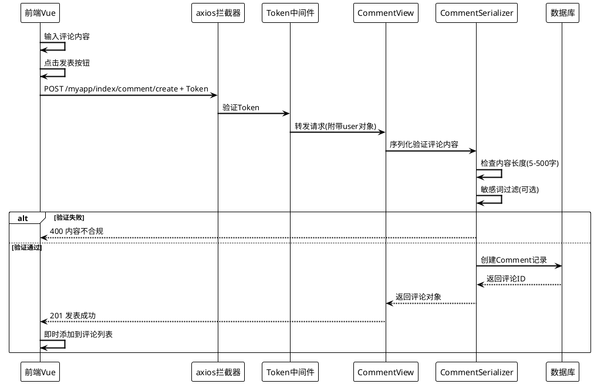
```plantuml
@startuml 发表图书评论
!theme plain
skinparam sequenceArrowThickness 2
skinparam roundcorner 5

participant "前端Vue" as F
participant "axios拦截器" as A
participant "Token中间件" as M
participant "CommentView" as B
participant "CommentSerializer" as S
participant "数据库" as D

F -> F: 输入评论内容
F -> F: 点击发表按钮
F -> A: POST /myapp/index/comment/create + Token
A -> M: 验证Token
M -> B: 转发请求(附带user对象)
B -> S: 序列化验证评论内容
S -> S: 检查内容长度(5-500字)
S -> S: 敏感词过滤(可选)

alt 验证失败
    S --> F: 400 内容不合规
else 验证通过
    S -> D: 创建Comment记录
    D --> S: 返回评论ID
    S --> B: 返回评论对象
    B --> F: 201 发表成功
    F -> F: 即时添加到评论列表
end

@enduml
```

### 4.2 评论点赞时序图

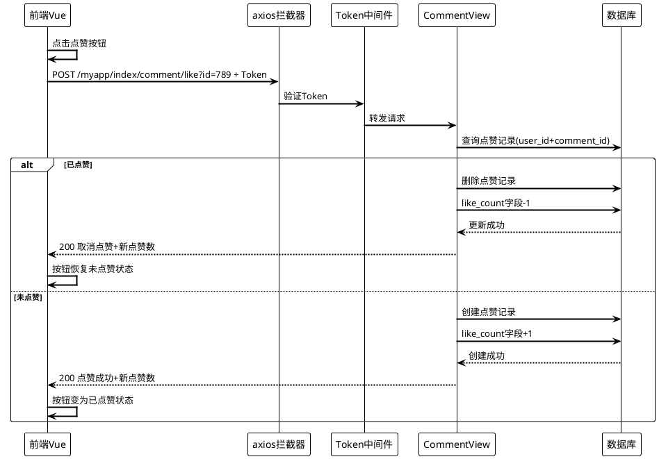
```plantuml
@startuml 评论点赞
!theme plain
skinparam sequenceArrowThickness 2
skinparam roundcorner 5

participant "前端Vue" as F
participant "axios拦截器" as A
participant "Token中间件" as M
participant "CommentView" as B
participant "数据库" as D

F -> F: 点击点赞按钮
F -> A: POST /myapp/index/comment/like?id=789 + Token
A -> M: 验证Token
M -> B: 转发请求
B -> D: 查询点赞记录(user_id+comment_id)

alt 已点赞
    B -> D: 删除点赞记录
    B -> D: like_count字段-1
    D --> B: 更新成功
    B --> F: 200 取消点赞+新点赞数
    F -> F: 按钮恢复未点赞状态
else 未点赞
    B -> D: 创建点赞记录
    B -> D: like_count字段+1
    D --> B: 创建成功
    B --> F: 200 点赞成功+新点赞数
    F -> F: 按钮变为已点赞状态
end

@enduml
```

### 4.3 社区话题发布时序图

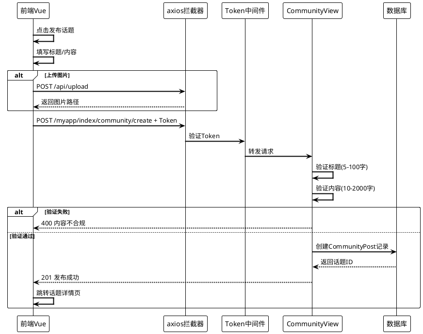
```plantuml
@startuml 社区话题发布
!theme plain
skinparam sequenceArrowThickness 2
skinparam roundcorner 5

participant "前端Vue" as F
participant "axios拦截器" as A
participant "Token中间件" as M
participant "CommunityView" as B
participant "数据库" as D

F -> F: 点击发布话题
F -> F: 填写标题/内容

alt 上传图片
    F -> A: POST /api/upload
    A --> F: 返回图片路径
end

F -> A: POST /myapp/index/community/create + Token
A -> M: 验证Token
M -> B: 转发请求
B -> B: 验证标题(5-100字)
B -> B: 验证内容(10-2000字)

alt 验证失败
    B --> F: 400 内容不合规
else 验证通过
    B -> D: 创建CommunityPost记录
    D --> B: 返回话题ID
    B --> F: 201 发布成功
    F -> F: 跳转话题详情页
end

@enduml
```

### 4.4 社区话题评论时序图

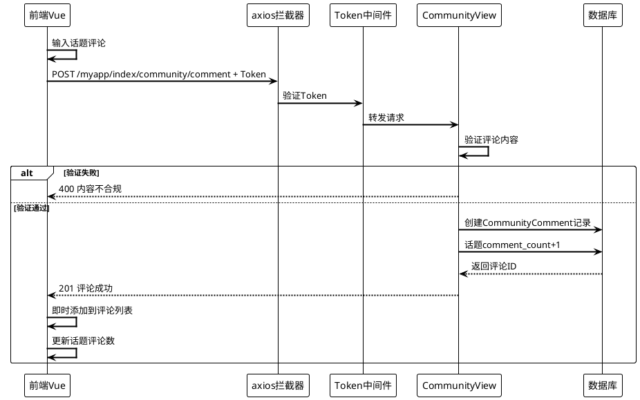
```plantuml
@startuml 社区话题评论
!theme plain
skinparam sequenceArrowThickness 2
skinparam roundcorner 5

participant "前端Vue" as F
participant "axios拦截器" as A
participant "Token中间件" as M
participant "CommunityView" as B
participant "数据库" as D

F -> F: 输入话题评论
F -> A: POST /myapp/index/community/comment + Token
A -> M: 验证Token
M -> B: 转发请求
B -> B: 验证评论内容

alt 验证失败
    B --> F: 400 内容不合规
else 验证通过
    B -> D: 创建CommunityComment记录
    B -> D: 话题comment_count+1
    D --> B: 返回评论ID
    B --> F: 201 评论成功
    F -> F: 即时添加到评论列表
    F -> F: 更新话题评论数
end

@enduml
```

### 4.5 评论删除时序图

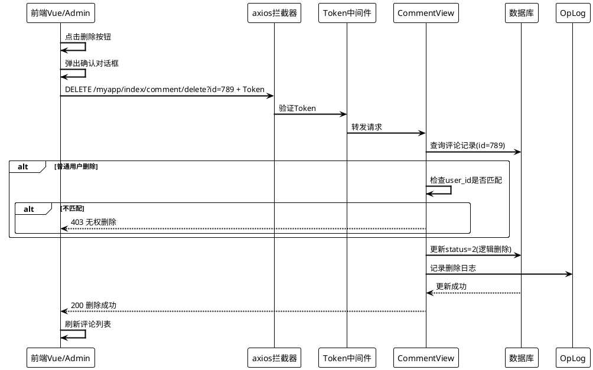
```plantuml
@startuml 评论删除
!theme plain
skinparam sequenceArrowThickness 2
skinparam roundcorner 5

participant "前端Vue/Admin" as F
participant "axios拦截器" as A
participant "Token中间件" as M
participant "CommentView" as B
participant "数据库" as D
participant "OpLog" as L

F -> F: 点击删除按钮
F -> F: 弹出确认对话框
F -> A: DELETE /myapp/index/comment/delete?id=789 + Token
A -> M: 验证Token
M -> B: 转发请求
B -> D: 查询评论记录(id=789)

alt 普通用户删除
    B -> B: 检查user_id是否匹配
    alt 不匹配
        B --> F: 403 无权删除
    end
end

B -> D: 更新status=2(逻辑删除)
B -> L: 记录删除日志
D --> B: 更新成功
B --> F: 200 删除成功
F -> F: 刷新评论列表

@enduml
```

---

## 5. 推荐算法模块时序图

### 5.1 推荐列表获取时序图

```plantuml
@startuml 推荐列表获取
!theme plain
skinparam sequenceArrowThickness 2
skinparam roundcorner 5

participant "前端Vue" as F
participant "axios拦截器" as A
participant "Token中间件" as M
participant "RecommendApiView" as B
participant "RecommendService" as R
participant "数据库" as D

F -> F: 访问推荐板块
F -> A: GET /myapp/index/book/recommend + Token
A -> M: 验证Token
M -> B: 转发请求(附带user对象)
B -> R: 调用推荐算法服务
R -> D: 读取所有用户行为数据
D --> R: 返回借阅/收藏/心愿记录
R -> R: buildRatingMatrix构建评分矩阵
R -> R: computeSimilarity计算用户相似度
R -> R: 找出Top K相似用户(K=10)
R -> D: 获取相似用户的图书记录
R -> R: 过滤当前用户已接触图书
R -> R: recommendTopN加权排序选出Top N(N=12)
R --> B: 返回推荐图书ID列表
B -> D: 查询推荐图书详细信息
B -> B: BookSerializer序列化
B --> F: 200 返回推荐图书列表
F -> F: 渲染推荐卡片

@enduml
```

### 5.2 热门图书推荐时序图

```plantuml
@startuml 热门图书推荐
!theme plain
skinparam sequenceArrowThickness 2
skinparam roundcorner 5

participant "前端Vue" as F
participant "axios拦截器" as A
participant "RecommendApiView" as B
participant "数据库" as D

F -> F: 访问热门推荐板块
F -> A: GET /myapp/index/book/hot
A -> B: 转发请求
B -> D: annotate统计每本图书借阅次数
B -> B: 计算综合热度分数\n(pv+collect+wish+borrow)
B -> D: order_by热度分数降序
B -> D: limit 12条记录
D --> B: 返回热门图书列表
B -> B: BookSerializer序列化
B --> F: 200 返回热门图书列表
F -> F: 渲染热门卡片

@enduml
```

---

## 6. 系统管理模块时序图

### 6.1 图书分类管理时序图

```plantuml
@startuml 图书分类管理
!theme plain
skinparam sequenceArrowThickness 2
skinparam roundcorner 5

participant "前端Admin" as F
participant "axios拦截器" as A
participant "AdminToken中间件" as M
participant "ClassificationView" as B
participant "数据库" as D
participant "OpLog" as L

F -> F: 点击添加分类
F -> F: 填写分类名称/父分类
F -> A: POST /myapp/admin/classification/create\n+ adminToken
A -> M: 验证adminToken
M -> B: 转发请求
B -> D: 检查分类名称重复

alt 名称已存在
    B --> F: 400 分类名称已存在
else 名称不重复
    B -> D: 创建Classification记录
    B -> L: 记录操作日志
    D --> B: 返回分类ID
    B --> F: 201 创建成功
    F -> F: 刷新分类树形列表
end

@enduml
```

### 6.2 图书标签管理时序图

```plantuml
@startuml 图书标签管理
!theme plain
skinparam sequenceArrowThickness 2
skinparam roundcorner 5

participant "前端Admin" as F
participant "axios拦截器" as A
participant "AdminToken中间件" as M
participant "TagView" as B
participant "数据库" as D
participant "OpLog" as L

F -> F: 点击添加标签
F -> F: 填写标签名称
F -> A: POST /myapp/admin/tag/create + adminToken
A -> M: 验证adminToken
M -> B: 转发请求
B -> D: 检查标签名称重复

alt 名称已存在
    B --> F: 400 标签名称已存在
else 名称不重复
    B -> D: 创建Tag记录
    B -> L: 记录操作日志
    D --> B: 返回标签ID
    B --> F: 201 创建成功
    F -> F: 刷新标签列表
end

@enduml
```

### 6.3 平台通知发布时序图

```plantuml
@startuml 平台通知发布
!theme plain
skinparam sequenceArrowThickness 2
skinparam roundcorner 5

participant "前端Admin" as F
participant "axios拦截器" as A
participant "AdminToken中间件" as M
participant "NoticeView" as B
participant "数据库" as D
participant "OpLog" as L

F -> F: 点击发布通知
F -> F: 填写标题/内容/有效期
F -> A: POST /myapp/admin/notice/create + adminToken
A -> M: 验证adminToken
M -> B: 转发请求
B -> B: 验证标题/内容长度

alt 验证失败
    B --> F: 400 内容不合规
else 验证通过
    B -> D: 创建Notice记录
    B -> L: 记录操作日志
    D --> B: 返回通知ID
    B --> F: 201 发布成功
    F -> F: 跳转通知列表页
end

@enduml
```

### 6.4 操作日志查询时序图

```plantuml
@startuml 操作日志查询
!theme plain
skinparam sequenceArrowThickness 2
skinparam roundcorner 5

participant "前端Admin" as F
participant "axios拦截器" as A
participant "AdminToken中间件" as M
participant "LogAdminView" as B
participant "数据库" as D

F -> F: 进入日志管理页面
F -> F: 设置筛选条件(时间/类型/用户)
F -> A: GET /myapp/admin/opLog/list?\nstart_time=xxx&operation=xxx + adminToken
A -> M: 验证adminToken
M -> B: 转发请求
B -> B: 构建查询条件(filter)
B -> D: 查询OpLog表(按时间/类型/用户筛选)
B -> D: order_by op_time降序
B -> D: 分页查询
D --> B: 返回日志记录列表
B -> B: 序列化日志数据
B --> F: 200 返回日志列表+总数
F -> F: 渲染日志表格

alt 导出日志
    F -> A: GET /myapp/admin/opLog/export\n+ adminToken
    A -> B: 转发请求
    B -> D: 查询所有符合条件的日志
    B -> B: 生成Excel文件
    B --> F: 返回文件流
    F -> F: 浏览器下载Excel
end

@enduml
```

### 6.5 系统概览统计时序图

```plantuml
@startuml 系统概览统计
!theme plain
skinparam sequenceArrowThickness 2
skinparam roundcorner 5

participant "前端Admin" as F
participant "axios拦截器" as A
participant "AdminToken中间件" as M
participant "OverviewView" as B
participant "数据库" as D

F -> F: 进入后台首页
F -> A: GET /myapp/admin/overview/data + adminToken
A -> M: 验证adminToken
M -> B: 转发请求
B -> D: count查询用户总数
B -> D: count查询图书总数
B -> D: count查询借出中数量(status=1)
B -> D: count查询今日新增借阅
B -> D: count查询评论总数
B -> D: count查询话题总数
B -> D: count查询今日新增用户
B -> D: group_by查询最近7天借阅趋势
D --> B: 返回各项统计数据
B -> B: 整合统计信息
B --> F: 200 返回概览数据
F -> F: 渲染统计卡片
F -> F: 使用ECharts渲染趋势图

@enduml
```

---

## 使用说明

### 在线渲染
1. 访问 [PlantUML在线编辑器](http://www.plantuml.com/plantuml/uml/)
2. 复制上述任意时序图代码（包含 `@startuml` 到 `@enduml` 的完整代码）
3. 粘贴到编辑器中，即可查看渲染结果
4. 可以下载为PNG、SVG等格式

### 本地渲染
如果您使用支持PlantUML的编辑器（如VS Code + PlantUML扩展），可以直接在编辑器中预览这些时序图。

### 主要时序图符号说明

**箭头类型**：
- `->` : 同步调用（实线箭头）
- `-->` : 异步响应/返回（虚线箭头）

**参与者定义**：
```plantuml
participant "显示名称" as 别名
```

**条件分支**：
```plantuml
alt 条件1
    操作1
else 条件2
    操作2
end
```

**自调用**：
```plantuml
A -> A: 内部处理
```

### 自定义样式

可以在 `@startuml` 后添加样式设置：
```plantuml
@startuml
!theme plain
skinparam sequenceArrowThickness 2
skinparam roundcorner 5
skinparam backgroundColor #EEEBDC
```

常用主题：`plain`, `cerulean`, `bluegray`, `mars`

### 导出格式

PlantUML支持导出多种格式：
- PNG（默认）
- SVG（矢量图，放大不失真）
- PDF（适合打印）
- LaTeX（适合学术论文）

---

## 模块统计

| 模块 | 时序图数量 | 说明 |
|------|----------|------|
| 用户管理模块 | 5个 | 注册、登录、资料更新、冻结解冻、删除 |
| 图书管理模块 | 5个 | 添加、列表查询、详情查看、搜索、编辑 |
| 借阅管理模块 | 5个 | 借书、还书、续借、记录查询、统计 |
| 社区互动模块 | 5个 | 发表评论、点赞、发布话题、话题评论、删除 |
| 推荐算法模块 | 2个 | 个性化推荐、热门推荐 |
| 系统管理模块 | 5个 | 分类管理、标签管理、通知发布、日志查询、概览统计 |
| **合计** | **27个** | 涵盖系统所有核心业务流程 |

---

## 时序图特点

1. **完整的交互流程**：展示从前端发起请求到数据库操作的完整链路
2. **详细的异常处理**：使用alt/else块展示各种异常情况的处理
3. **清晰的角色划分**：前端、拦截器、中间件、控制器、数据库等角色明确
4. **真实的API路径**：所有API路径都基于实际代码
5. **完整的业务逻辑**：包含验证、权限检查、日志记录等完整流程
6. **统一的设计风格**：所有时序图采用相同的样式和主题
