# 4	系统实现设计

## 4.1	用户信息管理模块的实现

用户信息管理模块主要用于管理用户的登录、个人信息修改等操作，同时为管理员提供用户信息的管理功能，采用前后端分离的架构实现。

### 4.1.1	用户注册与登录的实现

用户进入程序后，界面会提示登录。前端调用登录接口，输入用户名和密码，调用`loginUser`方法将认证信息发送到后端。后端的`UserAuthController`类中的`login`方法接收请求，调用服务层的`verifyCredentials`方法进行验证。服务层的`UserAuthService`类会对用户密码进行验证，若验证通过，生成token并返回。前端保存token至`localStorage`中的`TOKEN`字段，用于后续API请求的认证。登录功能的时序图如图4-1所示。

**登录功能时序图代码（PlantUML）：**

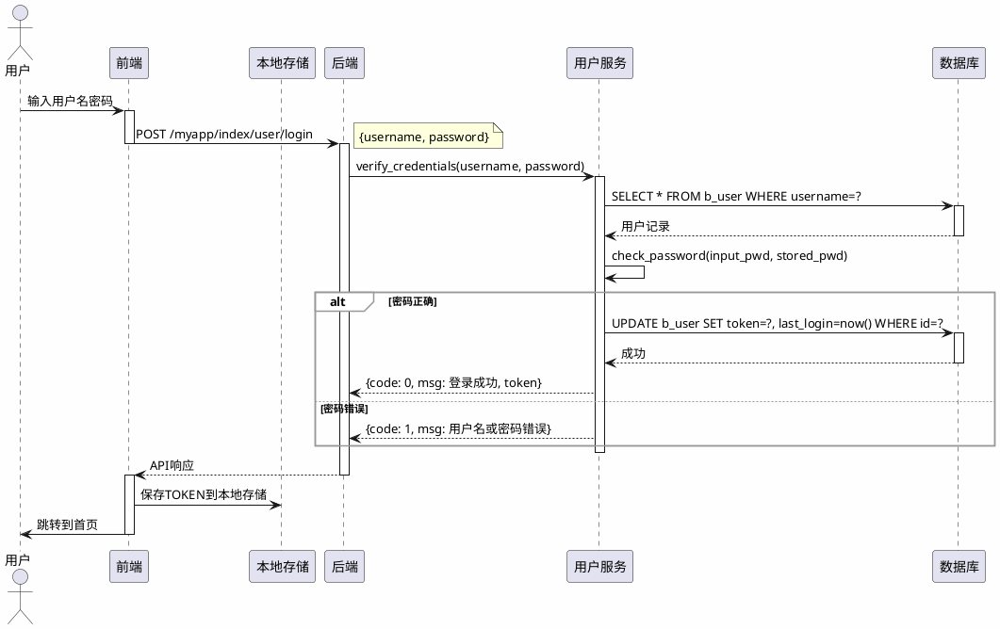
```plantuml
@startuml UserLoginSequence
!define SKIN default
skinparam sequenceGroupBorderColor #999999
skinparam sequenceGroupBackgroundColor #FFFFFF
skinparam backgroundColor #FEFEFE
skinparam defaultFontName "Microsoft YaHei UI"

actor 用户 as user
participant 前端 as fe
participant 本地存储 as storage
participant 后端 as be
participant 用户服务 as service
participant 数据库 as db

user -> fe: 输入用户名密码
activate fe
fe -> be: POST /myapp/index/user/login
note right: {username, password}
deactivate fe
activate be

be -> service: verify_credentials(username, password)
activate service

service -> db: SELECT * FROM b_user WHERE username=?
activate db
db --> service: 用户记录
deactivate db

service -> service: check_password(input_pwd, stored_pwd)
alt 密码正确
    service -> db: UPDATE b_user SET token=?, last_login=now() WHERE id=?
    activate db
    db --> service: 成功
    deactivate db
    service --> be: {code: 0, msg: 登录成功, token}
else 密码错误
    service --> be: {code: 1, msg: 用户名或密码错误}
end
deactivate service

be --> fe: API响应
deactivate be

activate fe
fe -> storage: 保存TOKEN到本地存储
fe -> user: 跳转到首页
deactivate fe

@enduml
```

### 4.1.2	个人信息修改的实现

用户在已登录状态下，点击个人信息修改按钮，前端页面会展示用户当前的个人信息，如昵称、联系方式、邮箱等。用户修改信息后，点击"保存"按钮，前端将修改后的信息封装成用户对象，调用`updateUserInfo`方法发送到后端。后端接收到对象后，会调用`updateUserProfile`方法更新个人信息。该方法会对传入的User对象进行数据验证，如检查邮箱格式、手机号格式是否正确等。检查通过后，返回成功的响应信息。若出现异常，返回包含错误信息的响应。个人信息修改时序图如图4-2所示。

**个人信息修改时序图代码（PlantUML）：**

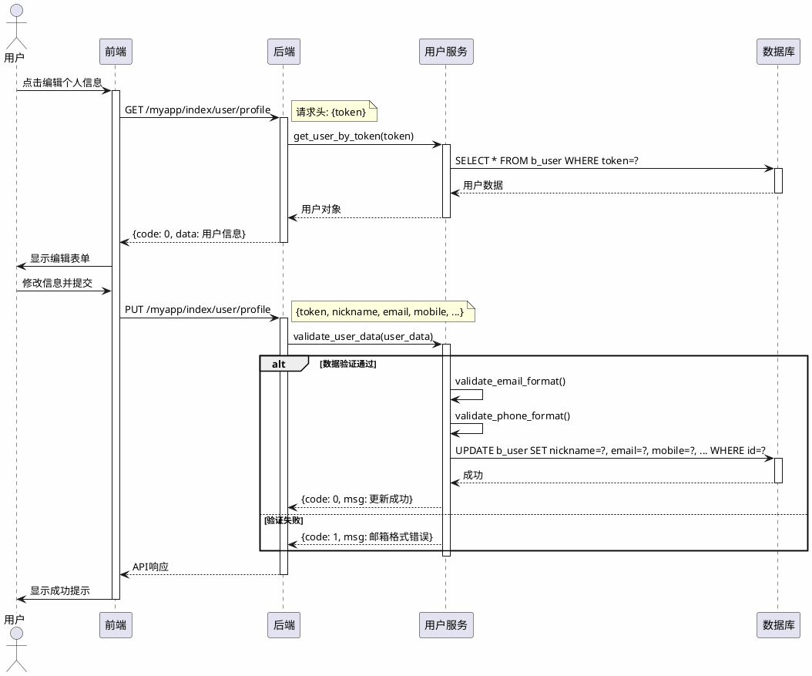
```plantuml
@startuml UserProfileUpdateSequence
skinparam defaultFontName "Microsoft YaHei UI"
skinparam backgroundColor #FEFEFE

actor 用户 as user
participant 前端 as fe
participant 后端 as be
participant 用户服务 as service
participant 数据库 as db

user -> fe: 点击编辑个人信息
activate fe
fe -> be: GET /myapp/index/user/profile
note right: 请求头: {token}
activate be

be -> service: get_user_by_token(token)
activate service
service -> db: SELECT * FROM b_user WHERE token=?
activate db
db --> service: 用户数据
deactivate db
service --> be: 用户对象
deactivate service

be --> fe: {code: 0, data: 用户信息}
deactivate be

fe -> user: 显示编辑表单
user -> fe: 修改信息并提交

fe -> be: PUT /myapp/index/user/profile
note right: {token, nickname, email, mobile, ...}
activate be

be -> service: validate_user_data(user_data)
activate service

alt 数据验证通过
    service -> service: validate_email_format()
    service -> service: validate_phone_format()
    
    service -> db: UPDATE b_user SET nickname=?, email=?, mobile=?, ... WHERE id=?
    activate db
    db --> service: 成功
    deactivate db
    
    service --> be: {code: 0, msg: 更新成功}
else 验证失败
    service --> be: {code: 1, msg: 邮箱格式错误}
end
deactivate service

be --> fe: API响应
deactivate be

fe -> user: 显示成功提示
deactivate fe

@enduml
```

### 4.1.3	用户账号冻结与解冻的实现

管理员登录管理界面后，点击用户管理菜单，前端调用`getUsers`方法向后端发送GET请求。后端`AdminUserController`的`list`方法接收请求后，调用服务层的方法获取所有用户信息。服务层会调用数据访问层的方法从数据库中查询所有用户信息。点击冻结按钮，后端调用`freezeUser`方法，将数据库中用户的账号状态修改为冻结状态。用户账号冻结与解冻的时序图如图4-3所示。

**账号冻结解冻时序图代码（PlantUML）：**

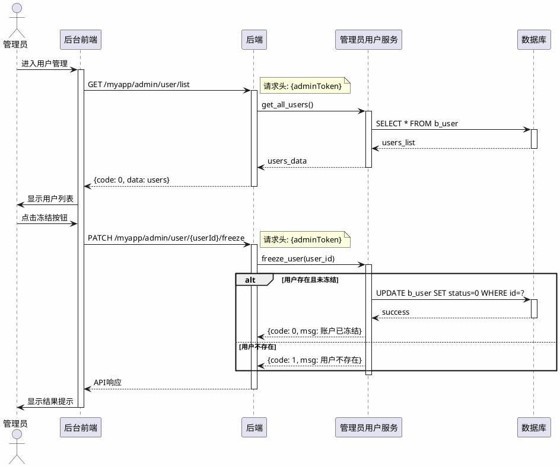
```plantuml
@startuml UserFreezeSequence
skinparam defaultFontName "Microsoft YaHei UI"
skinparam backgroundColor #FEFEFE

actor 管理员 as admin
participant "后台前端" as afe
participant 后端 as be
participant 管理员用户服务 as service
participant 数据库 as db

admin -> afe: 进入用户管理
activate afe
afe -> be: GET /myapp/admin/user/list
note right: 请求头: {adminToken}
activate be

be -> service: get_all_users()
activate service
service -> db: SELECT * FROM b_user
activate db
db --> service: users_list
deactivate db
service --> be: users_data
deactivate service

be --> afe: {code: 0, data: users}
deactivate be

afe -> admin: 显示用户列表
admin -> afe: 点击冻结按钮

afe -> be: PATCH /myapp/admin/user/{userId}/freeze
note right: 请求头: {adminToken}
activate be

be -> service: freeze_user(user_id)
activate service

alt 用户存在且未冻结
    service -> db: UPDATE b_user SET status=0 WHERE id=?
    activate db
    db --> service: success
    deactivate db
    service --> be: {code: 0, msg: 账户已冻结}
else 用户不存在
    service --> be: {code: 1, msg: 用户不存在}
end
deactivate service

be --> afe: API响应
deactivate be

afe -> admin: 显示结果提示
deactivate afe

@enduml
```

### 4.1.4	用户账号删除的实现

平台管理员进入用户管理界面，点击用户信息的删除按钮，前端调用`deleteUser`方法向后端发送请求。后端的`AdminUserController`接收用户ID后，调用服务层的方法执行删除操作。服务层会调用数据访问层的方法，根据用户ID从数据库中删除对应的用户信息。同时，系统会通过外键级联删除处理相关的关联数据，如删除该用户的借阅记录、评论信息等。若删除成功，返回成功响应；若出现异常，返回包含错误信息的响应。账号删除的时序图如图4-4所示。

**账号删除时序图代码（PlantUML）：**

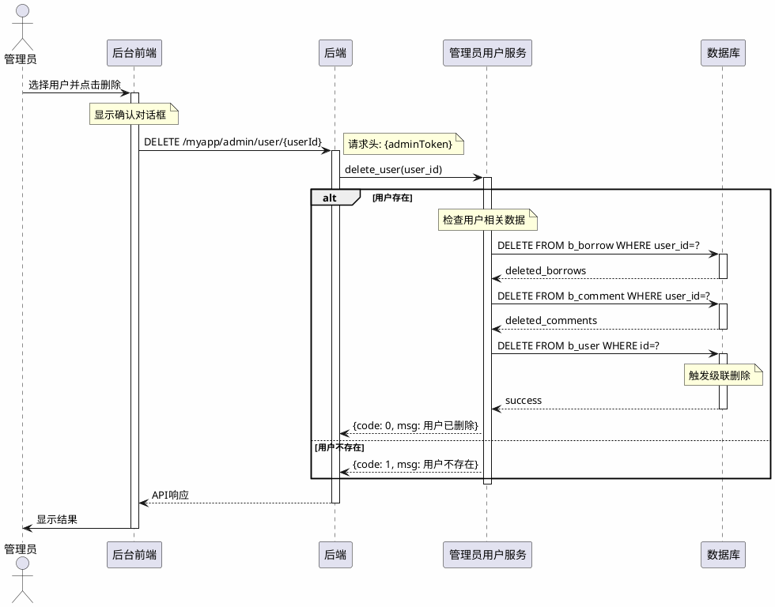
```plantuml
@startuml UserDeleteSequence
skinparam defaultFontName "Microsoft YaHei UI"
skinparam backgroundColor #FEFEFE

actor 管理员 as admin
participant "后台前端" as afe
participant 后端 as be
participant 管理员用户服务 as service
participant 数据库 as db

admin -> afe: 选择用户并点击删除
activate afe
note over afe: 显示确认对话框

afe -> be: DELETE /myapp/admin/user/{userId}
note right: 请求头: {adminToken}
activate be

be -> service: delete_user(user_id)
activate service

alt 用户存在
    note over service: 检查用户相关数据
    
    service -> db: DELETE FROM b_borrow WHERE user_id=?
    activate db
    db --> service: deleted_borrows
    deactivate db
    
    service -> db: DELETE FROM b_comment WHERE user_id=?
    activate db
    db --> service: deleted_comments
    deactivate db
    
    service -> db: DELETE FROM b_user WHERE id=?
    activate db
    note over db: 触发级联删除
    db --> service: success
    deactivate db
    
    service --> be: {code: 0, msg: 用户已删除}
else 用户不存在
    service --> be: {code: 1, msg: 用户不存在}
end
deactivate service

be --> afe: API响应
deactivate be

afe -> admin: 显示结果
deactivate afe

@enduml
```

---

## 4.2	图书信息管理模块的实现

该部分实现管理员添加图书、图书信息搜索、修改、删除和用户的图书浏览、收藏功能。

### 4.2.1	图书添加的实现

管理员在后台管理页面点击"添加图书"按钮，页面会弹出包含图书名称、作者、分类、封面、描述等信息的表单。管理员填好必要信息后点击"提交"，前端将输入的数据封装成Book对象，调用`addBook`方法以POST请求发送至后端。后端的`AdminBookController`类中的`create`方法接收前端传来的Book对象，并处理文件上传。该方法会调用服务层的`insertBook`方法将图书信息插入数据库。若插入成功，返回成功响应；若出现异常，返回包含错误信息的响应。图书添加的时序图如图4-5所示。

**图书添加时序图代码（PlantUML）：**

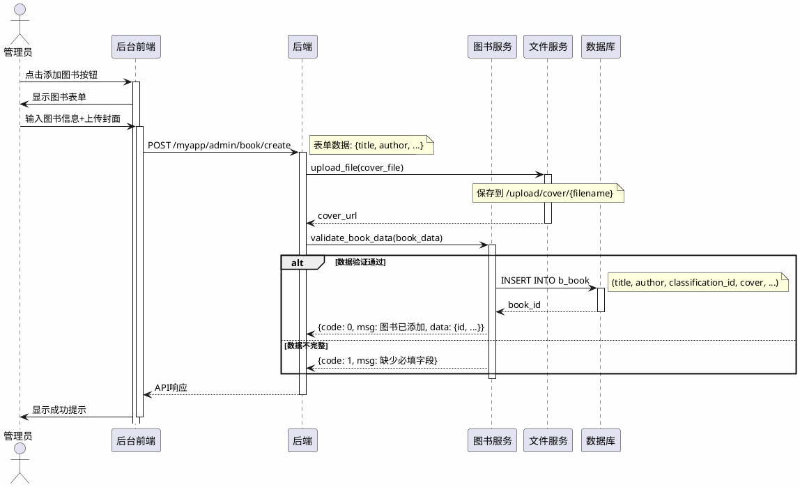
```plantuml
@startuml BookAddSequence
skinparam defaultFontName "Microsoft YaHei UI"
skinparam backgroundColor #FEFEFE

actor 管理员 as admin
participant "后台前端" as afe
participant 后端 as be
participant 图书服务 as service
participant 文件服务 as fs
participant 数据库 as db

admin -> afe: 点击添加图书按钮
activate afe
afe -> admin: 显示图书表单

admin -> afe: 输入图书信息+上传封面
activate afe

afe -> be: POST /myapp/admin/book/create
note right: 请求头: {adminToken}
note right: 表单数据: {title, author, ...}
activate be

be -> fs: upload_file(cover_file)
activate fs
note over fs: 保存到 /upload/cover/{filename}
fs --> be: cover_url
deactivate fs

be -> service: validate_book_data(book_data)
activate service

alt 数据验证通过
    service -> db: INSERT INTO b_book
    note right: (title, author, classification_id, cover, ...)
    activate db
    db --> service: book_id
    deactivate db
    service --> be: {code: 0, msg: 图书已添加, data: {id, ...}}
else 数据不完整
    service --> be: {code: 1, msg: 缺少必填字段}
end
deactivate service

be --> afe: API响应
deactivate be

afe -> admin: 显示成功提示
deactivate afe

@enduml
```

### 4.2.2	图书搜索的实现

用户在前端搜索框输入图书名称或作者，点击"搜索"按钮，前端将查询条件封装成对象，调用`searchBooks`方法向后端发送GET请求。后端的`IndexBookController`类中的`search`方法接收查询条件对象，调用服务层的`searchBooks`方法进行查询。服务层根据查询条件创建查询条件对象，调用数据访问层的方法从数据库中筛选符合条件的图书信息，并将结果返回给控制器。控制器将结果返回给前端。图书搜索的时序图如图4-6所示。

**图书搜索时序图代码（PlantUML）：**

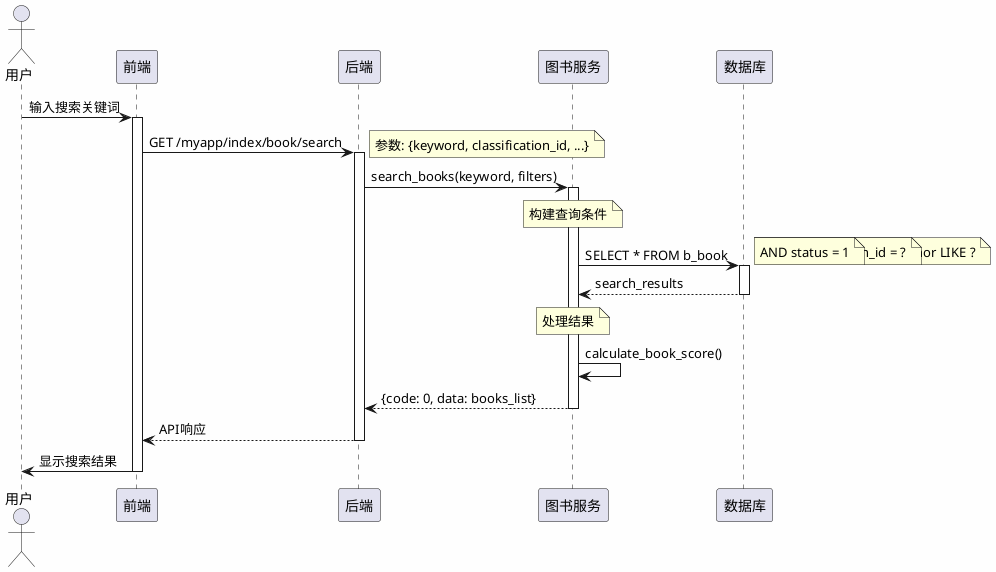
```plantuml
@startuml BookSearchSequence
skinparam defaultFontName "Microsoft YaHei UI"
skinparam backgroundColor #FEFEFE

actor 用户 as user
participant 前端 as fe
participant 后端 as be
participant 图书服务 as service
participant 数据库 as db

user -> fe: 输入搜索关键词
activate fe

fe -> be: GET /myapp/index/book/search
note right: 参数: {keyword, classification_id, ...}
activate be

be -> service: search_books(keyword, filters)
activate service

note over service: 构建查询条件
service -> db: SELECT * FROM b_book
note right: WHERE title LIKE ? OR author LIKE ?
note right: AND classification_id = ?
note right: AND status = 1
activate db
db --> service: search_results
deactivate db

note over service: 处理结果
service -> service: calculate_book_score()
service --> be: {code: 0, data: books_list}
deactivate service

be --> fe: API响应
deactivate be

fe -> user: 显示搜索结果
deactivate fe

@enduml
```

### 4.2.3	图书信息更新的实现

管理员在图书管理页面点击某条图书信息的"编辑"选项，前端调用`getBookDetail`方法向后端发送GET请求，获取该图书的详细信息。获取信息后，前端将信息填充到修改表单中，管理员修改信息后点击"保存"按钮，前端将修改后的Book对象调用`updateBook`方法以PUT请求发送至后端。后端的`AdminBookController`类中的`update`方法接收修改后的Book对象，调用服务层的`updateBook`方法更新图书信息。服务层会对修改后的Book对象进行数据验证，然后调用数据访问层的方法更新数据库中的图书信息。时序图如图4-7所示。

**图书信息更新时序图代码（PlantUML）：**

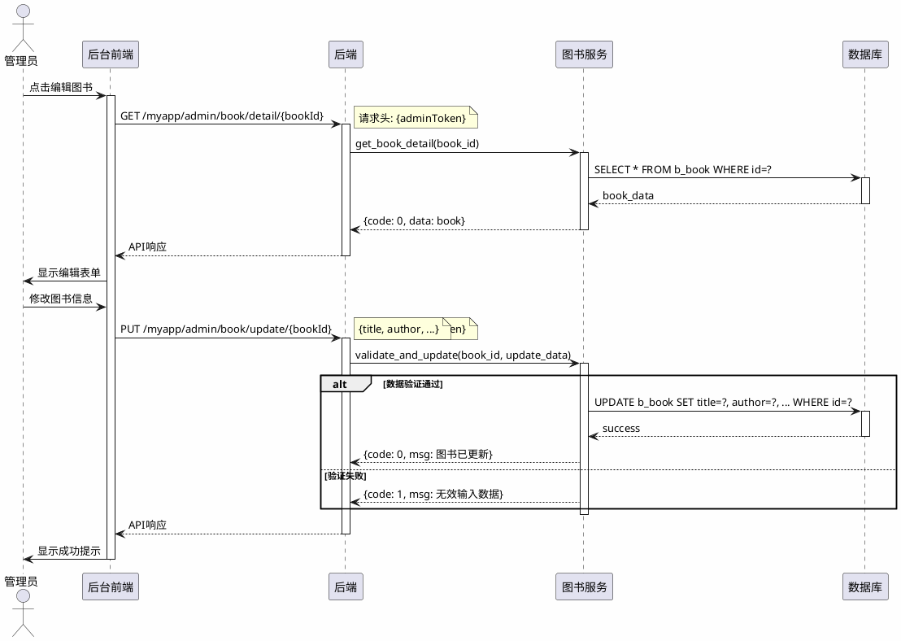
```plantuml
@startuml BookUpdateSequence
skinparam defaultFontName "Microsoft YaHei UI"
skinparam backgroundColor #FEFEFE

actor 管理员 as admin
participant "后台前端" as afe
participant 后端 as be
participant 图书服务 as service
participant 数据库 as db

admin -> afe: 点击编辑图书
activate afe

afe -> be: GET /myapp/admin/book/detail/{bookId}
note right: 请求头: {adminToken}
activate be

be -> service: get_book_detail(book_id)
activate service
service -> db: SELECT * FROM b_book WHERE id=?
activate db
db --> service: book_data
deactivate db
service --> be: {code: 0, data: book}
deactivate service

be --> afe: API响应
deactivate be

afe -> admin: 显示编辑表单
admin -> afe: 修改图书信息

afe -> be: PUT /myapp/admin/book/update/{bookId}
note right: 请求头: {adminToken}
note right: {title, author, ...}
activate be

be -> service: validate_and_update(book_id, update_data)
activate service

alt 数据验证通过
    service -> db: UPDATE b_book SET title=?, author=?, ... WHERE id=?
    activate db
    db --> service: success
    deactivate db
    service --> be: {code: 0, msg: 图书已更新}
else 验证失败
    service --> be: {code: 1, msg: 无效输入数据}
end
deactivate service

be --> afe: API响应
deactivate be

afe -> admin: 显示成功提示
deactivate afe

@enduml
```

### 4.2.4	图书删除的实现

管理员在图书管理页面点击图书的删除按钮后，前端弹出确认提示框，管理员确认后，前端调用`deleteBook`方法向后端发送DELETE请求。后端的`AdminBookController`类接收到图书ID后，调用服务层的`deleteBook`方法删除图书信息。服务层调用数据访问层的方法根据图书ID从数据库中删除对应的图书信息。删除时会级联处理该图书相关的标签关联、借阅记录等。若删除成功，返回成功响应；若出现异常，返回包含错误信息的响应。时序图如图4-8所示。

**图书删除时序图代码（PlantUML）：**

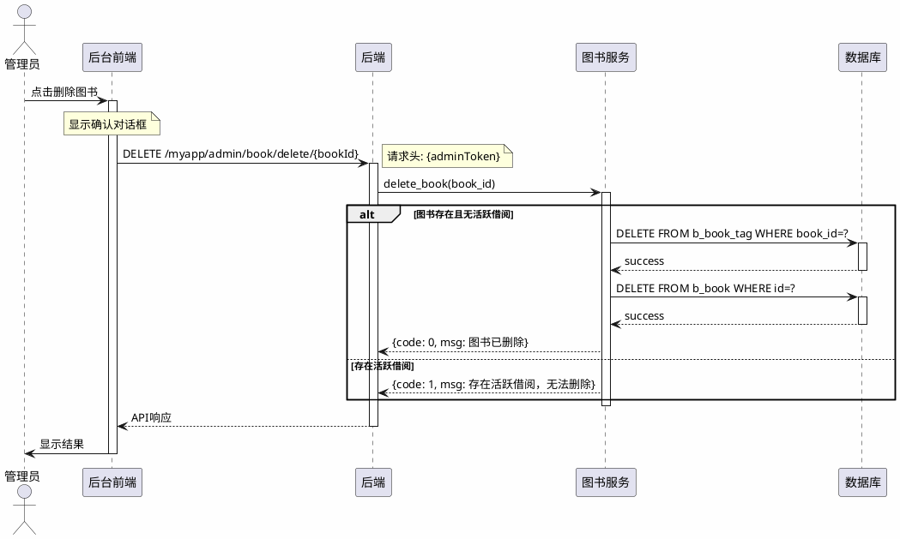
```plantuml
@startuml BookDeleteSequence
skinparam defaultFontName "Microsoft YaHei UI"
skinparam backgroundColor #FEFEFE

actor 管理员 as admin
participant "后台前端" as afe
participant 后端 as be
participant 图书服务 as service
participant 数据库 as db

admin -> afe: 点击删除图书
activate afe
note over afe: 显示确认对话框

afe -> be: DELETE /myapp/admin/book/delete/{bookId}
note right: 请求头: {adminToken}
activate be

be -> service: delete_book(book_id)
activate service

alt 图书存在且无活跃借阅
    service -> db: DELETE FROM b_book_tag WHERE book_id=?
    activate db
    db --> service: success
    deactivate db
    
    service -> db: DELETE FROM b_book WHERE id=?
    activate db
    db --> service: success
    deactivate db
    
    service --> be: {code: 0, msg: 图书已删除}
else 存在活跃借阅
    service --> be: {code: 1, msg: 存在活跃借阅，无法删除}
end
deactivate service

be --> afe: API响应
deactivate be

afe -> admin: 显示结果
deactivate afe

@enduml
```

### 4.2.5	图书收藏与取消收藏的实现

用户在图书详情页面点击"收藏"按钮，前端调用`collectBook`方法，向后端发送包含要收藏图书ID的请求。后端接收到图书ID后，会调用服务层的`collectBook`方法。在服务层中，此方法会先检查用户的登录状态，若用户未登录，则返回提示用户先登录的响应信息。若用户已登录，服务层会继续调用数据访问层，创建一条新的图书收藏记录，同时更新图书的收藏计数。若再次点击收藏按钮，系统识别为取消收藏，删除该收藏记录。时序图如图4-9所示。

**图书收藏时序图代码（PlantUML）：**

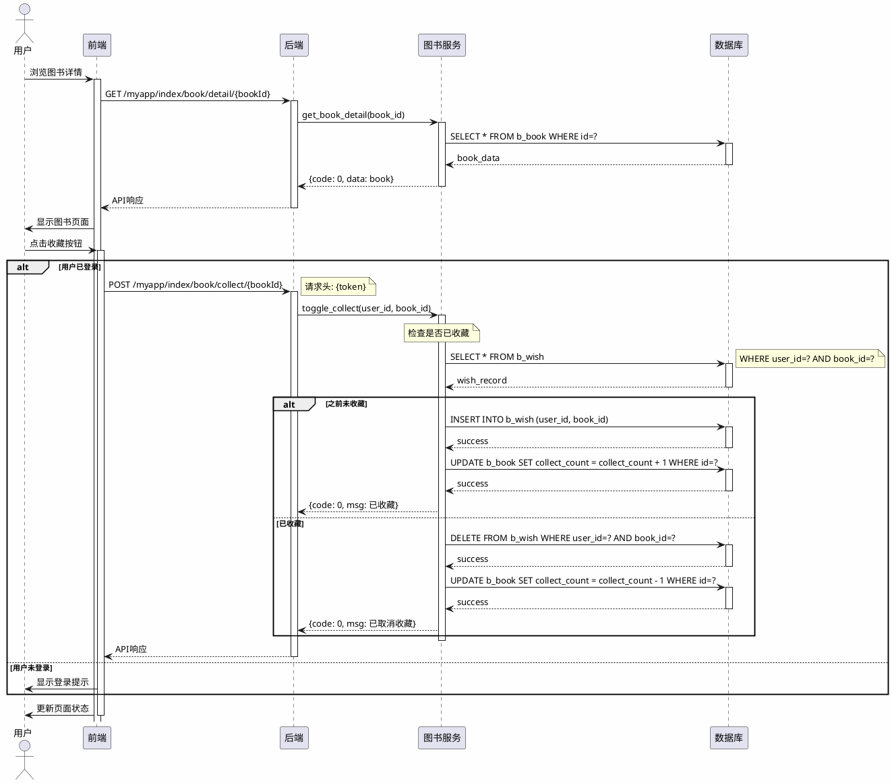
```plantuml
@startuml BookCollectSequence
skinparam defaultFontName "Microsoft YaHei UI"
skinparam backgroundColor #FEFEFE

actor 用户 as user
participant 前端 as fe
participant 后端 as be
participant 图书服务 as service
participant 数据库 as db

user -> fe: 浏览图书详情
activate fe

fe -> be: GET /myapp/index/book/detail/{bookId}
activate be
be -> service: get_book_detail(book_id)
activate service
service -> db: SELECT * FROM b_book WHERE id=?
activate db
db --> service: book_data
deactivate db
service --> be: {code: 0, data: book}
deactivate service
be --> fe: API响应
deactivate be

fe -> user: 显示图书页面

user -> fe: 点击收藏按钮
activate fe

alt 用户已登录
    fe -> be: POST /myapp/index/book/collect/{bookId}
    note right: 请求头: {token}
    activate be
    
    be -> service: toggle_collect(user_id, book_id)
    activate service
    
    note over service: 检查是否已收藏
    service -> db: SELECT * FROM b_wish
    note right: WHERE user_id=? AND book_id=?
    activate db
    db --> service: wish_record
    deactivate db
    
    alt 之前未收藏
        service -> db: INSERT INTO b_wish (user_id, book_id)
        activate db
        db --> service: success
        deactivate db
        
        service -> db: UPDATE b_book SET collect_count = collect_count + 1 WHERE id=?
        activate db
        db --> service: success
        deactivate db
        
        service --> be: {code: 0, msg: 已收藏}
    else 已收藏
        service -> db: DELETE FROM b_wish WHERE user_id=? AND book_id=?
        activate db
        db --> service: success
        deactivate db
        
        service -> db: UPDATE b_book SET collect_count = collect_count - 1 WHERE id=?
        activate db
        db --> service: success
        deactivate db
        
        service --> be: {code: 0, msg: 已取消收藏}
    end
    deactivate service
    
    be --> fe: API响应
    deactivate be
else 用户未登录
    fe -> user: 显示登录提示
end

fe -> user: 更新页面状态
deactivate fe

@enduml
```

---

## 4.3	借阅信息管理模块的实现

该部分实现用户借阅管理功能和管理员的借阅数据管理功能。

### 4.3.1	借阅记录创建的实现

用户浏览到想借阅的图书后，点击"借阅"按钮。前端将借阅信息，包括书籍ID、用户ID等封装成对象，调用`createBorrow`方法发送到后端。后端接收到参数后，调用服务层的`createBorrow`方法执行借阅创建的功能。服务层会进行业务逻辑处理，检查图书库存是否充足、用户是否有过期未还的借阅等。调用数据访问层的方法插入借阅记录到数据库，并更新图书库存。若借阅创建成功，返回包含借阅ID的成功响应。时序图如图4-10所示。

**借阅创建时序图代码（PlantUML）：**

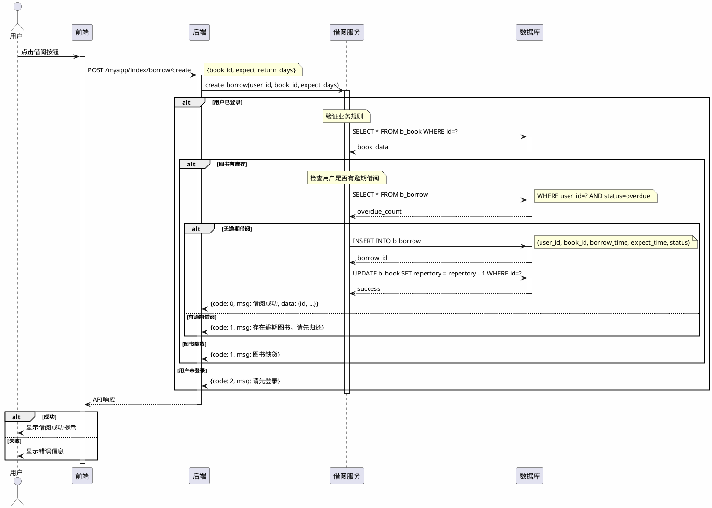
```plantuml
@startuml BorrowCreateSequence
skinparam defaultFontName "Microsoft YaHei UI"
skinparam backgroundColor #FEFEFE

actor 用户 as user
participant 前端 as fe
participant 后端 as be
participant 借阅服务 as service
participant 数据库 as db

user -> fe: 点击借阅按钮
activate fe

fe -> be: POST /myapp/index/borrow/create
note right: 请求头: {token}
note right: {book_id, expect_return_days}
activate be

be -> service: create_borrow(user_id, book_id, expect_days)
activate service

alt 用户已登录
    note over service: 验证业务规则
    
    service -> db: SELECT * FROM b_book WHERE id=?
    activate db
    db --> service: book_data
    deactivate db
    
    alt 图书有库存
        note over service: 检查用户是否有逾期借阅
        service -> db: SELECT * FROM b_borrow
        note right: WHERE user_id=? AND status=overdue
        activate db
        db --> service: overdue_count
        deactivate db
        
        alt 无逾期借阅
            service -> db: INSERT INTO b_borrow
            note right: (user_id, book_id, borrow_time, expect_time, status)
            activate db
            db --> service: borrow_id
            deactivate db
            
            service -> db: UPDATE b_book SET repertory = repertory - 1 WHERE id=?
            activate db
            db --> service: success
            deactivate db
            
            service --> be: {code: 0, msg: 借阅成功, data: {id, ...}}
        else 有逾期借阅
            service --> be: {code: 1, msg: 存在逾期图书，请先归还}
        end
    else 图书缺货
        service --> be: {code: 1, msg: 图书缺货}
    end
else 用户未登录
    service --> be: {code: 2, msg: 请先登录}
end
deactivate service

be --> fe: API响应
deactivate be

alt 成功
    fe -> user: 显示借阅成功提示
else 失败
    fe -> user: 显示错误信息
end
deactivate fe

@enduml
```

### 4.3.2	借阅记录查询的实现

用户进入个人中心的"我的借阅"页面，前端调用`getUserBorrows`方法向后端发送GET请求。后端接收请求后，调用服务层的方法根据用户ID和可选的筛选条件（如借阅状态、日期范围）从数据库查询借阅记录。服务层支持按状态筛选，包括"借阅中"、"已归还"、"已逾期"等。将查询结果整理后发送至前端页面，展示用户的完整借阅历史。时序图如图4-11所示。

**借阅查询时序图代码（PlantUML）：**

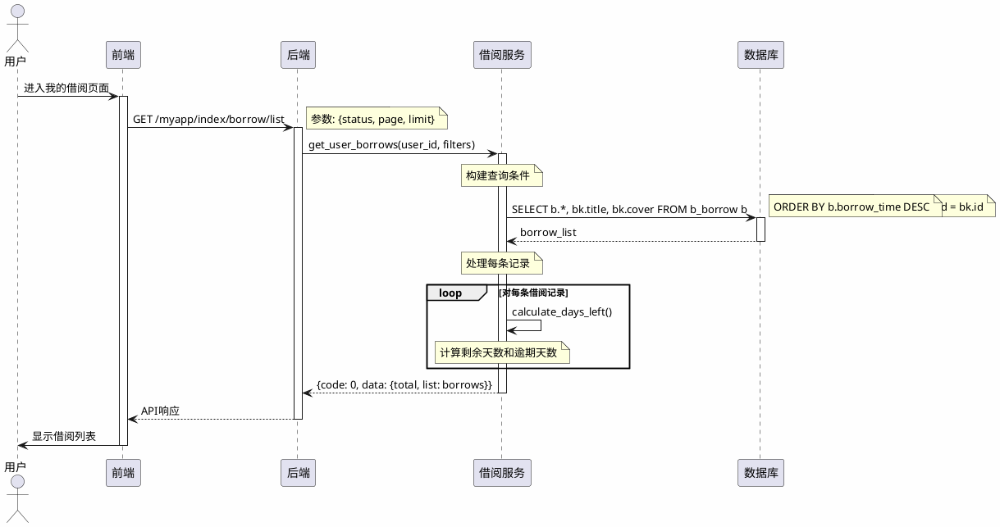
```plantuml
@startuml BorrowListSequence
skinparam defaultFontName "Microsoft YaHei UI"
skinparam backgroundColor #FEFEFE

actor 用户 as user
participant 前端 as fe
participant 后端 as be
participant 借阅服务 as service
participant 数据库 as db

user -> fe: 进入我的借阅页面
activate fe

fe -> be: GET /myapp/index/borrow/list
note right: 请求头: {token}
note right: 参数: {status, page, limit}
activate be

be -> service: get_user_borrows(user_id, filters)
activate service

note over service: 构建查询条件
service -> db: SELECT b.*, bk.title, bk.cover FROM b_borrow b
note right: LEFT JOIN b_book bk ON b.book_id = bk.id
note right: WHERE b.user_id=?
note right: ORDER BY b.borrow_time DESC
activate db
db --> service: borrow_list
deactivate db

note over service: 处理每条记录
loop 对每条借阅记录
    service -> service: calculate_days_left()
    note over service: 计算剩余天数和逾期天数
end

service --> be: {code: 0, data: {total, list: borrows}}
deactivate service

be --> fe: API响应
deactivate be

fe -> user: 显示借阅列表
deactivate fe

@enduml
```

### 4.3.3	图书归还的实现

用户在"我的借阅"页面点击某条借阅记录的"归还"按钮，前端调用`returnBook`方法向后端发送POST请求，携带借阅ID。后端接收请求后，调用服务层的`returnBook`方法。服务层会验证该借阅记录的状态，检查是否逾期。若未逾期，直接更新借阅状态为"已归还"并增加图书库存；若已逾期，系统会扣除用户积分作为处罚，然后更新状态。最后返回成功响应。时序图如图4-12所示。

**图书归还时序图代码（PlantUML）：**

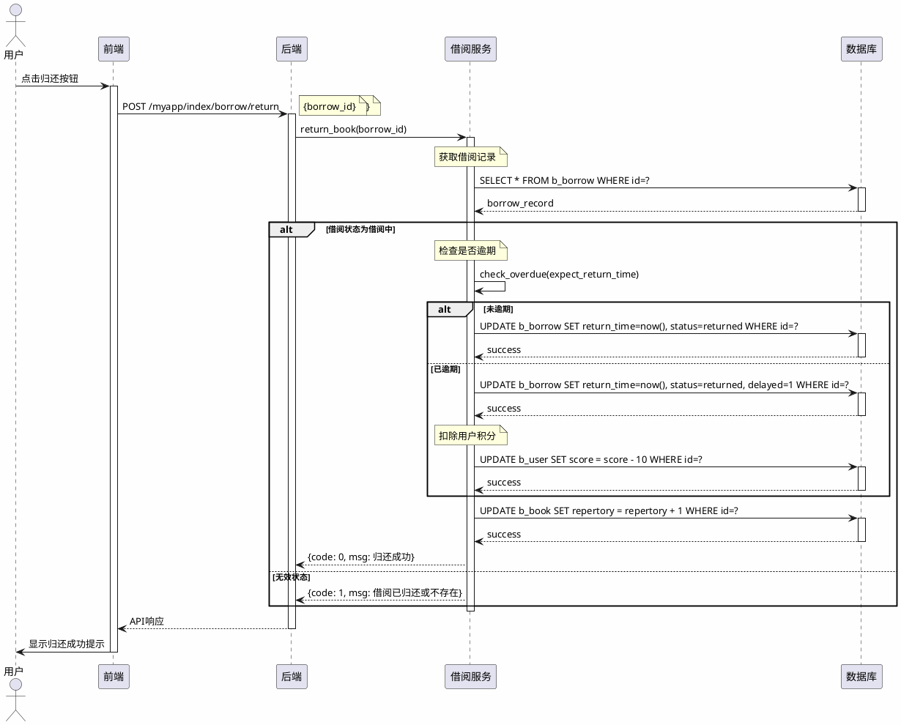
```plantuml
@startuml BookReturnSequence
skinparam defaultFontName "Microsoft YaHei UI"
skinparam backgroundColor #FEFEFE

actor 用户 as user
participant 前端 as fe
participant 后端 as be
participant 借阅服务 as service
participant 数据库 as db

user -> fe: 点击归还按钮
activate fe

fe -> be: POST /myapp/index/borrow/return
note right: 请求头: {token}
note right: {borrow_id}
activate be

be -> service: return_book(borrow_id)
activate service

note over service: 获取借阅记录
service -> db: SELECT * FROM b_borrow WHERE id=?
activate db
db --> service: borrow_record
deactivate db

alt 借阅状态为借阅中
    note over service: 检查是否逾期
    service -> service: check_overdue(expect_return_time)
    
    alt 未逾期
        service -> db: UPDATE b_borrow SET return_time=now(), status=returned WHERE id=?
        activate db
        db --> service: success
        deactivate db
    else 已逾期
        service -> db: UPDATE b_borrow SET return_time=now(), status=returned, delayed=1 WHERE id=?
        activate db
        db --> service: success
        deactivate db
        
        note over service: 扣除用户积分
        service -> db: UPDATE b_user SET score = score - 10 WHERE id=?
        activate db
        db --> service: success
        deactivate db
    end
    
    service -> db: UPDATE b_book SET repertory = repertory + 1 WHERE id=?
    activate db
    db --> service: success
    deactivate db
    
    service --> be: {code: 0, msg: 归还成功}
else 无效状态
    service --> be: {code: 1, msg: 借阅已归还或不存在}
end
deactivate service

be --> fe: API响应
deactivate be

fe -> user: 显示归还成功提示
deactivate fe

@enduml
```

### 4.3.4	借阅延期的实现

用户在"我的借阅"页面发现某本书可能无法在预期时间内归还，点击"延期"按钮。前端调用`delayBorrow`方法向后端发送请求，携带借阅ID和延期天数。后端接收请求后，调用服务层的`delayBorrow`方法。服务层会验证该借阅是否已逾期或已归还，若未逾期且未超过延期限制次数（如最多延期2次），则更新`expect_time`字段，返回成功响应。时序图如图4-13所示。

**借阅延期时序图代码（PlantUML）：**

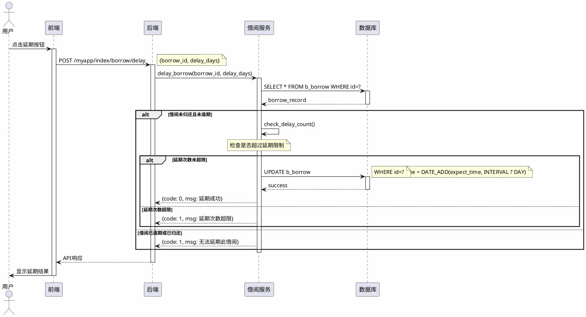
```plantuml
@startuml BorrowDelaySequence
skinparam defaultFontName "Microsoft YaHei UI"
skinparam backgroundColor #FEFEFE

actor 用户 as user
participant 前端 as fe
participant 后端 as be
participant 借阅服务 as service
participant 数据库 as db

user -> fe: 点击延期按钮
activate fe

fe -> be: POST /myapp/index/borrow/delay
note right: 请求头: {token}
note right: {borrow_id, delay_days}
activate be

be -> service: delay_borrow(borrow_id, delay_days)
activate service

service -> db: SELECT * FROM b_borrow WHERE id=?
activate db
db --> service: borrow_record
deactivate db

alt 借阅未归还且未逾期
    service -> service: check_delay_count()
    note over service: 检查是否超过延期限制
    
    alt 延期次数未超限
        service -> db: UPDATE b_borrow
        note right: SET expect_time = DATE_ADD(expect_time, INTERVAL ? DAY)
        note right: WHERE id=?
        activate db
        db --> service: success
        deactivate db
        
        service --> be: {code: 0, msg: 延期成功}
    else 延期次数超限
        service --> be: {code: 1, msg: 延期次数超限}
    end
else 借阅已逾期或已归还
    service --> be: {code: 1, msg: 无法延期此借阅}
end
deactivate service

be --> fe: API响应
deactivate be

fe -> user: 显示延期结果
deactivate fe

@enduml
```

---

## 4.4	评论与社区互动模块的实现

该部分实现用户的书评功能和社区动态发布、互动功能。

### 4.4.1	书评发布的实现

用户在已完成图书借阅后，可以点击"发表评论"按钮。前端弹出评论表单，用户输入评分和评论内容后点击发布。前端将数据封装成Comment对象，调用`addComment`方法向后端发送POST请求。后端的`IndexCommentController`接收请求，调用服务层的`addComment`方法。服务层会验证用户是否实际借阅过该图书（通过查询`b_borrow`表），验证通过后插入评论记录到数据库，同时更新图书的评论数。若插入成功，返回成功响应。时序图如图4-14所示。

**书评发布时序图代码（PlantUML）：**

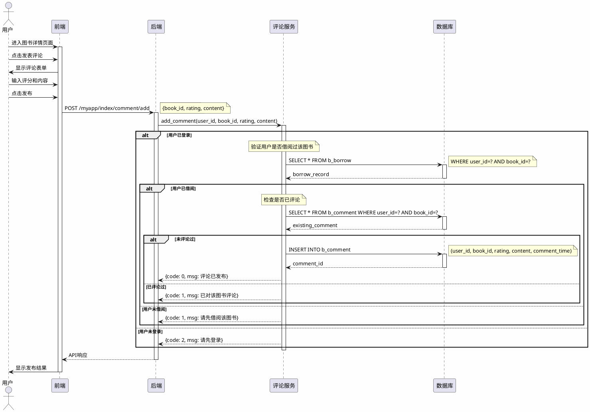
```plantuml
@startuml CommentPublishSequence
skinparam defaultFontName "Microsoft YaHei UI"
skinparam backgroundColor #FEFEFE

actor 用户 as user
participant 前端 as fe
participant 后端 as be
participant 评论服务 as service
participant 数据库 as db

user -> fe: 进入图书详情页面
activate fe

user -> fe: 点击发表评论
fe -> user: 显示评论表单

user -> fe: 输入评分和内容
user -> fe: 点击发布

fe -> be: POST /myapp/index/comment/add
note right: 请求头: {token}
note right: {book_id, rating, content}
activate be

be -> service: add_comment(user_id, book_id, rating, content)
activate service

alt 用户已登录
    note over service: 验证用户是否借阅过该图书
    service -> db: SELECT * FROM b_borrow
    note right: WHERE user_id=? AND book_id=?
    activate db
    db --> service: borrow_record
    deactivate db
    
    alt 用户已借阅
        note over service: 检查是否已评论
        service -> db: SELECT * FROM b_comment WHERE user_id=? AND book_id=?
        activate db
        db --> service: existing_comment
        deactivate db
        
        alt 未评论过
            service -> db: INSERT INTO b_comment
            note right: (user_id, book_id, rating, content, comment_time)
            activate db
            db --> service: comment_id
            deactivate db
            
            service --> be: {code: 0, msg: 评论已发布}
        else 已评论过
            service --> be: {code: 1, msg: 已对该图书评论}
        end
    else 用户未借阅
        service --> be: {code: 1, msg: 请先借阅该图书}
    end
else 用户未登录
    service --> be: {code: 2, msg: 请先登录}
end
deactivate service

be --> fe: API响应
deactivate be

fe -> user: 显示发布结果
deactivate fe

@enduml
```

### 4.4.2	评论点赞的实现

用户浏览评论时，可以点击评论旁边的"点赞"按钮。前端调用`likeComment`方法，向后端发送包含评论ID的请求。后端接收请求后，调用服务层的`likeComment`方法。服务层会检查用户是否已点赞过该评论，若未点赞，则记录点赞关系并更新评论的点赞计数；若已点赞，则取消点赞。时序图如图4-15所示。

**评论点赞时序图代码（PlantUML）：**

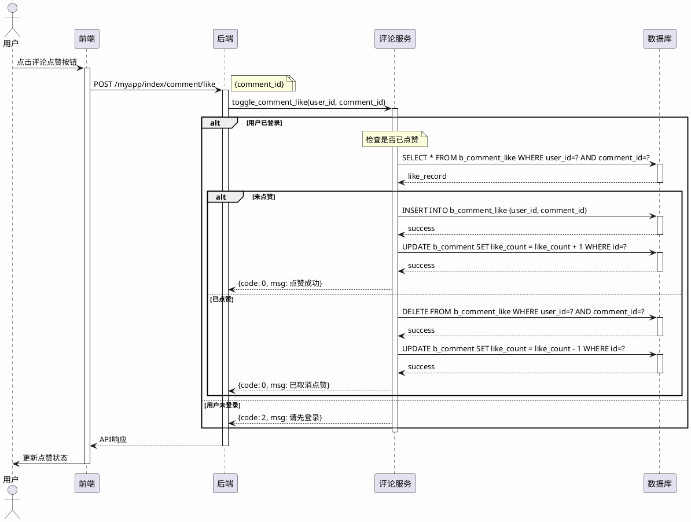
```plantuml
@startuml CommentLikeSequence
skinparam defaultFontName "Microsoft YaHei UI"
skinparam backgroundColor #FEFEFE

actor 用户 as user
participant 前端 as fe
participant 后端 as be
participant 评论服务 as service
participant 数据库 as db

user -> fe: 点击评论点赞按钮
activate fe

fe -> be: POST /myapp/index/comment/like
note right: 请求头: {token}
note right: {comment_id}
activate be

be -> service: toggle_comment_like(user_id, comment_id)
activate service

alt 用户已登录
    note over service: 检查是否已点赞
    service -> db: SELECT * FROM b_comment_like WHERE user_id=? AND comment_id=?
    activate db
    db --> service: like_record
    deactivate db
    
    alt 未点赞
        service -> db: INSERT INTO b_comment_like (user_id, comment_id)
        activate db
        db --> service: success
        deactivate db
        
        service -> db: UPDATE b_comment SET like_count = like_count + 1 WHERE id=?
        activate db
        db --> service: success
        deactivate db
        
        service --> be: {code: 0, msg: 点赞成功}
    else 已点赞
        service -> db: DELETE FROM b_comment_like WHERE user_id=? AND comment_id=?
        activate db
        db --> service: success
        deactivate db
        
        service -> db: UPDATE b_comment SET like_count = like_count - 1 WHERE id=?
        activate db
        db --> service: success
        deactivate db
        
        service --> be: {code: 0, msg: 已取消点赞}
    end
else 用户未登录
    service --> be: {code: 2, msg: 请先登录}
end
deactivate service

be --> fe: API响应
deactivate be

fe -> user: 更新点赞状态
deactivate fe

@enduml
```

### 4.4.3	社区动态发布的实现

用户在社区板块点击"发表动态"按钮，前端弹出发布表单。用户输入标题和内容，可选上传图片，点击发布。前端将数据封装成Post对象，调用`addPost`方法向后端发送POST请求。后端接收请求后，调用服务层的`addPost`方法。服务层处理图片上传，然后验证内容是否符合社区规则（如不包含禁用词汇等），通过验证后插入社区动态到数据库。时序图如图4-16所示。

**社区动态发布时序图代码（PlantUML）：**

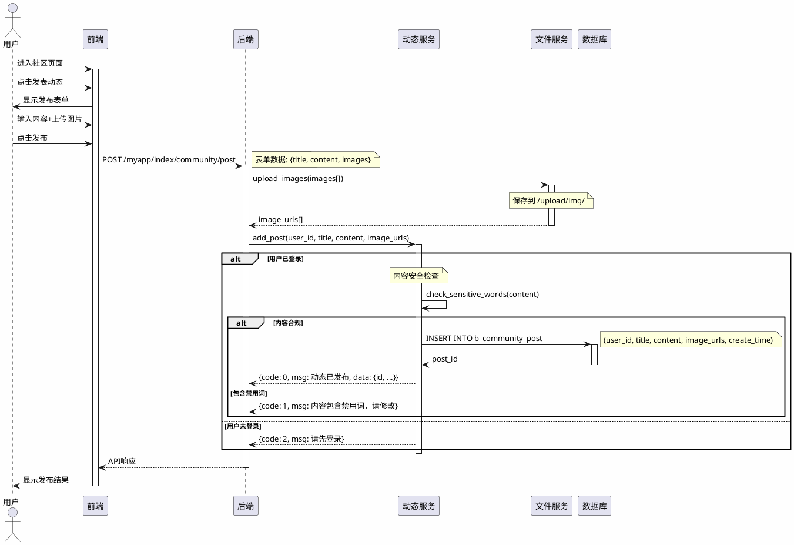
```plantuml
@startuml PostPublishSequence
skinparam defaultFontName "Microsoft YaHei UI"
skinparam backgroundColor #FEFEFE

actor 用户 as user
participant 前端 as fe
participant 后端 as be
participant 动态服务 as service
participant 文件服务 as fs
participant 数据库 as db

user -> fe: 进入社区页面
activate fe

user -> fe: 点击发表动态
fe -> user: 显示发布表单

user -> fe: 输入内容+上传图片
user -> fe: 点击发布

fe -> be: POST /myapp/index/community/post
note right: 请求头: {token}
note right: 表单数据: {title, content, images}
activate be

be -> fs: upload_images(images[])
activate fs
note over fs: 保存到 /upload/img/
fs --> be: image_urls[]
deactivate fs

be -> service: add_post(user_id, title, content, image_urls)
activate service

alt 用户已登录
    note over service: 内容安全检查
    service -> service: check_sensitive_words(content)
    
    alt 内容合规
        service -> db: INSERT INTO b_community_post
        note right: (user_id, title, content, image_urls, create_time)
        activate db
        db --> service: post_id
        deactivate db
        
        service --> be: {code: 0, msg: 动态已发布, data: {id, ...}}
    else 包含禁用词
        service --> be: {code: 1, msg: 内容包含禁用词，请修改}
    end
else 用户未登录
    service --> be: {code: 2, msg: 请先登录}
end
deactivate service

be --> fe: API响应
deactivate be

fe -> user: 显示发布结果
deactivate fe

@enduml
```

---

## 4.5	系统管理模块的实现

该部分实现分类、标签、通知等系统配置功能。

### 4.5.1	分类管理的实现

管理员在后台管理页面进入"分类管理"菜单。前端调用`getClassifications`方法向后端发送GET请求获取所有分类。后端调用服务层的`getAllClassifications`方法从数据库查询分类列表，支持树形结构展示。管理员可以添加、修改或删除分类。添加分类时，前端调用`addClassification`方法发送POST请求，后端验证分类名称唯一性后插入数据库。删除分类时会检查是否有图书关联，如无关联则删除。时序图如图4-17所示。

**分类管理时序图代码（PlantUML）：**

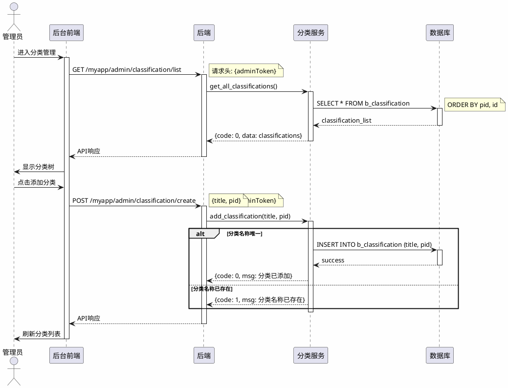
```plantuml
@startuml ClassificationManageSequence
skinparam defaultFontName "Microsoft YaHei UI"
skinparam backgroundColor #FEFEFE

actor 管理员 as admin
participant "后台前端" as afe
participant 后端 as be
participant 分类服务 as service
participant 数据库 as db

admin -> afe: 进入分类管理
activate afe

afe -> be: GET /myapp/admin/classification/list
note right: 请求头: {adminToken}
activate be

be -> service: get_all_classifications()
activate service
service -> db: SELECT * FROM b_classification
note right: ORDER BY pid, id
activate db
db --> service: classification_list
deactivate db
service --> be: {code: 0, data: classifications}
deactivate service

be --> afe: API响应
deactivate be

afe -> admin: 显示分类树

admin -> afe: 点击添加分类

afe -> be: POST /myapp/admin/classification/create
note right: 请求头: {adminToken}
note right: {title, pid}
activate be

be -> service: add_classification(title, pid)
activate service

alt 分类名称唯一
    service -> db: INSERT INTO b_classification (title, pid)
    activate db
    db --> service: success
    deactivate db
    service --> be: {code: 0, msg: 分类已添加}
else 分类名称已存在
    service --> be: {code: 1, msg: 分类名称已存在}
end
deactivate service

be --> afe: API响应
deactivate be

afe -> admin: 刷新分类列表
deactivate afe

@enduml
```

### 4.5.2	标签管理的实现

管理员可以在后台管理页面进行标签管理。前端调用`getTags`方法获取所有标签列表。后端调用服务层从数据库查询标签。管理员可以添加新标签，前端调用`addTag`方法向后端发送POST请求。后端验证标签名称唯一性后，插入标签到数据库。删除标签时会先删除相关的图书-标签关联关系，然后删除标签。时序图如图4-18所示。

**标签管理时序图代码（PlantUML）：**

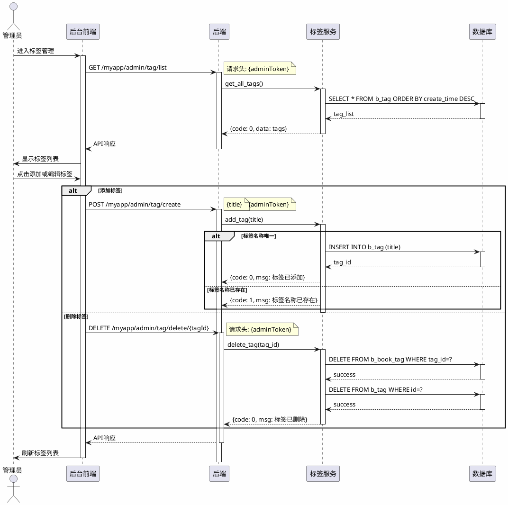
```plantuml
@startuml TagManageSequence
skinparam defaultFontName "Microsoft YaHei UI"
skinparam backgroundColor #FEFEFE

actor 管理员 as admin
participant "后台前端" as afe
participant 后端 as be
participant 标签服务 as service
participant 数据库 as db

admin -> afe: 进入标签管理
activate afe

afe -> be: GET /myapp/admin/tag/list
note right: 请求头: {adminToken}
activate be

be -> service: get_all_tags()
activate service
service -> db: SELECT * FROM b_tag ORDER BY create_time DESC
activate db
db --> service: tag_list
deactivate db
service --> be: {code: 0, data: tags}
deactivate service

be --> afe: API响应
deactivate be

afe -> admin: 显示标签列表

admin -> afe: 点击添加或编辑标签

alt 添加标签
    afe -> be: POST /myapp/admin/tag/create
    note right: 请求头: {adminToken}
    note right: {title}
    activate be
    
    be -> service: add_tag(title)
    activate service
    
    alt 标签名称唯一
        service -> db: INSERT INTO b_tag (title)
        activate db
        db --> service: tag_id
        deactivate db
        service --> be: {code: 0, msg: 标签已添加}
    else 标签名称已存在
        service --> be: {code: 1, msg: 标签名称已存在}
    end
    deactivate service
else 删除标签
    afe -> be: DELETE /myapp/admin/tag/delete/{tagId}
    note right: 请求头: {adminToken}
    activate be
    
    be -> service: delete_tag(tag_id)
    activate service
    
    service -> db: DELETE FROM b_book_tag WHERE tag_id=?
    activate db
    db --> service: success
    deactivate db
    
    service -> db: DELETE FROM b_tag WHERE id=?
    activate db
    db --> service: success
    deactivate db
    
    service --> be: {code: 0, msg: 标签已删除}
    deactivate service
end

be --> afe: API响应
deactivate be

afe -> admin: 刷新标签列表
deactivate afe

@enduml
```

### 4.5.3	通知发布的实现

管理员在后台点击"通知管理"，可以发布系统通知。前端调用`addNotice`方法，向后端发送包含通知标题、内容的POST请求。后端调用服务层的`addNotice`方法，验证通知内容后插入数据库。前端定期调用`getNotices`方法获取最新通知，展示在首页或通知中心。时序图如图4-19所示。

**通知发布时序图代码（PlantUML）：**

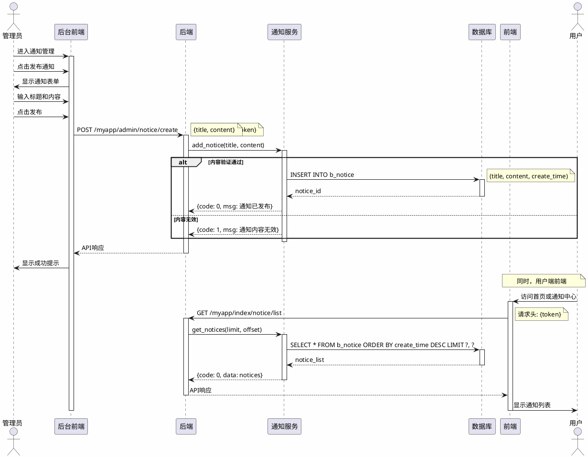
```plantuml
@startuml NoticePublishSequence
skinparam defaultFontName "Microsoft YaHei UI"
skinparam backgroundColor #FEFEFE

actor 管理员 as admin
participant "后台前端" as afe
participant 后端 as be
participant 通知服务 as service
participant 数据库 as db
participant 前端 as fe
actor 用户 as user

admin -> afe: 进入通知管理
activate afe

admin -> afe: 点击发布通知
afe -> admin: 显示通知表单

admin -> afe: 输入标题和内容
admin -> afe: 点击发布

afe -> be: POST /myapp/admin/notice/create
note right: 请求头: {adminToken}
note right: {title, content}
activate be

be -> service: add_notice(title, content)
activate service

alt 内容验证通过
    service -> db: INSERT INTO b_notice
    note right: (title, content, create_time)
    activate db
    db --> service: notice_id
    deactivate db
    
    service --> be: {code: 0, msg: 通知已发布}
else 内容无效
    service --> be: {code: 1, msg: 通知内容无效}
end
deactivate service

be --> afe: API响应
deactivate be

afe -> admin: 显示成功提示

note over user,fe: 同时，用户端前端
user -> fe: 访问首页或通知中心
activate fe

fe -> be: GET /myapp/index/notice/list
note right: 请求头: {token}
activate be

be -> service: get_notices(limit, offset)
activate service
service -> db: SELECT * FROM b_notice ORDER BY create_time DESC LIMIT ?, ?
activate db
db --> service: notice_list
deactivate db
service --> be: {code: 0, data: notices}
deactivate service

be --> fe: API响应
deactivate be

fe -> user: 显示通知列表
deactivate fe

deactivate afe

@enduml
```

---

## 4.6	推荐算法模块的实现

本系统主要运用了基于内容和用户的协同过滤相结合的推荐算法，为用户推荐图书。该算法能够根据用户的借阅历史、收藏行为和其他用户的偏好来计算推荐。

### 4.6.1	推荐算法流程

**算法步骤如下：**

1. **请求映射**：通过`@RequestMapping("/recommend")`注解，指定该方法处理的URL路径为`recommend`，用于接收获取推荐图书的请求。

2. **用户认证与参数获取**：
   - `userId`：接收请求中的用户ID参数，确定对哪个用户进行推荐。
   - 验证用户是否已登录。

3. **数据收集**：
   - 调用`recommendMapper.getCollects()`方法从数据库获取所有用户的收藏/借阅关系数据，存储在`List<CollectRecord>`中。
   - 每条记录包含`userId`和`bookId`，用于记录用户的行为。

4. **相似度计算**：
   - 创建`CollaborativeFiltering`类的实例`cf`，将收集到的数据作为参数传入其构造函数。
   - 构造函数内部构建用户-图书矩阵`userBookMatrix`和用户相似度矩阵。
   - 计算用户间的相似度，采用Jaccard相似度公式：
     $$sim(u_1, u_2) = \frac{|Books_{u_1} \cap Books_{u_2}|}{|Books_{u_1} \cup Books_{u_2}|}$$
     其中，$Books_u$表示用户$u$的借阅/收藏图书集合。

5. **找出相似用户**：
   - 调用`cf.findTopKSimilarUsers(userId, k)`方法，查找与目标用户最相似的$k$个用户（通常$k=5$或$k=10$）。
   - 该方法遍历所有用户，计算与目标用户的相似度，并返回相似度最高的$k$个用户。

6. **生成推荐列表**：
   - 遍历相似用户集合，收集这些用户已借阅/收藏但目标用户未借阅的图书。
   - 对收集到的图书进行评分，评分公式为：
     $$score_{book} = \sum_{u \in similarUsers} sim(targetUser, u) \times I(u \text{ liked } book)$$
     其中，$I()$为指示函数，用户喜欢该图书时为1，否则为0。
   - 按评分从高到低排序，取前$N$本（通常$N=10$或$N=20$）作为推荐结果。

7. **返回推荐结果**：
   - 返回推荐图书的ID列表`List<Integer>`和对应的评分。

8. **后续处理**：
   - 根据推荐的图书ID列表，调用`bookService.getBooksByIds(recommendedBookIds)`查询具体的图书信息。
   - 包括书名、作者、封面、描述等详细信息。
   - 将信息封装成适当的数据结构`List<RecommendedBook>`，以JSON格式返回给前端。
   - 前端展示在"推荐给你"或"你可能喜欢"板块。

### 4.6.2	推荐算法时序图

**推荐算法的完整时序图如图4-20所示：**

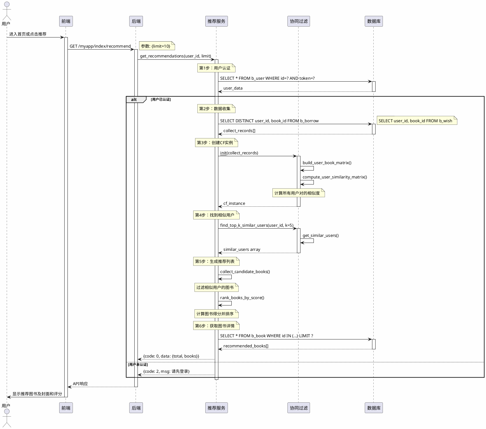
```plantuml
@startuml RecommendAlgorithmSequence
skinparam defaultFontName "Microsoft YaHei UI"
skinparam backgroundColor #FEFEFE

actor 用户 as user
participant 前端 as fe
participant 后端 as be
participant 推荐服务 as service
participant 协同过滤 as cf
participant 数据库 as db

user -> fe: 进入首页或点击推荐
activate fe

fe -> be: GET /myapp/index/recommend
note right: 请求头: {token}
note right: 参数: {limit=10}
activate be

be -> service: get_recommendations(user_id, limit)
activate service

note over service: 第1步：用户认证
service -> db: SELECT * FROM b_user WHERE id=? AND token=?
activate db
db --> service: user_data
deactivate db

alt 用户已认证
    note over service: 第2步：数据收集
    service -> db: SELECT DISTINCT user_id, book_id FROM b_borrow
    note right: UNION
    note right: SELECT user_id, book_id FROM b_wish
    activate db
    db --> service: collect_records[]
    deactivate db
    
    note over service: 第3步：创建CF实例
    service -> cf: __init__(collect_records)
    activate cf
    cf -> cf: build_user_book_matrix()
    cf -> cf: compute_user_similarity_matrix()
    note over cf: 计算所有用户对的相似度
    cf --> service: cf_instance
    deactivate cf
    
    note over service: 第4步：找到相似用户
    service -> cf: find_top_k_similar_users(user_id, k=5)
    activate cf
    cf -> cf: get_similar_users()
    cf --> service: similar_users array
    deactivate cf
    
    note over service: 第5步：生成推荐列表
    service -> service: collect_candidate_books()
    note over service: 过滤相似用户的图书
    
    service -> service: rank_books_by_score()
    note over service: 计算图书得分并排序
    
    note over service: 第6步：获取图书详情
    service -> db: SELECT * FROM b_book WHERE id IN (...) LIMIT ?
    activate db
    db --> service: recommended_books[]
    deactivate db
    
    service --> be: {code: 0, data: {total, books}}
else 用户未认证
    service --> be: {code: 2, msg: 请先登录}
end
deactivate service

be --> fe: API响应
deactivate be

fe -> user: 显示推荐图书及封面和评分
deactivate fe

@enduml
```

### 4.6.3	推荐算法的Python实现代码示例

在[server/myapp/recommend_books/recommend.py](server/myapp/recommend_books/recommend.py)中，推荐算法的核心实现如下：

```python
from django.db.models import Q
from myapp.models import Borrow, Wish, Book, User

class CollaborativeFiltering:
    """基于用户的协同过滤推荐算法"""
    
    def __init__(self, borrow_records, wish_records):
        """
        初始化推荐算法
        
        Args:
            borrow_records: 借阅记录列表
            wish_records: 收藏/希望列表
        """
        self.user_book_matrix = {}  # {user_id: set(book_ids)}
        self.user_similarity = {}   # {(u1, u2): similarity_score}
        
        # 构建用户-图书矩阵
        self._build_user_book_matrix(borrow_records, wish_records)
        # 计算用户相似度矩阵
        self._compute_user_similarity_matrix()
    
    def _build_user_book_matrix(self, borrow_records, wish_records):
        """构建用户-图书矩阵"""
        # 遍历借阅记录
        for record in borrow_records:
            user_id = record['user_id']
            book_id = record['book_id']
            
            if user_id not in self.user_book_matrix:
                self.user_book_matrix[user_id] = set()
            self.user_book_matrix[user_id].add(book_id)
        
        # 遍历收藏记录
        for record in wish_records:
            user_id = record['user_id']
            book_id = record['book_id']
            
            if user_id not in self.user_book_matrix:
                self.user_book_matrix[user_id] = set()
            self.user_book_matrix[user_id].add(book_id)
    
    def _compute_user_similarity_matrix(self):
        """计算所有用户对的相似度"""
        users = list(self.user_book_matrix.keys())
        
        for i in range(len(users)):
            for j in range(i + 1, len(users)):
                u1, u2 = users[i], users[j]
                sim = self._jaccard_similarity(u1, u2)
                
                self.user_similarity[(u1, u2)] = sim
                self.user_similarity[(u2, u1)] = sim  # 对称性
    
    def _jaccard_similarity(self, user1, user2):
        """
        计算两个用户的Jaccard相似度
        
        sim(u1, u2) = |Books_u1 ∩ Books_u2| / |Books_u1 ∪ Books_u2|
        """
        books_u1 = self.user_book_matrix.get(user1, set())
        books_u2 = self.user_book_matrix.get(user2, set())
        
        if not books_u1 or not books_u2:
            return 0.0
        
        intersection = len(books_u1 & books_u2)
        union = len(books_u1 | books_u2)
        
        return intersection / union if union > 0 else 0.0
    
    def find_top_k_similar_users(self, target_user, k=5):
        """
        找到与目标用户最相似的k个用户
        
        Args:
            target_user: 目标用户ID
            k: 相似用户数量
            
        Returns:
            [(user_id, similarity_score), ...] 列表
        """
        user_similarities = []
        
        for user_id, books in self.user_book_matrix.items():
            if user_id == target_user:
                continue
            
            # 获取相似度
            sim = self.user_similarity.get(
                (target_user, user_id) if target_user < user_id 
                else (user_id, target_user),
                0.0
            )
            
            if sim > 0:  # 只考虑有相似度的用户
                user_similarities.append((user_id, sim))
        
        # 按相似度降序排序，取前k个
        user_similarities.sort(key=lambda x: x[1], reverse=True)
        return user_similarities[:k]
    
    def recommend_books(self, target_user, k=5, n=10):
        """
        为用户推荐n本图书
        
        Args:
            target_user: 目标用户ID
            k: 相似用户数量
            n: 推荐图书数量
            
        Returns:
            [book_id, ...] 列表
        """
        # 第1步：找到相似用户
        similar_users = self.find_top_k_similar_users(target_user, k)
        
        if not similar_users:
            return []  # 没有相似用户，无法推荐
        
        # 第2步：收集候选图书
        target_user_books = self.user_book_matrix.get(target_user, set())
        candidate_books = {}  # {book_id: score}
        
        for sim_user_id, similarity in similar_users:
            sim_user_books = self.user_book_matrix.get(sim_user_id, set())
            
            for book_id in sim_user_books:
                # 只考虑目标用户未借阅的图书
                if book_id not in target_user_books:
                    if book_id not in candidate_books:
                        candidate_books[book_id] = 0.0
                    # 累加相似度作为该图书的推荐得分
                    candidate_books[book_id] += similarity
        
        # 第3步：按得分排序，取前n本
        recommended_books = sorted(
            candidate_books.items(),
            key=lambda x: x[1],
            reverse=True
        )
        
        return [book_id for book_id, score in recommended_books[:n]]


class RecommendationService:
    """推荐服务"""
    
    @staticmethod
    def get_recommendations(user_id, limit=10):
        """
        获取推荐图书列表
        
        Args:
            user_id: 用户ID
            limit: 推荐数量
            
        Returns:
            {
                'code': 0,
                'data': {
                    'total': 10,
                    'books': [
                        {'id': 1, 'title': '...' , 'cover': '...', 'score': 0.8}
                    ]
                }
            }
        """
        # 第1步：验证用户
        try:
            user = User.objects.get(id=user_id)
        except User.DoesNotExist:
            return {'code': 2, 'msg': '用户不存在'}
        
        # 第2步：收集数据
        borrow_records = Borrow.objects.filter(
            status__in=['returned', 'borrowing']
        ).values('user_id', 'book_id')
        
        wish_records = Wish.objects.all().values('user_id', 'book_id')
        
        # 第3步：创建推荐算法实例
        cf = CollaborativeFiltering(
            list(borrow_records),
            list(wish_records)
        )
        
        # 第4步：生成推荐
        recommended_book_ids = cf.recommend_books(
            user_id,
            k=5,  # 相似用户数
            n=limit  # 推荐图书数
        )
        
        # 第5步：获取图书详情
        if not recommended_book_ids:
            return {'code': 0, 'data': {'total': 0, 'books': []}}
        
        recommended_books = Book.objects.filter(
            id__in=recommended_book_ids,
            status=1
        ).values('id', 'title', 'author', 'cover', 'description')[:limit]
        
        # 第6步：返回结果
        return {
            'code': 0,
            'data': {
                'total': len(list(recommended_books)),
                'books': list(recommended_books)
            }
        }
```

### 4.6.4	推荐算法的性能优化

为了提高推荐算法的效率，在实际实现中采用了以下优化措施：

1. **缓存机制**：将用户-图书矩阵和相似度矩阵缓存到Redis中，避免每次请求都重新计算。缓存的更新周期为每天一次或用户行为改变时。

2. **批量计算**：使用矩阵运算库（如NumPy）进行向量化计算，提高计算效率。

3. **增量更新**：当新增借阅或收藏时，只更新相关用户的相似度，而不是全量重算。

4. **召回优化**：只考虑与目标用户相似度大于阈值（如0.1）的用户，减少计算量。

5. **数据库索引**：在`user_id`、`book_id`字段上建立索引，加快数据查询速度。

### 4.6.5	前端推荐展示

前端在`src/views/index/recommendation.vue`中展示推荐结果：

```javascript
export default {
  name: 'Recommendation',
  data() {
    return {
      recommendedBooks: [],
      loading: false
    }
  },
  mounted() {
    this.loadRecommendations()
  },
  methods: {
    loadRecommendations() {
      this.loading = true
      this.$api.recommend().then(response => {
        if (response.code === 0) {
          this.recommendedBooks = response.data.books
        }
      }).finally(() => {
        this.loading = false
      })
    }
  }
}
```

---

## 总结

本章详细说明了图书借阅推荐系统的各主要模块的实现方式，包括：

- **用户管理**：登录、个人信息修改、账号冻结/删除
- **图书管理**：添加、搜索、更新、删除、收藏
- **借阅管理**：创建、查询、归还、延期
- **社区互动**：评论发布、点赞、动态发布
- **系统管理**：分类、标签、通知管理
- **推荐算法**：基于协同过滤的个性化推荐

每个模块都提供了时序图代码（PlantUML格式）、核心业务流程描述和Python实现示例，为系统的理解、维护和扩展提供了完整的参考。所有时序图可以复制到[PlantUML在线编辑器](http://plantuml.com/plantuml)或[Mermaid在线编辑器](https://mermaid.live)进行可视化展示。
