# 图书借阅推荐系统 - 系统设计和系统实现

## 3 系统设计

### 3.1 系统架构设计

系统采用经典的三层分层架构设计,分别为表现层(Presentation Layer)、业务逻辑层(Business Logic Layer)和数据访问层(Data Access Layer)。此种架构设计遵循了软件工程中的关注点分离原则,使得各层职责明确,便于系统的开发、维护和扩展。

**表现层**负责与用户的交互,主要包含用户界面的展示和用户输入的响应处理。在本系统中,表现层采用Vue.js 2.x框架结合Ant Design Vue组件库进行开发。Vue.js作为一个轻量级且高效的JavaScript框架,提供了丰富的指令和组件复用机制,使得前端代码组织清晰、易于维护。Ant Design Vue组件库提供了企业级的UI组件,包括表格、表单、对话框、弹窗等,确保了系统界面的美观性和一致性。系统前端分为用户端和管理员端两个部分,用户端主要展示图书浏览、搜索、借阅等功能,管理员端提供图书、用户、借阅等的管理功能。

**业务逻辑层**是系统的核心,负责实现系统的所有业务需求。该层包含了用户认证与授权管理、图书资源管理、社区互动功能、借阅流程管理以及个性化推荐算法等多个子模块。业务逻辑层通过接收来自表现层的请求,按照既定的业务规则进行处理,将结果返回给表现层。例如,在用户借书时,业务逻辑层需要验证用户身份、检查图书库存、检查用户是否已有该图书的未归还记录等多个步骤。该层的设计遵循了单一职责原则,每个模块负责特定的业务功能。

**数据访问层**负责与数据库的交互,是系统与持久化存储之间的桥梁。本系统使用Django框架内置的ORM(Object-Relational Mapping)工具来实现数据访问。ORM提供了面向对象的数据访问接口,开发者可以使用Python类和对象来操作数据库,无需编写复杂的SQL语句。这种方式提高了代码的可读性和可维护性,同时也增强了系统对数据库切换的适应性。数据访问层通过定义Models来映射数据库表,提供了增、删、改、查等基本操作,以及复杂的查询接口。

**前后端通信协议**：系统采用前后端分离的设计模式,前端和后端通过HTTP/HTTPS协议进行通信。具体地,前端通过axios库发送HTTP请求到后端的RESTful API接口,后端接收请求、处理业务逻辑后,以JSON格式返回响应结果。为了提高通信效率和用户体验,前端采用了axios拦截器,自动在每个HTTP请求的头部附加用户的身份认证Token,后端通过验证Token来确认用户身份。

**安全认证机制**：系统采用基于Token的身份认证方式,而非传统的Session机制。当用户登录成功后,系统生成一个32位的Token字符串存储在数据库中,同时将Token返回给前端,前端将Token存储在浏览器的localStorage中。在后续的API请求中,前端在HTTP请求头中附加Token。后端中间件拦截每个请求,从请求头中提取Token,查询数据库验证Token的有效性。若Token无效或过期,系统返回403错误码,触发前端的登出逻辑。这种认证方式具有以下优势：一是无状态性,服务端不需要维护Session信息,便于系统的水平扩展；二是安全性高,Token可以设置过期时间(后续优化中可以实现)；三是跨域支持,便于移动端应用的接入。

### 3.2 系统功能模块设计

#### 3.2.1 系统功能模块总体设计

系统采用模块化设计思想,将复杂的系统功能分解为六个相对独立、职责明确的功能模块。这六个模块分别为：用户管理模块、图书管理模块、借阅管理模块、社区互动模块、推荐算法模块和系统管理模块。各模块之间通过明确定义的接口进行通信,形成了一个有机的整体。

模块设计遵循以下原则：
- **高内聚性**：每个模块内部的功能紧密相关,职责单一明确；
- **低耦合性**：模块间的依赖关系最小化,通过统一的接口进行交互；
- **可扩展性**：模块采用开闭原则设计,易于扩展新功能；
- **可维护性**：模块代码结构清晰,便于理解和维护。

系统各模块之间通过接口进行协作,其详细类关系在各模块小节的类图中分别说明。

#### 3.2.2 各模块详细设计

##### 3.2.2.1 用户管理模块

用户管理模块负责用户注册、登录认证和账号管理。用户注册时填写用户名和密码,系统校验用户名唯一性并创建User记录,默认role='1'(普通用户)和status='0'(正常状态)。登录时验证用户名密码,通过后生成32位UUID作为Token存入User表的token字段(普通用户)或admin_token字段(管理员),前端将Token存入localStorage。后续请求通过axios拦截器自动在请求头附加token或adminToken,后端TokenAuthentication或AdminTokenAuthentication认证类从请求头提取Token并查询数据库验证,匹配成功则将User对象注入request.user。用户可修改昵称、头像、手机号、邮箱、性别、简介等资料,头像上传到avatar/目录。管理员可查询用户列表,冻结账号(设置status='1'),解冻账号(恢复status='0'),删除用户记录。

该模块包括控制类UserIndexView、UserAdminView,实体类User,序列化类UserSerializer,日志类LoginLog。User模型定义id(BigAutoField主键)、username、password、role(ROLE_CHOICES: 0管理员/1普通用户)、status(STATUS_CHOICES: 0正常/1封号)、gender(GENDER_CHOICES: M男/F女)、nickname、avatar(FileField)、mobile、email、description、create_time、score、push_email、push_switch、admin_token、token字段。UserIndexView处理前台register、login、updateProfile、logout请求。UserAdminView处理后台freezeUserAccount、unfreezeUserAccount、queryUserAccount、deleteViolationAccount操作。LoginLog记录username、ip、ua和log_time。

**类图展示**

```
┌──────────────────┐      ┌────────────────┐      ┌──────────┐
│  UserAdminView    │      │  UserIndexView │      │ User     │
│(后台用户管理控制) │      │(前台认证控制)  │      │(模型)    │
└─────────┬────────┘      └───────┬────────┘      └────┬─────┘
          │                        │                    │
          └──────────┬─────────────┴──────┐            │
                     │  UserSerializer    │            │
                     └──────────┬─────────┘            │
                                │                      │
                           ┌────┴────┐          ┌─────┴─────┐
                           │ Token   │          │ LoginLog   │
                           └─────────┘          └────────────┘
```

**表3-1 UserAdminView类**

| 类名 | UserAdminView |
|------|--------------|
| 包名 | myapp.views.admin.user |
| 描述 | 管理员对用户账号进行查询、冻结、解冻与删除的控制类 |

| 方法 | 权限 | 名称 | 描述 |
|------|------|------|------|
| public | freezeUserAccount | 冻结用户账号 |
| public | unfreezeUserAccount | 解冻用户账号 |
| public | queryUserAccount | 查询用户账号 |
| public | deleteViolationAccount | 删除违规用户账号 |

**表3-2 UserIndexView类**

| 类名 | UserIndexView |
|------|--------------|
| 包名 | myapp.views.index.user |
| 描述 | 前台用户注册、登录、资料维护控制类 |

| 方法 | 权限 | 名称 | 描述 |
|------|------|------|------|
| public | register | 用户注册 |
| public | login | 用户登录并生成Token |
| public | updateProfile | 修改个人资料 |
| public | logout | 退出登录 |

##### 3.2.2.2 图书管理模块

图书管理模块管理图书的新增、编辑、删除、查询和展示。管理员通过后台添加图书,填写title(标题)、original_title(原标题)、author(作者)、translator(译者)、isbn、press(出版社)、pub_date(出版日期)、description(简介)、price(价格)、page_count(页数)、repertory(库存)、score(评分)、layout(装帧)等信息,上传cover图片到cover/目录,通过外键classification关联分类,通过ManyToManyField tag关联标签,设置status(0上架/1下架)。管理员可编辑图书信息或删除图书。前台用户浏览图书列表,支持按title关键词模糊搜索,按classification外键筛选,按tag多对多关系筛选,查看图书详情。系统自动统计pv(浏览量)、collect_count(收藏数)、wish_count(心愿数)。用户通过Book.collect(ManyToManyField关联User)收藏图书,通过Book.wish关联User添加心愿单。

该模块包括控制类BookAdminView、BookIndexView,实体类Book、Classification、Tag,序列化类BookSerializer、UpdateBookSerializer,行为记录类Record。Book模型字段:id、classification(外键)、tag(多对多)、title、original_title、cover(ImageField)、author、translator、description、press、page_count、price、isbn、pub_date、online_time、status(STATUS_CHOICES)、repertory、score、layout、create_time、pv、recommend_count、wish(ManyToManyField User)、wish_count、collect(ManyToManyField User)、collect_count。Classification模型支持多级分类,pid字段=-1表示根分类。BookAdminView.list_api按keyword/c/tag筛选,detail查询详情,create/update/delete处理增删改。BookIndexView处理前台listBooks、detail、search、sort。Record记录用户浏览行为(user外键、book外键、record_time)。

**类图展示**

```
┌──────────────────┐      ┌────────────────┐      ┌──────────┐
│  BookAdminView    │      │  BookIndexView │      │ Book     │
│(后台图书管理控制) │      │(前台图书查询)  │      │(模型)    │
└─────────┬────────┘      └───────┬────────┘      └────┬─────┘
          │                        │                    │
          └──────────┬─────────────┴──────┐            │
                     │   BookSerializer   │            │
                     └──────────┬─────────┘            │
                                │                      │
                           ┌────┴──────┐       ┌──────┴──────┐
                           │Classification│    │    Tag      │
                           └──────────────┘    └─────────────┘
```

**表3-3 BookAdminView类**

| 类名 | BookAdminView |
|------|--------------|
| 包名 | myapp.views.admin.book |
| 描述 | 管理员对图书信息进行新增、编辑、删除与上下架控制 |

| 方法 | 权限 | 名称 | 描述 |
|------|------|------|------|
| public | addBook | 新增图书 |
| public | editBook | 编辑图书 |
| public | deleteBook | 删除图书 |
| public | updateStatus | 上下架管理 |

**表3-4 BookIndexView类**

| 类名 | BookIndexView |
|------|--------------|
| 包名 | myapp.views.index.book |
| 描述 | 前台图书检索、详情与排序展示控制类 |

| 方法 | 权限 | 名称 | 描述 |
|------|------|------|------|
| public | listBooks | 图书列表查询 |
| public | detail | 图书详情展示 |
| public | search | 关键字搜索 |
| public | sort | 排序与筛选 |

##### 3.2.2.3 借阅管理模块

借阅管理模块处理借书、还书、续借流程。用户发起借书请求,系统执行create视图,校验图书库存(Book.repertory>0),查询是否已有status='1'的借阅记录(重复借阅校验),验证通过后创建Borrow记录,设置user外键、book外键、status='1'(借出)、borrow_time=当前时间、expect_time=借出时间+60天、delayed=False,同时将Book.repertory-=1。用户查看"我的借阅"通过list_api按userId和borrowStatus筛选。归还图书时调用return_book视图,获取Borrow记录,更新status='2'(已还),设置return_time,将Book.repertory+=1。续借时调用renew视图,检查是否逾期和delayed状态,将expect_time延长30天,设置delayed=True。管理员通过BorrowAdminView查询所有借阅记录,按状态筛选,查看借阅统计。

该模块包括控制类BorrowIndexView、BorrowAdminView,实体类Borrow、BorrowLog,序列化类BorrowSerializer。Borrow模型字段:id、user(外键User)、book(外键Book)、status('1'借出/'2'已还)、borrow_time(DateTimeField auto_now_add)、expect_time(DateTimeField)、return_time(DateTimeField)、delayed(BooleanField,默认False表示未续借)。BorrowIndexView.list_api查询用户借阅记录(按userId和borrowStatus筛选,按borrow_time倒序),create处理借书(库存检查、重复校验、创建记录、库存减1),return_book处理还书(更新status和return_time、库存加1),renew处理续借(延期逻辑)。BorrowAdminView.queryBorrowList查询记录,updateBorrowStatus更新状态,statistics统计数据。BorrowLog记录操作日志(user外键、book外键、action、log_time)。

**类图展示**

```
┌──────────────────┐      ┌────────────────┐      ┌──────────┐
│ BorrowIndexView   │      │ BorrowAdminView│      │ Borrow   │
│(前台借阅控制)     │      │(后台借阅管理)  │      │(模型)    │
└─────────┬────────┘      └───────┬────────┘      └────┬─────┘
          │                        │                    │
          └──────────┬─────────────┴──────┐            │
                     │  BorrowSerializer  │            │
                     └──────────┬─────────┘            │
                                │                      │
                           ┌────┴──────┐       ┌──────┴──────┐
                           │ BorrowLog │       │   Book      │
                           └───────────┘       └─────────────┘
```

**表3-5 BorrowIndexView类**

| 类名 | BorrowIndexView |
|------|----------------|
| 包名 | myapp.views.index.borrow |
| 描述 | 前台借书、还书、续借控制类 |

| 方法 | 权限 | 名称 | 描述 |
|------|------|------|------|
| public | borrow | 发起借书 |
| public | returnBook | 归还图书 |
| public | renew | 续借操作 |
| public | listMine | 查询我的借阅 |

**表3-6 BorrowAdminView类**

| 类名 | BorrowAdminView |
|------|----------------|
| 包名 | myapp.views.admin.borrow |
| 描述 | 后台借阅记录查询与统计管理类 |

| 方法 | 权限 | 名称 | 描述 |
|------|------|------|------|
| public | queryBorrowList | 借阅记录查询 |
| public | updateBorrowStatus | 更新借阅状态 |
| public | statistics | 借阅统计 |

##### 3.2.2.4 社区互动模块

社区互动模块提供图书评论和社区话题功能。用户在图书详情页发表评论,Comment模型记录content(max_length=200)、user外键、book外键、comment_time(auto_now_add)、like_count字段。其他用户点赞评论时,Comment.like_count+=1。查询评论列表通过list_api按bookId筛选,支持order参数控制排序:recent按comment_time倒序,hot按like_count倒序。用户查询自己的评论通过list_my_comment按userId筛选。管理员可删除评论(delete视图按ids批量删除)。用户在社区板块发布话题,CommunityPost模型记录title(max_length=100)、content(max_length=2000)、user外键、create_time、views(浏览量)、like_count(点赞数)、liked_users(ManyToManyField记录点赞用户)。用户浏览话题列表post_list按recent或hot排序,查看话题详情post_detail时views自增,点赞话题通过post_like操作liked_users多对多关系,评论话题创建CommunityComment记录(content、user外键、post外键、create_time、like_count)。ReadingEvent模型记录阅读活动(title、description、cover、start_time、end_time、status)。

该模块包括控制类CommentView、CommunityView,实体类Comment、CommunityPost、CommunityComment、ReadingEvent,序列化类CommentSerializer、CommunityPostSerializer、CommunityCommentSerializer。Comment模型:id、content、user外键、book外键、comment_time、like_count。CommunityPost模型:id、title、content、user外键、create_time、views、like_count、liked_users(ManyToManyField User)。CommunityComment模型:id、content、user外键、post外键、event外键、create_time、like_count。ReadingEvent模型:id、title、description、cover(ImageField upload_to='event/')、start_time、end_time、create_time、status(STATUS_CHOICES: 0未开始/1进行中/2已结束)。CommentView.list_api按bookId和order查询,create发表评论,like点赞(like_count+1),delete删除。CommunityView.post_list查询话题,post_create发布话题,post_detail查看详情(views+1),post_delete删除(权限校验),post_like点赞。

**类图展示**

```
┌──────────────────┐      ┌────────────────┐      ┌─────────────┐
│  CommentView      │      │ CommunityView  │      │  Comment    │
│(图书评论控制)     │      │(社区话题控制)  │      │(模型)       │
└─────────┬────────┘      └───────┬────────┘      └────┬────────┘
          │                        │                    │
          └──────────┬─────────────┴──────┐            │
                     │ CommentSerializer  │            │
                     └──────────┬─────────┘            │
                                │                      │
                           ┌────┴──────┐       ┌──────┴─────────┐
                           │CommunityPost│      │CommunityComment│
                           └─────────────┘      └────────────────┘
```

**表3-7 CommentView类**

| 类名 | CommentView |
|------|-------------|
| 包名 | myapp.views.index.comment |
| 描述 | 图书评论发表、查询与点赞控制类 |

| 方法 | 权限 | 名称 | 描述 |
|------|------|------|------|
| public | createComment | 发表评论 |
| public | listComment | 评论列表 |
| public | likeComment | 评论点赞 |
| public | deleteComment | 删除评论 |

**表3-8 CommunityView类**

| 类名 | CommunityView |
|------|---------------|
| 包名 | myapp.views.index.community |
| 描述 | 社区话题、贴文与讨论控制类 |

| 方法 | 权限 | 名称 | 描述 |
|------|------|------|------|
| public | createPost | 发布话题 |
| public | listPost | 话题列表 |
| public | likePost | 话题点赞 |
| public | createPostComment | 话题评论 |

##### 3.2.2.5 推荐算法模块

推荐算法模块采用基于用户的协同过滤算法。核心函数build_user_item_matrix()构建用户-图书评分矩阵:查询所有Book和role=2的User(普通用户),初始化numpy矩阵(行=用户数,列=图书数),遍历用户和图书,若book在user.collect_books中则评分=1,若在user.wish_books中则评分+=0.5。使用sklearn.metrics.pairwise.cosine_similarity()计算用户相似度矩阵。recommend_books_based_on_collaborative_filtering(user_id)函数:获取目标用户在all_users中的索引user_index,从similarity_matrix[user_index]获取相似度向量并按值倒序排序,遍历相似用户(排除自己),获取相似用户的collect_books和wish_books(使用Django QuerySet的|运算符合并),过滤掉目标用户已收藏和已加入心愿单的图书,添加到recommended_books集合,返回前12本图书。

该模块位于myapp/recommend_books/recommend.py,依赖numpy、sklearn库和Django ORM。使用Book模型的collect(ManyToManyField User, related_name='collect_books')和wish(ManyToManyField User, related_name='wish_books')字段获取用户行为数据。User模型通过role字段区分角色(role=2表示普通用户,过滤管理员)。算法流程:过滤普通用户→构建评分矩阵(collect=1分,wish=0.5分)→计算余弦相似度→按相似度排序→遍历相似用户→收集相似用户喜欢但目标用户未接触的图书→返回Top 12推荐结果。推荐结果基于用户收藏和心愿单行为,未使用借阅数据。

**类图展示**

```
┌──────────────────┐      ┌──────────────────┐      ┌──────────┐
│ RecommendApiView  │      │ RecommendService │      │  Book    │
│(推荐接口控制)     │      │(推荐算法引擎)    │      │(模型)    │
└─────────┬────────┘      └────────┬─────────┘      └────┬─────┘
          │                         │                     │
          └──────────┬──────────────┴──────┐             │
                     │  RatingMatrix       │             │
                     └──────────┬──────────┘             │
                                │                        │
                           ┌────┴──────┐        ┌───────┴──────┐
                           │  Borrow   │        │   Record     │
                           └───────────┘        └──────────────┘
```

**表3-9 RecommendService类**

| 类名 | RecommendService |
|------|------------------|
| 包名 | myapp.recommend_books.recommend |
| 描述 | 评分矩阵构建与相似度计算的算法服务类 |

| 方法 | 权限 | 名称 | 描述 |
|------|------|------|------|
| public | buildRatingMatrix | 构建用户-图书矩阵 |
| public | computeSimilarity | 计算用户相似度 |
| public | recommendTopN | 生成Top-N推荐 |

**表3-10 RecommendApiView类**

| 类名 | RecommendApiView |
|------|------------------|
| 包名 | myapp.views.index.book |
| 描述 | 推荐结果接口输出控制类 |

| 方法 | 权限 | 名称 | 描述 |
|------|------|------|------|
| public | recommendList | 获取推荐列表 |
| public | hotList | 获取热门列表 |

##### 3.2.2.6 系统管理模块

系统管理模块提供分类、标签、通知和日志管理。Classification模型支持多级分类,pid字段指向父分类id(根分类pid=-1)。ClassificationView.list_api执行SQL JOIN查询(x.id AS parentId, x.title AS parentTitle, y.id AS childId, y.title AS childTitle),构建树形结构数据返回前端。create创建分类前校验title重复,update更新分类,delete删除分类。Tag模型存储标签title和create_time,与Book通过ManyToManyField建立多对多关系。TagView.list_api查询所有标签按create_time倒序,create创建标签前校验title重复,update更新标签,delete删除标签(会级联删除book_tag中间表记录但不影响Book)。Notice模型记录平台通知,包含title(max_length=100)、content(max_length=1000)和create_time字段。前台用户可查询通知列表,后台管理员可创建、编辑、删除通知。系统通过LogMiddleware中间件自动记录三类日志:LoginLog(username、ip、ua、log_time),OpLog(re_ip、re_time、re_url、re_method、re_content、access_time),ErrorLog(ip、url、method、content、log_time),为审计和监控提供数据支撑。

该模块包括控制类ClassificationView、TagView、NoticeView,实体类Classification、Tag、Notice、LoginLog、OpLog、ErrorLog。Classification模型:id、pid(默认-1)、title、create_time。Tag模型:id、title、create_time。Notice模型:id、title、content、create_time。LoginLog模型:id、username、ip、ua、log_time(auto_now_add)。OpLog模型:id、re_ip、re_time(auto_now_add)、re_url、re_method、re_content、access_time。ErrorLog模型:id、ip、url、method、content、log_time(auto_now_add)。ClassificationView.list_api返回父子分类树形结构(key、name、isParent、children),create/update/delete处理增删改。TagView.list_api查询标签,create校验重复并创建,update/delete处理编辑删除。NoticeView处理通知增删改查。日志由LogMiddleware中间件自动记录,无需手动调用。

**类图展示**

```
┌──────────────────┐  ┌──────────────────┐  ┌──────────────────┐  ┌──────────────────┐
│ClassificationView│  │     TagView      │  │    NoticeView    │  │    LogAdminView  │
│(分类管理控制)    │  │(标签管理控制)    │  │(通知管理控制)    │  │(日志管理控制)    │
└─────────┬────────┘  └─────────┬────────┘  └─────────┬────────┘  └─────────┬────────┘
          │                     │                     │                     │
          └──────────┬──────────┴──────────┬──────────┴──────────┬──────────┘
                     │                     │                     │
                ┌────┴──────┐      ┌──────┴──────┐       ┌──────┴──────┐
                │Classification│    │    Tag      │       │   Notice    │
                └──────────────┘    └─────────────┘       └─────────────┘
                     ┌────────────────────────────────────────────┐
                     │ LoginLog / OpLog / ErrorLog (日志模型)      │
                     └────────────────────────────────────────────┘
```

**表3-11 ClassificationView类**

| 类名 | ClassificationView |
|------|--------------------|
| 包名 | myapp.views.admin.classification |
| 描述 | 图书分类的创建、修改、删除控制类 |

| 方法 | 权限 | 名称 | 描述 |
|------|------|------|------|
| public | addClassification | 新增分类 |
| public | editClassification | 编辑分类 |
| public | deleteClassification | 删除分类 |
| public | listClassification | 分类列表 |

**表3-12 TagView类**

| 类名 | TagView |
|------|---------|
| 包名 | myapp.views.admin.tag |
| 描述 | 图书标签管理控制类 |

| 方法 | 权限 | 名称 | 描述 |
|------|------|------|------|
| public | addTag | 新增标签 |
| public | editTag | 编辑标签 |
| public | deleteTag | 删除标签 |
| public | listTag | 标签列表 |

**表3-13 NoticeView类**

| 类名 | NoticeView |
|------|------------|
| 包名 | myapp.views.admin.notice |
| 描述 | 平台通知发布与维护控制类 |

| 方法 | 权限 | 名称 | 描述 |
|------|------|------|------|
| public | publishNotice | 发布通知 |
| public | editNotice | 编辑通知 |
| public | deleteNotice | 删除通知 |
| public | listNotice | 通知列表 |

**表3-14 LogAdminView类**

| 类名 | LogAdminView |
|------|-------------|
| 包名 | myapp.views.admin.loginLog / myapp.views.admin.opLog / myapp.views.admin.errorLog |
| 描述 | 登录日志、操作日志与错误日志查询控制类 |

| 方法 | 权限 | 名称 | 描述 |
|------|------|------|------|
| public | queryLoginLog | 查询登录日志 |
| public | queryOpLog | 查询操作日志 |
| public | queryErrorLog | 查询错误日志 |
| public | exportLog | 导出日志 |

### 3.3 数据库设计

#### 3.3.1 概念结构设计

根据系统的业务需求,系统主要涉及以下几个实体及其关系：

**User(用户)实体**：代表系统中的用户,包括属性如用户ID、用户名、密码、昵称、头像、邮箱等。

**Book(图书)实体**：代表系统中的图书资源,包括属性如图书ID、书名、作者、出版社、ISBN、出版日期、简介、封面等。

**Borrow(借阅)实体**：代表用户的借阅行为,包括属性如借阅ID、借出时间、应还时间、实际还书时间等。

**Comment(评论)实体**：代表用户对图书的评论,包括属性如评论ID、评论内容、发表时间、发表者等。

**Classification(分类)实体**：代表图书的分类信息,支持多级分类结构,包括属性如分类ID、分类名称、父分类ID等。

**Tag(标签)实体**：代表对图书的标签,每本图书可以有多个标签,每个标签可以标记多本图书,形成N对N的关系。

这些实体之间的主要关系为：
- User与Borrow：1对N关系,一个用户可以有多条借阅记录
- Book与Borrow：1对N关系,一本图书可以被多个用户借阅
- User与Comment：1对N关系,一个用户可以发表多条评论
- Book与Comment：1对N关系,一本图书可以有多条评论
- Book与Classification：N对1关系,多本图书可以属于同一分类
- Book与Tag：N对N关系,多本图书可以有相同的标签,一本图书也可以有多个标签

#### 3.3.2 逻辑结构设计

基于概念结构设计,系统采用MySQL关系型数据库来存储数据,遵循第三范式的设计原则,确保数据的一致性和完整性。系统主要包括以下数据表：

**用户相关表**：b_user(用户基本信息)、b_user_collect(用户收藏)、b_user_wish(用户心愿)等。

**图书相关表**：b_book(图书基本信息)、b_classification(分类信息)、b_tag(标签信息)、b_book_tag(图书与标签的关联)等。

**借阅相关表**：b_borrow(借阅记录)、b_return_log(还书日志)等。

**评论相关表**：b_comment(评论信息)、b_comment_like(评论点赞记录)等。

**系统日志表**：b_op_log(操作日志)、b_login_log(登录日志)、b_error_log(错误日志)等。

#### 3.3.3 数据表详细设计

**b_user表**是用户信息的核心表,主要字段包括：
- id：主键,使用BigAutoField类型支持大规模数据
- username：用户名,varchar(100),唯一约束
- password：密码,varchar(255),存储加密后的密码哈希值
- email：邮箱,varchar(100),唯一约束
- role：角色,int类型,1为管理员,2为普通用户
- status：账户状态,int类型,0为正常,1为冻结
- nickname：昵称,varchar(100)
- avatar：头像路径,varchar(255)
- gender：性别,int类型,0为未设置,1为男性,2为女性
- mobile：手机号,varchar(20)
- create_time：创建时间,auto_now_add=True
- last_login_time：最后登录时间
- token：认证Token,varchar(255),唯一约束
- score：用户积分,int类型,默认为0

**b_book表**存储图书信息,主要字段包括：
- id：主键,BigAutoField
- title：书名,varchar(200),非空
- author：作者,varchar(100)
- translator：译者,varchar(100),可空
- isbn：ISBN号,varchar(20),唯一约束
- cover：封面图片路径,varchar(255)
- description：简介,TextField,长文本
- classification_id：分类ID,外键关联b_classification表
- price：价格,decimal(10, 2)
- page_count：页数,int
- publish_date：出版日期,date
- publisher：出版社,varchar(100)
- create_time：添加时间,auto_now_add=True
- pv：浏览次数,int,初始值为0,每次查看详情时加1
- wish_count：心愿数,int,初始值为0
- collect_count：收藏数,int,初始值为0
- stock：库存数量,int,初始值由管理员设置

**b_borrow表**记录用户的借阅行为,主要字段包括：
- id：主键,BigAutoField
- user_id：用户ID,外键关联b_user表
- book_id：图书ID,外键关联b_book表
- status：借阅状态,int类型,1为借出中,2为已归还
- borrow_time：借出时间,auto_now_add=True
- expect_time：应还时间,date
- return_time：实际还书时间,date,可空
- delayed：是否续借,boolean,默认为False
- fine：罚款金额,decimal(10, 2),预留字段

**b_comment表**存储评论信息,主要字段包括：
- id：主键,BigAutoField
- book_id：图书ID,外键关联b_book表
- user_id：评论者ID,外键关联b_user表
- content：评论内容,TextField
- comment_time：评论时间,auto_now_add=True
- like_count：点赞数,int,初始值为0
- status：评论状态,int类型,0为待审核,1为已发布,2为已删除

**b_classification表**存储分类信息,支持多级分类结构,主要字段包括：
- id：主键,BigAutoField
- title：分类名称,varchar(100)
- pid：父分类ID,int,可空,若为空则为一级分类
- create_time：创建时间,auto_now_add=True

**b_tag表**存储标签信息,主要字段包括：
- id：主键,BigAutoField
- title：标签名称,varchar(50)
- create_time：创建时间,auto_now_add=True

**b_op_log表**记录系统的操作日志,用于系统审计和追踪,主要字段包括：
- id：主键,BigAutoField
- user_id：操作用户ID,外键关联b_user表
- operation：操作类型,varchar(100)
- target：操作目标,varchar(255)
- detail：操作详情,TextField
- op_time：操作时间,auto_now_add=True
- ip_address：操作者IP地址,varchar(50)

## 4 系统实现

本章详细阐述系统各个模块的实现过程,包括关键功能的代码实现、技术选型的理由以及关键算法的实现细节。每个功能实现都配有详细的时序图,展示前后端交互流程。

### 4.1 用户管理模块的实现

用户管理模块包括用户注册、登录、资料修改、账号冻结/解冻和账号删除等核心功能,是系统安全和用户体验的基础保障。

#### 4.1.1 用户注册的实现

用户注册是系统的入口功能。前端提供注册表单,用户输入用户名、密码、确认密码、邮箱等信息。前端进行初步的客户端验证,检查密码强度、邮箱格式等,然后调用`registerApi`方法发送HTTP POST请求到后端的`/myapp/index/user/register`接口。

后端接收到注册请求后,进行多层次的验证。首先验证请求数据的完整性,确保所有必填字段都已提供；其次使用正则表达式验证邮箱格式的合法性；再次验证密码长度是否至少为8个字符,并包含字母和数字的组合；最后查询数据库检查该用户名是否已存在。如果以上验证都通过,系统调用Django的User model创建用户记录,并使用`make_password`函数对密码进行加密存储。新用户的角色默认设置为2(普通用户),账户状态设置为0(正常)。创建成功后返回200状态码和成功消息。

时序图如下：

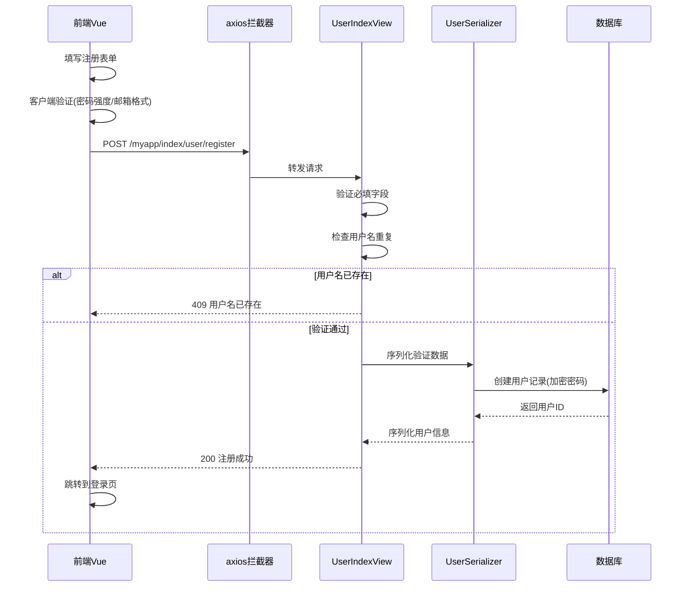
```mermaid
sequenceDiagram
    participant F as 前端Vue
    participant A as axios拦截器
    participant B as UserIndexView
    participant S as UserSerializer
    participant D as 数据库

    F->>F: 填写注册表单
    F->>F: 客户端验证(密码强度/邮箱格式)
    F->>A: POST /myapp/index/user/register
    A->>B: 转发请求
    B->>B: 验证必填字段
    B->>B: 检查用户名重复
    alt 用户名已存在
        B-->>F: 409 用户名已存在
    else 验证通过
        B->>S: 序列化验证数据
        S->>D: 创建用户记录(加密密码)
        D-->>S: 返回用户ID
        S-->>B: 序列化用户信息
        B-->>F: 200 注册成功
        F->>F: 跳转到登录页
    end
```

#### 4.1.2 用户登录的实现

用户在登录页面输入用户名和密码,前端调用`loginApi`方法向`/myapp/index/user/login`发送POST请求。后端的`UserIndexView`类中的login方法接收请求,首先根据用户名查询数据库中的用户记录,若用户不存在则返回404错误；若用户存在,使用Django的`check_password`函数验证密码是否正确。

若密码验证通过,系统生成一个32位的UUID作为Token,将Token存储到数据库的User表中,同时记录登录时间和登录日志。后端将Token、用户ID、用户名、角色等信息以JSON格式返回给前端。前端收到响应后,将Token和用户信息存储到浏览器的localStorage中,并通过Vuex的`Login` action更新全局状态。最后前端根据用户角色跳转到相应的首页(普通用户跳转到图书列表,管理员跳转到后台管理页面)。

时序图如下：

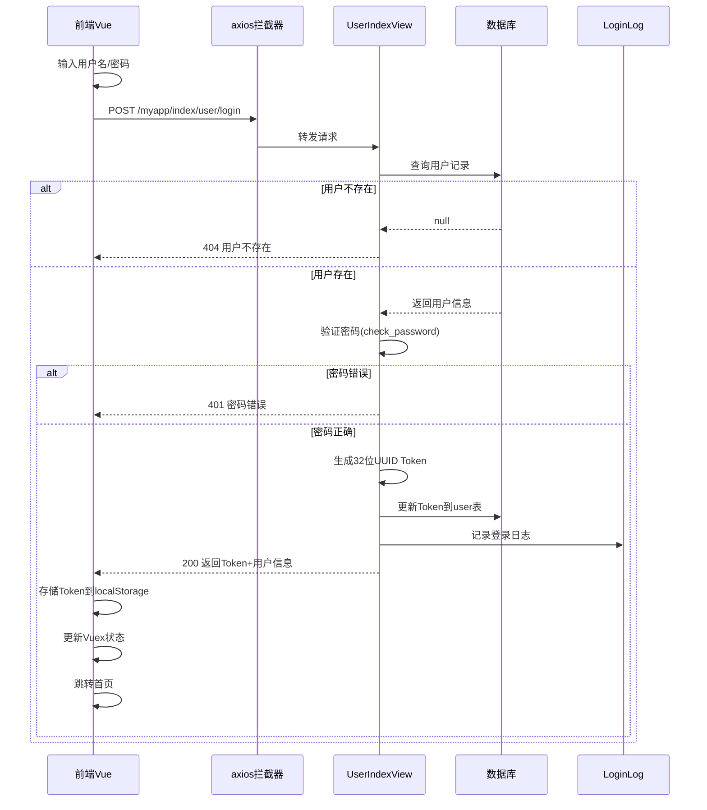
```mermaid
sequenceDiagram
    participant F as 前端Vue
    participant A as axios拦截器
    participant B as UserIndexView
    participant D as 数据库
    participant L as LoginLog

    F->>F: 输入用户名/密码
    F->>A: POST /myapp/index/user/login
    A->>B: 转发请求
    B->>D: 查询用户记录
    alt 用户不存在
        D-->>B: null
        B-->>F: 404 用户不存在
    else 用户存在
        D-->>B: 返回用户信息
        B->>B: 验证密码(check_password)
        alt 密码错误
            B-->>F: 401 密码错误
        else 密码正确
            B->>B: 生成32位UUID Token
            B->>D: 更新Token到user表
            B->>L: 记录登录日志
            B-->>F: 200 返回Token+用户信息
            F->>F: 存储Token到localStorage
            F->>F: 更新Vuex状态
            F->>F: 跳转首页
        end
    end
```

#### 4.1.3 用户资料更新的实现

已登录用户可在个人中心页面修改个人资料,包括昵称、头像、性别、手机号等信息。前端调用`updateUserInfo`方法向`/myapp/index/user/update`发送PUT请求,并在请求头中附加Token。

后端通过Token验证中间件确认用户身份,从请求数据中获取要更新的字段。系统允许用户只更新部分字段,未提供的字段保持原值不变。对于头像上传,前端先调用`/api/upload`接口上传图片文件到服务器,获得图片路径后再更新到用户信息中。后端验证手机号格式(若提供),然后调用User model的update方法更新数据库记录。更新成功后返回更新后的用户信息,前端同步更新localStorage和Vuex状态,确保界面显示的用户信息与数据库一致。

时序图如下：

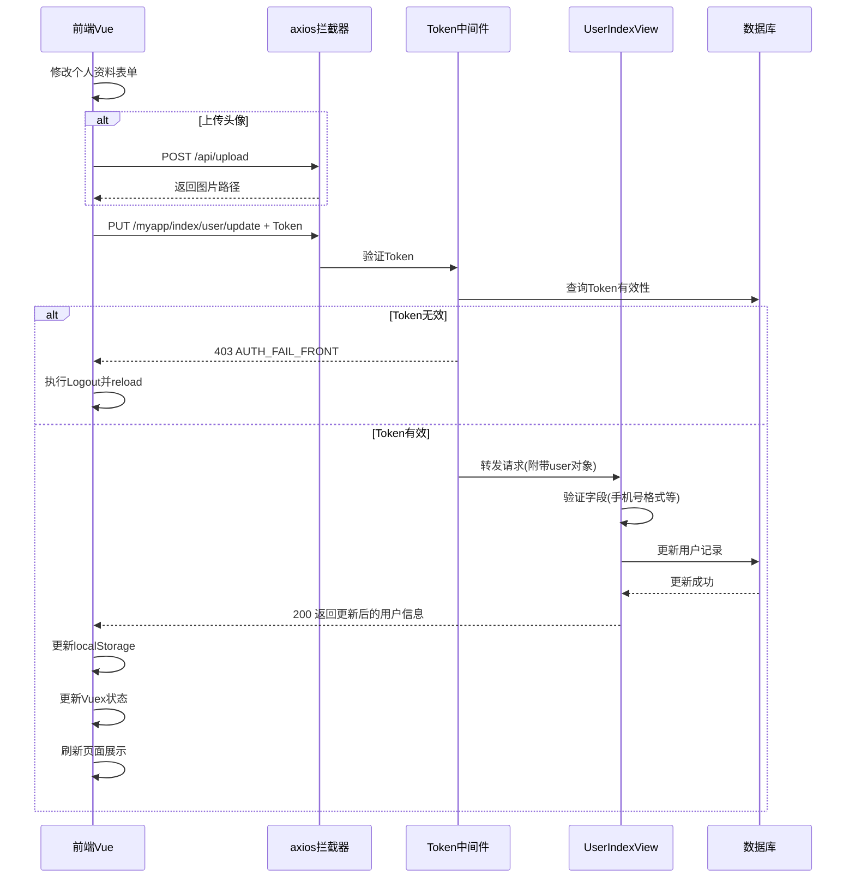
```mermaid
sequenceDiagram
    participant F as 前端Vue
    participant A as axios拦截器
    participant M as Token中间件
    participant B as UserIndexView
    participant D as 数据库

    F->>F: 修改个人资料表单
    alt 上传头像
        F->>A: POST /api/upload
        A-->>F: 返回图片路径
    end
    F->>A: PUT /myapp/index/user/update + Token
    A->>M: 验证Token
    M->>D: 查询Token有效性
    alt Token无效
        M-->>F: 403 AUTH_FAIL_FRONT
        F->>F: 执行Logout并reload
    else Token有效
        M->>B: 转发请求(附带user对象)
        B->>B: 验证字段(手机号格式等)
        B->>D: 更新用户记录
        D-->>B: 更新成功
        B-->>F: 200 返回更新后的用户信息
        F->>F: 更新localStorage
        F->>F: 更新Vuex状态
        F->>F: 刷新页面展示
    end
```

#### 4.1.4 用户账号冻结/解冻的实现

管理员在后台用户管理页面可以对违规用户执行冻结或解冻操作。管理员点击用户列表中某个用户的"冻结"或"解冻"按钮,前端弹出确认对话框,确认后调用`freezeUserApi`或`unfreezeUserApi`方法向`/myapp/admin/user/freeze`或`/myapp/admin/user/unfreeze`发送POST请求,并在请求头中附加adminToken。

后端通过Token验证中间件确认管理员身份,从请求参数中获取用户ID。系统查询该用户记录,修改status字段(0为正常,1为冻结)。若冻结用户,系统同时将该用户的Token字段置空,强制用户下线。操作完成后记录操作日志到OpLog表,便于追溯。后端返回操作结果,前端刷新用户列表展示最新状态。

时序图如下：

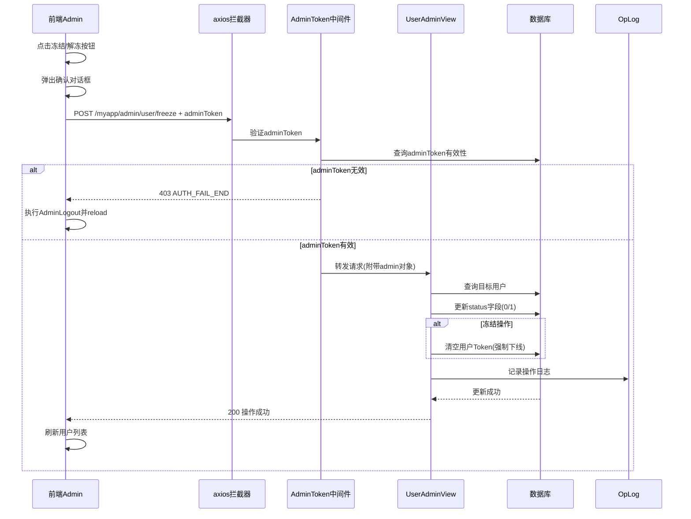
```mermaid
sequenceDiagram
    participant F as 前端Admin
    participant A as axios拦截器
    participant M as AdminToken中间件
    participant B as UserAdminView
    participant D as 数据库
    participant L as OpLog

    F->>F: 点击冻结/解冻按钮
    F->>F: 弹出确认对话框
    F->>A: POST /myapp/admin/user/freeze + adminToken
    A->>M: 验证adminToken
    M->>D: 查询adminToken有效性
    alt adminToken无效
        M-->>F: 403 AUTH_FAIL_END
        F->>F: 执行AdminLogout并reload
    else adminToken有效
        M->>B: 转发请求(附带admin对象)
        B->>D: 查询目标用户
        B->>D: 更新status字段(0/1)
        alt 冻结操作
            B->>D: 清空用户Token(强制下线)
        end
        B->>L: 记录操作日志
        D-->>B: 更新成功
        B-->>F: 200 操作成功
        F->>F: 刷新用户列表
    end
```

#### 4.1.5 用户账号删除的实现

管理员可删除严重违规的用户账号。点击删除按钮后,前端调用`deleteUserApi`方法向`/myapp/admin/user/delete`发送DELETE请求,携带用户ID和adminToken。

后端验证管理员身份后,首先检查该用户是否有未归还的借阅记录,若有则拒绝删除并提示先归还图书。若无未归还记录,系统级联删除该用户的所有相关数据,包括评论、收藏、心愿、登录日志等,然后删除用户记录。删除操作记录到OpLog表。后端返回删除结果,前端刷新列表并提示操作成功。

时序图如下：

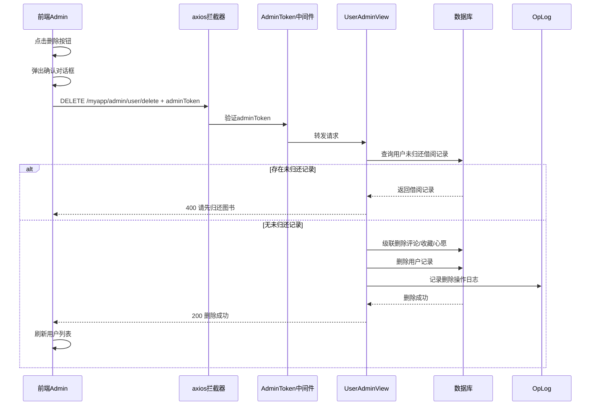
```mermaid
sequenceDiagram
    participant F as 前端Admin
    participant A as axios拦截器
    participant M as AdminToken中间件
    participant B as UserAdminView
    participant D as 数据库
    participant L as OpLog

    F->>F: 点击删除按钮
    F->>F: 弹出确认对话框
    F->>A: DELETE /myapp/admin/user/delete + adminToken
    A->>M: 验证adminToken
    M->>B: 转发请求
    B->>D: 查询用户未归还借阅记录
    alt 存在未归还记录
        D-->>B: 返回借阅记录
        B-->>F: 400 请先归还图书
    else 无未归还记录
        B->>D: 级联删除评论/收藏/心愿
        B->>D: 删除用户记录
        B->>L: 记录删除操作日志
        D-->>B: 删除成功
        B-->>F: 200 删除成功
        F->>F: 刷新用户列表
    end
```

### 4.2 图书管理模块的实现

图书管理模块包括图书添加、编辑、删除、列表查询、详情查看和搜索等功能,是系统核心业务的基础。

#### 4.2.1 图书添加的实现

管理员在后台图书管理页面点击"添加图书"按钮,填写图书信息包括书名、作者、译者、ISBN、出版社、出版日期、简介、价格、页数、库存、分类和标签等。封面图片需要先上传到服务器,获得图片路径。填写完成后,前端调用`addBookApi`方法向`/myapp/admin/book/create`发送POST请求,携带图书信息和adminToken。

后端验证管理员身份后,使用`BookSerializer`对请求数据进行验证,检查必填字段是否完整、ISBN是否重复、价格和库存是否为正数等。验证通过后,系统创建Book记录并保存到数据库,同时处理图书与标签的多对多关系(通过中间表b_book_tag)。创建成功后记录操作日志,返回新创建的图书ID和成功消息。前端跳转回图书列表页面并刷新数据。

时序图如下：

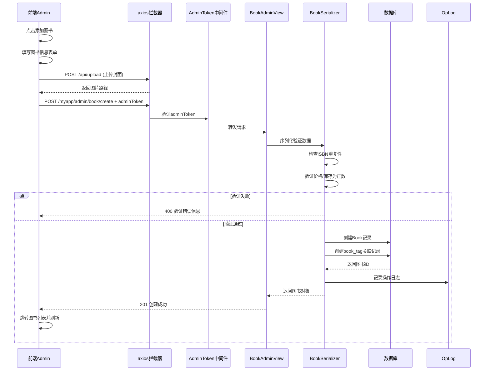
```mermaid
sequenceDiagram
    participant F as 前端Admin
    participant A as axios拦截器
    participant M as AdminToken中间件
    participant B as BookAdminView
    participant S as BookSerializer
    participant D as 数据库
    participant L as OpLog

    F->>F: 点击添加图书
    F->>F: 填写图书信息表单
    F->>A: POST /api/upload (上传封面)
    A-->>F: 返回图片路径
    F->>A: POST /myapp/admin/book/create + adminToken
    A->>M: 验证adminToken
    M->>B: 转发请求
    B->>S: 序列化验证数据
    S->>S: 检查ISBN重复性
    S->>S: 验证价格/库存为正数
    alt 验证失败
        S-->>F: 400 验证错误信息
    else 验证通过
        S->>D: 创建Book记录
        S->>D: 创建book_tag关联记录
        D-->>S: 返回图书ID
        S->>L: 记录操作日志
        S-->>B: 返回图书对象
        B-->>F: 201 创建成功
        F->>F: 跳转图书列表并刷新
    end
```

#### 4.2.2 图书列表查询的实现

用户在前台图书列表页面浏览所有可借阅的图书。前端调用`listApi`方法向`/myapp/index/book/list`发送GET请求,可携带分页参数(page, size)、分类筛选(classification_id)和排序参数(sort)。

后端的`BookIndexView`类中的list方法接收请求,根据参数构建查询条件。系统默认只返回status为"上架"状态的图书。通过Django ORM的filter方法进行分类筛选,通过order_by方法进行排序(支持按浏览量pv、收藏数collect_count、创建时间create_time等排序)。使用Django的Paginator类实现分页,默认每页显示12本图书。查询结果通过`BookSerializer`序列化后返回给前端,前端使用Ant Design Vue的Card组件以卡片形式展示图书列表,包括封面、书名、作者和价格等信息。

时序图如下：

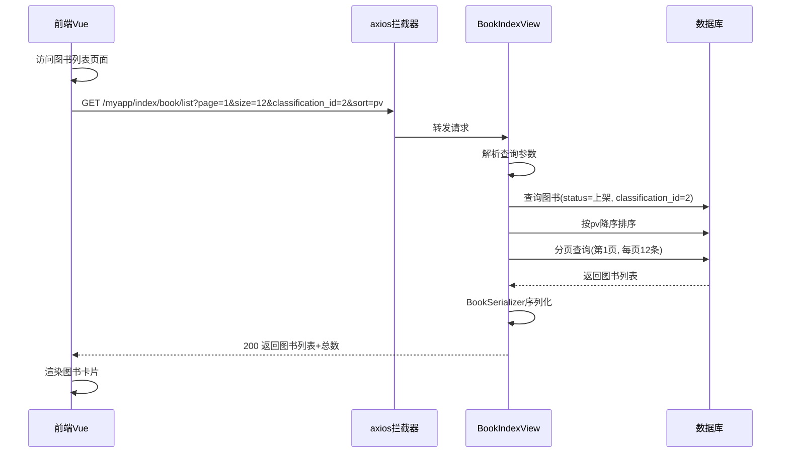
```mermaid
sequenceDiagram
    participant F as 前端Vue
    participant A as axios拦截器
    participant B as BookIndexView
    participant D as 数据库

    F->>F: 访问图书列表页面
    F->>A: GET /myapp/index/book/list?page=1&size=12&classification_id=2&sort=pv
    A->>B: 转发请求
    B->>B: 解析查询参数
    B->>D: 查询图书(status=上架, classification_id=2)
    B->>D: 按pv降序排序
    B->>D: 分页查询(第1页, 每页12条)
    D-->>B: 返回图书列表
    B->>B: BookSerializer序列化
    B-->>F: 200 返回图书列表+总数
    F->>F: 渲染图书卡片
```

#### 4.2.3 图书详情查看的实现

用户点击图书卡片或书名链接,前端调用`detailApi`方法向`/myapp/index/book/detail`发送GET请求,携带图书ID参数。

后端的`BookIndexView`类中的detail方法接收请求,根据图书ID查询数据库。若图书不存在则返回404错误；若图书存在,系统将该图书的pv字段加1(记录浏览量),然后通过`DetailBookSerializer`序列化图书详细信息。序列化器中包含关联字段,如`classification_title`(通过外键关系获取分类名称)和`tag_list`(通过多对多关系获取所有标签)。系统同时查询该图书的评论列表和用户的收藏/心愿状态。所有信息整合后返回给前端,前端渲染详情页面,展示图书封面、基本信息、简介、评论列表以及借阅/收藏/心愿按钮。

时序图如下：

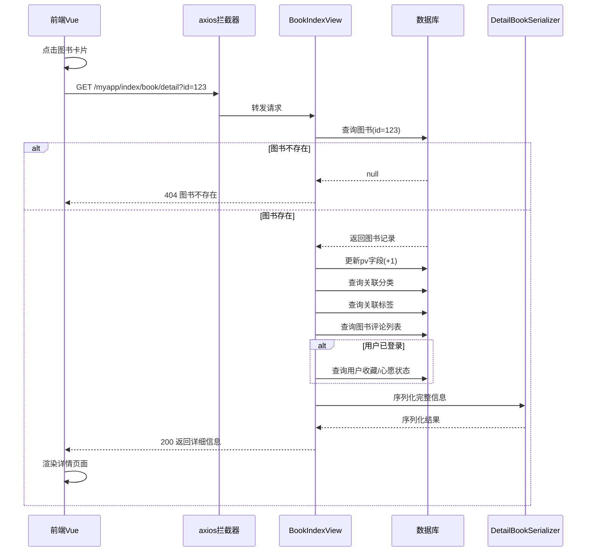
```mermaid
sequenceDiagram
    participant F as 前端Vue
    participant A as axios拦截器
    participant B as BookIndexView
    participant D as 数据库
    participant S as DetailBookSerializer

    F->>F: 点击图书卡片
    F->>A: GET /myapp/index/book/detail?id=123
    A->>B: 转发请求
    B->>D: 查询图书(id=123)
    alt 图书不存在
        D-->>B: null
        B-->>F: 404 图书不存在
    else 图书存在
        D-->>B: 返回图书记录
        B->>D: 更新pv字段(+1)
        B->>D: 查询关联分类
        B->>D: 查询关联标签
        B->>D: 查询图书评论列表
        alt 用户已登录
            B->>D: 查询用户收藏/心愿状态
        end
        B->>S: 序列化完整信息
        S-->>B: 序列化结果
        B-->>F: 200 返回详细信息
        F->>F: 渲染详情页面
    end
```

#### 4.2.4 图书搜索的实现

用户在搜索框输入关键词,前端调用`searchApi`方法向`/myapp/index/book/search`发送GET请求,携带keyword参数。

后端的`BookIndexView`类中的search方法接收关键词,使用Django ORM的Q对象进行多字段模糊查询。查询范围包括书名(title)、作者(author)、译者(translator)、ISBN、出版社(publisher)和简介(description)等字段。系统使用`__icontains`查询操作符实现不区分大小写的模糊匹配。查询结果按相关度排序(优先匹配书名和作者的结果),支持分页。序列化后返回给前端,前端展示搜索结果列表,并高亮显示匹配的关键词。

时序图如下：

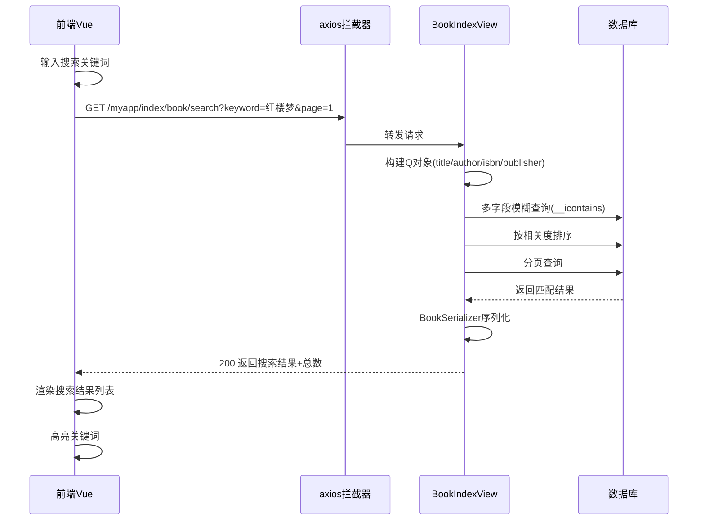
```mermaid
sequenceDiagram
    participant F as 前端Vue
    participant A as axios拦截器
    participant B as BookIndexView
    participant D as 数据库

    F->>F: 输入搜索关键词
    F->>A: GET /myapp/index/book/search?keyword=红楼梦&page=1
    A->>B: 转发请求
    B->>B: 构建Q对象(title/author/isbn/publisher)
    B->>D: 多字段模糊查询(__icontains)
    B->>D: 按相关度排序
    B->>D: 分页查询
    D-->>B: 返回匹配结果
    B->>B: BookSerializer序列化
    B-->>F: 200 返回搜索结果+总数
    F->>F: 渲染搜索结果列表
    F->>F: 高亮关键词
```

#### 4.2.5 图书编辑的实现

管理员在后台图书管理页面点击某本图书的"编辑"按钮,前端先调用`detailApi`获取该图书的详细信息,填充到编辑表单中。管理员修改需要更新的字段后,点击"保存"按钮,前端调用`updateBookApi`方法向`/myapp/admin/book/update`发送PUT请求,携带图书ID和修改后的数据及adminToken。

后端验证管理员身份后,使用`UpdateBookSerializer`验证更新数据。系统允许部分字段更新,未提供的字段保持原值。若修改了标签,系统先删除该图书的所有标签关联记录,再重新创建新的关联。更新成功后记录操作日志,返回更新后的图书信息。前端刷新图书列表并提示更新成功。

时序图如下：

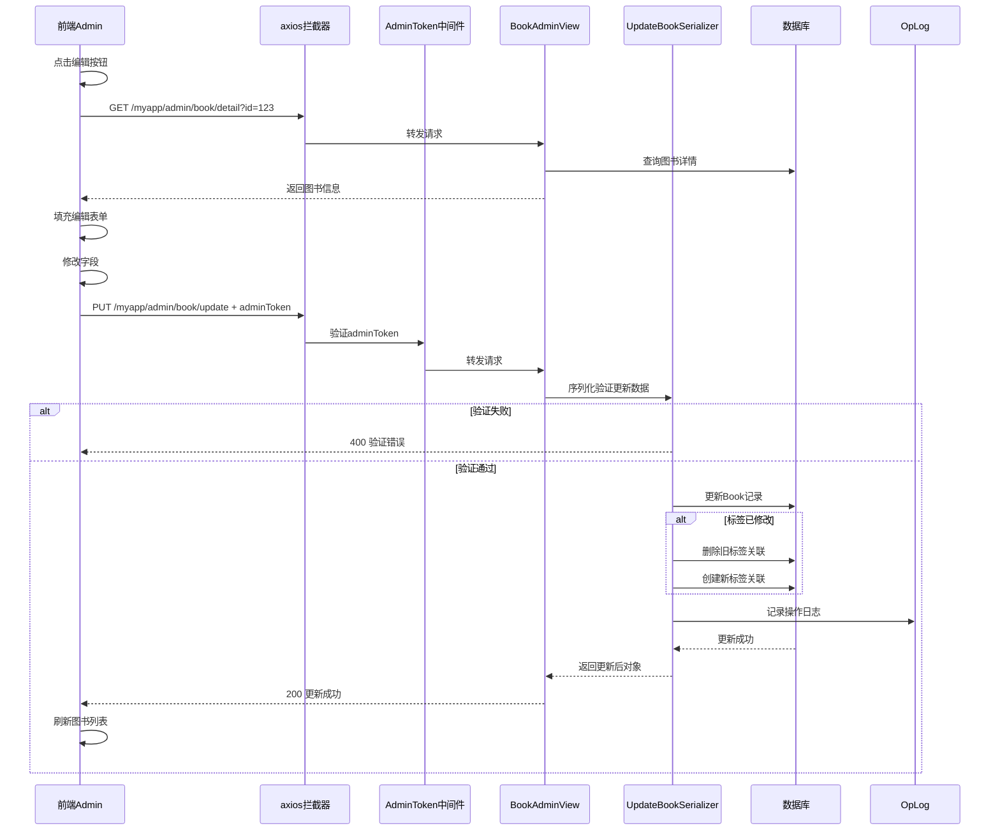
```mermaid
sequenceDiagram
    participant F as 前端Admin
    participant A as axios拦截器
    participant M as AdminToken中间件
    participant B as BookAdminView
    participant S as UpdateBookSerializer
    participant D as 数据库
    participant L as OpLog

    F->>F: 点击编辑按钮
    F->>A: GET /myapp/admin/book/detail?id=123
    A->>B: 转发请求
    B->>D: 查询图书详情
    B-->>F: 返回图书信息
    F->>F: 填充编辑表单
    F->>F: 修改字段
    F->>A: PUT /myapp/admin/book/update + adminToken
    A->>M: 验证adminToken
    M->>B: 转发请求
    B->>S: 序列化验证更新数据
    alt 验证失败
        S-->>F: 400 验证错误
    else 验证通过
        S->>D: 更新Book记录
        alt 标签已修改
            S->>D: 删除旧标签关联
            S->>D: 创建新标签关联
        end
        S->>L: 记录操作日志
        D-->>S: 更新成功
        S-->>B: 返回更新后对象
        B-->>F: 200 更新成功
        F->>F: 刷新图书列表
    end
```

### 4.3 借阅管理模块的实现

借阅管理模块包括借书、还书、续借和借阅记录查询等功能,是系统核心业务流程的关键环节。

#### 4.3.1 借书功能的实现

用户在图书详情页点击"借阅"按钮,前端调用`borrowApi`方法向`/myapp/index/borrow/create`发送POST请求,携带图书ID和Token。

后端通过Token验证中间件确认用户身份。系统首先进行一系列业务规则检查：(1)检查图书库存是否大于0；(2)检查该用户是否已借阅该图书且未归还(避免重复借阅)；(3)检查用户是否有逾期未还的图书(若有则禁止借阅新书)。若所有检查通过,系统创建Borrow记录,设置借出时间为当前时间,应还时间为借出时间后60天,状态设置为1(借出中)。同时将该图书的库存stock字段减1。操作成功后记录到操作日志,返回借阅成功消息和借阅记录ID。前端跳转到"我的借阅"页面并显示成功提示。

时序图如下：

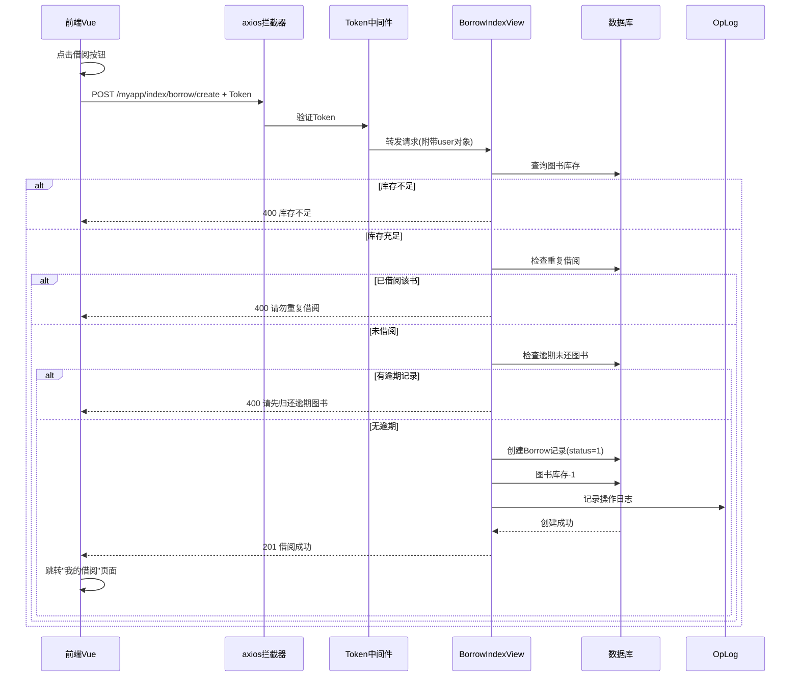
```mermaid
sequenceDiagram
    participant F as 前端Vue
    participant A as axios拦截器
    participant M as Token中间件
    participant B as BorrowIndexView
    participant D as 数据库
    participant L as OpLog

    F->>F: 点击借阅按钮
    F->>A: POST /myapp/index/borrow/create + Token
    A->>M: 验证Token
    M->>B: 转发请求(附带user对象)
    B->>D: 查询图书库存
    alt 库存不足
        B-->>F: 400 库存不足
    else 库存充足
        B->>D: 检查重复借阅
        alt 已借阅该书
            B-->>F: 400 请勿重复借阅
        else 未借阅
            B->>D: 检查逾期未还图书
            alt 有逾期记录
                B-->>F: 400 请先归还逾期图书
            else 无逾期
                B->>D: 创建Borrow记录(status=1)
                B->>D: 图书库存-1
                B->>L: 记录操作日志
                D-->>B: 创建成功
                B-->>F: 201 借阅成功
                F->>F: 跳转"我的借阅"页面
            end
        end
    end
```

#### 4.3.2 还书功能的实现

用户在"我的借阅"页面点击某条借阅记录的"还书"按钮,前端调用`returnBookApi`方法向`/myapp/index/borrow/return`发送POST请求,携带借阅记录ID和Token。

后端验证用户身份后,根据借阅记录ID查询Borrow表。系统检查该借阅记录的status是否为1(借出中),若不是则返回错误。若状态正确,系统更新该记录的return_time字段为当前时间,status字段更新为2(已归还)。同时将对应图书的库存stock字段加1。若归还时间晚于应还时间,系统计算逾期天数并可预留罚款字段(当前版本不实施罚款,仅作提示)。操作成功后记录日志,返回还书成功消息。前端刷新借阅列表,该记录的状态显示为"已归还"。

时序图如下：

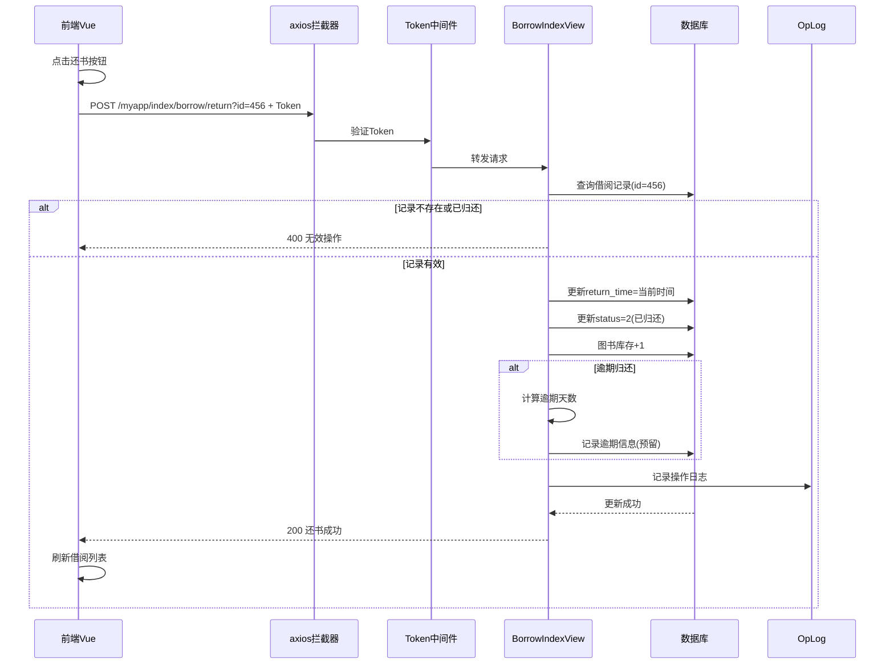
```mermaid
sequenceDiagram
    participant F as 前端Vue
    participant A as axios拦截器
    participant M as Token中间件
    participant B as BorrowIndexView
    participant D as 数据库
    participant L as OpLog

    F->>F: 点击还书按钮
    F->>A: POST /myapp/index/borrow/return?id=456 + Token
    A->>M: 验证Token
    M->>B: 转发请求
    B->>D: 查询借阅记录(id=456)
    alt 记录不存在或已归还
        B-->>F: 400 无效操作
    else 记录有效
        B->>D: 更新return_time=当前时间
        B->>D: 更新status=2(已归还)
        B->>D: 图书库存+1
        alt 逾期归还
            B->>B: 计算逾期天数
            B->>D: 记录逾期信息(预留)
        end
        B->>L: 记录操作日志
        D-->>B: 更新成功
        B-->>F: 200 还书成功
        F->>F: 刷新借阅列表
    end
```

#### 4.3.3 续借功能的实现

用户在"我的借阅"页面对未逾期的借阅记录点击"续借"按钮,前端调用`renewApi`方法向`/myapp/index/borrow/renew`发送POST请求,携带借阅记录ID和Token。

后端验证用户身份后,查询借阅记录。系统检查该记录的status是否为1(借出中)、是否已续借过(delayed字段)、当前时间是否已逾期。若已续借过则返回错误提示"每本图书只能续借一次"；若已逾期则返回"已逾期的图书不能续借"。若检查通过,系统将该记录的expect_time字段延长30天,delayed字段设置为True。操作成功后记录日志,返回续借成功消息和新的应还日期。前端刷新列表,显示更新后的应还时间。

时序图如下：

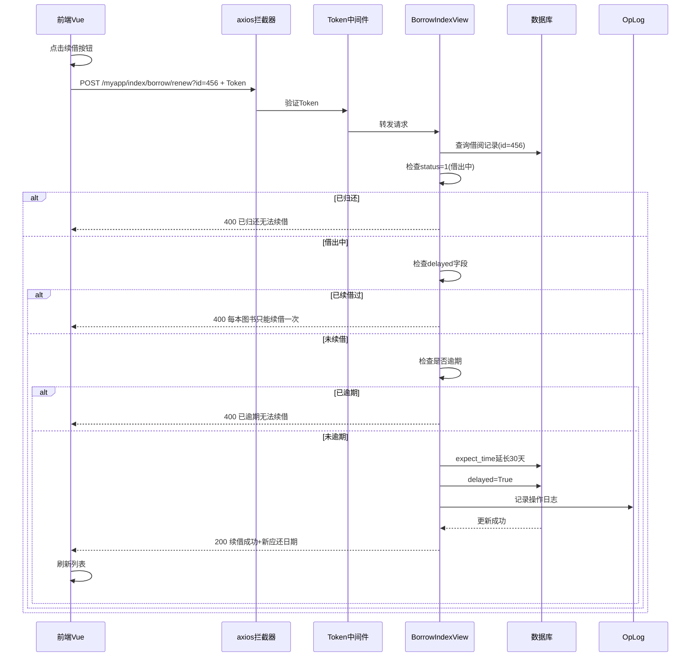
```mermaid
sequenceDiagram
    participant F as 前端Vue
    participant A as axios拦截器
    participant M as Token中间件
    participant B as BorrowIndexView
    participant D as 数据库
    participant L as OpLog

    F->>F: 点击续借按钮
    F->>A: POST /myapp/index/borrow/renew?id=456 + Token
    A->>M: 验证Token
    M->>B: 转发请求
    B->>D: 查询借阅记录(id=456)
    B->>B: 检查status=1(借出中)
    alt 已归还
        B-->>F: 400 已归还无法续借
    else 借出中
        B->>B: 检查delayed字段
        alt 已续借过
            B-->>F: 400 每本图书只能续借一次
        else 未续借
            B->>B: 检查是否逾期
            alt 已逾期
                B-->>F: 400 已逾期无法续借
            else 未逾期
                B->>D: expect_time延长30天
                B->>D: delayed=True
                B->>L: 记录操作日志
                D-->>B: 更新成功
                B-->>F: 200 续借成功+新应还日期
                F->>F: 刷新列表
            end
        end
    end
```

#### 4.3.4 借阅记录查询的实现

用户在"我的借阅"页面查看自己的所有借阅记录。前端调用`listMineApi`方法向`/myapp/index/borrow/list`发送GET请求,携带Token和可选的状态筛选参数(status)。

后端验证用户身份后,根据用户ID查询Borrow表的所有记录。若提供了status参数,则只返回对应状态的记录(1为借出中,2为已归还)。查询结果通过`BorrowSerializer`序列化,包含关联的图书信息(书名、封面、作者等)和借阅时间信息。系统计算每条记录的剩余天数(若未归还)或逾期天数(若已逾期)。序列化结果按借出时间降序排列返回给前端。前端使用Ant Design Vue的Table组件展示借阅列表,包括图书信息、借出时间、应还时间、状态和操作按钮(还书/续借)。

时序图如下：

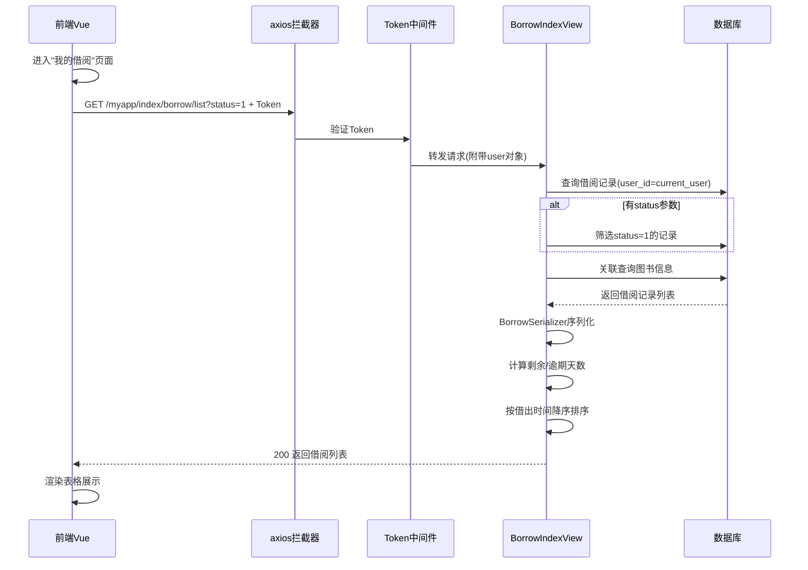
```mermaid
sequenceDiagram
    participant F as 前端Vue
    participant A as axios拦截器
    participant M as Token中间件
    participant B as BorrowIndexView
    participant D as 数据库

    F->>F: 进入"我的借阅"页面
    F->>A: GET /myapp/index/borrow/list?status=1 + Token
    A->>M: 验证Token
    M->>B: 转发请求(附带user对象)
    B->>D: 查询借阅记录(user_id=current_user)
    alt 有status参数
        B->>D: 筛选status=1的记录
    end
    B->>D: 关联查询图书信息
    D-->>B: 返回借阅记录列表
    B->>B: BorrowSerializer序列化
    B->>B: 计算剩余/逾期天数
    B->>B: 按借出时间降序排序
    B-->>F: 200 返回借阅列表
    F->>F: 渲染表格展示
```

#### 4.3.5 借阅统计的实现

管理员在后台可查看借阅统计数据。前端调用`statisticsApi`方法向`/myapp/admin/borrow/statistics`发送GET请求,携带adminToken和可选的时间范围参数。

后端验证管理员身份后,从Borrow表中聚合统计数据,包括总借阅次数、当前借出中的图书数量、已归还图书数量、逾期未还数量、续借次数等。系统使用Django ORM的aggregate和annotate方法进行聚合查询。同时统计借阅量Top 10的图书、借阅最活跃的用户等信息。所有统计数据整合后返回给前端,前端使用ECharts库渲染柱状图、折线图和饼图,直观展示借阅数据分析结果。

时序图如下：

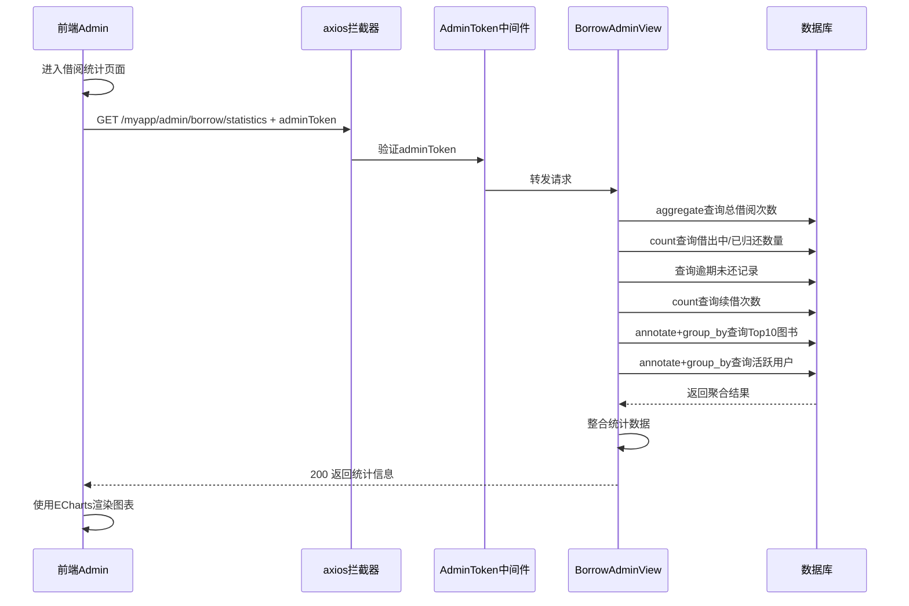
```mermaid
sequenceDiagram
    participant F as 前端Admin
    participant A as axios拦截器
    participant M as AdminToken中间件
    participant B as BorrowAdminView
    participant D as 数据库

    F->>F: 进入借阅统计页面
    F->>A: GET /myapp/admin/borrow/statistics + adminToken
    A->>M: 验证adminToken
    M->>B: 转发请求
    B->>D: aggregate查询总借阅次数
    B->>D: count查询借出中/已归还数量
    B->>D: 查询逾期未还记录
    B->>D: count查询续借次数
    B->>D: annotate+group_by查询Top10图书
    B->>D: annotate+group_by查询活跃用户
    D-->>B: 返回聚合结果
    B->>B: 整合统计数据
    B-->>F: 200 返回统计信息
    F->>F: 使用ECharts渲染图表
```

### 4.4 社区互动模块的实现

社区互动模块包括图书评论、社区话题发布、点赞互动和评论管理等功能,旨在提升平台活跃度和用户粘性。

#### 4.4.1 发表图书评论的实现

用户在图书详情页的评论区输入评论内容,点击"发表"按钮。前端调用`createCommentApi`方法向`/myapp/index/comment/create`发送POST请求,携带图书ID、评论内容和Token。

后端验证用户身份后,使用`CommentSerializer`验证评论内容,检查内容长度是否在合理范围(不少于5个字,不超过500个字)。系统还可集成敏感词过滤功能,对含有违规内容的评论进行拦截或标记为待审核状态。若验证通过,系统创建Comment记录,设置book_id为目标图书ID,user_id为当前用户ID,comment_time为当前时间,status设置为1(已发布)或0(待审核,根据系统配置决定)。创建成功后返回新评论的ID和内容。前端将新评论即时添加到评论列表顶部,提升用户体验。

时序图如下：

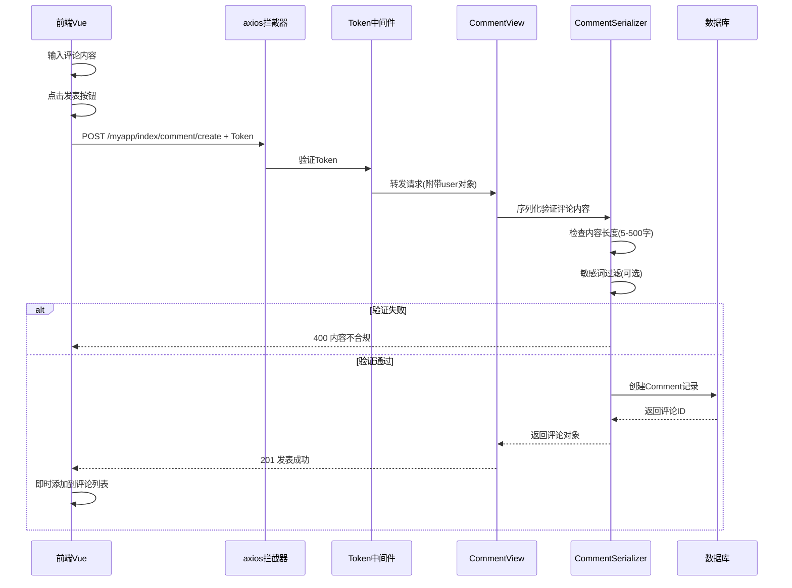
```mermaid
sequenceDiagram
    participant F as 前端Vue
    participant A as axios拦截器
    participant M as Token中间件
    participant B as CommentView
    participant S as CommentSerializer
    participant D as 数据库

    F->>F: 输入评论内容
    F->>F: 点击发表按钮
    F->>A: POST /myapp/index/comment/create + Token
    A->>M: 验证Token
    M->>B: 转发请求(附带user对象)
    B->>S: 序列化验证评论内容
    S->>S: 检查内容长度(5-500字)
    S->>S: 敏感词过滤(可选)
    alt 验证失败
        S-->>F: 400 内容不合规
    else 验证通过
        S->>D: 创建Comment记录
        D-->>S: 返回评论ID
        S-->>B: 返回评论对象
        B-->>F: 201 发表成功
        F->>F: 即时添加到评论列表
    end
```

#### 4.4.2 评论点赞的实现

用户在评论列表中点击某条评论的点赞按钮。前端调用`likeCommentApi`方法向`/myapp/index/comment/like`发送POST请求,携带评论ID和Token。

后端验证用户身份后,检查该用户是否已对该评论点赞过(通过查询b_comment_like中间表)。若已点赞则执行取消点赞操作(删除点赞记录,评论的like_count字段减1)；若未点赞则执行点赞操作(创建点赞记录,like_count字段加1)。操作成功后返回最新的点赞数量和用户的点赞状态。前端更新界面显示,点赞按钮变为已点赞状态,点赞数实时更新。

时序图如下：

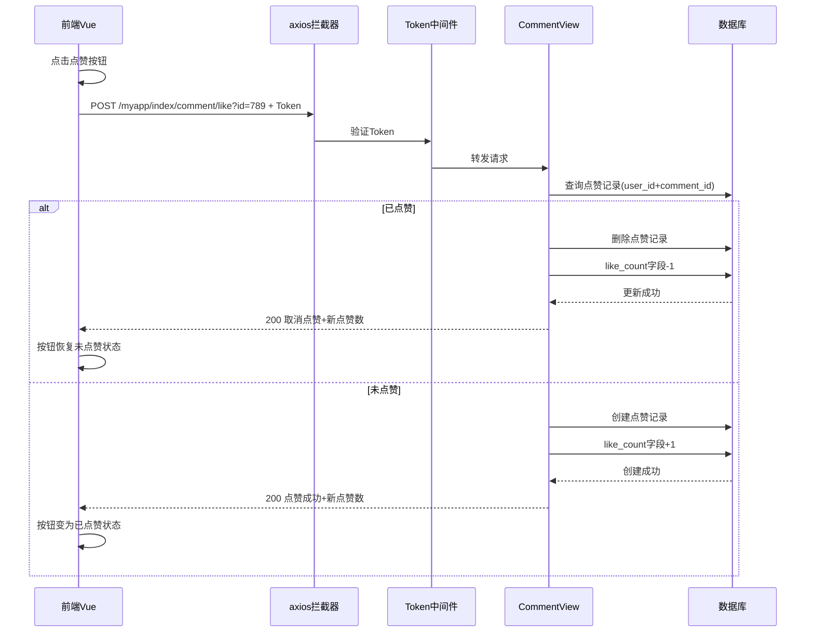
```mermaid
sequenceDiagram
    participant F as 前端Vue
    participant A as axios拦截器
    participant M as Token中间件
    participant B as CommentView
    participant D as 数据库

    F->>F: 点击点赞按钮
    F->>A: POST /myapp/index/comment/like?id=789 + Token
    A->>M: 验证Token
    M->>B: 转发请求
    B->>D: 查询点赞记录(user_id+comment_id)
    alt 已点赞
        B->>D: 删除点赞记录
        B->>D: like_count字段-1
        D-->>B: 更新成功
        B-->>F: 200 取消点赞+新点赞数
        F->>F: 按钮恢复未点赞状态
    else 未点赞
        B->>D: 创建点赞记录
        B->>D: like_count字段+1
        D-->>B: 创建成功
        B-->>F: 200 点赞成功+新点赞数
        F->>F: 按钮变为已点赞状态
    end
```

#### 4.4.3 社区话题发布的实现

用户在社区页面点击"发布话题"按钮,填写话题标题和内容,可选择上传图片。前端调用`createPostApi`方法向`/myapp/index/community/create`发送POST请求,携带标题、内容、图片(可选)和Token。

后端验证用户身份后,验证标题长度(5-100字)和内容长度(10-2000字)。若验证通过,系统创建CommunityPost记录,设置author_id为当前用户ID,create_time为当前时间,status为1(已发布),初始like_count和comment_count为0。创建成功后返回新话题的ID。前端跳转到话题详情页并显示发布成功提示。

时序图如下：

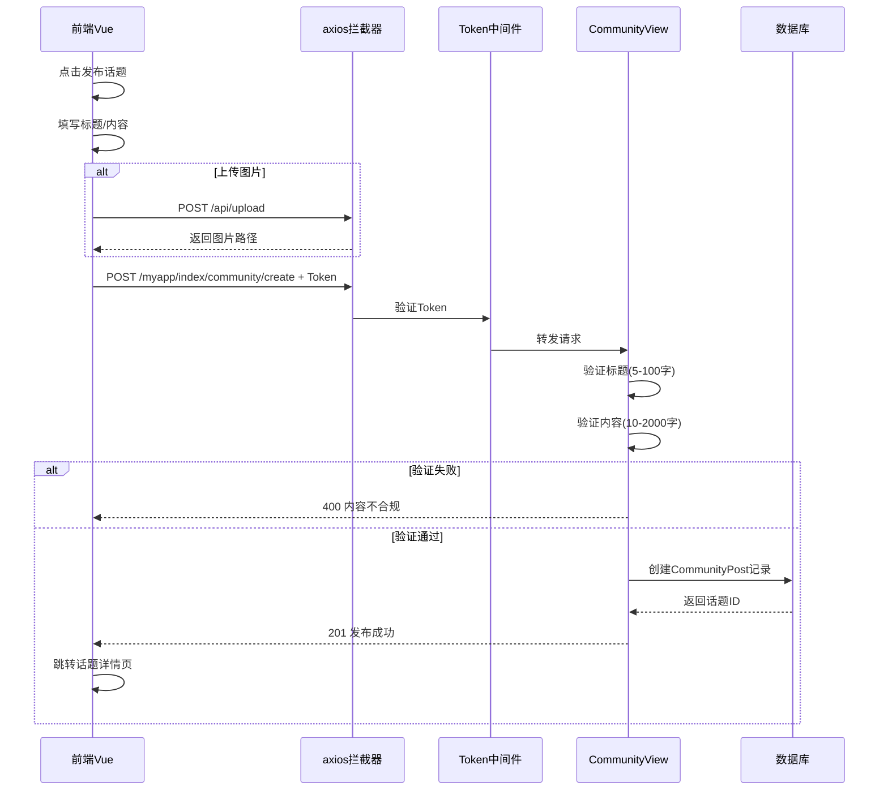
```mermaid
sequenceDiagram
    participant F as 前端Vue
    participant A as axios拦截器
    participant M as Token中间件
    participant B as CommunityView
    participant D as 数据库

    F->>F: 点击发布话题
    F->>F: 填写标题/内容
    alt 上传图片
        F->>A: POST /api/upload
        A-->>F: 返回图片路径
    end
    F->>A: POST /myapp/index/community/create + Token
    A->>M: 验证Token
    M->>B: 转发请求
    B->>B: 验证标题(5-100字)
    B->>B: 验证内容(10-2000字)
    alt 验证失败
        B-->>F: 400 内容不合规
    else 验证通过
        B->>D: 创建CommunityPost记录
        D-->>B: 返回话题ID
        B-->>F: 201 发布成功
        F->>F: 跳转话题详情页
    end
```

#### 4.4.4 社区话题评论的实现

用户在社区话题详情页的评论区输入评论,点击"回复"按钮。前端调用`createPostCommentApi`方法向`/myapp/index/community/comment`发送POST请求,携带话题ID、评论内容和Token。

后端验证用户身份后,验证评论内容。若验证通过,系统创建CommunityComment记录,设置post_id为目标话题ID,user_id为当前用户ID,comment_time为当前时间。同时将对应话题的comment_count字段加1。创建成功后返回新评论对象。前端将新评论即时添加到评论列表,并更新话题的评论数显示。

时序图如下：

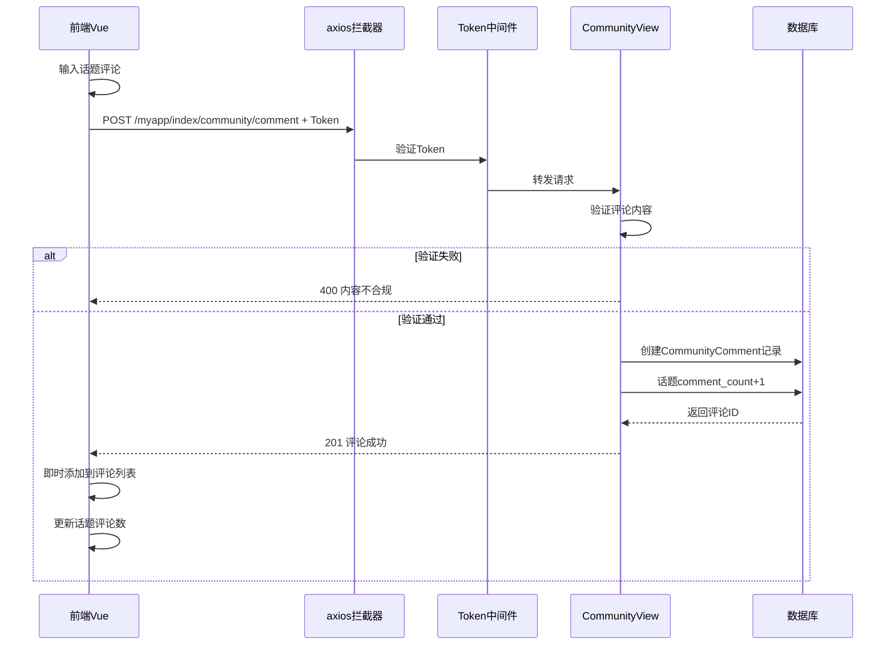
```mermaid
sequenceDiagram
    participant F as 前端Vue
    participant A as axios拦截器
    participant M as Token中间件
    participant B as CommunityView
    participant D as 数据库

    F->>F: 输入话题评论
    F->>A: POST /myapp/index/community/comment + Token
    A->>M: 验证Token
    M->>B: 转发请求
    B->>B: 验证评论内容
    alt 验证失败
        B-->>F: 400 内容不合规
    else 验证通过
        B->>D: 创建CommunityComment记录
        B->>D: 话题comment_count+1
        D-->>B: 返回评论ID
        B-->>F: 201 评论成功
        F->>F: 即时添加到评论列表
        F->>F: 更新话题评论数
    end
```

#### 4.4.5 评论删除的实现

用户可删除自己发表的评论,管理员可删除任何评论。前端调用`deleteCommentApi`方法向`/myapp/index/comment/delete`或`/myapp/admin/comment/delete`发送DELETE请求,携带评论ID和Token/adminToken。

后端验证用户身份后,查询评论记录。若是普通用户操作,系统检查该评论的user_id是否与当前用户ID一致,若不一致则返回403权限错误；若是管理员操作,则无需检查。权限验证通过后,系统将评论的status字段更新为2(已删除),或直接删除记录(根据系统设计决定是逻辑删除还是物理删除)。同时将对应图书或话题的like_count字段减去该评论的点赞数。操作成功后返回删除结果,前端刷新评论列表。

时序图如下：

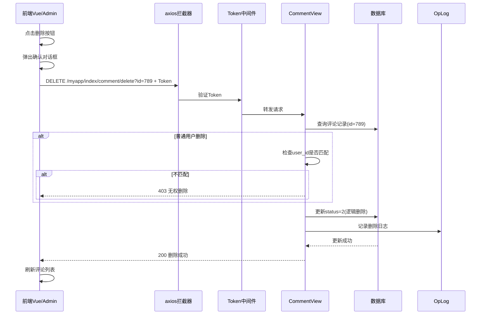
```mermaid
sequenceDiagram
    participant F as 前端Vue/Admin
    participant A as axios拦截器
    participant M as Token中间件
    participant B as CommentView
    participant D as 数据库
    participant L as OpLog

    F->>F: 点击删除按钮
    F->>F: 弹出确认对话框
    F->>A: DELETE /myapp/index/comment/delete?id=789 + Token
    A->>M: 验证Token
    M->>B: 转发请求
    B->>D: 查询评论记录(id=789)
    alt 普通用户删除
        B->>B: 检查user_id是否匹配
        alt 不匹配
            B-->>F: 403 无权删除
        end
    end
    B->>D: 更新status=2(逻辑删除)
    B->>L: 记录删除日志
    D-->>B: 更新成功
    B-->>F: 200 删除成功
    F->>F: 刷新评论列表
```

### 4.5 推荐算法模块的实现

推荐算法模块采用基于用户的协同过滤算法,为用户推荐可能感兴趣的图书,提升用户体验和平台图书利用率。

#### 4.5.1 推荐列表获取的实现

用户在首页或个人中心查看"为你推荐"板块。前端调用`recommendListApi`方法向`/myapp/index/book/recommend`发送GET请求,携带Token。

后端验证用户身份后,调用推荐算法服务`RecommendService`。算法首先构建用户-图书评分矩阵,评分来源包括借阅行为(权重3)、收藏行为(权重2)和心愿行为(权重1)。系统从Borrow、b_user_collect和b_user_wish表中读取所有用户的行为数据,构建成稀疏矩阵。

然后算法调用`computeSimilarity`方法计算当前用户与其他所有用户的相似度。相似度计算采用余弦相似度公式,设用户u和用户v的评分向量分别为Ru和Rv,则相似度计算公式为：

sim(u, v) = (Ru · Rv) / (||Ru|| × ||Rv||)

其中·表示向量点积,||·||表示向量的模。系统找出相似度最高的K个用户(K默认为10),获取这些相似用户借阅/收藏过但当前用户未接触过的图书,作为候选推荐集合。

最后算法调用`recommendTopN`方法,根据候选图书被相似用户选择的频次和相似用户的相似度进行加权排序,选出Top N本图书(N默认为12)作为推荐结果。推荐结果通过`BookSerializer`序列化后返回给前端,前端以卡片形式展示推荐图书列表。

时序图如下：

```mermaid
sequenceDiagram
    participant F as 前端Vue
    participant A as axios拦截器
    participant M as Token中间件
    participant B as RecommendApiView
    participant R as RecommendService
    participant D as 数据库

    F->>F: 访问推荐板块
    F->>A: GET /myapp/index/book/recommend + Token
    A->>M: 验证Token
    M->>B: 转发请求(附带user对象)
    B->>R: 调用推荐算法服务
    R->>D: 读取所有用户行为数据
    D-->>R: 返回借阅/收藏/心愿记录
    R->>R: buildRatingMatrix构建评分矩阵
    R->>R: computeSimilarity计算用户相似度
    R->>R: 找出Top K相似用户(K=10)
    R->>D: 获取相似用户的图书记录
    R->>R: 过滤当前用户已接触图书
    R->>R: recommendTopN加权排序选出Top N(N=12)
    R-->>B: 返回推荐图书ID列表
    B->>D: 查询推荐图书详细信息
    B->>B: BookSerializer序列化
    B-->>F: 200 返回推荐图书列表
    F->>F: 渲染推荐卡片
```

#### 4.5.2 热门图书推荐的实现

除了个性化推荐,系统还提供热门图书推荐作为补充策略,尤其针对新用户或行为数据不足的用户。前端调用`hotListApi`方法向`/myapp/index/book/hot`发送GET请求。

后端的`RecommendApiView`类中的hotList方法不需要Token验证。系统从Book表中按综合热度排序查询图书,综合热度通过加权公式计算：

热度分数 = pv × 1 + collect_count × 3 + wish_count × 2 + borrow_count × 5

其中pv为浏览量,collect_count为收藏数,wish_count为心愿数,borrow_count为借阅次数(需要从Borrow表统计)。系统使用Django ORM的annotate方法统计每本图书的借阅次数,然后计算综合热度分数并排序,选出Top 12本图书作为热门推荐。结果序列化后返回给前端,前端在首页或推荐页面展示热门图书列表。

时序图如下：

```mermaid
sequenceDiagram
    participant F as 前端Vue
    participant A as axios拦截器
    participant B as RecommendApiView
    participant D as 数据库

    F->>F: 访问热门推荐板块
    F->>A: GET /myapp/index/book/hot
    A->>B: 转发请求
    B->>D: annotate统计每本图书借阅次数
    B->>B: 计算综合热度分数(pv+collect+wish+borrow)
    B->>D: order_by热度分数降序
    B->>D: limit 12条记录
    D-->>B: 返回热门图书列表
    B->>B: BookSerializer序列化
    B-->>F: 200 返回热门图书列表
    F->>F: 渲染热门卡片
```

### 4.6 系统管理模块的实现

系统管理模块包括分类管理、标签管理、通知发布和日志监控等后台管理功能,是系统运维和治理的核心工具。

#### 4.6.1 图书分类管理的实现

管理员在后台分类管理页面可以添加、编辑和删除图书分类。点击"添加分类"按钮,填写分类名称和父分类(可选,若不选则为一级分类)。前端调用`addClassificationApi`方法向`/myapp/admin/classification/create`发送POST请求,携带分类信息和adminToken。

后端验证管理员身份后,检查分类名称是否重复。若验证通过,系统创建Classification记录,设置title为分类名称,pid为父分类ID(若为一级分类则为NULL)。创建成功后返回新分类的ID。前端刷新分类列表,以树形结构展示多级分类关系。

编辑和删除分类的流程类似,编辑时调用`editClassificationApi`向`/myapp/admin/classification/update`发送PUT请求；删除时调用`deleteClassificationApi`向`/myapp/admin/classification/delete`发送DELETE请求。删除分类前系统检查该分类下是否有图书,若有则拒绝删除并提示先移动图书到其他分类。

时序图如下：

```mermaid
sequenceDiagram
    participant F as 前端Admin
    participant A as axios拦截器
    participant M as AdminToken中间件
    participant B as ClassificationView
    participant D as 数据库
    participant L as OpLog

    F->>F: 点击添加分类
    F->>F: 填写分类名称/父分类
    F->>A: POST /myapp/admin/classification/create + adminToken
    A->>M: 验证adminToken
    M->>B: 转发请求
    B->>D: 检查分类名称重复
    alt 名称已存在
        B-->>F: 400 分类名称已存在
    else 名称不重复
        B->>D: 创建Classification记录
        B->>L: 记录操作日志
        D-->>B: 返回分类ID
        B-->>F: 201 创建成功
        F->>F: 刷新分类树形列表
    end
```

#### 4.6.2 图书标签管理的实现

管理员在后台标签管理页面可以添加、编辑和删除图书标签。点击"添加标签"按钮,填写标签名称。前端调用`addTagApi`方法向`/myapp/admin/tag/create`发送POST请求,携带标签名称和adminToken。

后端验证管理员身份后,检查标签名称是否重复。若验证通过,系统创建Tag记录,设置title为标签名称。创建成功后返回新标签的ID。前端刷新标签列表。

编辑标签时调用`editTagApi`向`/myapp/admin/tag/update`发送PUT请求,修改标签名称。删除标签时调用`deleteTagApi`向`/myapp/admin/tag/delete`发送DELETE请求。删除标签会同时删除b_book_tag表中的所有关联记录,不影响图书本身,但图书会失去该标签。

时序图如下：

```mermaid
sequenceDiagram
    participant F as 前端Admin
    participant A as axios拦截器
    participant M as AdminToken中间件
    participant B as TagView
    participant D as 数据库
    participant L as OpLog

    F->>F: 点击添加标签
    F->>F: 填写标签名称
    F->>A: POST /myapp/admin/tag/create + adminToken
    A->>M: 验证adminToken
    M->>B: 转发请求
    B->>D: 检查标签名称重复
    alt 名称已存在
        B-->>F: 400 标签名称已存在
    else 名称不重复
        B->>D: 创建Tag记录
        B->>L: 记录操作日志
        D-->>B: 返回标签ID
        B-->>F: 201 创建成功
        F->>F: 刷新标签列表
    end
```

#### 4.6.3 平台通知发布的实现

管理员在后台通知管理页面可以发布平台公告或规则更新。点击"发布通知"按钮,填写通知标题、内容和有效期。前端调用`publishNoticeApi`方法向`/myapp/admin/notice/create`发送POST请求,携带通知信息和adminToken。

后端验证管理员身份后,验证标题和内容长度。若验证通过,系统创建Notice记录,设置title为通知标题,content为通知内容,create_time为当前时间,expire_time为有效期。创建成功后返回新通知的ID。前端跳转回通知列表页面。

前台用户访问系统时,前端调用`listNoticeApi`方法向`/myapp/index/notice/list`发送GET请求,获取所有未过期的通知列表。系统在首页顶部以滚动公告的形式展示最新通知,用户点击可查看详情。

时序图如下：

```mermaid
sequenceDiagram
    participant F as 前端Admin
    participant A as axios拦截器
    participant M as AdminToken中间件
    participant B as NoticeView
    participant D as 数据库
    participant L as OpLog

    F->>F: 点击发布通知
    F->>F: 填写标题/内容/有效期
    F->>A: POST /myapp/admin/notice/create + adminToken
    A->>M: 验证adminToken
    M->>B: 转发请求
    B->>B: 验证标题/内容长度
    alt 验证失败
        B-->>F: 400 内容不合规
    else 验证通过
        B->>D: 创建Notice记录
        B->>L: 记录操作日志
        D-->>B: 返回通知ID
        B-->>F: 201 发布成功
        F->>F: 跳转通知列表页
    end
```

#### 4.6.4 操作日志查询的实现

管理员在后台日志管理页面可以查询操作日志、登录日志和错误日志。前端调用`queryOpLogApi`方法向`/myapp/admin/opLog/list`发送GET请求,可携带时间范围、操作类型、用户ID等筛选参数及adminToken。

后端验证管理员身份后,根据筛选参数从OpLog表中查询日志记录。系统使用Django ORM的filter方法构建查询条件,支持按时间范围(op_time__gte和op_time__lte)、操作类型(operation)、用户ID(user_id)等多维度筛选。查询结果按时间降序排列并分页返回。前端使用Ant Design Vue的Table组件展示日志列表,包括操作时间、操作用户、操作类型、操作目标、操作详情和IP地址等信息。管理员可导出日志为Excel文件进行离线分析。

登录日志和错误日志的查询流程与操作日志类似,分别从LoginLog和ErrorLog表查询。

时序图如下：

```mermaid
sequenceDiagram
    participant F as 前端Admin
    participant A as axios拦截器
    participant M as AdminToken中间件
    participant B as LogAdminView
    participant D as 数据库

    F->>F: 进入日志管理页面
    F->>F: 设置筛选条件(时间/类型/用户)
    F->>A: GET /myapp/admin/opLog/list?start_time=xxx&operation=xxx + adminToken
    A->>M: 验证adminToken
    M->>B: 转发请求
    B->>B: 构建查询条件(filter)
    B->>D: 查询OpLog表(按时间/类型/用户筛选)
    B->>D: order_by op_time降序
    B->>D: 分页查询
    D-->>B: 返回日志记录列表
    B->>B: 序列化日志数据
    B-->>F: 200 返回日志列表+总数
    F->>F: 渲染日志表格
    alt 导出日志
        F->>A: GET /myapp/admin/opLog/export + adminToken
        A->>B: 转发请求
        B->>D: 查询所有符合条件的日志
        B->>B: 生成Excel文件
        B-->>F: 返回文件流
        F->>F: 浏览器下载Excel
    end
```

#### 4.6.5 系统概览统计的实现

管理员登录后台首页可以查看系统概览统计。前端调用`overviewApi`方法向`/myapp/admin/overview/data`发送GET请求,携带adminToken。

后端验证管理员身份后,从多个表中聚合统计数据,包括：
- 用户总数(User表count)
- 图书总数(Book表count)
- 当前借出中图书数量(Borrow表count,status=1)
- 今日新增借阅量(Borrow表count,borrow_time为今天)
- 评论总数(Comment表count)
- 社区话题总数(CommunityPost表count)
- 今日新增用户数(User表count,create_time为今天)
- 最近7天借阅趋势(Borrow表group_by日期统计)

所有统计数据整合后返回给前端。前端使用卡片组件展示关键指标(用户总数、图书总数等),使用ECharts库渲染趋势图(最近7天借阅趋势折线图),为管理员提供系统运营的全局视图。

时序图如下：

```mermaid
sequenceDiagram
    participant F as 前端Admin
    participant A as axios拦截器
    participant M as AdminToken中间件
    participant B as OverviewView
    participant D as 数据库

    F->>F: 进入后台首页
    F->>A: GET /myapp/admin/overview/data + adminToken
    A->>M: 验证adminToken
    M->>B: 转发请求
    B->>D: count查询用户总数
    B->>D: count查询图书总数
    B->>D: count查询借出中数量(status=1)
    B->>D: count查询今日新增借阅
    B->>D: count查询评论总数
    B->>D: count查询话题总数
    B->>D: count查询今日新增用户
    B->>D: group_by查询最近7天借阅趋势
    D-->>B: 返回各项统计数据
    B->>B: 整合统计信息
    B-->>F: 200 返回概览数据
    F->>F: 渲染统计卡片
    F->>F: 使用ECharts渲染趋势图
```

---

## 总结

本文档详细阐述了图书借阅推荐系统的系统设计和系统实现过程。第3章从系统架构、功能模块和数据库三个维度进行了全面的设计,明确了系统的技术选型、模块划分和数据结构。第4章通过六个核心模块的实现细节和时序图,展示了系统各项功能的具体实现流程和前后端交互逻辑。

系统采用前后端分离的架构设计,前端使用Vue.js 2.x和Ant Design Vue构建用户界面,后端使用Django 4.1.4框架和MySQL数据库提供RESTful API服务。通过基于Token的身份认证机制保障系统安全,通过协同过滤推荐算法提升用户体验,通过完善的日志系统保障系统的可维护性和可追溯性。

整个系统实现了用户管理、图书管理、借阅管理、社区互动、推荐算法和系统管理六大核心功能模块,满足了图书馆借阅场景的业务需求,为用户提供了便捷的图书借阅和社区交流平台,为管理员提供了完善的后台管理工具。
